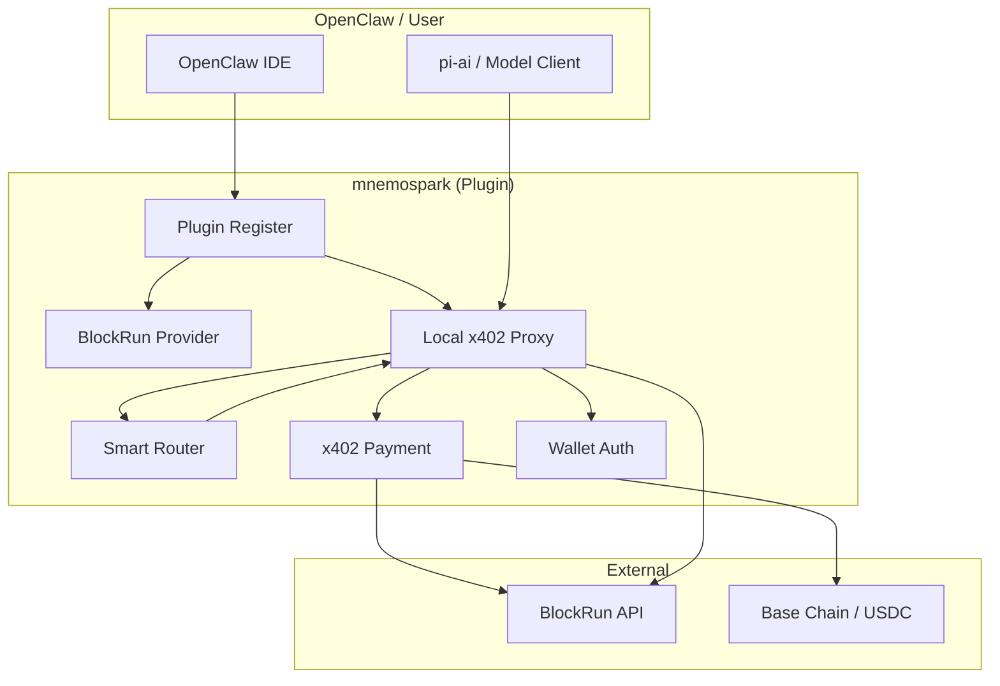
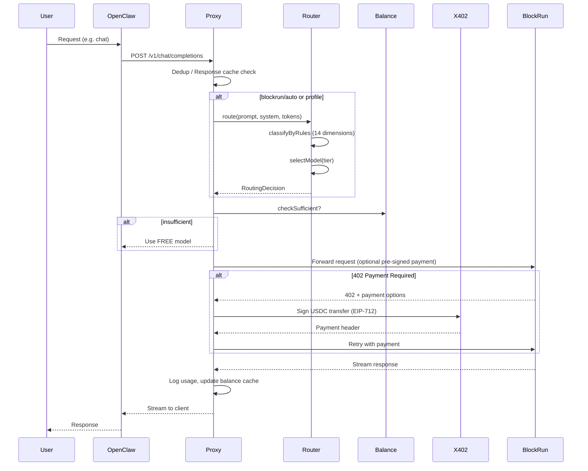
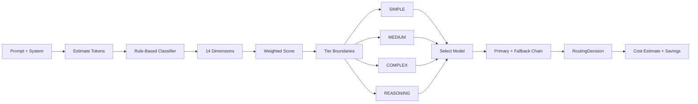

# mnemospark – Product Specification for Product Managers

**Document version:** 1.0  
**Last updated:** February 2026  
**Audience:** Product, leadership, and non-engineering stakeholders

---

## Executive summary

**mnemospark** is a smart LLM router and inference toolkit that plugs into **OpenClaw**. It gives users access to 30+ AI models through a single wallet and one API surface. The system routes each request to the cheapest model that can handle it, handles **x402 micropayments** (USDC on Base) automatically, and can reduce cost by ~78% versus always using premium models. In short: one plugin, one wallet, many models, with automatic cost optimization and pay-per-use billing.

---

## What mnemospark does (product view)

| Capability               | Description                                                                                                                                                                      |
| ------------------------ | -------------------------------------------------------------------------------------------------------------------------------------------------------------------------------- |
| **Smart routing**        | When the user (or agent) picks “auto” (or eco/premium), the system classifies the request (simple vs. complex vs. reasoning) and chooses the cheapest capable model.             |
| **30+ models**           | Single provider surface for OpenAI, Anthropic, Google, DeepSeek, xAI, NVIDIA, Moonshot, MiniMax, etc., via BlockRun’s API.                                                       |
| **One wallet**           | User funds a single wallet with USDC on Base; all model usage is paid from that wallet via x402. No per-provider API keys for paid models.                                       |
| **Cost control**         | Routing profiles: **free** (no balance needed), **eco** (minimize cost), **auto** (balanced), **premium** (best quality). Empty wallet automatically falls back to a free model. |
| **OpenClaw integration** | Installed as an OpenClaw plugin; registers a “BlockRun” provider, injects model list and auth placeholder, and starts a local proxy when the gateway runs.                       |
| **Transparent billing**  | Usage is logged locally; `/stats` shows usage and savings; `/wallet` shows balance and funding instructions.                                                                     |

---

## Architecture at a glance

mnemospark is a **plugin plus local proxy**: it is not a separate microservice. OpenClaw loads the plugin; the plugin registers a provider and, when the OpenClaw gateway is running, starts an **HTTP proxy** on localhost (default port 8402). All LLM traffic to “BlockRun” goes through this proxy, which handles routing, payment, and forwarding to BlockRun’s API.

- **Monolith-style plugin:** One codebase, one process (the OpenClaw gateway process, or a standalone CLI proxy).
- **Frontend:** None; the “UI” is OpenClaw’s existing UI (model picker, chat, etc.).
- **Backend:** Plugin code (provider registration, config injection) + in-process proxy (HTTP server) + router + x402 payment logic.
- **External boundaries:** BlockRun API (HTTPS), Base RPC (balance checks, payment settlement).

---

## How data flows

### 1. Plugin load (once per gateway start)

1. OpenClaw loads the mnemospark plugin and calls `register()`.
2. Plugin registers the **BlockRun provider** (model list, base URL pointing to local proxy).
3. Plugin **injects** into OpenClaw’s config: BlockRun provider (baseUrl, api, apiKey placeholder, models) and optional default model `blockrun/auto`.
4. Plugin injects a **placeholder auth profile** per agent so OpenClaw’s model layer finds credentials (real auth is in the proxy).
5. If in **gateway mode**, plugin starts the **x402 proxy** in the background (wallet resolution, then HTTP server on 8402).
6. Proxy becomes the single entry point for all BlockRun model requests.

### 2. Per-request flow (user sends a chat/completion request)

1. **OpenClaw / pi-ai** sends a request to `http://127.0.0.1:8402/v1/chat/completions` (or similar) with model e.g. `blockrun/auto` or `blockrun/anthropic/claude-sonnet-4-6`.
2. **Proxy** receives the request:
   - **Dedup / response cache:** If the same request was recently served, return cached response (avoids double charge on retries).
   - If model is a **routing profile** (auto, eco, premium, free):
     - **Router** classifies the prompt (rule-based, 14 dimensions, &lt;1ms) and selects a **tier** (SIMPLE, MEDIUM, COMPLEX, REASONING).
     - Router picks **primary model** and **fallback chain** for that tier.
     - If wallet is empty, proxy overrides to a **free model** (e.g. NVIDIA GPT-OSS-120B).
   - **Balance check:** Proxy checks cached USDC balance; if insufficient for estimated cost, can switch to free model or return a clear error.
3. **Proxy** forwards the request to **BlockRun API** (optionally with a pre-signed payment header from payment cache).
4. If BlockRun responds **402 Payment Required**:
   - **x402** module parses payment options, signs an EIP-712 USDC transfer with the user’s wallet key, and retries the request with the payment header.
   - Payment can be **cached** per endpoint to skip 402 on subsequent requests (~200ms saved).
5. BlockRun streams the response back; **proxy** streams it to OpenClaw, logs **usage** (model, tier, cost, savings, latency) to a daily JSONL file, and optionally updates **balance cache** (optimistic deduction).
6. **OpenClaw** displays the response to the user.

### 3. Router decision flow (when using auto/eco/premium)

- **Input:** Prompt text, optional system prompt, max output tokens, routing profile (auto | eco | premium).
- **Steps:**
  - Estimate input token count (~4 chars per token).
  - **Rule-based classifier** scores 14 dimensions (token count, code/reasoning/simple/technical/creative keywords, multi-step, agentic, etc.) with configurable weights and tier boundaries.
  - **Agentic detection:** If agentic score is high or agentic mode is set, use **agentic tier** config (models better for multi-step tasks).
  - **Overrides:** Very large context → force COMPLEX; structured output (e.g. JSON) → at least configured minimum tier.
  - **Tier selection:** Score maps to one of SIMPLE | MEDIUM | COMPLEX | REASONING; ambiguous cases use a configurable default tier.
  - **Model selection:** For that tier, select primary model and ordered fallback list (with rate-limit and balance awareness).
- **Output:** RoutingDecision (model id, tier, cost estimate, baseline cost, savings percentage, reasoning string).

---

## Technologies in use

| Layer            | Technology                  | Product note                                                                                                         |
| ---------------- | --------------------------- | -------------------------------------------------------------------------------------------------------------------- |
| **Runtime**      | Node.js 20+                 | Single process; no separate backend service.                                                                         |
| **Language**     | TypeScript (ESM)            | Typed, build with tsup; emits `dist/` for plugin and CLI.                                                            |
| **Host**         | OpenClaw                    | Plugin extends OpenClaw’s provider and command surface; gateway starts the proxy.                                    |
| **Payments**     | x402 (EIP-712 USDC on Base) | Micropayments; wallet holds USDC, proxy signs per-request payments.                                                  |
| **Crypto / RPC** | viem                        | Wallet creation, signing, and Base chain balance/ERC-20 reads.                                                       |
| **Upstream API** | BlockRun (HTTPS)            | All 30+ models are accessed via BlockRun’s OpenAI-compatible API.                                                    |
| **Persistence**  | Local files only            | Wallet key, OpenClaw config, usage logs (JSONL), optional session/journal files under `~/.openclaw` (or equivalent). |
| **Testing**      | Vitest, tsx scripts         | Unit tests, resilience and E2E-style scripts.                                                                        |

---

## Design and structure (code organization)

- **Entry points:** `src/index.ts` (OpenClaw plugin), `src/cli.ts` (standalone proxy binary).
- **Plugin surface:** Registers provider, injects config and auth, registers `/wallet` and `/stats` commands, registers a service with `stop()` to close the proxy on gateway shutdown.
- **Proxy:** HTTP server in `src/proxy.ts`; request handling, dedup, response cache, balance checks, routing invocation, x402 retry, streaming, usage logging, and fallback chain (including rate-limit and degraded-response handling).
- **Router:** `src/router/` — `rules.ts` (rule-based classifier), `selector.ts` (tier → model selection), `config.ts` (default tiers and scoring), `types.ts` (Tier, RoutingDecision, config types).
- **Models:** `src/models.ts` — BlockRun model list, OpenClaw model definitions, aliases (e.g. `claude` → `anthropic/claude-sonnet-4-6`), pricing and context windows.
- **Payments:** `src/x402.ts` (402 handling, EIP-712 signing, payment cache), `src/payment-cache.ts`, `src/balance.ts` (USDC balance with cache and thresholds).
- **Auth:** `src/auth.ts` — wallet resolution (saved file, env var, or auto-generate and persist).
- **Optimizations:** `src/dedup.ts` (request dedup to avoid double charge on retries), `src/response-cache.ts` (LLM response cache by request hash), `src/compression/` (optional context compression for token savings).
- **Observability:** `src/logger.ts` (usage JSONL), `src/stats.ts` (aggregation for `/stats`), `src/journal.ts` (session journal for “what did you do” context), `src/session.ts` (optional session-pinned model).

The codebase follows a **single-responsibility** layout: one main module per concern (proxy, router, x402, balance, auth, models, etc.), with clear boundaries and minimal cross-deps. Configuration is centralized (router config, balance thresholds, proxy timeouts) and overridable via plugin config or env.

---

## Trade-offs and implications

- **Single-process, local proxy:** Simplifies deployment and avoids network auth between OpenClaw and the router; all state is in one process. Scaling is limited to one proxy per OpenClaw gateway; multi-user or multi-instance scaling would require a shared proxy or re-architecting.
- **Rule-based routing only:** Routing is 100% local (no LLM call for classification), which keeps latency and cost low and behavior predictable. Trade-off: no “semantic” classification; future improvements would be tuning rules or adding an optional LLM classifier.
- **Wallet-based payments:** One wallet per install is simple for users and aligns with x402; key management and security are the user’s responsibility (env or file). No built-in multi-tenant or per-user wallets.
- **BlockRun as single upstream:** All paid models go through BlockRun; availability and pricing depend on BlockRun. The design (profiles, tiers, fallbacks) makes it easy to add or swap models within that API.
- **Heavy use of local files and OpenClaw config:** Config and auth are injected into OpenClaw’s files; this keeps the plugin model simple but ties behavior to OpenClaw’s config layout and lifecycle.
- **Free-tier fallback when balance is empty:** Good for continuity and adoption; product should make it clear when the user is on “free” vs paid so expectations match.

---

## User-facing features (for PM prioritization)

1. **Model selection** — Choose a specific model (e.g. `blockrun/claude`) or a profile: `blockrun/auto`, `blockrun/eco`, `blockrun/premium`, `blockrun/free`.
2. **Wallet** — One wallet; fund with USDC on Base; view address and balance via `/wallet`; optional `/wallet export` for backup.
3. **Stats** — `/stats` [days] shows usage and cost savings over the last N days (e.g. 7 or 30).
4. **Transparent routing** — Logs and reasoning string indicate which model was chosen and why (tier, cost, savings).
5. **Resilience** — Fallback chain on provider errors or rate limits; optional response cache and request dedup to avoid duplicate charges; degraded-response detection with fallback.
6. **Cost control** — Empty wallet → free model; low balance warnings; optional context compression to reduce token usage.

---

## Configuration surface (product-relevant)

- **Environment:** `BLOCKRUN_WALLET_KEY` (optional; else file or auto-generated), `BLOCKRUN_PROXY_PORT` (default 8402), `CLAWROUTER_DISABLED` to turn off the plugin.
- **Plugin config (openclaw):** Optional `routing` overrides (tiers, scoring, overrides), optional `walletKey` (sensitive).
- **Router:** Default tiers and scoring live in code (`router/config.ts`); overridable via plugin config for power users or future UI.

---

## Diagram summary

1. **Architecture:** OpenClaw + mnemospark plugin (provider + proxy + router + x402 + auth) talking to BlockRun API and Base chain.
2. **Request flow:** User → OpenClaw → proxy (dedup/cache → route → balance → x402) → BlockRun → stream back → usage log.
3. **Router flow:** Prompt → token estimate → rule-based classifier → tier → model selection → RoutingDecision with cost/savings.

---

## Appendix: Terminology

- **OpenClaw:** The host IDE/platform that loads plugins and runs the gateway.
- **BlockRun:** The upstream API that exposes 30+ LLM models behind an OpenAI-compatible API and x402 payments.
- **x402:** HTTP 402 Payment Required–based protocol; server returns payment options; client signs and resends with payment (here: EIP-712 USDC on Base).
- **Tier:** Routing complexity level — SIMPLE, MEDIUM, COMPLEX, REASONING — used to pick primary and fallback models.
- **Routing profile:** User-facing mode — free, eco, auto, premium — that selects which tier config (and thus which model set) the router uses.
