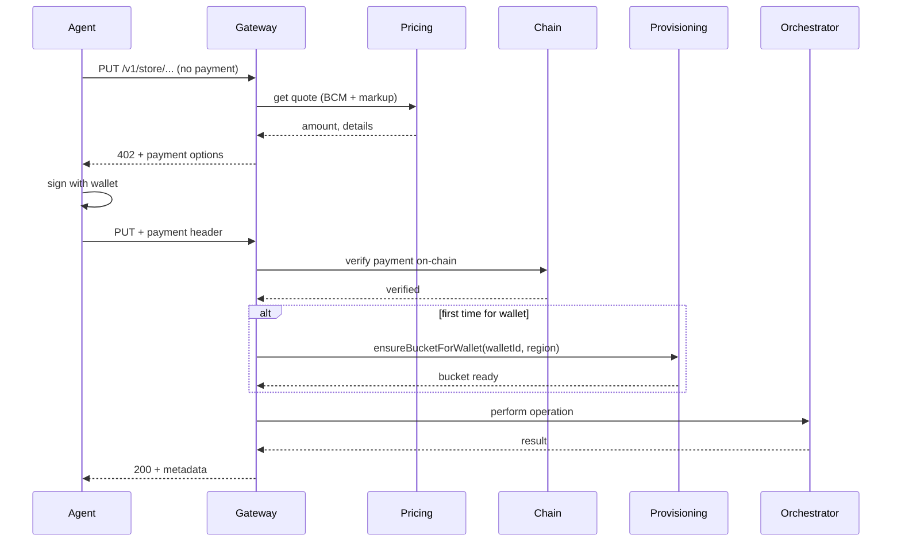

# Feature: x402 Storage Gateway

**Source:** mnemospark Product Spec v3 — Sections 1.1, 2, 3.2, 5.2, 6, 8, 10–13  
**PRD:** [mnemospark_PRD.md](../mnemospark_PRD.md) — R1 (x402 payment-as-auth), R2 (activity fee), R3 (storage fee trigger), R6 (wallet=tenant, bucket-per-wallet), R10–R11 (Phase 1 scope)  
**Status:** Definable now

---

## Feature Name

x402 Storage Gateway

## Problem

Agents need to pay for storage operations without managing separate API keys or OAuth. The product promise is **payment-as-authentication**: the micropayment is the credential. Without a gateway that enforces 402 → quote → sign → on-chain verify → then perform operation, we cannot guarantee that no storage access happens before payment is verified.

**User job:** “I want to upload/download/list my agent data by paying per request, with no separate storage credentials.”

## Solution

Build an **x402 Storage Gateway** that sits in front of all storage operations:

1. **Receive** storage request (e.g. PUT/GET/LIST from agent or proxy).
2. **Quote** using the Pricing Module (BCM + markup for activity; GetCostForecast + markup for storage fee when applicable). Return **402** with payment options (amount, payTo, asset, network).
3. **Accept** retried request with payment header; **verify payment on-chain**.
4. **After verification:** Ensure bucket-per-wallet provisioning in the **single AWS account** (create bucket for wallet if first time in region); then call **Orchestrator** to perform the S3 operation.
5. **Return** 200 + response body/metadata, or appropriate error.

Reuse existing codebase: `x402`, `auth`, `balance`, `payment-cache`, `config`, `logger`; proxy-style HTTP server and 402 retry flow. **Replace** the LLM proxy target with storage gateway logic (see Section 12.2).

## Success Metrics

- 100% of storage operations require verified on-chain payment before any S3 call.
- Gateway returns 402 with correct quote (BCM + markup) for every unauthenticated storage request.
- Time from “request with payment” to “200 + result” is within SLA (e.g. p95 &lt; 5s for upload/list; download depends on size).
- Zero storage operations performed without prior payment verification (auditable via logs).

## Acceptance Criteria

1. Gateway exposes HTTP REST endpoints that accept storage operations (upload, download, list) and return 402 when no valid payment is present.
2. 402 response body includes amount (from Pricing Module), payTo, asset, network sufficient for client to sign and retry.
3. On request with valid payment header, gateway verifies payment on-chain before calling Orchestrator.
4. If payment is valid and the wallet does not yet have a bucket in the chosen region, gateway triggers **Bucket-per-wallet Provisioning** (create bucket in the single AWS account) then proceeds with operation.
5. Gateway never calls Orchestrator or S3 before on-chain verification succeeds.
6. Idempotency: optional `Idempotency-Key` header supported for mutating operations; duplicate key within TTL returns cached 200 (no double charge). _(TTL and required vs optional to be confirmed — see spec feedback.)_
7. Insufficient funds / verification failure returns clear error (4xx) and does not perform storage operation.
8. Integration tests with real S3 (Vitest) cover 402 → pay → verify → 200 flow for at least one operation type.

## Dependencies

- **Pricing Module** (quotes for activity and storage fee).
- **Orchestrator** (performs S3 after verification).
- **Bucket-per-wallet Provisioning** (triggered on first verified payment for a wallet to create its bucket in the single AWS account).
- **S3 Storage Backend** (used by Orchestrator).
- Existing: x402, auth, balance, payment-cache, config, logger.

## RICE Score

| R              | I   | C    | E              | Score            |
| -------------- | --- | ---- | -------------- | ---------------- |
| All MVP agents | 3   | 100% | 2 person-weeks | (R×I×C)/E = high |

- **Reach:** Every agent using mnemospark.
- **Impact:** 3 (massive — unlocks paid storage).
- **Confidence:** 100% (spec and tech choices resolved).
- **Effort:** M (~2 weeks).

## Timeline

**M** (2 weeks)

## Hand-off Questions

1. Where exactly does the current proxy 402 retry flow live (file/function), and what is the minimal set of changes to swap “LLM upstream” for “Pricing Module quote + Orchestrator call”?
2. Should verification failure after a successful quote be logged in a dedicated audit structure (see metering storage open question in spec)?
3. Confirm: one gateway process per OpenClaw instance (started by plugin), and all agent requests from that instance go through this single gateway?

---

## Antfarm hand-off

### Task string (copy-paste for `workflow run feature-dev`)

```
Build the x402 Storage Gateway for mnemospark: HTTP REST gateway in front of all storage operations that (1) returns 402 with quote from Pricing Module when no payment, (2) verifies payment on-chain before any S3 call, (3) triggers bucket-per-wallet provisioning in single AWS account when wallet has no bucket in region, (4) calls Orchestrator after verification to perform S3 operation. Reuse x402, auth, balance, payment-cache, config, logger; replace LLM proxy target with storage gateway. Constraints: single AWS account; one bucket per wallet; no storage operation before on-chain verification. Acceptance: [ ] REST endpoints for upload/download/list return 402 when no valid payment; [ ] 402 body includes amount, payTo, asset, network; [ ] valid payment header triggers on-chain verify then Orchestrator; [ ] first-time wallet/region triggers bucket provisioning then operation; [ ] Orchestrator/S3 never called before verification; [ ] optional Idempotency-Key for mutating ops, duplicate key within TTL = cached 200 no double charge; [ ] verification failure returns 4xx, no storage op; [ ] Vitest integration test 402→pay→verify→200 for at least one operation type.
```

### Verifier acceptance checklist

- [ ] Gateway exposes HTTP REST endpoints for storage operations (upload, download, list) and returns 402 when no valid payment.
- [ ] 402 response body includes amount (from Pricing Module), payTo, asset, network for client to sign and retry.
- [ ] On request with valid payment header, gateway verifies payment on-chain before calling Orchestrator.
- [ ] If payment valid and wallet has no bucket in chosen region, gateway triggers Bucket-per-wallet Provisioning then proceeds.
- [ ] Gateway never calls Orchestrator or S3 before on-chain verification succeeds.
- [ ] Optional `Idempotency-Key` header supported for mutating operations; duplicate key within TTL returns cached 200 (no double charge).
- [ ] Insufficient funds / verification failure returns clear 4xx and does not perform storage operation.
- [ ] Integration tests with real S3 (Vitest) cover 402 → pay → verify → 200 for at least one operation type.

---

## Customer Journey Map

Agent/user has installed mnemospark and funded wallet. They (or the agent) issue a storage request. The gateway is the first touchpoint: it either returns 402 (quote) or, after payment, 200 (result). This feature is the core of “pay to store.”

## UX Flow (high level)



## Edge Cases and Error States

| Scenario                                             | Handling                                                                                                                                              |
| ---------------------------------------------------- | ----------------------------------------------------------------------------------------------------------------------------------------------------- |
| Client never retries with payment                    | 402 remains; no storage operation.                                                                                                                    |
| Payment verification fails (e.g. insufficient funds) | 4xx, clear message; no Orchestrator call.                                                                                                             |
| Verification succeeds but Orchestrator/S3 fails      | Return 5xx; payment already consumed — idempotency key allows safe retry (same key → cached response if implemented).                                 |
| Duplicate Idempotency-Key within TTL                 | Return 200 with cached response; do not charge again or perform operation again.                                                                      |
| Gateway crash after verification, before S3          | Payment is on-chain; on retry with same idempotency key, return cached result if stored; otherwise client may need to retry (idempotency design TBD). |

## Data Requirements

- Gateway must pass to Pricing: operation type, size (if known), region, storage class for quote.
- Gateway must pass to Orchestrator: region, agent id (or wallet-derived bucket id), key, body (upload), etc.
- For audit (if activity log is in scope): timestamp, request type, wallet, amount, success/failure (see spec feedback).
