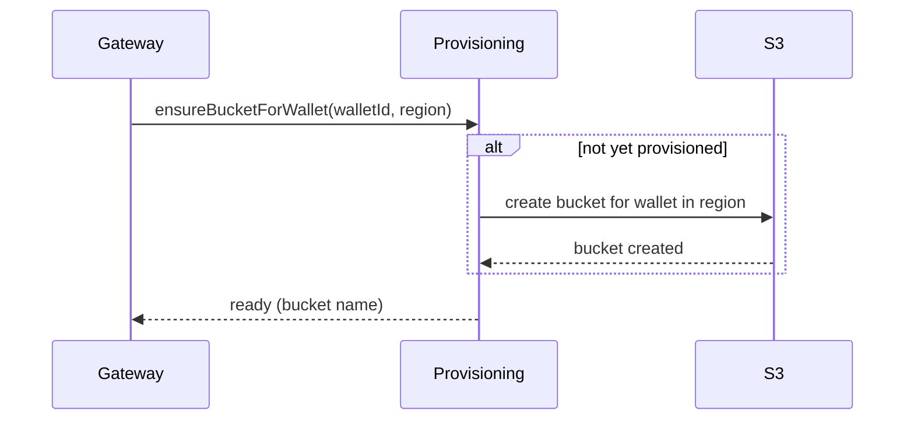

# Feature: Bucket-per-wallet Provisioning

**Source:** mnemospark Product Spec v3 — Sections 3.3.1, 5.1, 6.1, 10.1, 11  
**PRD:** [mnemospark_PRD.md](../mnemospark_PRD.md) — R6 (tenant model: single account, wallet=tenant, bucket-per-wallet; payment triggers bucket creation)  
**Status:** Definable now

---

## Feature Name

Bucket-per-wallet Provisioning (single AWS account)

## Problem

When an agent (via its wallet) pays for the first time in a region, we must have a place to store its data: a **bucket per wallet** in the **single AWS account**, with clear mapping between wallet and bucket. Spec v3 resolves that there is no AWS Organizations or sub-accounts; **wallet = tenant**, and **payment verification triggers bucket creation** (per region as configured). Without automated bucket-per-wallet provisioning, we’d need manual S3 setup per tenant and cannot scale.

**User job:** “The first time I pay for storage in a region, my wallet’s bucket is created automatically; I don’t have to configure AWS.”

## Solution

Implement **Bucket-per-wallet Provisioning** that:

1. **Trigger:** Invoked by the **x402 Storage Gateway** after **on-chain payment verification** for a wallet that does not yet have a bucket in the chosen region.
2. **Identity model:**
   - **Company** = single AWS account used by mnemospark.
   - **Wallet** = storage tenant.
   - **Bucket:** Each wallet has **one S3 bucket per region** as configured for MVP (2–3 regions). Agent data lives under prefixes inside that bucket.
3. **Actions:**
   - Compute deterministic bucket name from wallet id (and region) following AWS naming rules.
   - Check if bucket exists; if not, create it in the correct region with required encryption and tags (e.g. SSE-S3/SSE-KMS, cost allocation tags).
   - Optionally apply tags/metadata needed for Cost Explorer/GetCostForecast scoping.
4. **Idempotency:** If wallet already has a bucket in that region, provisioning is a no-op (return success).
5. **Security:** Bucket policies and IAM roles ensure isolation between wallets (no cross-wallet access), while keeping all resources in the single account.

Gateway calls provisioning only after payment is verified; provisioning does not handle payment or 402.

## Success Metrics

- First verified payment for a new wallet in a region results in exactly **one new bucket** for that wallet in that region.
- Subsequent requests for the same wallet/region do not create duplicate buckets.
- Provisioning completes within acceptable time (e.g. &lt; 30 seconds) or returns an error that gateway can surface for retry.
- Integration test: simulate “first payment for wallet W in region R” → verify bucket exists and Orchestrator/S3 backend can use it.

## Acceptance Criteria

1. Provisioning is invoked by the gateway when: payment verified **and** wallet has no bucket in the target region.
2. Deterministic bucket naming: bucket name derived from wallet id and region, compliant with AWS naming rules and unique in the account.
3. Bucket is created in the correct region, with encryption settings per Phase 1 (SSE-S3/SSE-KMS) and required tags/metadata.
4. One bucket per wallet per region: repeated calls for same wallet/region do not create duplicates; provisioning is idempotent.
5. Errors (e.g. bucket creation failure, name collision) are logged and returned to gateway; gateway can return 503 and ask client to retry later.
6. Documentation or runbook: how to add a new region (config update and any tagging requirements).

## Dependencies

- **x402 Storage Gateway** (invokes provisioning after verification).
- **Orchestrator** and **S3 Storage Backend** (use the created bucket in the single AWS account).
- AWS: Single account with IAM permissions to create S3 buckets and apply policies/tags.

## RICE Score

| R               | I   | C   | E                | Score |
| --------------- | --- | --- | ---------------- | ----- |
| All new wallets | 3   | 90% | 1.5 person-weeks | High  |

- **Reach:** Every new wallet/tenant.
- **Impact:** 3 (enables per-tenant isolation and scaling).
- **Confidence:** 90% (single-account S3 provisioning is straightforward).
- **Effort:** M– (between S and M, ~1.5 weeks).

## Timeline

**M–** (~1.5 weeks)

## Hand-off Questions

1. Exact bucket naming convention from wallet id + region (hashing, truncation, character set) and required tags for billing/forecasting.
2. Whether provisioning should eagerly create buckets in all configured regions on first payment, or lazily per region when first used.
3. How to surface “bucket for wallet” mapping to Pricing/Cost Explorer (tags, naming, both).

---

## Antfarm hand-off

### Task string (copy-paste for `workflow run feature-dev`)

```
Build Bucket-per-wallet Provisioning for mnemospark: invoked by x402 Storage Gateway after on-chain payment verification when wallet has no bucket in the chosen region. In single AWS account: compute deterministic bucket name from wallet id + region (AWS naming rules), create bucket in region with SSE-S3 or SSE-KMS and tags (e.g. cost allocation). Idempotent: same wallet/region returns success, no duplicate bucket. Return bucket name to gateway. Constraints: no AWS Organizations or CloudFormation; one bucket per wallet per region; bucket policies/IAM for wallet isolation. Acceptance: [ ] invoked when payment verified and wallet has no bucket in target region; [ ] deterministic bucket naming from wallet id + region, AWS-compliant and unique; [ ] bucket created with Phase 1 encryption (SSE-S3/SSE-KMS) and required tags; [ ] repeated wallet/region = no duplicate, idempotent; [ ] errors logged and returned for gateway 503/retry; [ ] docs or runbook for adding new region.
```

### Verifier acceptance checklist

- [ ] Provisioning invoked by gateway when: payment verified **and** wallet has no bucket in target region.
- [ ] Deterministic bucket naming: bucket name derived from wallet id and region, compliant with AWS naming rules and unique in account.
- [ ] Bucket created in correct region with Phase 1 encryption (SSE-S3/SSE-KMS) and required tags/metadata.
- [ ] One bucket per wallet per region: repeated calls for same wallet/region do not create duplicates; provisioning is idempotent.
- [ ] Errors (e.g. bucket creation failure, name collision) logged and returned to gateway; gateway can return 503 and ask client to retry.
- [ ] Documentation or runbook: how to add a new region (config update and tagging requirements).

---

## Customer Journey Map

Agent funds wallet and issues first storage request in a region. Gateway verifies payment, then calls Bucket-per-wallet Provisioning. Once provisioning succeeds, Orchestrator can use the new bucket. The agent experiences “first request in a region might take a bit longer; later requests are fast.”

## UX Flow



## Edge Cases and Error States

| Scenario                                                        | Handling                                                                                                 |
| --------------------------------------------------------------- | -------------------------------------------------------------------------------------------------------- |
| Bucket already exists for wallet/region                         | Return success; no duplicate creation.                                                                   |
| Bucket name collision                                           | Log; adjust naming (e.g. suffix) or return error; gateway 503; client can retry.                         |
| S3 rate limit or transient failure                              | Log; retry with backoff; on persistent failure, gateway 503; client can retry.                           |
| Partial success across regions (if eager multi-region creation) | Document behavior: retry provisioning for failed regions only, or fall back to lazy-per-region creation. |

## Data Requirements

- Inputs: wallet id (or equivalent), region.
- Outputs: bucket name for wallet/region (mapping) for Orchestrator/backend.
- No internal ledger for “GB stored”; usage from AWS APIs. Audit trail for “who was provisioned when” may live in activity log (see spec feedback).
