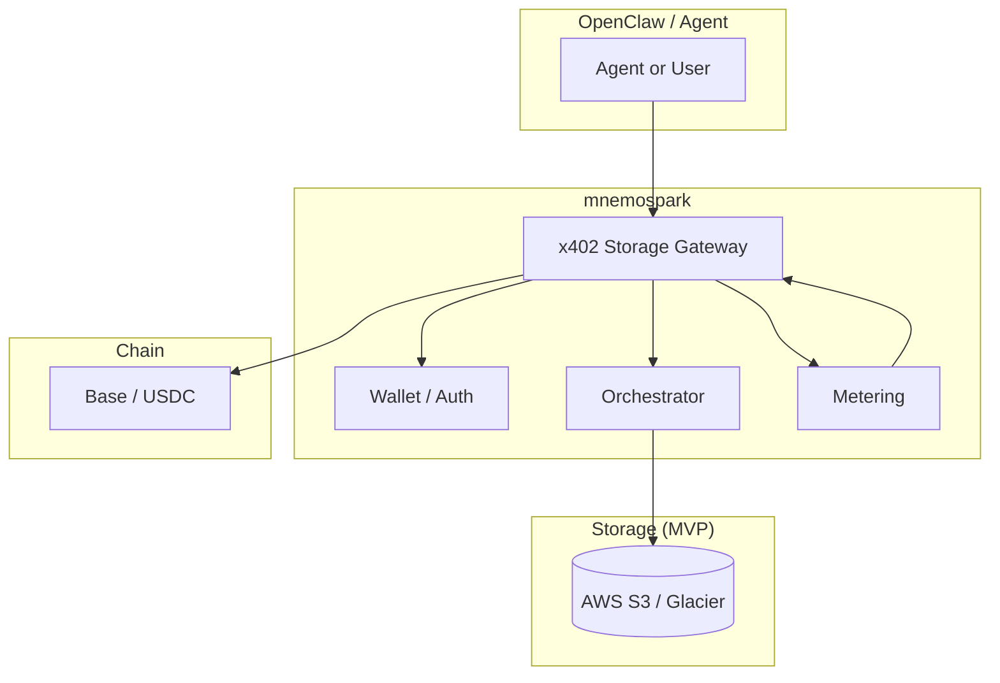
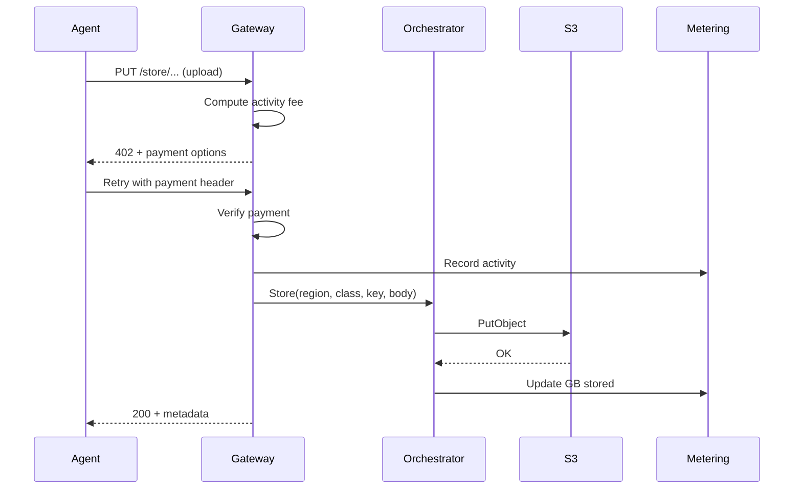

# mnemospark – Product Specification v1

**Document version:** 1.0  
**Last updated:** February 2026  
**Audience:** Product Managers, leadership, feature development

mnemospark is a **storage orchestration** product for **OpenClaw** and its agents. Agents pay for their own persistence and data sovereignty using **x402 payment-as-authentication**. The product will support **many storage providers and many regions** over time; we start with **AWS S3 and S3 Glacier** and the regions AWS offers. Revenue is **metered via x402**: activity fees (pay-per-sync) and storage fees (monthly GB stored + region premium).

---

## Executive summary

**mnemospark** is a storage orchestration product for **OpenClaw** and its agents. It lets agents pay for their own persistence using **x402 payment-as-authentication**: no API keys for storage—the micropayment is the credential. The system orchestrates **where** and **how** agent data is stored (provider, region, storage class) and charges per sync (activity) plus per GB per month (storage), with optional region premium. **MVP** uses **AWS S3 and S3 Glacier** across AWS regions; the product is designed to support additional providers and regions in the future. Installation and use follow the same pattern as the prior OpenClaw plugin (see [Current product spec](.company/current_product_spec.md)): install as an OpenClaw plugin, fund a wallet, use commands and tools from the assistant.

---

## 1. Core concept

### 1.1 x402 payment-as-authentication handshake

- x402 is used as **payment-as-authentication**. The handshake: “Pay to prove entitlement to use this storage endpoint.” Payment both **authorizes** the operation and **meters** it. No separate API keys or OAuth for storage access—the micropayment is the credential.
- **Implication for features:** Every storage operation (sync up, sync down, list, etc.) can be gated by a 402 flow: server returns 402 + payment options; client (agent or proxy) signs payment; server grants access and performs the operation. Usage is metered and paid in one step.

### 1.2 Storage orchestration (product)

- **Storage orchestration** means the product decides **where** (provider, region) and **how** (storage class, tier) to store agent data and executes the operations after payment.
  - **Provider selection:** Start with AWS S3/Glacier; later add other providers (e.g. GCS, Azure Blob).
  - **Regional storage (feature):** Choose region(s) for data (sovereignty, latency, compliance). MVP uses AWS regions; product will support multiple providers and many regions over time.
  - **Storage class selection:** Map agent needs to storage classes (e.g. S3 Standard, Standard-IA, Glacier Instant/Flexible/Deep Archive, Intelligent-Tiering).
  - **Sync semantics:** Upload, download, list, restore from archive—each metered as **activity**.

### 1.3 Goal: Agents pay for their own persistence and sovereignty

- **Persistence:** Agent state, memories, and artifacts are stored in cloud storage; the **agent (or its wallet)** pays for that storage and for each sync.
- **Sovereignty:** Region choice gives control over where data lives (e.g. EU for GDPR, US for domestic-only). “Region premium” in the revenue model reflects higher-value or regulated regions.
- **Autonomous:** No human-in-the-loop to top up a provider API key; the agent’s wallet is funded with USDC and pays via x402 per operation.

---

## 2. Revenue model (metered x402 payments)

All charges are collected via **x402 micropayments** (e.g. USDC on Base). Two fee types:

### 2.1 Activity fee: Pay-per-sync

- **What counts as “sync”:** Each discrete storage operation that consumes bandwidth or compute.
  - **Upload (PUT):** Pay per upload (and optionally per GB uploaded).
  - **Download (GET):** Pay per download and/or per GB downloaded.
  - **List / enumerate:** Pay per LIST (or per 1000 keys).
  - **Restore from Glacier:** Pay per restore request and/or per GB restored (aligns with AWS retrieval pricing).
- **Product name:** “Activity fee” or “Pay-per-sync” — micro-payments for **bandwidth and compute** consumed by sync operations.
- **Feature implications:**
  - Meter every storage API call (or batched equivalent) and return 402 with amount due before performing the operation.
  - Expose clear pricing (e.g. $ per 1000 PUTs, $ per GB egress) so agents or operators can estimate cost.

### 2.2 Storage fee: Monthly recurring (GB stored + region premium)

- **GB stored:** Monthly fee based on **total GB stored** (e.g. at end of month or rolling average). Mirrors AWS S3 storage pricing (per GB-month).
- **Storage class:** Fee can vary by effective “storage class” (e.g. Standard vs Glacier Deep Archive). Lower access tiers = lower $/GB-month.
- **Region premium:** Surcharge for storing data in selected regions (e.g. EU, regulated markets). Reflects sovereignty and compliance value.
- **Billing cadence:** Can be aggregated monthly and charged via x402 (e.g. one 402 per month for storage bill) or broken into smaller micropayments.
- **Feature implications:**
  - Track per-customer (per-wallet) usage: GB per region and per storage class.
  - Report “storage usage” and “estimated storage fee” in dashboard or `/storage`-style commands.
  - Support “region premium” as a configurable multiplier or fixed add-on per region.

### 2.3 Summary table

| Fee type | Metered by                        | Example x402 trigger            |
| -------- | --------------------------------- | ------------------------------- |
| Activity | Per PUT/GET/LIST/restore, + GB    | 402 before upload/download      |
| Storage  | GB-month + storage class + region | Monthly 402 or pre-paid balance |

---

## 3. MVP scope: AWS S3 and S3 Glacier

### 3.1 Why S3 / Glacier for MVP

- **Mature APIs:** PUT, GET, LIST, multipart upload, and storage class selection are well-defined. Easy to map “sync” to S3 operations.
- **Storage classes:** Standard (frequent), Standard-IA / One Zone-IA (infrequent), Glacier Instant / Flexible / Deep Archive (archive), and Intelligent-Tiering (auto) support orchestration by access pattern.
- **Many regions:** AWS offers many regions; buckets are per-region. Replication (CRR/SRR) and Multi-Region Access Points support multi-region strategies and region premium.
- **Pricing model alignment:** AWS charges for storage (GB-month), requests (PUT/GET/LIST), and data transfer. Maps cleanly to **Activity fee** (requests + transfer) and **Storage fee** (GB-month + region).

### 3.2 MVP capabilities (feature development)

1. **Storage backend abstraction**
   - Single “storage provider” interface: create bucket (or use existing), PUT, GET, LIST, delete, get metadata, set storage class.
   - First implementation: **AWS S3** (and S3 Glacier via storage class/lifecycle). Use AWS SDK; credentials are server-side (mnemospark service), not the agent. Agent pays mnemospark via x402; mnemospark pays AWS (or passes through cost).

2. **x402 gateway for storage**
   - All storage API calls go through an **x402 gateway**. Gateway returns 402 + payment options (amount, payTo, asset, network). Agent (or proxy) signs payment; gateway verifies and then performs the S3 operation.
   - Reuse existing x402 stack (signing, payment cache, balance check) from codebase; gateway calls orchestrator and storage backend instead of an LLM API.

3. **Orchestration (region + storage class)**
   - **Region selection:** Configure or select AWS region(s) per tenant/agent (e.g. us-east-1, eu-west-1). Store region in config or per-bucket.
   - **Storage class selection:** Map “tier” or “profile” to S3 storage class (e.g. hot → Standard, cool → Standard-IA, archive → Glacier). MVP can start with Standard + one Glacier class.
   - **Orchestrator:** Component that, given “sync this blob” or “store this with tier X in region Y,” chooses bucket, key, and storage class and performs the operation after payment.

4. **Metering and pricing**
   - **Activity:** For each PUT/GET/LIST/restore, compute price (e.g. from config or table: $ per 1000 requests, $ per GB). Return in 402 body; after payment, log for billing and analytics.
   - **Storage:** Periodically (e.g. daily) sum GB stored per wallet/tenant per region and storage class. Apply $/GB-month and region premium. Expose via “storage usage” API or report; charge via x402 (e.g. monthly).

5. **Agent-facing API**
   - Simple REST or RPC: “Upload object,” “Download object,” “List prefix,” “Get storage usage.” All require x402 payment (or pre-paid balance). Optional: idempotency keys to avoid double charge on retries.

### 3.3 Out of scope for MVP (later)

- Other storage backends (e.g. GCS, Azure Blob, IPFS) as additional provider implementations.
- Full CRR/SRR and Multi-Region Access Points (can be phased: start single region, add replication later).
- Complex lifecycle automation (e.g. auto-transition to Glacier after 90 days) can be a follow-on; MVP can set storage class at write time.

---

## 4. OpenClaw product and integration

### 4.1 Product for OpenClaw and its agents

mnemospark is a product **for OpenClaw and its agents**. It should be **easy to install into OpenClaw and use**, in the same way as the prior plugin (ClawRouter): install via OpenClaw’s plugin system, fund a wallet, and use storage from the assistant (commands, tools, or agent-accessible API).

- **OpenClaw** is the personal AI assistant platform ([openclaw.ai](https://openclaw.ai), [GitHub openclaw/openclaw](https://github.com/openclaw/openclaw)). It provides the Gateway (control plane), channels (WhatsApp, Telegram, Slack, Discord, etc.), agents, skills, and tools.
- **Install and use:** Users install mnemospark as an OpenClaw plugin (e.g. `openclaw plugins install mnemospark` or equivalent). After installation, the gateway loads the plugin; the plugin registers commands (e.g. `/wallet`, `/storage`) and may start a local storage gateway when the gateway runs. Agents (or users via chat) can then persist and retrieve data via x402-paid storage.
- **Consistency with prior product:** The prior product (see [Current product spec](.company/current_product_spec.md)) was an OpenClaw plugin that registered a provider, injected config, and started a local proxy. mnemospark should follow the same integration pattern: plugin entry point, config injection if needed, local gateway/proxy when the gateway runs, and clear commands for wallet and storage usage.

### 4.2 OpenClaw directory and file structure (reference for building features)

The following layout is relevant for integrating mnemospark with OpenClaw and for skills/plugins that read or write under the OpenClaw tree. Use it when implementing config, wallet, logs, and any workspace/skills paths. For a detailed example of **skill/plugin file layout and backup patterns** (directory structure, what to back up, scripts), see [examples/openclaw-skills-clawdbot-backup-1.0.1/SKILL.md](../examples/openclaw-skills-clawdbot-backup-1.0.1/SKILL.md). That example documents a ClawdBot (~/.claude) structure; the **OpenClaw** equivalents are below.

**OpenClaw key locations:**

```
~/.openclaw/                        # Main OpenClaw directory
├── openclaw.json                   # Main gateway config (models, channels, agents, etc.)
├── openclaw.yaml                   # Alternative/override config
├── agents/                         # Per-agent config and auth
│   ├── main/
│   │   └── agent/
│   │       └── auth-profiles.json
│   └── <agentId>/
├── workspace/                      # Agent workspace (default root for tools)
│   └── skills/                     # Workspace skills: ~/.openclaw/workspace/skills/<skill>/SKILL.md
│       └── <skill-name>/
│           ├── SKILL.md
│           └── ...
├── extensions/                     # Installed extensions/plugins (e.g. clawrouter, mnemospark)
│   └── <plugin-name>/
│       ├── package.json
│       ├── openclaw.plugin.json
│       └── ...
└── blockrun/                       # Prior plugin data (mnemospark can use same pattern under mnemospark/)
    ├── wallet.key                  # Wallet private key (sensitive)
    └── logs/                       # Usage logs (e.g. usage-YYYY-MM-DD.jsonl)
```

**For mnemospark:**

- **Config:** Plugin config can live in OpenClaw’s config (`openclaw.json` / `openclaw.yaml`) under a `mnemospark` or `plugins.mnemospark` key, or in a dedicated file under `~/.openclaw/mnemospark/` (e.g. `config.json`).
- **Wallet:** Same pattern as prior product: e.g. `~/.openclaw/mnemospark/wallet.key` (or reuse `blockrun` path during migration). Env override: `MNEMOSPARK_WALLET_KEY` or equivalent.
- **Logs / metering:** e.g. `~/.openclaw/mnemospark/logs/` for activity and storage usage logs.
- **Plugin binary/config:** Installed under `~/.openclaw/extensions/mnemospark/` (or as per OpenClaw’s plugin install path) with `package.json`, `openclaw.plugin.json`, and built `dist/`.

**Skills and workspace (OpenClaw):**

- **Workspace root:** Default `~/.openclaw/workspace` (configurable via `agents.defaults.workspace` in OpenClaw).
- **Skills:** `~/.openclaw/workspace/skills/<skill-name>/SKILL.md` — each skill is a directory with a `SKILL.md` and optional supporting files.
- **Injected prompts:** OpenClaw can inject `AGENTS.md`, `SOUL.md`, `TOOLS.md` from the workspace.

When building mnemospark features (storage gateway, commands, tools), use the paths above so that config, wallet, and logs are in the right place and backup/restore procedures (as in the [ClawdBot backup SKILL](../examples/openclaw-skills-clawdbot-backup-1.0.1/SKILL.md)) can be adapted for OpenClaw by substituting `~/.openclaw` and the structure above.

---

## 5. Architecture at a glance

- **Core:** **Storage gateway + orchestrator.** Gateway receives storage requests (e.g. “PUT bucket/key”), returns 402 with price, accepts payment, then calls **orchestrator**. Orchestrator selects region + storage class and invokes the **storage backend** (e.g. S3).
- **Deployment:** OpenClaw plugin + local gateway (same process as OpenClaw gateway, or standalone CLI). When the OpenClaw gateway runs, the plugin starts the storage gateway (e.g. HTTP server on localhost). Agents and users access storage through this gateway.
- **Payment layer:** Wallet, x402 signing, balance check, and 402 retry flow (reused from existing codebase).



---

## 6. How data flows

### 6.1 Sync (e.g. upload)

1. Agent sends “upload object” to **x402 Storage Gateway** (e.g. `PUT /v1/store/{region}/{bucket}/{key}` with body).
2. Gateway computes **activity fee** (e.g. PUT price + size-based).
3. Gateway responds **402** with payment options (amount, payTo, asset, network).
4. Agent (or proxy) signs payment with wallet; retries request with payment header.
5. Gateway verifies payment, **records activity** for billing, then calls **Orchestrator**.
6. Orchestrator selects **storage class** (and bucket/region if not fixed); calls **S3** (PutObject).
7. Gateway returns 200 + metadata (e.g. etag, region, storage class).
8. **Storage metering** updates “GB stored” for this wallet/region/class (for monthly storage fee).

### 6.2 Download and list

- Same pattern: Gateway returns 402 → client pays → Gateway performs GET or LIST and charges **activity fee**. No change to “GB stored” for GET; LIST is activity-only.

### 6.3 Monthly storage fee

- **Metering** aggregates GB stored per wallet per region and storage class (e.g. from S3 Inventory or custom bookkeeping).
- Apply **storage fee** (GB-month rate + region premium); trigger **x402** (e.g. one payment per month or deduct from pre-paid balance). Feature: “Storage bill” or “Storage usage” page/command.



---

## 7. Technologies

| Layer         | Technology                           | Note                                                                    |
| ------------- | ------------------------------------ | ----------------------------------------------------------------------- |
| Payment       | x402 (EIP-712 USDC on Base)          | Payment-as-auth for storage.                                            |
| Wallet        | viem, existing auth module           | Wallet pays for storage operations.                                     |
| Storage (MVP) | AWS S3, S3 Glacier                   | SDK (e.g. AWS SDK for JavaScript/TypeScript); server-side credentials.  |
| Orchestration | New module                           | Region + storage-class selection; calls S3 API.                         |
| Metering      | New + existing                       | Activity: per request. Storage: GB-month aggregation.                   |
| Gateway       | HTTP server (existing proxy pattern) | 402 + orchestrator + S3.                                                |
| Host          | OpenClaw                             | Plugin runs inside OpenClaw; gateway starts when OpenClaw gateway runs. |

**AWS (implementation):**

- **S3 storage classes:** Standard, Standard-IA, One Zone-IA, Glacier Instant/Flexible/Deep Archive, Intelligent-Tiering. See [S3 storage class intro](https://docs.aws.amazon.com/AmazonS3/latest/userguide/storage-class-intro.html).
- **Replication:** CRR/SRR and Multi-Region Access Points for multi-region and failover. See [S3 Replication](https://docs.aws.amazon.com/AmazonS3/latest/userguide/replication.html).
- **Pricing:** Storage (GB-month), request (PUT/GET/LIST), data transfer. Align activity fee with request + transfer; storage fee with GB-month + region.

---

## 8. Design and structure (code / feature areas)

- **Keep:** `x402`, `auth`, `balance`, `payment-cache`, `config`, `logger`; proxy-style HTTP server and 402 retry flow.
- **Remove or replace:** LLM router, model list, BlockRun provider, LLM proxy target (see Section 12).
- **Add:**
  - **Storage gateway:** HTTP API for store/get/list; 402 before each operation; call orchestrator after payment.
  - **Orchestrator:** Inputs: region, storage tier (or profile), key, body. Output: S3 PutObject/GetObject/ListObjects with chosen bucket and storage class.
  - **Storage backend (S3):** Wrapper around AWS SDK; bucket naming (e.g. per-wallet or per-tenant); credentials from env or IAM role.
  - **Metering:** Activity log (request type, size, fee); storage usage aggregation (GB per wallet/region/class); optional export for “storage bill.”
- **Config:** Region list, storage-class mapping, activity price table, storage $/GB-month and region premium.

---

## 9. Trade-offs and implications

- **Payment-as-auth:** Simplifies agent onboarding (no API keys for storage) but ties availability to wallet balance and 402 flow. Need clear “insufficient funds” and low-balance warnings (reuse current balance UX).
- **Single storage backend (S3) in MVP:** Faster to ship; multi-backend (e.g. GCS) increases scope. Abstraction layer allows adding backends later without changing gateway/orchestrator interface.
- **Server-side AWS credentials:** Mnemospark service holds AWS keys or IAM role; agents never see them. Agent pays mnemospark; mnemospark pays AWS (or marks up). Operational burden: secure credential storage and per-tenant isolation (e.g. bucket policy or prefix per wallet).
- **Storage fee cadence:** Monthly is simple; more frequent (e.g. weekly) increases 402 traffic. Pre-paid balance can absorb storage fee and simplify UX.
- **Region premium:** Subjective; can start with a simple multiplier per region (e.g. 1.2x for EU) and refine with product and compliance input.

---

## 10. Information gaps and open questions

- **Tenant / identity model:** How is “per-wallet” or “per-tenant” scoped? One wallet = one agent, one user, or one organization? Drives bucket naming, prefix layout, and metering. Need: clear definition and whether multiple wallets can share storage (e.g. org-level billing).
- **Payment verification and settlement:** Who verifies the x402 payment on the server side? Does verification happen on-chain before granting access, or is there a trusted “payment accepted” callback? Need: end-to-end 402 verification flow.
- **Pre-paid balance vs per-request 402:** Do we support a pre-funded balance debited for activity (and optionally storage), or is every operation a 402? If both, how is balance stored and who holds it? Need: decision on balance ledger (on-chain only vs off-chain balance with periodic settlement).
- **Storage usage source of truth:** For “GB stored per wallet/region/class,” use S3 Inventory, S3 API (ListObjects + HeadObject), or an internal ledger updated on every PUT/DELETE? Need: chosen approach and consistency guarantees.
- **Region premium values:** Which regions get a premium and at what multiplier (or fixed add-on)? Need: initial table or formula (can be config-driven).
- **Activity fee pricing table:** Exact $ per 1000 PUT/GET/LIST and $ per GB in/out. Pass-through of AWS costs vs markup. Need: pricing model and initial numbers.
- **Idempotency and retries:** Reuse request-dedup pattern (hash body, cache response 30s) or define explicit idempotency keys (e.g. `Idempotency-Key` header)? Need: decision and API contract so clients can safely retry.
- **Glacier restore semantics:** When agent requests a GET and object is in Glacier, block until restore, return 202 + job id, or pre-warm on a schedule? Need: product behavior and timeout expectations.
- **Multi-region MVP:** Single-region only or support “store in region X” from day one? Need: scope for v1.

---

## 11. Technology choices to make

| Area                        | Options                                                                                                       | Decision needed                                                        |
| --------------------------- | ------------------------------------------------------------------------------------------------------------- | ---------------------------------------------------------------------- |
| **AWS SDK**                 | `@aws-sdk/client-s3` (v3) vs `aws-sdk` (v2)                                                                   | v3 recommended.                                                        |
| **Server-side AWS auth**    | IAM role vs long-lived access keys in env                                                                     | IAM role preferred for production; keys in env acceptable for MVP/dev. |
| **Bucket strategy**         | One bucket per tenant (prefix by wallet) vs one bucket (prefix = wallet/tenant) vs shared bucket + strict IAM | Decide per-tenant vs shared and naming.                                |
| **Gateway transport**       | HTTP REST vs gRPC vs both                                                                                     | REST aligns with 402 and existing proxy; decide for MVP.               |
| **Metering storage**        | Same process (SQLite/JSONL) vs separate DB (Postgres, DynamoDB) vs S3-only (Inventory + custom tags)          | MVP can start with file-based or SQLite.                               |
| **Payment verification**    | On-chain per request vs off-chain “payment service” that settles in batch                                     | Decide who operates payTo and how verification is done.                |
| **OpenClaw plugin surface** | Commands (e.g. `/wallet`, `/storage`), optional tools, service with `stop()` for gateway shutdown             | Align with OpenClaw plugin API.                                        |
| **Testing**                 | Vitest; integration tests against real S3 (localstack vs real AWS test bucket)                                | Decide how we test S3 integration.                                     |

---

## 12. Parts of the existing codebase to prune (later)

The following are tied to the **LLM router / BlockRun** product and are **not needed** for the storage orchestration product. Plan to remove or replace them in a dedicated cleanup pass.

### 12.1 Remove entirely (LLM-router–specific)

| Path                                                   | Purpose                                                                                                  |
| ------------------------------------------------------ | -------------------------------------------------------------------------------------------------------- |
| `src/router/`                                          | Rule-based classifier, tier selection, model fallback chain (entire directory).                          |
| `src/models.ts`, `src/models.test.ts`                  | BlockRun model list, OpenClaw model definitions, aliases, pricing.                                       |
| `src/provider.ts`                                      | BlockRun provider plugin for OpenClaw.                                                                   |
| `src/updater.ts`                                       | ClawRouter npm update check.                                                                             |
| `src/stats.ts`                                         | Inference usage aggregation. Replace with storage/activity stats or remove and re-add.                   |
| `src/journal.ts`, `src/journal.test.ts`                | Session journal from LLM responses.                                                                      |
| `src/session.ts`                                       | Session-pinned model.                                                                                    |
| `src/compression/`                                     | LLM context compression (entire directory).                                                              |
| `src/response-cache.ts`, `src/response-cache*.test.ts` | LLM response cache.                                                                                      |
| `src/dedup.ts`                                         | Request dedup for LLM retries. Evaluate: reuse for storage idempotency or replace with idempotency keys. |
| `src/retry.ts`                                         | Retry logic; may be reusable for S3—review before pruning.                                               |

### 12.2 Heavily modify or replace

| Path           | Pivot action                                                                                                                                                                    |
| -------------- | ------------------------------------------------------------------------------------------------------------------------------------------------------------------------------- |
| `src/proxy.ts` | Replace with storage gateway: same 402 flow and balance checks; add storage API (PUT/GET/LIST), orchestrator call, S3.                                                          |
| `src/index.ts` | Remove provider registration, model config injection, OPENCLAW_MODELS, router exports. Keep wallet resolution, commands (e.g. `/wallet`, `/storage`), service stop for gateway. |
| `src/cli.ts`   | Start storage gateway instead of LLM proxy; keep wallet resolution and balance check; update help and env vars.                                                                 |
| `src/types.ts` | Trim to types needed for storage gateway and OpenClaw plugin surface.                                                                                                           |

### 12.3 Tests

- Remove or repurpose: LLM proxy E2E, resilience, fallback, compression, model-selection, ClawRouter docker tests.
- Keep: balance and wallet tests; add storage gateway E2E when implemented.

### 12.4 Keep as-is or minor changes

`src/x402.ts`, `src/x402.test.ts`, `src/auth.ts`, `src/balance.ts`, `src/payment-cache.ts`, `src/config.ts`, `src/logger.ts`, `src/errors.ts`, `src/version.ts`.

### 12.5 Config and package

- **`openclaw.plugin.json`:** Update name, description, and config schema for storage (region, storage config).
- **`package.json`:** Update name/description; keep `openclaw` peer dependency; add `@aws-sdk/client-s3` when implementing.

---

## 13. Feature development checklist (for PM)

- [ ] **x402 payment-as-auth:** Document handshake (402 → sign → access); ensure gateway never performs storage without valid payment.
- [ ] **Storage gateway API:** Define REST (or RPC) for upload, download, list; idempotency; 402 response shape and payment header.
- [ ] **Activity fee:** Define and implement pricing for PUT/GET/LIST/restore; expose in 402 body; log for billing.
- [ ] **Orchestrator:** Region + storage-class selection; integration with S3 backend; bucket/prefix strategy per wallet or tenant.
- [ ] **S3 backend (MVP):** Create/use bucket(s); set storage class; credentials and region config.
- [ ] **Storage metering:** Track GB stored per wallet/region/class; aggregate for monthly report; compute storage fee (GB-month + region premium).
- [ ] **Storage fee collection:** Monthly (or periodic) 402 or deduction from balance; “storage usage” and “storage bill” view or command.
- [ ] **OpenClaw integration:** Plugin install, config paths, wallet path, commands (`/wallet`, `/storage`), gateway start/stop; align with OpenClaw directory structure (Section 4.2).
- [ ] **Agent-facing docs:** How to fund wallet, call storage API, interpret 402, and understand activity vs storage fees.
- [ ] **Resolve gaps and choices:** Work through Section 10 (information gaps) and Section 11 (technology choices) and document decisions.

---

## 14. Terminology

- **x402 payment-as-authentication:** Using the 402 payment handshake to both authorize and meter access (no separate API key).
- **Storage orchestration:** Deciding where (provider, region) and how (storage class) to store agent data and executing the operations.
- **Regional storage:** Feature that lets users/agents choose region(s) for data (sovereignty, latency, compliance). Product supports many regions (starting with AWS regions).
- **Sync:** A single storage operation (upload, download, list, restore) that is metered as **activity**.
- **Activity fee:** Pay-per-sync charge (requests + optional bandwidth).
- **Storage fee:** Monthly charge for GB stored, plus storage-class and region premium.
- **Region premium:** Surcharge for storing data in designated (e.g. sovereign or regulated) regions.
- **Orchestrator:** Component that selects region and storage class and invokes the storage backend (e.g. S3).
- **OpenClaw:** Personal AI assistant platform ([openclaw.ai](https://openclaw.ai), [GitHub](https://github.com/openclaw/openclaw)); host for mnemospark plugin and agents.

---

## Appendix: References

- **Current product spec (prior plugin):** [.company/current_product_spec.md](.company/current_product_spec.md) — OpenClaw integration pattern, proxy, wallet, commands.
- **OpenClaw:** [openclaw.ai](https://openclaw.ai), [GitHub openclaw/openclaw](https://github.com/openclaw/openclaw).
- **OpenClaw directory structure and skill/plugin layout example:** [examples/openclaw-skills-clawdbot-backup-1.0.1/SKILL.md](../examples/openclaw-skills-clawdbot-backup-1.0.1/SKILL.md) — file and directory structure, backup/restore patterns; adapt paths to `~/.openclaw` and Section 4.2 for feature work.
