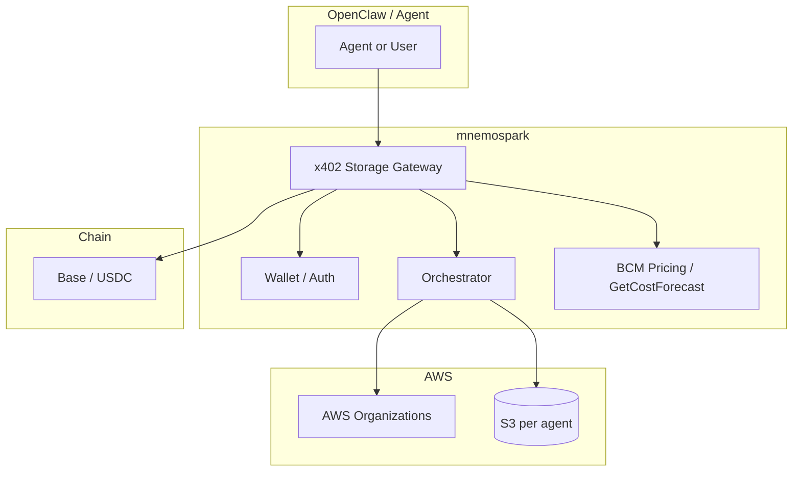

# mnemospark – Product Specification v2

**Document version:** 2.0  
**Last updated:** February 2026  
**Audience:** Product Managers, leadership, feature development

**Changelog (v2):** Resolved Section 10 (information gaps) and Section 11 (technology choices) with product decisions. MVP scope updated: S3 only (no Glacier), 2–3 regions, pricing via AWS BCM Pricing Calculator API and Cost Explorer GetCostForecast API plus markup. Tenant model: AWS Organizations (company = management account; wallet = OU; sub-account per OU; one bucket per agent). Per-request x402; on-chain verification before granting access; payment triggers sub-account creation and infra build.

mnemospark is a **storage orchestration** product for **OpenClaw** and its agents. Agents pay for their own persistence and data sovereignty using **x402 payment-as-authentication**. The product will support **many storage providers and many regions** over time; **MVP** uses **AWS S3 only** (no Glacier) in **two to three regions** as a proof of concept. Revenue is **metered via x402**: per-request activity fees (quote via AWS BCM Pricing Calculator API + markup) and monthly storage fees (AWS Cost Explorer GetCostForecast + markup). No region premium in MVP.

---

## Executive summary

**mnemospark** is a storage orchestration product for **OpenClaw** and its agents. It lets agents pay for their own persistence using **x402 payment-as-authentication**: no API keys for storage—the micropayment is the credential. **MVP** uses **AWS S3 only** (no Glacier) in **two to three regions**, with infrastructure provisioned via **CloudFormation templates** per region. **Pricing:** Initial sync and storage are quoted with the **AWS BCM (Billing and Cost Management) Pricing Calculator API** (service, region, usage, storage class); a **markup percentage** is applied for using the service. **Monthly storage fee** is derived from **Cost Explorer GetCostForecast API** (forecasted usage over the period) plus markup, charged to the OpenClaw wallet. **Download (egress)** is quoted via BCM (data transfer out), markup applied, and charged per request. **Tenant model:** The company owns the primary (management) AWS account; the main OpenClaw agent establishes a wallet (used as the logical **Organizational Unit**, OU); each OU maps to a member (sub-)account; each sub-account can have **one S3 bucket per agent**. Installation and use follow the same pattern as the prior OpenClaw plugin (see [Current product spec](.company/current_product_spec.md)).

---

## 1. Core concept

### 1.1 x402 payment-as-authentication handshake

- x402 is used as **payment-as-authentication**. The handshake: “Pay to prove entitlement to use this storage endpoint.” Payment both **authorizes** the operation and **meters** it. No separate API keys or OAuth for storage access—the micropayment is the credential.
- **Verification:** Verification happens **on-chain** before granting access to cloud account resources and storage. Once payment is verified, that triggers sub-account creation (if needed) and infrastructure build for S3 (and other storage options in the future).

### 1.2 Storage orchestration (product)

- **Storage orchestration** means the product decides **where** (provider, region) and **how** (storage class, tier) to store agent data and executes the operations after payment.
  - **Provider selection:** Start with AWS S3; later add other providers (e.g. GCS, Azure Blob) and Glacier/archive tiers.
  - **Regional storage (feature):** Choose region(s) for data (sovereignty, latency, compliance). MVP offers two to three regions; product will support multiple providers and many regions over time.
  - **Storage class selection:** Map agent needs to S3 storage classes (e.g. Standard, Standard-IA). Glacier is out of scope for MVP.
  - **Sync semantics:** Upload, download, list—each metered as **activity** (per-request x402).

### 1.3 Goal: Agents pay for their own persistence and sovereignty

- **Persistence:** Agent state, memories, and artifacts are stored in cloud storage; the **agent (or its wallet)** pays for that storage and for each sync.
- **Sovereignty:** Region choice gives control over where data lives. Region premium may be added later; MVP uses cost + markup only.
- **Autonomous:** No human-in-the-loop to top up a provider API key; the agent’s wallet is funded with USDC and pays via x402 per operation.

---

## 2. Revenue model (metered x402 payments)

All charges are collected via **per-request x402 micropayments** (e.g. USDC on Base). Two fee types:

### 2.1 Activity fee: Pay-per-sync (per-request x402)

- **What counts as “sync”:** Each discrete storage operation that consumes bandwidth or compute.
  - **Upload (PUT):** When the agent requests storage, we know the size of the files. A **quote** is produced using the **AWS BCM Pricing Calculator API** for S3 (service "Amazon Simple Storage Service", attributes: storage class, region, usage quantity, and optional discounts). Generate estimates for storage, requests, and data transfer. Apply a **markup percentage** for using the service. Charge the OpenClaw wallet via x402 before performing the operation.
  - **Download (GET):** **Egress** (data transferred **out** of AWS) is quoted via the BCM Pricing Calculator API, markup applied, and the OpenClaw agent wallet is charged via x402 for the download.
  - **List / enumerate:** Pay per LIST (or per 1000 keys); quote via BCM + markup.
- **No pre-paid balance for MVP:** Every operation is a 402; no off-chain balance ledger.

### 2.2 Storage fee: Monthly (forecast + markup)

- **Source:** Use **AWS Cost Explorer Forecast API** (**GetCostForecast**): retrieves predicted spending over a specified time period (e.g. up to 3 months daily or 18 months monthly) based on historical usage. Specify TimePeriod, Metric (e.g. BLENDED_COST), Granularity (DAILY/MONTHLY), and optional Filter (by service, region, tags, etc.) to get forecasts with confidence intervals.
- **Monthly fee:** The **forecasted amount of usage** for storage is the basis for the **storage fee**. Apply a **markup percentage** for using the service. This is the **monthly fee** charged to the OpenClaw wallet for hosting the storage (one x402 per month per wallet/tenant).
- **MVP:** No region premium; cost + markup only.

### 2.3 Summary table

| Fee type | Metered by / source                 | Example x402 trigger            |
| -------- | ----------------------------------- | ------------------------------- |
| Activity | BCM Pricing Calculator API + markup | 402 before upload/download/list |
| Storage  | GetCostForecast + markup (monthly)  | Monthly 402 for storage hosting |

---

## 3. MVP scope: AWS S3 (no Glacier), 2–3 regions

### 3.1 Why S3 for MVP

- **Mature APIs:** PUT, GET, LIST, multipart upload. Easy to map “sync” to S3 operations.
- **Regions:** MVP supports **two to three regions** as a proof of concept. Use **CloudFormation templates** to map infrastructure to each region (simple, repeatable).
- **Pricing alignment:** BCM Pricing Calculator API supports full S3 cost modeling; GetCostForecast supports monthly storage fee projection.

### 3.2 MVP capabilities (feature development)

1. **Storage backend (S3 only)**
   - Single “storage provider” interface: create bucket (or use existing), PUT, GET, LIST, delete, get metadata. First implementation: **AWS S3**. Use **@aws-sdk/client-s3** (v3). Credentials: **IAM roles** (dev and prod). Agent pays mnemospark via x402; mnemospark pays AWS (or passes through cost + markup).
   - **Bucket strategy:** **One bucket per agent.** An OpenClaw instance can have many agents (at least the main agent); each agent gets its own S3 bucket.

2. **x402 gateway for storage**
   - All storage API calls go through an **x402 gateway**. Gateway returns 402 + payment options (amount from BCM quote + markup). Agent (or proxy) signs payment; gateway verifies **on-chain**, then performs the S3 operation (and triggers sub-account/infra creation if needed).
   - **Payment verification:** On-chain per request. Request types: (1) establish account and store data, (2) update stored data, (3) monthly service fee for stored data, (4) download stored data.

3. **Orchestration (region + storage class)**
   - **Region selection:** Two to three regions for MVP; CloudFormation templates per region.
   - **Storage class:** MVP uses S3 Standard (or one other non-Glacier class as needed). No Glacier.
   - **Orchestrator:** Given “sync this blob in region X,” chooses bucket (per agent), key, and storage class; performs the operation after payment.

4. **Metering and pricing**
   - **Activity:** Quote via **BCM Pricing Calculator API** (service, region, attributes, usage). Apply markup; return in 402 body; after on-chain verification, perform operation. **Storage usage source of truth:** Use **AWS APIs only** (e.g. S3 API, Cost Explorer); **no internal ledger** for GB stored.
   - **Storage fee:** Use **GetCostForecast** for forecasted storage cost; apply markup; charge OpenClaw wallet monthly via x402.

5. **Agent-facing API**
   - **REST** API: “Upload object,” “Download object,” “List prefix,” “Get storage usage.” All require per-request x402 payment. Idempotency: see Section 10 (remaining open).

### 3.3 Out of scope for MVP (later)

- **S3 Glacier** (restore semantics, archive tiers).
- Other storage backends (GCS, Azure Blob, IPFS).
- Region premium; pre-paid balance; off-chain ledger.
- Full CRR/SRR and Multi-Region Access Points (can be phased).

---

## 4. OpenClaw product and integration

### 4.1 Product for OpenClaw and its agents

mnemospark is a product **for OpenClaw and its agents**. It should be **easy to install into OpenClaw and use**, in the same way as the prior plugin (ClawRouter): install via OpenClaw’s plugin system, fund a wallet, and use storage from the assistant (commands, tools, or agent-accessible API).

- **OpenClaw** is the personal AI assistant platform ([openclaw.ai](https://openclaw.ai), [GitHub openclaw/openclaw](https://github.com/openclaw/openclaw)). It provides the Gateway (control plane), channels, agents, skills, and tools.
- **Install and use:** Users install mnemospark as an OpenClaw plugin. The plugin registers commands (e.g. `/wallet`, `/storage`) and starts the storage gateway when the OpenClaw gateway runs. **OpenClaw plugin surface** aligns with the OpenClaw plugin API (commands, optional tools, service with `stop()` for gateway shutdown).

### 4.2 OpenClaw directory and file structure (reference for building features)

The following layout is relevant for integrating mnemospark with OpenClaw. For a detailed example of skill/plugin file layout and backup patterns, see [examples/openclaw-skills-clawdbot-backup-1.0.1/SKILL.md](../examples/openclaw-skills-clawdbot-backup-1.0.1/SKILL.md). **OpenClaw** key locations:

```
~/.openclaw/
├── openclaw.json
├── agents/
├── workspace/
│   └── skills/<skill-name>/SKILL.md
├── extensions/<plugin-name>/
└── blockrun/   (or mnemospark/) — wallet.key, logs/
```

**For mnemospark:** Config under `openclaw.json` or `~/.openclaw/mnemospark/`; wallet e.g. `~/.openclaw/mnemospark/wallet.key`; logs under `~/.openclaw/mnemospark/logs/`; plugin under `~/.openclaw/extensions/mnemospark/`.

---

## 5. Architecture at a glance

### 5.1 Tenant and identity model (AWS Organizations)

- **AWS Organizations** provides the standard framework: a **primary (management) account** with **member accounts** (sub-accounts) in a hierarchical structure. Enables centralized billing, policy enforcement, and resource isolation.
- **Company** owns the **primary (management) account**.
- **OpenClaw instance** can have **many agents**; the **main OpenClaw agent** establishes a **wallet** if none exists. This wallet is used as the logical **Organizational Unit (OU)** grouping.
- **Sub-accounts** (member accounts under the primary) map to OUs. Each sub-account can support **as many storage locations (e.g. S3 buckets) as needed** to match the **total number of agents** in the OpenClaw instance under that main agent (i.e. **one bucket per agent**).

### 5.2 Core components

- **Storage gateway + orchestrator.** Gateway receives storage requests, returns 402 with price (BCM quote + markup), accepts payment, verifies on-chain, then calls **orchestrator**. Orchestrator selects region and bucket (per agent) and invokes **S3**.
- **Deployment:** OpenClaw plugin + local gateway. When the OpenClaw gateway runs, the plugin starts the storage gateway (e.g. HTTP REST on localhost).
- **Payment layer:** Wallet, x402 signing, on-chain verification, 402 retry flow (reused from existing codebase).



---

## 6. How data flows

### 6.1 Sync (e.g. upload)

1. Agent sends “upload object” to **x402 Storage Gateway** (e.g. `PUT /v1/store/...` with body).
2. Gateway calls **BCM Pricing Calculator API** to get quote for initial sync and storage (service, region, usage). Applies **markup**.
3. Gateway responds **402** with payment options (amount, payTo, asset, network).
4. Agent (or proxy) signs payment with wallet; retries request with payment header.
5. Gateway verifies payment **on-chain**. After verification, triggers **sub-account creation and infrastructure build** (if first time) for S3.
6. Orchestrator selects **bucket** (per agent) and **region**; calls **S3** (PutObject).
7. Gateway returns 200 + metadata. **Storage usage** is derived from **AWS APIs** (no internal ledger).

### 6.2 Download (egress)

- Agent requests download. Gateway quotes **egress** (data transfer out) via **BCM Pricing Calculator API**, applies markup, returns 402. Agent pays; gateway verifies on-chain and performs GET; charges wallet.

### 6.3 Monthly storage fee

- Use **GetCostForecast** for forecasted storage cost over the period. Apply **markup**. Charge OpenClaw wallet via **one x402 per month** for storage hosting.

---

## 7. Technologies

| Layer         | Technology                                                    | Note                                                                      |
| ------------- | ------------------------------------------------------------- | ------------------------------------------------------------------------- |
| Payment       | x402 (EIP-712 USDC on Base)                                   | Payment-as-auth; on-chain verification per request.                       |
| Wallet        | viem, existing auth module                                    | Wallet pays for storage operations.                                       |
| Storage (MVP) | AWS S3 only                                                   | **@aws-sdk/client-s3** (v3). IAM roles (dev and prod). No Glacier in MVP. |
| Pricing       | BCM Pricing Calculator API, Cost Explorer GetCostForecast API | Quote activity and egress; forecast storage; apply markup.                |
| Orchestration | New module                                                    | Region + bucket (one per agent); calls S3 API.                            |
| Gateway       | HTTP REST server (existing proxy pattern)                     | 402 + BCM quote + orchestrator + S3.                                      |
| Host          | OpenClaw                                                      | Plugin aligns with OpenClaw plugin API.                                   |
| Testing       | Vitest                                                        | Integration tests against **real S3** (no localstack for decision).       |

**AWS (implementation):**

- **S3:** Standard (and optionally Standard-IA) for MVP. No Glacier.
- **Tenant isolation:** AWS Organizations; one bucket per agent; CloudFormation per region (2–3 regions for MVP).

---

## 8. Design and structure (code / feature areas)

- **Keep:** `x402`, `auth`, `balance`, `payment-cache`, `config`, `logger`; proxy-style HTTP server and 402 retry flow.
- **Remove or replace:** LLM router, model list, BlockRun provider, LLM proxy target (see Section 12).
- **Add:**
  - **Storage gateway:** REST API for store/get/list; 402 before each operation; BCM quote + markup; on-chain verification; call orchestrator after payment.
  - **Orchestrator:** Inputs: region, key, body. Output: S3 PutObject/GetObject/ListObjects with chosen bucket (per agent).
  - **Storage backend (S3):** Wrapper around **@aws-sdk/client-s3** (v3); one bucket per agent; IAM roles.
  - **Pricing module:** BCM Pricing Calculator API (activity, egress); GetCostForecast (monthly storage); markup config.
- **Config:** Region list (2–3 for MVP), storage-class mapping (S3 Standard), markup percentage. No internal ledger; use AWS APIs for usage.

---

## 9. Trade-offs and implications

- **Payment-as-auth + on-chain per request:** Simplifies agent onboarding but ties every operation to a 402 and on-chain verification. Need clear “insufficient funds” and retry UX.
- **No Glacier in MVP:** Simplifies scope and avoids restore semantics; archive tiers can be added later.
- **One bucket per agent:** Clear isolation and metering; more buckets to manage. Aligns with AWS Organizations and sub-account model.
- **No internal ledger:** Reliance on AWS APIs (S3, Cost Explorer) for usage and billing. Simpler ops; audit trail for our own activity logs may still be needed (see Section 10).
- **2–3 regions, CloudFormation:** Simple multi-region MVP; easy to add regions later with templates.

---

## 10. Resolved decisions (v2) and remaining open questions

### 10.1 Resolved (v2)

- **Tenant / identity model:** AWS Organizations. Company = primary (management) account. OpenClaw main agent establishes a wallet (no wallet → create one); wallet = logical **OU**. Sub-accounts (member accounts) under the primary; each sub-account can have as many S3 buckets as needed = **one bucket per agent** in that OpenClaw instance.
- **Payment verification and settlement:** Verification is **on-chain** before granting access to cloud account resources and storage. Once payment is verified, that triggers sub-account creation and infrastructure build for S3 (and other storage options later).
- **Pre-paid balance vs per-request 402:** **Per-request x402 only.** Quote produced with **BCM Pricing Calculator API** for S3 (service, attributes, usage, discounts). Comprehensive estimates for storage, requests, and data transfer. Apply markup; charge OpenClaw wallet per operation. No pre-paid balance for MVP.
- **Storage usage source of truth:** **No internal ledger.** Use **AWS APIs only** (e.g. S3 API, Cost Explorer / GetCostForecast for forecasted usage).
- **Region premium values:** **MVP:** Two or three regions as proof of concept. **No region premium.** Determine cost and apply a **markup percentage** for using the service.
- **Activity fee pricing:** **BCM Pricing Calculator API** for initial sync and storage quote + **markup**. **Egress:** Quote data transfer out via BCM, markup, charge OpenClaw wallet on download. **Storage fee:** **GetCostForecast API** for forecasted usage; storage fee = forecast + markup; monthly x402 to OpenClaw wallet for hosting.
- **Glacier restore semantics:** **No Glacier for MVP.** Deferred.
- **Multi-region MVP:** **Multi-region MVP:** At least **two to three regions**; keep it simple with **CloudFormation templates** to map infrastructure to each region.

### 10.2 Remaining open questions

- **Idempotency and retries:** Need a simple, explicit contract so clients can safely retry (e.g. avoid double charge or double upload). See _Additional feedback_ below for a recommended approach.
- **Metering storage (where we store our own records):** Usage _source of truth_ is AWS APIs (resolved). Open question: **Where do we store our own records** of activity (request logs, who paid what, audit trail)? Options: (A) Same process: JSONL or SQLite under `~/.openclaw/mnemospark/logs/` for audit and debugging; (B) No persistent metering store—rely only on AWS APIs and on-chain payment history. Decision needed: (A) for audit trail vs (B) for simplicity. See _Additional feedback_ below.

### 10.3 Additional feedback and follow-up

**Idempotency (simplified recommendation):**

- **Goal:** Allow the client (agent or proxy) to retry a request (e.g. after a timeout) without being charged twice or creating duplicate objects.
- **Recommendation:** Support an optional **`Idempotency-Key`** header (e.g. a UUID or opaque string chosen by the client). Server behavior: (1) For mutating operations (PUT, etc.), if the key was already seen and the operation succeeded, return the **same success response** (and do not perform the operation again or charge again). (2) Store the key with the response for a **TTL** (e.g. 24 hours). (3) Duplicate key within TTL → 200 with cached response. (4) No key or new key → normal flow. This gives a clear API contract and avoids double charge on retries. **Follow-up:** Confirm TTL (e.g. 24h) and whether to require the header for all mutating calls or keep it optional.

**Metering storage (simplified recommendation):**

- **Usage for billing:** We use AWS APIs (S3, Cost Explorer) only—no internal ledger for “GB stored” (resolved).
- **Our own activity log:** For support, debugging, and audit (e.g. “which wallet paid for which request at what time”), we need a place to record requests and payment outcomes. **Recommendation:** Keep a **lightweight activity log** in the same process (e.g. JSONL under `~/.openclaw/mnemospark/logs/`) that records: timestamp, request type (upload/download/list), wallet, amount, success/failure. No need for a separate DB for MVP; file-based is sufficient. **Follow-up:** Confirm whether this minimal audit log is in scope for MVP or defer to “no persistent metering store” (option B) and rely only on AWS + chain.

---

## 11. Technology choices (decisions in v2)

| Area                        | Options                                               | Decision (v2)                                                                                                                                             |
| --------------------------- | ----------------------------------------------------- | --------------------------------------------------------------------------------------------------------------------------------------------------------- |
| **AWS SDK**                 | `@aws-sdk/client-s3` (v3) vs `aws-sdk` (v2)           | **@aws-sdk/client-s3** (v3).                                                                                                                              |
| **Server-side AWS auth**    | IAM role vs long-lived access keys in env             | **IAM roles** for dev and prod.                                                                                                                           |
| **Bucket strategy**         | One per tenant / shared / prefix                      | **One bucket per agent.** OpenClaw instance has at least main agent; can have many agents; each agent gets its own bucket.                                |
| **Gateway transport**       | HTTP REST vs gRPC vs both                             | **REST.**                                                                                                                                                 |
| **Metering storage**        | Same process (SQLite/JSONL) vs separate DB vs S3-only | **Need more details** — see Section 10.2 and 10.3 (activity log vs no persistent store). Usage _source of truth_ is AWS APIs only.                        |
| **Payment verification**    | On-chain per request vs off-chain batch               | **On-chain per request.** Request types: establish account and store data; update stored data; monthly service fee for stored data; download stored data. |
| **OpenClaw plugin surface** | Commands, tools, service stop                         | **Aligns with OpenClaw plugin API.**                                                                                                                      |
| **Testing**                 | Vitest; localstack vs real S3                         | **Test with real S3 integration.**                                                                                                                        |

---

## 12. Parts of the existing codebase to prune (later)

_(Unchanged from v1. Same list: remove LLM router, models, provider, stats, journal, session, compression, response-cache, dedup/retry review; replace proxy with storage gateway; keep x402, auth, balance, payment-cache, config, logger.)_

The following are tied to the **LLM router / BlockRun** product and are **not needed** for the storage orchestration product. Plan to remove or replace them in a dedicated cleanup pass.

### 12.1 Remove entirely (LLM-router–specific)

| Path                                                   | Purpose                                                                                                  |
| ------------------------------------------------------ | -------------------------------------------------------------------------------------------------------- |
| `src/router/`                                          | Rule-based classifier, tier selection, model fallback chain (entire directory).                          |
| `src/models.ts`, `src/models.test.ts`                  | BlockRun model list, OpenClaw model definitions, aliases, pricing.                                       |
| `src/provider.ts`                                      | BlockRun provider plugin for OpenClaw.                                                                   |
| `src/updater.ts`                                       | ClawRouter npm update check.                                                                             |
| `src/stats.ts`                                         | Inference usage aggregation. Replace with storage/activity stats or remove and re-add.                   |
| `src/journal.ts`, `src/journal.test.ts`                | Session journal from LLM responses.                                                                      |
| `src/session.ts`                                       | Session-pinned model.                                                                                    |
| `src/compression/`                                     | LLM context compression (entire directory).                                                              |
| `src/response-cache.ts`, `src/response-cache*.test.ts` | LLM response cache.                                                                                      |
| `src/dedup.ts`                                         | Request dedup for LLM retries. Evaluate: reuse for storage idempotency or replace with idempotency keys. |
| `src/retry.ts`                                         | Retry logic; may be reusable for S3—review before pruning.                                               |

### 12.2 Heavily modify or replace

| Path           | Action                                                                                                                                                                          |
| -------------- | ------------------------------------------------------------------------------------------------------------------------------------------------------------------------------- |
| `src/proxy.ts` | Replace with storage gateway: same 402 flow and balance checks; add storage REST API (PUT/GET/LIST), BCM quote + markup, on-chain verification, orchestrator call, S3.          |
| `src/index.ts` | Remove provider registration, model config injection, OPENCLAW_MODELS, router exports. Keep wallet resolution, commands (e.g. `/wallet`, `/storage`), service stop for gateway. |
| `src/cli.ts`   | Start storage gateway instead of LLM proxy; keep wallet resolution and balance check; update help and env vars.                                                                 |
| `src/types.ts` | Trim to types needed for storage gateway and OpenClaw plugin surface.                                                                                                           |

### 12.3 Tests

- Remove or repurpose: LLM proxy E2E, resilience, fallback, compression, model-selection, ClawRouter docker tests.
- Keep: balance and wallet tests; add storage gateway E2E with **real S3** integration.

### 12.4 Keep as-is or minor changes

`src/x402.ts`, `src/x402.test.ts`, `src/auth.ts`, `src/balance.ts`, `src/payment-cache.ts`, `src/config.ts`, `src/logger.ts`, `src/errors.ts`, `src/version.ts`.

### 12.5 Config and package

- **`openclaw.plugin.json`:** Update name, description, and config schema for storage (region, markup, 2–3 regions).
- **`package.json`:** Update name/description; keep `openclaw` peer dependency; add `@aws-sdk/client-s3` (v3).

---

## 13. Feature development checklist (for PM)

- [ ] **x402 payment-as-auth:** Document handshake (402 → sign → on-chain verify → access); ensure gateway never performs storage without verified payment.
- [ ] **Storage gateway API:** Define REST for upload, download, list; idempotency (see Section 10.3); 402 response shape and payment header.
- [ ] **Activity fee:** Integrate BCM Pricing Calculator API for quote (initial sync, storage, egress); apply markup; expose in 402 body; verify on-chain then perform operation.
- [ ] **Orchestrator:** Region + bucket (one per agent); integration with S3 backend; CloudFormation templates for 2–3 regions.
- [ ] **S3 backend (MVP):** @aws-sdk/client-s3 (v3); IAM roles; one bucket per agent; no Glacier.
- [ ] **Storage fee:** GetCostForecast for forecasted usage; apply markup; monthly x402 to OpenClaw wallet.
- [ ] **Tenant model:** AWS Organizations; wallet = OU; sub-account per OU; one bucket per agent; payment verification triggers sub-account and infra creation.
- [ ] **OpenClaw integration:** Plugin install, config paths, wallet path, commands (`/wallet`, `/storage`), gateway start/stop; align with OpenClaw plugin API.
- [ ] **Agent-facing docs:** How to fund wallet, call storage API, interpret 402, and understand activity vs storage fees.
- [ ] **Resolve remaining:** Idempotency (confirm TTL and optional vs required); metering storage (activity log in process vs no persistent store).

---

## 14. Terminology

- **x402 payment-as-authentication:** Using the 402 payment handshake to both authorize and meter access (no separate API key). Verification is on-chain before granting access.
- **Storage orchestration:** Deciding where (provider, region) and how (storage class) to store agent data and executing the operations.
- **Regional storage:** Feature that lets users/agents choose region(s) for data. MVP offers 2–3 regions; no region premium.
- **Sync:** A single storage operation (upload, download, list) metered as **activity** (per-request x402).
- **Activity fee:** Pay-per-sync charge; quoted via **BCM Pricing Calculator API** + markup.
- **Storage fee:** Monthly charge for hosting storage; based on **GetCostForecast** + markup.
- **BCM Pricing Calculator API:** AWS API for S3 cost modeling (service, region, attributes, usage, discounts); used to quote activity and egress.
- **GetCostForecast (Cost Explorer):** AWS API for forecasted spending over a time period; used for monthly storage fee.
- **Egress:** Data transferred **out** of AWS; quoted via BCM and charged with markup on download.
- **OU (Organizational Unit):** In AWS Organizations, a grouping of member accounts; here, the wallet is used as the logical OU.
- **Orchestrator:** Component that selects region and bucket (per agent) and invokes the storage backend (S3).
- **OpenClaw:** Personal AI assistant platform ([openclaw.ai](https://openclaw.ai), [GitHub](https://github.com/openclaw/openclaw)); host for mnemospark plugin and agents.

---

## Appendix: References

- **Current product spec (prior plugin):** [.company/current_product_spec.md](.company/current_product_spec.md) — OpenClaw integration pattern, proxy, wallet, commands.
- **OpenClaw:** [openclaw.ai](https://openclaw.ai), [GitHub openclaw/openclaw](https://github.com/openclaw/openclaw).
- **OpenClaw directory structure and skill/plugin layout example:** [examples/openclaw-skills-clawdbot-backup-1.0.1/SKILL.md](../examples/openclaw-skills-clawdbot-backup-1.0.1/SKILL.md).
- **AWS:** BCM Pricing Calculator API; Cost Explorer GetCostForecast; S3 storage classes; AWS Organizations.
