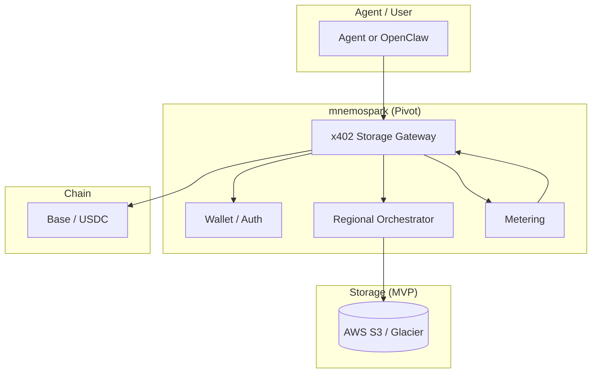
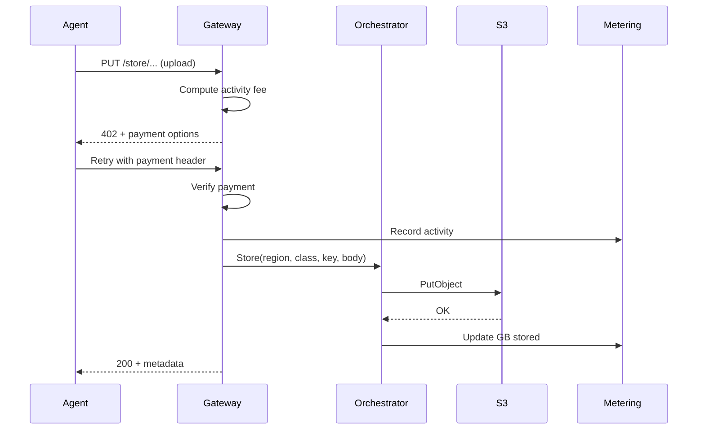

# mnemospark – Product Pivot Specification (Regional Storage Orchestration)

**Document version:** 1.0  
**Last updated:** February 2026  
**Audience:** Product Managers, leadership, feature development  
**Relationship:** Pivots from the current LLM-router product (see `current_product_spec.md`) to agent-owned persistence with x402 and AWS storage.

---

## Executive summary

**mnemospark** is pivoting from **smart LLM routing** to **Regional Storage Orchestration**: a service that lets **agents pay for their own persistence and data sovereignty** using **x402 payment-as-authentication**. The core idea: replace “route LLM requests and pay per inference” with “orchestrate where and how agent data is stored, and charge per sync (activity) plus per GB per month (storage), with optional region premium.” **MVP** is built on **AWS S3 and S3 Glacier** (and extensible to other storage options). Revenue is **metered via x402**: activity fees (pay-per-sync for bandwidth/compute) and storage fees (monthly GB stored + region premium). This spec guides feature development for the pivot.

---

## 1. Core concept

### 1.1 x402 payment-as-authentication handshake

- **Current (clone):** x402 is used to pay an upstream LLM API (BlockRun) per request; the proxy signs USDC and retries on 402.
- **Pivot:** x402 is used as **payment-as-authentication**. The handshake is: “Pay to prove entitlement to use this storage endpoint.” Payment both **authorizes** the operation and **meters** it. No separate API keys or OAuth for storage access—the micropayment is the credential.
- **Implication for features:** Every storage operation (sync up, sync down, list, etc.) can be gated by a 402 flow: server returns 402 + payment options; client (agent or proxy) signs payment; server grants access and performs the operation. Usage is metered and paid in one step.

### 1.2 The pivot: LLM routing → Regional Storage Orchestration

| Before (current clone)                       | After (pivot)                                                                                   |
| -------------------------------------------- | ----------------------------------------------------------------------------------------------- |
| Route LLM requests to cheapest capable model | Orchestrate **where** and **how** agent data is stored (region + storage class)                 |
| Pay per inference (BlockRun API)             | Pay per **sync** (activity) and per **GB stored per month** (storage)                           |
| Single upstream (BlockRun)                   | **Storage backends**: MVP = AWS S3 / S3 Glacier; later = other providers                        |
| “Smart router” picks model                   | “Orchestrator” picks **region**, **storage class**, and **sync strategy** (e.g. hot vs archive) |

- **Regional Storage Orchestration** means:
  - **Region selection:** Choose AWS region(s) for data (sovereignty, latency, compliance).
  - **Storage class selection:** Map agent needs to S3 Standard, Standard-IA, Glacier Instant/Flexible/Deep Archive, or Intelligent-Tiering (and later other backends).
  - **Sync semantics:** Define what “sync” means (upload, download, list, restore from archive) and meter it as **activity**.

### 1.3 Goal: Agents pay for their own persistence and sovereignty

- **Persistence:** Agent state, memories, and artifacts are stored in cloud storage; the **agent (or its wallet)** pays for that storage and for each sync.
- **Sovereignty:** Region choice gives control over where data lives (e.g. EU for GDPR, US for domestic-only). “Region premium” in the revenue model reflects higher-value or regulated regions.
- **Autonomous:** No human-in-the-loop to top up a provider API key; the agent’s wallet is funded with USDC and pays via x402 per operation.

---

## 2. Revenue model (metered x402 payments)

All charges are collected via **x402 micropayments** (e.g. USDC on Base). Two fee types:

### 2.1 Activity fee: Pay-per-sync

- **What counts as “sync”:** Each discrete storage operation that consumes bandwidth or compute.
  - **Upload (PUT):** Pay per upload (and optionally per GB uploaded).
  - **Download (GET):** Pay per download and/or per GB downloaded.
  - **List / enumerate:** Pay per LIST (or per 1000 keys).
  - **Restore from Glacier:** Pay per restore request and/or per GB restored (aligns with AWS retrieval pricing).
- **Product name:** “Activity fee” or “Pay-per-sync” — micro-payments for **bandwidth and compute** consumed by sync operations.
- **Feature implications:**
  - Meter every storage API call (or batched equivalent) and return 402 with amount due before performing the operation.
  - Expose clear pricing (e.g. $ per 1000 PUTs, $ per GB egress) so agents or operators can estimate cost.

### 2.2 Storage fee: Monthly recurring (GB stored + region premium)

- **GB stored:** Monthly fee based on **total GB stored** (e.g. at end of month or rolling average). Mirrors AWS S3 storage pricing (per GB-month).
- **Storage class:** Fee can vary by effective “storage class” (e.g. Standard vs Glacier Deep Archive). Lower access tiers = lower $/GB-month.
- **Region premium:** Surcharge for storing data in selected regions (e.g. EU, regulated markets). Reflects sovereignty and compliance value.
- **Billing cadence:** Can be aggregated monthly and charged via x402 (e.g. one 402 per month for storage bill) or broken into smaller micropayments.
- **Feature implications:**
  - Track per-customer (per-wallet) usage: GB per region and per storage class.
  - Report “storage usage” and “estimated storage fee” in dashboard or `/storage`-style commands.
  - Support “region premium” as a configurable multiplier or fixed add-on per region.

### 2.3 Summary table

| Fee type | Metered by                        | Example x402 trigger            |
| -------- | --------------------------------- | ------------------------------- |
| Activity | Per PUT/GET/LIST/restore, + GB    | 402 before upload/download      |
| Storage  | GB-month + storage class + region | Monthly 402 or pre-paid balance |

---

## 3. MVP scope: AWS S3 and S3 Glacier

### 3.1 Why S3 / Glacier for MVP

- **Mature APIs:** PUT, GET, LIST, multipart upload, and storage class selection are well-defined. Easy to map “sync” to S3 operations.
- **Storage classes:** Standard (frequent), Standard-IA / One Zone-IA (infrequent), Glacier Instant / Flexible / Deep Archive (archive), and Intelligent-Tiering (auto) support “orchestration” (choose class by access pattern).
- **Regional:** Buckets are per-region; replication (CRR/SRR) and Multi-Region Access Points support multi-region strategies and “region premium” positioning.
- **Pricing model alignment:** AWS charges for storage (GB-month), requests (PUT/GET/LIST), and data transfer. Maps cleanly to **Activity fee** (requests + transfer) and **Storage fee** (GB-month + region).

### 3.2 MVP capabilities (feature development)

1. **Storage backend abstraction**
   - Single “storage provider” interface: create bucket (or use existing), PUT, GET, LIST, delete, get metadata, set storage class.
   - First implementation: **AWS S3** (and S3 Glacier via storage class/lifecycle). Use AWS SDK; credentials are server-side (mnemospark service), not the agent. Agent pays mnemospark via x402; mnemospark pays AWS (or passes through cost).

2. **x402 gateway for storage**
   - All storage API calls go through an **x402 gateway**. Gateway returns 402 + payment options (amount, payTo, asset, network). Agent (or proxy) signs payment; gateway verifies and then performs the S3 operation.
   - Reuse existing x402 stack (signing, payment cache, balance check) from current codebase; replace “forward to BlockRun” with “call S3 (or orchestrator).”

3. **Regional orchestration**
   - **Region selection:** Configure or select AWS region(s) per tenant/agent (e.g. us-east-1, eu-west-1). Store region in config or per-bucket.
   - **Storage class selection:** Map “tier” or “profile” to S3 storage class (e.g. hot → Standard, cool → Standard-IA, archive → Glacier). MVP can start with Standard + one Glacier class.
   - **Orchestrator:** Component that, given “sync this blob” or “store this with tier X in region Y,” chooses bucket, key, and storage class and performs the operation after payment.

4. **Metering and pricing**
   - **Activity:** For each PUT/GET/LIST/restore, compute price (e.g. from config or table: $ per 1000 requests, $ per GB). Return in 402 body; after payment, log for billing and analytics.
   - **Storage:** Periodically (e.g. daily) sum GB stored per wallet/tenant per region and storage class. Apply $/GB-month and region premium. Expose via “storage usage” API or report; charge via x402 (e.g. monthly).

5. **Agent-facing API**
   - Simple REST or RPC: “Upload object,” “Download object,” “List prefix,” “Get storage usage.” All require x402 payment (or pre-paid balance). Optional: idempotency keys to avoid double charge on retries (reuse dedup pattern from current proxy).

### 3.3 Out of scope for MVP (later)

- Other storage backends (e.g. GCS, Azure Blob, IPFS) as additional provider implementations.
- Full CRR/SRR and Multi-Region Access Points (can be phased: start single region, add replication later).
- Complex lifecycle automation (e.g. auto-transition to Glacier after 90 days) can be a follow-on; MVP can set storage class at write time.

---

## 4. Architecture at a glance (pivot)

- **No LLM routing:** Remove or deprecate router, model list, and BlockRun provider from the product surface. Keep **wallet, x402 signing, balance, and proxy/gateway pattern** as the payment layer.
- **New core:** **Storage gateway + orchestrator.** Gateway receives storage requests (e.g. “PUT bucket/key”), returns 402 with price, accepts payment, then calls **orchestrator**. Orchestrator selects region + storage class and invokes **storage backend** (S3).
- **Deployment:** Can remain plugin + local proxy (OpenClaw) or evolve to a standalone service that agents call. For MVP, a single gateway service (or proxy) that talks to AWS S3 is sufficient.

---

## 5. How data flows (pivot)

### 5.1 Sync (e.g. upload)

1. Agent sends “upload object” to **x402 Storage Gateway** (e.g. `PUT /v1/store/{region}/{bucket}/{key}` with body).
2. Gateway computes **activity fee** (e.g. PUT price + size-based).
3. Gateway responds **402** with payment options (amount, payTo, asset, network).
4. Agent (or proxy) signs payment with wallet; retries request with payment header.
5. Gateway verifies payment, **records activity** for billing, then calls **Orchestrator**.
6. Orchestrator selects **storage class** (and bucket/region if not fixed); calls **S3** (PutObject).
7. Gateway returns 200 + metadata (e.g. etag, region, storage class).
8. **Storage metering** updates “GB stored” for this wallet/region/class (for monthly storage fee).

### 5.2 Download and list

- Same pattern: Gateway returns 402 → client pays → Gateway performs GET or LIST and charges **activity fee**. No change to “GB stored” for GET; LIST is activity-only.

### 5.3 Monthly storage fee

- **Metering** aggregates GB stored per wallet per region and storage class (e.g. from S3 Inventory or custom bookkeeping).
- Apply **storage fee** (GB-month rate + region premium); trigger **x402** (e.g. one payment per month or deduct from pre-paid balance). Feature: “Storage bill” or “Storage usage” page/command.

---

## 6. Technologies (pivot-relevant)

| Layer         | Technology                           | Note                                                                                    |
| ------------- | ------------------------------------ | --------------------------------------------------------------------------------------- |
| Payment       | x402 (EIP-712 USDC on Base)          | Reuse from current codebase; payment-as-auth for storage.                               |
| Wallet / keys | viem, existing auth module           | No change; wallet pays for storage operations.                                          |
| Storage (MVP) | AWS S3, S3 Glacier                   | SDK (e.g. AWS SDK for JavaScript/TypeScript); server-side credentials.                  |
| Orchestration | New module                           | Region + storage-class selection; calls S3 API.                                         |
| Metering      | New + existing                       | Activity: per request. Storage: GB-month aggregation (e.g. from S3 or internal ledger). |
| Gateway       | HTTP server (existing proxy pattern) | Replace “proxy to BlockRun” with “402 + orchestrator + S3.”                             |

**AWS knowledge (for implementation):**

- **S3 storage classes:** Standard, Standard-IA, One Zone-IA, Glacier Instant/Flexible/Deep Archive, Intelligent-Tiering. Different $/GB-month and retrieval cost; choose by access pattern. See [S3 storage class intro](https://docs.aws.amazon.com/AmazonS3/latest/userguide/storage-class-intro.html).
- **Replication:** CRR/SRR and Multi-Region Access Points for multi-region and failover; supports “region premium” and sovereignty. See [S3 Replication](https://docs.aws.amazon.com/AmazonS3/latest/userguide/replication.html).
- **Pricing dimensions:** Storage (GB-month), request (PUT/GET/LIST), data transfer. Align activity fee with request + transfer; storage fee with GB-month + region.

---

## 7. Design and structure (code / feature areas)

- **Keep:** `x402`, `auth`, `balance`, `payment-cache`, `config`, `logger`; proxy-style HTTP server and 402 retry flow.
- **Remove or deprecate:** `router/`, `models.ts`, BlockRun provider, LLM proxy target.
- **Add:**
  - **Storage gateway:** HTTP API for store/get/list; 402 before each operation; call orchestrator after payment.
  - **Orchestrator:** Inputs: region, storage tier (or profile), key, body. Output: S3 PutObject/GetObject/ListObjects with chosen bucket and storage class.
  - **Storage backend (S3):** Wrapper around AWS SDK; bucket naming (e.g. per-wallet or per-tenant); credentials from env or IAM role.
  - **Metering:** Activity log (request type, size, fee); storage usage aggregation (GB per wallet/region/class); optional export for “storage bill.”
- **Config:** Region list, storage-class mapping, activity price table, storage $/GB-month and region premium.

---

## 8. Trade-offs and implications

- **Payment-as-auth:** Simplifies agent onboarding (no API keys for storage) but ties availability to wallet balance and 402 flow. Need clear “insufficient funds” and low-balance warnings (reuse current balance UX).
- **Single storage backend (S3) in MVP:** Faster to ship; multi-backend (e.g. GCS) increases scope. Abstraction layer allows adding backends later without changing gateway/orchestrator interface.
- **Server-side AWS credentials:** Mnemospark service holds AWS keys or IAM role; agents never see them. Agent pays mnemospark; mnemospark pays AWS (or marks up). Operational burden: secure credential storage and per-tenant isolation (e.g. bucket policy or prefix per wallet).
- **Storage fee cadence:** Monthly is simple; more frequent (e.g. weekly) increases 402 traffic. Pre-paid balance can absorb storage fee and simplify UX.
- **Region premium:** Subjective; can start with a simple multiplier per region (e.g. 1.2x for EU) and refine with product and compliance input.

---

## 9. Information gaps and open questions

The following need product or engineering input before or during implementation. Resolve these to avoid rework.

- **Tenant / identity model:** How is “per-wallet” or “per-tenant” scoped? Is one wallet = one agent, one user, or one organization? This drives bucket naming, prefix layout, and metering aggregation. Need: clear definition of tenant and whether multiple wallets can share storage (e.g. org-level billing).
- **Payment verification and settlement:** Who verifies the x402 payment on the server side—mnemospark’s gateway or a separate settlement service? Does verification happen on-chain before granting access, or is there a trusted “payment accepted” callback? Need: end-to-end 402 verification flow (including who runs the payTo receiver and how verification is tied to the request).
- **Pre-paid balance vs per-request 402:** Spec mentions “pre-paid balance” as an option for storage fees. Do we support a pre-funded balance that is debited for activity (and optionally storage), or is every operation a 402? If both, how is balance stored and who holds it? Need: decision on balance ledger (on-chain only vs off-chain balance with periodic settlement).
- **Storage usage source of truth:** For “GB stored per wallet/region/class,” do we rely on S3 Inventory, S3 API (ListObjects + HeadObject), or an internal ledger updated on every PUT/DELETE? Inventory is eventually consistent and batch; ledger is real-time but must stay in sync. Need: chosen approach and consistency guarantees.
- **Region premium values:** Which regions get a premium and at what multiplier (or fixed add-on)? Is this a product/pricing decision or a config table? Need: initial table or formula (can be config-driven).
- **Activity fee pricing table:** Exact $ per 1000 PUT/GET/LIST and $ per GB in/out. Pass-through of AWS costs vs markup. Need: pricing model (e.g. config file or admin API) and initial numbers.
- **OpenClaw vs standalone:** Is the MVP an OpenClaw plugin (storage commands + gateway when gateway runs) or a standalone service agents call over the network? Affects auth (wallet in plugin vs wallet in agent), deployment, and multi-tenancy. Need: deployment model for MVP.
- **Idempotency and retries:** For storage, do we reuse the existing request-dedup pattern (hash body, cache response 30s) or define explicit idempotency keys (e.g. `Idempotency-Key` header)? Need: decision and API contract so clients can safely retry.
- **Glacier restore semantics:** When agent requests a GET and object is in Glacier, do we block until restore completes, return 202 + job id, or pre-warm on a schedule? Need: product behavior and timeout expectations.
- **Multi-region MVP:** Is MVP single-region only (simplest) or do we support “store in region X” from day one? Multi-region affects bucket strategy and config. Need: scope for v1.

---

## 10. Technology choices to make

Explicit decisions required; document choices and rationale when decided.

| Area                          | Options                                                                                                       | Decision needed                                                                                                                             |
| ----------------------------- | ------------------------------------------------------------------------------------------------------------- | ------------------------------------------------------------------------------------------------------------------------------------------- |
| **AWS SDK**                   | `@aws-sdk/client-s3` (v3) vs `aws-sdk` (v2)                                                                   | v3 is modular and current; v2 is legacy. Recommend v3.                                                                                      |
| **Server-side AWS auth**      | IAM role (e.g. EC2/ECS/Lambda) vs long-lived access keys in env                                               | IAM role preferred for production; keys in env acceptable for MVP/dev.                                                                      |
| **Bucket strategy**           | One bucket per tenant (prefix by wallet) vs one bucket (prefix = wallet/tenant) vs shared bucket + strict IAM | Affects isolation, cost allocation, and S3 policies. Decide per-tenant vs shared and naming.                                                |
| **Gateway transport**         | HTTP REST (current proxy style) vs gRPC vs both                                                               | REST aligns with 402 and existing proxy; gRPC could reduce overhead for high-frequency sync. Decide for MVP.                                |
| **Metering storage**          | Same process (e.g. SQLite/JSONL) vs separate DB (Postgres, DynamoDB) vs S3-only (Inventory + custom tags)     | Affects scalability and reporting. MVP can start with file-based or SQLite; plan for DB if we need real-time dashboards.                    |
| **Payment verification**      | On-chain verification per request vs off-chain “payment service” that settles in batch                        | On-chain is trustless but slower/costly; off-chain is faster but needs trust model. Decide who operates payTo and how verification is done. |
| **Runtime / deployment**      | Remain Node.js (current) vs other runtime for gateway                                                         | No strong reason to change; Node.js + TypeScript is fine. Confirm or document.                                                              |
| **OpenClaw plugin surface**   | Keep plugin entry (register, commands) vs ship only standalone binary                                         | If we keep OpenClaw, which commands remain? e.g. `/wallet` yes, `/stats` → storage stats? Decide plugin vs standalone and command set.      |
| **Logging and observability** | Reuse current logger (JSONL to file) vs structured logging (e.g. Pino) + optional log aggregation             | MVP can keep file-based; decide if we need log aggregation for ops.                                                                         |
| **Testing**                   | Keep Vitest; add integration tests against real S3 (localstack vs real AWS test bucket)                       | Decide how we test S3 integration (localstack, test account, mocks).                                                                        |

---

## 11. Parts of the existing codebase to prune (later)

The following are tied to the **LLM router / BlockRun** product and are **not needed** for the storage-orchestration pivot. Plan to remove or replace them when implementing the pivot; prune in a dedicated cleanup pass to avoid breaking the repo mid-development.

### 11.1 Remove entirely (LLM-router–specific)

| Path                          | Purpose                                                           | Note                                                                                                                       |
| ----------------------------- | ----------------------------------------------------------------- | -------------------------------------------------------------------------------------------------------------------------- |
| `src/router/`                 | Rule-based classifier, tier selection, model fallback chain       | Entire directory: `index.ts`, `rules.ts`, `selector.ts`, `config.ts`, `types.ts`, `llm-classifier.ts`, `selector.test.ts`. |
| `src/models.ts`               | BlockRun model list, OpenClaw model definitions, aliases, pricing | All 30+ model definitions and `OPENCLAW_MODELS` / `BLOCKRUN_MODELS`.                                                       |
| `src/models.test.ts`          | Tests for model alias resolution                                  | Remove with `models.ts`.                                                                                                   |
| `src/provider.ts`             | BlockRun provider plugin for OpenClaw                             | Registers “BlockRun” as LLM provider; not used for storage.                                                                |
| `src/updater.ts`              | ClawRouter npm update check                                       | BlockRun-specific; remove or replace with mnemospark branding.                                                             |
| `src/stats.ts`                | Inference usage aggregation (requests, cost, savings)             | LLM-specific. Replace with storage/activity stats module or remove and re-add for storage.                                 |
| `src/journal.ts`              | Session journal (“what did you do”) from assistant text           | Extracts actions from LLM responses. Not needed for storage; remove unless we repurpose for storage audit log.             |
| `src/journal.test.ts`         | Tests for journal                                                 | Remove with `journal.ts`.                                                                                                  |
| `src/session.ts`              | Session-pinned model (prevent model switch mid-task)              | LLM-specific. Remove for storage.                                                                                          |
| `src/compression/`            | LLM context compression (token savings)                           | Entire directory: layers, codebook, etc. Not used for blob storage.                                                        |
| `src/response-cache.ts`       | Cache LLM responses by request hash                               | LLM response cache. Remove; storage gateway may need a different dedup strategy (idempotency keys).                        |
| `src/response-cache*.test.ts` | Tests for response cache                                          | All four test files; remove with `response-cache.ts`.                                                                      |
| `src/dedup.ts`                | Request dedup to avoid double charge on LLM retries               | LLM-specific. Evaluate: keep and reuse for storage idempotency, or replace with explicit idempotency-key handling.         |
| `src/retry.ts`                | Retry logic for LLM/provider calls                                | May be reusable for S3 retries; review before pruning.                                                                     |

### 11.2 Heavily modify or replace (do not delete without replacement)

| Path           | Purpose                                                                                              | Pivot action                                                                                                                                                                                                                                         |
| -------------- | ---------------------------------------------------------------------------------------------------- | ---------------------------------------------------------------------------------------------------------------------------------------------------------------------------------------------------------------------------------------------------- |
| `src/proxy.ts` | HTTP server: LLM request handling, routing, 402, BlockRun forward, streaming                         | **Replace** with storage gateway: same 402 flow and balance checks; remove router, models, BlockRun, streaming LLM response; add storage API (PUT/GET/LIST), orchestrator call, S3. Large file; treat as rewrite.                                    |
| `src/index.ts` | Plugin entry: register provider, inject models config, inject auth, start proxy, `/wallet`, `/stats` | **Modify**: remove provider registration, `injectModelsConfig`, `injectAuthProfile`, OPENCLAW_MODELS, router exports. Keep wallet resolution, optional `/wallet` (and `/storage`?), service stop for gateway. Trim exports to storage-relevant only. |
| `src/cli.ts`   | Standalone proxy CLI (start LLM proxy)                                                               | **Modify**: start storage gateway instead of LLM proxy; keep wallet resolution and balance check; update help text and env vars.                                                                                                                     |
| `src/types.ts` | OpenClaw plugin types, provider types, command types                                                 | **Trim**: keep only types needed for storage gateway and any remaining OpenClaw surface (e.g. command context). Remove or archive LLM provider model types if unused.                                                                                |

### 11.3 Tests to remove or repurpose

| Path                                                                                                                  | Note                                                                              |
| --------------------------------------------------------------------------------------------------------------------- | --------------------------------------------------------------------------------- |
| `test/resilience-*.ts`, `test/fallback.ts`, `test/proxy-reuse.ts`, `test/e2e*.ts`, `test/e2e-tool-id-sanitization.ts` | LLM proxy and routing E2E/resilience. Remove or replace with storage gateway E2E. |
| `test/compression.ts`                                                                                                 | Compression tests. Remove with `src/compression/`.                                |
| `test/google-messages.ts`                                                                                             | Likely LLM/API-specific. Review and remove if not storage-related.                |
| `test/test-model-selection.sh`, `test/test-clawrouter.mjs`, `test/run-docker-test.sh`, `test/docker/*`                | BlockRun/ClawRouter-specific. Remove or replace with mnemospark storage tests.    |
| `test/test-retry.ts`                                                                                                  | Retry logic tests. Keep if we keep `retry.ts` for S3.                             |
| `test/test-balance*.ts`, `test/test-wallet-persistence.ts`, `test/manual-wallet-test.sh`                              | Wallet/balance; **keep** and ensure they still pass after pivot.                  |

### 11.4 Keep as-is or minor changes

| Path                              | Purpose                                                                  |
| --------------------------------- | ------------------------------------------------------------------------ |
| `src/x402.ts`, `src/x402.test.ts` | x402 signing, payment cache, 402 handling. **Keep.**                     |
| `src/auth.ts`                     | Wallet resolution (file, env, generate). **Keep.**                       |
| `src/balance.ts`                  | USDC balance check, cache, thresholds. **Keep.**                         |
| `src/payment-cache.ts`            | Cache pre-signed payment per endpoint. **Keep** for storage gateway 402. |
| `src/config.ts`                   | Port and env config. **Keep**; add storage/orchestrator config later.    |
| `src/logger.ts`                   | Usage JSONL. **Keep**; may repurpose for activity log.                   |
| `src/errors.ts`                   | Balance and RPC errors. **Keep.**                                        |
| `src/version.ts`                  | Version constant. **Keep.**                                              |

### 11.5 Config and package

- **`openclaw.plugin.json`:** Update name, description, and config schema for storage (e.g. remove routing overrides, add storage/region config).
- **`package.json`:** Update name/description; remove or keep `openclaw` peer dependency depending on whether we remain an OpenClaw plugin. Add `@aws-sdk/client-s3` (or chosen SDK) when implementing.

---

## 12. Feature development checklist (for PM)

Use this to prioritize and track the pivot.

- [ ] **x402 payment-as-auth:** Document handshake (402 → sign → access); ensure gateway never performs storage without valid payment.
- [ ] **Storage gateway API:** Define REST (or RPC) for upload, download, list; idempotency; 402 response shape and payment header.
- [ ] **Activity fee:** Define and implement pricing for PUT/GET/LIST/restore (per request and/or per GB); expose in 402 body; log for billing.
- [ ] **Orchestrator:** Region + storage-class selection; integration with S3 backend (PutObject, GetObject, ListObjectsV2); bucket/prefix strategy per wallet or tenant.
- [ ] **S3 backend (MVP):** Create/use bucket(s); set storage class; handle multipart if needed; credentials and region config.
- [ ] **Storage metering:** Track GB stored per wallet/region/class; aggregate for monthly report; compute storage fee (GB-month + region premium).
- [ ] **Storage fee collection:** Monthly (or periodic) 402 or deduction from balance; “storage usage” and “storage bill” view or command.
- [ ] **Agent-facing docs:** How to fund wallet, call storage API, interpret 402, and understand activity vs storage fees.
- [ ] **Deprecation/cleanup:** Remove or feature-flag LLM router and BlockRun provider; update README and product positioning to “Regional Storage Orchestration.”
- [ ] **Resolve gaps and choices:** Work through Section 9 (information gaps) and Section 10 (technology choices) and document decisions.

---

## 13. Terminology (pivot)

- **x402 payment-as-authentication:** Using the 402 payment handshake to both authorize and meter access (no separate API key).
- **Regional Storage Orchestration:** Deciding where (region) and how (storage class) to store agent data and executing the storage operations.
- **Sync:** A single storage operation (upload, download, list, restore) that is metered as **activity**.
- **Activity fee:** Pay-per-sync charge (requests + optional bandwidth).
- **Storage fee:** Monthly charge for GB stored, plus storage-class and region premium.
- **Region premium:** Surcharge for storing data in designated (e.g. sovereign or regulated) regions.
- **Orchestrator:** Component that selects region and storage class and invokes the storage backend (e.g. S3).

---

## Appendix: Mapping from current spec to pivot

| Current (LLM router) | Pivot (Storage orchestration)  |
| -------------------- | ------------------------------ |
| BlockRun provider    | Storage backend (S3)           |
| Smart router         | Regional orchestrator          |
| Model / tier         | Storage class / region         |
| Pay per inference    | Pay per sync + GB-month        |
| `/stats` (inference) | Storage usage + activity stats |
| `/wallet`            | Unchanged                      |
| x402 to BlockRun     | x402 to mnemospark gateway     |
