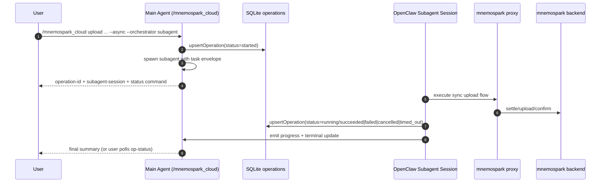

# Cursor Dev: Complete cursor-dev-44 with explicit subagent orchestration interfaces for mnemospark async operations

**ID:** cursor-dev-47  
**Repo:** mnemospark  
**Date:** 2026-03-19  
**Revision:** rev 2  
**Last commit in repo:** 3655a00 fix(cloud): harden upload redirects and make friendly-name resolution SQLite-first

**Workspace for Agent:** Work only in **this repo** (the repo you were started in). This repo is **mnemospark**. This repo contains the plugin, command parser/handlers, SQLite datastore integration, and JSONL observability paths for cloud operations. Do **not** clone, or require access to any other repository; all code and references are in this file. The primary spec for this work is `dev_docs/features_cursor_dev/cursor-dev-44-openclaw-subagent-orchestration-for-mnemospark.md` (raw: `https://raw.githubusercontent.com/pawlsclick/mnemospark-docs/refs/heads/main/dev_docs/features_cursor_dev/cursor-dev-44-openclaw-subagent-orchestration-for-mnemospark.md`).

**AWS:** When implementing or changing AWS services or resources (e.g. AWS CLI, CloudFormation/SAM templates, Lambda, API Gateway, DynamoDB), follow [AWS Best Practices](https://docs.aws.amazon.com/). The **AWS MCP Server** tool is available in this environment and should be used when working on AWS-based services and resources.

## Scope

Implement **cursor-dev-44 completion** inside `mnemospark` only, by adding a real OpenClaw subagent orchestration path for long-running client operations while preserving existing SQLite + JSONL tracking semantics from cursor-dev-41/42/43.

Depends on cursor-dev-44 (initial async behavior), cursor-dev-41 (operations table), cursor-dev-42 (client JSONL), and cursor-dev-43 (proxy JSONL).

Required behavior:

1. Add a **subagent orchestration mode** for long-running operations (`upload`, `download`, optionally `restore` if present).
2. Main command handler must return quickly with operation ID and orchestration metadata.
3. Use **one operation lifecycle** in existing `operations` table (no parallel tracker table).
4. Emit lifecycle/progress/terminal events to existing JSONL streams (`events.jsonl`, `proxy-events.jsonl`) and user-facing status messages.
5. Implement explicit cancel and timeout outcomes, visible in SQLite + JSONL.

## Spec instructions

- If a spec already exists for this feature or flow (for example in `meta_docs/` or `dev_docs/`), reference it explicitly using both:
  - The repo-relative path (e.g. `meta_docs/payment-authorization-eip712-trace.md`).
  - The raw GitHub URL for agents/tools that fetch docs programmatically (e.g. `https://raw.githubusercontent.com/pawlsclick/mnemospark-docs/refs/heads/main/meta_docs/payment-authorization-eip712-trace.md`).
- If no spec exists yet, create a new spec file using the standard spec header (Title, Date, Revision, Related cursor-dev IDs, Repo/component) and sections (`## Overview`, `## Context`, `## Diagrams`, `## Details`).
- When the feature includes a multi-step or stateful process, add at least one mermaid diagram under `## Diagrams` that captures the main flow.
- When updating an existing spec, increment the **Revision** and update the **Date** to the latest edit date.

## Diagrams



## Exact interfaces

### 1) Command interface additions (mnemospark cloud)

Canonical slash command name for native surfaces is `/mnemospark_cloud` (underscore).

Add optional flags for long-running commands:

- `--orchestrator <mode>` where mode in `{inline, subagent}` (default remains current behavior for backward compatibility; for `--async`, default should become `subagent` once stable).
- `--timeout-seconds <n>` optional per-operation timeout (subagent mode).
- `--cancel` for `op-status` command path (see op-status extension below).

Command examples:

- `/mnemospark_cloud upload ... --async --orchestrator subagent`
- `/mnemospark_cloud download ... --async --orchestrator subagent --timeout-seconds 900`
- `/mnemospark_cloud op-status --operation-id <id>`
- `/mnemospark_cloud op-status --operation-id <id> --cancel`

### 2) Subagent task envelope contract

Define a serialized handoff payload (TypeScript type + JSON shape):

```ts
type MnemosparkSubagentTaskV1 = {
  schema: "mnemospark.subagent-task.v1";
  operationId: string;
  traceId: string;
  command: "upload" | "download" | "restore";
  args: string; // sync command args (no --async)
  timeoutSeconds?: number;
  requestedBy: {
    pluginCommand: "mnemospark_cloud";
    chatId?: string;
    senderId?: string;
  };
};
```

Rules:
- `operationId` and `traceId` are created by main handler and reused through completion.
- Subagent executes sync path using forced operation/trace context.
- No extra lifecycle table; write status updates to existing `operations` row.

### 3) SQLite operation status contract (reuse existing table)

Status values used by orchestration path:
- `started`
- `running`
- terminal: `succeeded | failed | cancelled | timed_out`

Error codes for terminal failures:
- `ASYNC_FAILED`
- `ASYNC_EXCEPTION`
- `ASYNC_CANCELLED`
- `ASYNC_TIMEOUT`
- `ASYNC_DISPATCH_FAILED`

### 4) JSONL event contract additions (events.jsonl)

Emit these event types:
- `operation.dispatched`
- `operation.progress`
- `operation.cancel.requested`
- `operation.cancelled`
- `operation.timed_out`
- `operation.completed`

Required keys in each event payload:
- `operation_id`
- `trace_id`
- `event_type`
- `status`
- `ts`
- plus context fields (`wallet_address`, `object_id`, `object_key`, `quote_id`) when available.

### 5) op-status response extension

`op-status` output must include (when present):
- `operation-id`
- `type`
- `status`
- `started-at`
- `finished-at`
- `orchestrator: subagent|inline`
- `subagent-session-id`
- `timeout-seconds`
- `error-code` / `error-message`

### 6) Cancellation contract

- `op-status --operation-id <id> --cancel` requests cancellation.
- If subagent session exists, signal cancel and transition:
  - interim: `running` + cancel requested event
  - terminal: `cancelled` with `ASYNC_CANCELLED`
- Must be idempotent (repeated cancel requests do not corrupt state).

## References

- [`dev_docs/features_cursor_dev/cursor-dev-44-openclaw-subagent-orchestration-for-mnemospark.md`](dev_docs/features_cursor_dev/cursor-dev-44-openclaw-subagent-orchestration-for-mnemospark.md) | raw: `https://raw.githubusercontent.com/pawlsclick/mnemospark-docs/refs/heads/main/dev_docs/features_cursor_dev/cursor-dev-44-openclaw-subagent-orchestration-for-mnemospark.md`
- [`dev_docs/features_cursor_dev/cursor-dev-41-client-sqlite-datastore-foundation.md`](dev_docs/features_cursor_dev/cursor-dev-41-client-sqlite-datastore-foundation.md) | raw: `https://raw.githubusercontent.com/pawlsclick/mnemospark-docs/refs/heads/main/dev_docs/features_cursor_dev/cursor-dev-41-client-sqlite-datastore-foundation.md`
- [`dev_docs/features_cursor_dev/cursor-dev-42-client-jsonl-observability-and-manifest.md`](dev_docs/features_cursor_dev/cursor-dev-42-client-jsonl-observability-and-manifest.md) | raw: `https://raw.githubusercontent.com/pawlsclick/mnemospark-docs/refs/heads/main/dev_docs/features_cursor_dev/cursor-dev-42-client-jsonl-observability-and-manifest.md`
- [`dev_docs/features_cursor_dev/cursor-dev-43-proxy-jsonl-observability.md`](dev_docs/features_cursor_dev/cursor-dev-43-proxy-jsonl-observability.md) | raw: `https://raw.githubusercontent.com/pawlsclick/mnemospark-docs/refs/heads/main/dev_docs/features_cursor_dev/cursor-dev-43-proxy-jsonl-observability.md`
- OpenClaw subagents docs | raw: `https://docs.openclaw.ai/tools/subagents`

## Agent

- **Install (idempotent):** `npm ci`
- **Start (if needed):** None.
- **Secrets:** None beyond existing runtime config.
- **Acceptance criteria (checkboxes):**
  - [ ] `upload` and `download` support `--async --orchestrator subagent` and return quickly with operation ID.
  - [ ] Main handler persists operation row in `operations` and records dispatch metadata.
  - [ ] Subagent executes sync command path with forced operation/trace IDs.
  - [ ] Progress and terminal events are emitted to JSONL with required correlation fields.
  - [ ] `op-status` shows orchestrator/session/timeout context and terminal outcomes.
  - [ ] Cancellation path works and records `cancelled` + `ASYNC_CANCELLED` semantics.
  - [ ] Timeout path works and records `timed_out` + `ASYNC_TIMEOUT` semantics.
  - [ ] Tests cover dispatch, success, failure, cancel, and timeout transitions.
  - [ ] Branch from `main`, open PR.

## Task string (optional)

Complete cursor-dev-44 in mnemospark by implementing OpenClaw subagent orchestration for async upload/download, reusing existing SQLite operations lifecycle and JSONL observability. Add explicit orchestration, timeout, and cancel interfaces as defined above; preserve backward compatibility and avoid introducing parallel operation trackers.
