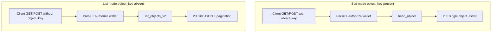
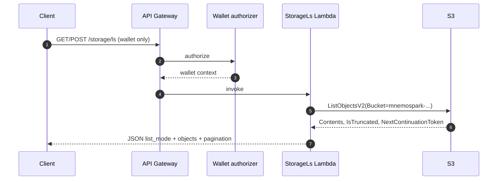

# Cursor Dev: Backend — S3-authoritative bucket listing for GET/POST /storage/ls

**ID:** cursor-dev-48  
**Repo:** mnemospark-backend  
**Date:** 2026-03-21  
**Revision:** rev 1  
**Last commit in repo (when authored):** `dc0abfb` — fix(iam): allow GetItem on upload transaction log for StorageUpload Lambda  

**Related cursor-dev IDs:** Extends [cursor-dev-05-lambda-storage-ls.md](cursor-dev-05-lambda-storage-ls.md). Client work: **cursor-dev-49** (run **after** this task is merged and deployed).

**Workspace for Agent:** Work only in **mnemospark-backend**. Do **not** require the mnemospark client repo; hand off API behavior via OpenAPI and this spec. The primary spec for this work is this file (raw: `https://raw.githubusercontent.com/pawlsclick/mnemospark-docs/refs/heads/main/dev_docs/features_cursor_dev/cursor-dev-48-backend-storage-ls-s3-list-mode.md`).

**AWS:** Use the **AWS MCP Server** (`aws___search_documentation`, `aws___call_aws`) when validating IAM actions, S3 API behavior, and SAM/API Gateway parameters. Follow [AWS Best Practices](https://docs.aws.amazon.com/).

---

## Order of operations (all repos)

1. **This task (cursor-dev-48) — mnemospark-backend**  
   Implement list mode on `/storage/ls`, SAM/API Gateway updates, tests, merge, **deploy** stack (staging then production as you normally do).

2. **cursor-dev-49 — mnemospark**  
   Client/parser/proxy/storage types and SQLite friendly-name enrichment. Must target an environment where the **deployed** backend exposes list mode (or gate client on API version if you add one).

3. **Docs (optional same PR as 49 or follow-up)**  
   If product/workflow docs in **mnemospark-docs** describe `ls` as requiring `--object-key`, update them after client ships.

---

## Scope

Add an **S3-authoritative listing mode** to the existing **StorageLs** Lambda (`services/storage-ls/app.py`) and wire it through **API Gateway** and **OpenAPI**.

**Current behavior (unchanged when `object_key` is present):** resolve wallet bucket `mnemospark-<sha256(wallet)[0:16]>`, `head_object` for that key, return single-object JSON (`success`, `key`, `size_bytes`, `bucket` per `docs/openapi.yaml` `StorageLsResponse`).

**New behavior (when `object_key` is absent):** same wallet authorization and bucket resolution, then **`list_objects_v2`** on the bucket. Return a JSON body that includes an **array** of objects with at least `key`, `size_bytes`, and `last_modified` (ISO 8601 string). Include S3 pagination fields: `is_truncated`, `next_continuation_token` (or null). Set a clear discriminator field such as `"list_mode": true` so clients can branch without ambiguity.

**Request parameters**

- **GET:** `wallet_address` remains required. **`object_key` becomes optional.** When omitted, enter list mode. Optional query params for list mode: `continuation_token`, `max_keys` (cap server-side, e.g. ≤ 1000), optional `prefix` if you need future prefix filters (default: list all keys under bucket root; initial implementation may omit `prefix` if YAGNI).
- **POST:** JSON body must allow **`object_key` omitted** for list mode; same optional pagination fields in body. Update SAM `RequestModel` / OpenAPI schema so validation allows this (may require a new composite model or relaxed required fields).

**Backward compatibility:** Existing clients that always send `object_key` must receive the **same** response shape as today.

**Empty bucket:** HTTP **200** with `objects: []`, not 404.

**Implementation notes**

- Use boto3 `list_objects_v2`. Per AWS documentation, callers need **READ access to the bucket** and the **`s3:ListBucket`** permission for the `ListObjectsV2` API ([Boto3 `list_objects_v2`](https://docs.aws.amazon.com/boto3/latest/reference/services/s3/client/list_objects_v2.html)).
- Map S3 `Contents` entries to your response items; omit or handle `Contents` missing (empty bucket).
- Do **not** add friendly names in the Lambda; naming is **client-side best effort** (cursor-dev-49).

**SAM / `template.yaml`**

- **StorageLsFunction** → Events **StorageLsGet**: set `method.request.querystring.object_key` **Required: false** (was true).
- **POST** model: align with OpenAPI so `object_key` is not required when listing.
- **IAM:** The function’s inline policy already includes `s3:ListBucket` on `arn:aws:s3:::mnemospark-*` and `s3:GetObject` on `arn:aws:s3:::mnemospark-*/*`. **Verify** after edits (see **IAM verification** below). No IAM change is strictly required for list mode if this policy is already attached; if `HeadObject` is used for stat mode, confirm it is allowed (typically covered by `s3:GetObject` on object ARNs). Optional hardening: add `s3:prefix` / `s3:delimiter` condition keys on `ListBucket` scoped to the wallet bucket name — **out of scope for rev 1** unless security review requires it.

**Docs in backend repo**

- Update `docs/openapi.yaml` (`/storage/ls` GET/POST, response schema union or documented variants).
- Update `docs/storage-ls.md` with examples for stat vs list mode and pagination.

**Tests**

- Unit tests: parse branches, empty list, truncated list (mock S3 client).
- Integration tests: extend existing storage ls integration patterns where feasible.

---

## Overview

Wallet-authenticated clients need to **list all object keys** in their dedicated bucket using S3 as the source of truth, without requiring `--object-key` on the client. The backend exposes that capability on the existing `/storage/ls` route by making `object_key` optional and returning a list payload when it is absent.

---

## Context

- Prior spec: [cursor-dev-05-lambda-storage-ls.md](cursor-dev-05-lambda-storage-ls.md) (single-object metadata).
- Handler: `mnemospark-backend/services/storage-ls/app.py`.
- Authorizer: wallet context must match `wallet_address` (existing behavior).

---

## Diagrams

---

## IAM verification (AWS MCP)

When implementing or reviewing, use the AWS MCP server:

1. **`aws___search_documentation`** — Confirm `ListObjectsV2` / `list_objects_v2` permission requirements (`s3:ListBucket` on bucket ARN). Example search phrase: `S3 ListObjectsV2 IAM permission s3:ListBucket`.
2. **`aws___call_aws`** — After deploy, optional smoke check (if credentials and stack allow): `aws s3api list-objects-v2 --bucket <wallet-bucket> --max-keys 1` using a role/session that mirrors the Lambda policy (not the Lambda role directly unless your operator has assume-role). For template review, prefer reading the deployed stack or the SAM template inline policy under **StorageLsFunction**.

**Current SAM excerpt (verify in repo; line numbers may drift):** `StorageLsFunction` `Policies` include `s3:ListBucket` on `arn:aws:s3:::mnemospark-*` and `s3:GetObject` on `arn:aws:s3:::mnemospark-*/*`.

---

## Spec instructions

- Keep **one PR** in mnemospark-backend; branch from default branch per repo policy.
- Increment OpenAPI version or add a clear changelog note in `docs/storage-ls.md` if consumers rely on fixed schemas.
- Do not implement SQLite or friendly names in this repo.

---

## References

- This spec (primary): [cursor-dev-48-backend-storage-ls-s3-list-mode.md](cursor-dev-48-backend-storage-ls-s3-list-mode.md) — raw: `https://raw.githubusercontent.com/pawlsclick/mnemospark-docs/refs/heads/main/dev_docs/features_cursor_dev/cursor-dev-48-backend-storage-ls-s3-list-mode.md`
- Prior ls feature: [cursor-dev-05-lambda-storage-ls.md](cursor-dev-05-lambda-storage-ls.md)
- Client follow-up: [cursor-dev-49-mnemospark-client-storage-ls-list-friendly-names.md](cursor-dev-49-mnemospark-client-storage-ls-list-friendly-names.md)
- Backend OpenAPI (live in code repo): `mnemospark-backend/docs/openapi.yaml` — raw: `https://raw.githubusercontent.com/pawlsclick/mnemospark-backend/refs/heads/main/docs/openapi.yaml`
- Backend storage ls doc: `mnemospark-backend/docs/storage-ls.md` — raw: `https://raw.githubusercontent.com/pawlsclick/mnemospark-backend/refs/heads/main/docs/storage-ls.md`
- Boto3 `list_objects_v2`: [AWS documentation](https://docs.aws.amazon.com/boto3/latest/reference/services/s3/client/list_objects_v2.html)
- IAM S3 read/write example patterns: [Grant read and write access to Amazon S3 bucket objects](https://docs.aws.amazon.com/IAM/latest/UserGuide/reference_policies_examples_s3_rw-bucket.html)

---

## Agent

- **Install (idempotent):** `source .venv/bin/activate` (or project venv), `pip install -r requirements.txt` as needed; `ruff`, `pytest` per `AGENTS.md`.
- **Start (if needed):** None.
- **Secrets:** AWS credentials for integration tests / SAM deploy (as per your environment).
- **Acceptance criteria (checkboxes):**
  - [ ] With **`object_key` present**, behavior and response match **pre-change** semantics (single-object metadata).
  - [ ] With **`object_key` absent**, `wallet_address` + auth valid → **200** and `list_mode` (or equivalent) **true**, `objects` array, each item includes **`key`**, **`size_bytes`**, **`last_modified`**.
  - [ ] **Empty bucket** returns **200** and `objects: []`.
  - [ ] **Pagination:** pass through `ContinuationToken` / `NextContinuationToken` (or documented equivalent); respect **max keys** cap; expose `is_truncated`.
  - [ ] **GET** query string: `object_key` **not** required for list mode.
  - [ ] **POST** body validates without `object_key` for list mode.
  - [ ] **`docs/openapi.yaml`** and **`docs/storage-ls.md`** updated.
  - [ ] **`template.yaml`** API Gateway request parameters / models updated.
  - [ ] **Unit tests** + **integration tests** updated or added.
  - [ ] **IAM** reviewed; if `ListBucket`/`GetObject` already present on StorageLsFunction, document confirmation in PR description (optional: paste `aws cloudformation get-template` or policy snippet). Use **AWS MCP** for doc verification as needed.
  - [ ] Branch + PR; **do not commit to `main`** per mnemospark-backend policy.

---

## Task string (optional)

Work only in **mnemospark-backend**. Read `dev_docs/features_cursor_dev/cursor-dev-48-backend-storage-ls-s3-list-mode.md` in **mnemospark-docs** (fetch raw URL if needed). Extend `GET`/`POST` `/storage/ls` so **omitting `object_key`** runs `list_objects_v2` on the wallet’s `mnemospark-*` bucket and returns paginated JSON with `list_mode` and `objects[]` (`key`, `size_bytes`, `last_modified`). Keep existing stat behavior when `object_key` is set. Update SAM (`template.yaml`), `docs/openapi.yaml`, `docs/storage-ls.md`, and tests. Use the **AWS MCP** server to confirm `s3:ListBucket` / ListObjectsV2 requirements. Acceptance: checkboxes in the spec file.
