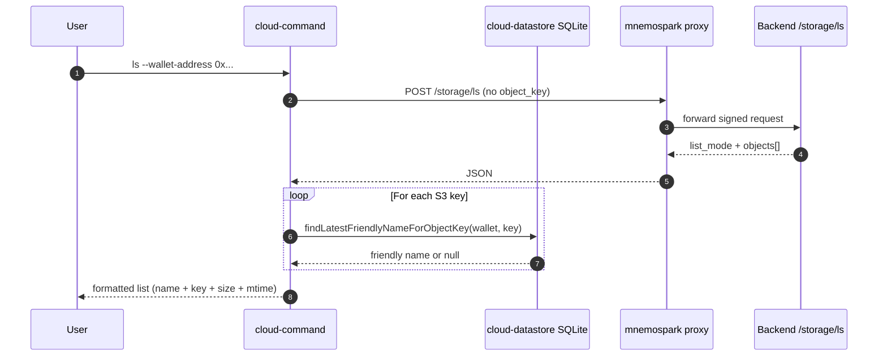

# Cursor Dev: Client — Wallet-only `ls`, S3 list response handling, SQLite friendly-name enrichment

**ID:** cursor-dev-49  
**Repo:** mnemospark  
**Date:** 2026-03-21  
**Revision:** rev 1  
**Last commit in repo (when authored):** `2c1d804` — chore: sync release-please manifest to 0.2.2 (#55)  

**Depends on:** **cursor-dev-48** (mnemospark-backend: `/storage/ls` list mode **deployed** or available in the target environment). Do not merge client-only changes that **require** list mode until the backend supports it; alternatively implement **backward-compatible** parsing (handle both single-object and list responses) and gate wallet-only `ls` on detecting list support (not preferred—deploy backend first).

**Workspace for Agent:** Work only in **mnemospark**. Do **not** edit mnemospark-backend in this run; consume the API contract from cursor-dev-48 / backend OpenAPI. Primary spec: this file (raw: `https://raw.githubusercontent.com/pawlsclick/mnemospark-docs/refs/heads/main/dev_docs/features_cursor_dev/cursor-dev-49-mnemospark-client-storage-ls-list-friendly-names.md`).

**AWS:** Client does not call AWS APIs directly for this feature; storage calls go through the **proxy → backend**. Use **AWS MCP** only if you need to confirm S3 or IAM semantics for documentation strings or troubleshooting (optional).

---

## Order of operations (all repos)

1. **cursor-dev-48 (mnemospark-backend)** — merged, stack **deployed** with list mode on `/storage/ls`.
2. **This task (cursor-dev-49, mnemospark)** — parser, `cloud-storage.ts`, `proxy.ts` if needed, `cloud-command.ts` user messages, `cloud-datastore.ts` lookup helper, tests.
3. **mnemospark-docs (optional)** — update [mnemospark_full_workflow.md](../product_docs/mnemospark_full_workflow.md) or slash-command help if `ls` examples still say `--object-key` is mandatory.

---

## Scope

### 1. Command-line / parser (`src/cloud-command.ts`)

- For subcommand **`ls` only**, allow **`--wallet-address`** without **`--object-key`** and without **`--name`** (today `parseObjectSelector` returns `null` if both are missing — change this **only for `ls`**).
- **`download`** and **`delete`** must **continue to require** an object selector (`--object-key` or `--name` + selectors) — do not widen accidentally.
- When in **list mode**, build a storage request payload that **omits** `object_key` (or sends explicit null only if backend accepts it; prefer omission to match GET query behavior).
- Update in-app / slash help strings that currently imply `--object-key` or `--name` is always required for `ls`.

### 2. HTTP client and types (`src/cloud-storage.ts`)

- Extend **`StorageLsResponse`** (or introduce a discriminated union) to represent:
  - **Stat:** existing single-object shape.
  - **List:** `list_mode: true`, `objects: Array<{ key: string; size_bytes: number; last_modified?: string }>`, plus pagination fields mirroring backend (`is_truncated`, `next_continuation_token`).
- Harden **`parseLsResponse`** (or equivalent) to validate both shapes; throw clear errors on malformed payloads.
- **`requestStorageLs`** (or the function that POSTs to `/storage/ls`) must forward optional pagination parameters when exposing advanced usage (MVP: single page; optional CLI flags `--max-keys` / `--continuation-token` can be a follow-up).

### 3. Proxy (`src/proxy.ts`)

- Ensure the proxy forwards **POST** bodies / **GET** queries **without** `object_key` when in list mode (no middleware that strips empty fields incorrectly).

### 4. SQLite — best-effort friendly names (`src/cloud-datastore.ts`)

Add a helper, e.g. **`findLatestFriendlyNameForObjectKey(walletAddress: string, objectKey: string): Promise<string | null>`**, with this **resolution order**:

1. **`friendly_names`**: `wallet_address` match, `object_key = ?`, `is_active = 1`, order by **`created_at` DESC**, limit **1**.
2. Else **`objects`** by `object_key` → `object_id`, then **`friendly_names`** by `object_id` + wallet + `is_active = 1`, latest `created_at`.

If no row: return **`null`** (UI shows key only or “unnamed”).

**Note:** S3 is authoritative for **which keys exist**; SQLite only **labels** keys when data exists locally.

### 5. User-facing output (`cloud-command.ts` or small formatter)

- For **list mode**, print a readable table or bullet list: **friendly name** (if resolved), **object key**, **size**, **last modified**.
- Prefix with a short disclaimer, e.g. that **names come from the local catalog** and may be missing for keys not recorded locally.

### 6. Operations / telemetry

- Prefer **one** `operations` row per `ls` list invocation (`type: "ls"`, metadata or error_message field noting `list_mode: true`) rather than one row per S3 key (avoid SQLite spam).

### 7. Tests

- Update tests that expect **`ls` + wallet only** to be invalid (`src/cloud-command.test.ts` in the mnemospark repo currently asserts invalid args).
- Add unit tests for **parse** (list mode), **response parsing**, and **friendly name resolution** (datastore).
- **`cloud-storage.test.ts`**: fixture for list response.

---

## Overview

End users run `/mnemospark_cloud ls --wallet-address <addr>` and see **every object key** in their bucket (from S3 via the backend), with **friendly names** filled in when the local SQLite `friendly_names` / `objects` tables have a match.

---

## Context

- SQLite schema: `friendly_names` includes `friendly_name`, `object_id`, `object_key`, `wallet_address`, `is_active`, `created_at` (see mnemospark `src/cloud-datastore.ts`).
- Backend contract: **cursor-dev-48**.

---

## Diagrams

---

## References

- This spec: [cursor-dev-49-mnemospark-client-storage-ls-list-friendly-names.md](cursor-dev-49-mnemospark-client-storage-ls-list-friendly-names.md) — raw: `https://raw.githubusercontent.com/pawlsclick/mnemospark-docs/refs/heads/main/dev_docs/features_cursor_dev/cursor-dev-49-mnemospark-client-storage-ls-list-friendly-names.md`
- Backend dependency: [cursor-dev-48-backend-storage-ls-s3-list-mode.md](cursor-dev-48-backend-storage-ls-s3-list-mode.md)
- Prior client ls: [cursor-dev-14-client-ls-download-delete.md](cursor-dev-14-client-ls-download-delete.md)
- Backend OpenAPI (contract): `https://raw.githubusercontent.com/pawlsclick/mnemospark-backend/refs/heads/main/docs/openapi.yaml`

---

## Agent

- **Install (idempotent):** `npm ci` or `npm install` per project.
- **Start (if needed):** None; mock `fetch` in tests.
- **Secrets:** None for unit tests.
- **Acceptance criteria (checkboxes):**
  - [ ] `/mnemospark_cloud ls --wallet-address <addr>` **without** `--object-key` or `--name` is **valid** and triggers **list mode**.
  - [ ] **download** / **delete** still **require** object selector.
  - [ ] **Proxy** forwards list requests without forcing `object_key`.
  - [ ] **Response parsing** supports **both** stat and list JSON shapes from backend.
  - [ ] **SQLite helper** resolves friendly name with the **two-step** rule (`object_key` row first, then `object_id`).
  - [ ] **User-visible output** shows S3 keys with **best-effort** names and a **short disclaimer** about local catalog.
  - [ ] **Tests** updated/added; CI green.
  - [ ] Branch + PR from default branch (follow mnemospark repo policy if documented).

---

## Task string (optional)

Work only in **mnemospark**. Read `cursor-dev-49-mnemospark-client-storage-ls-list-friendly-names.md` in mnemospark-docs (raw GitHub URL if needed). **Depends on deployed cursor-dev-48.** Implement wallet-only `ls`: relax `parseObjectSelector` for `ls` only; extend `cloud-storage` types and parsers for list responses; add `findLatestFriendlyNameForObjectKey` in `cloud-datastore.ts`; format output with friendly names + disclaimer; update proxy if needed; fix tests that treat wallet-only `ls` as invalid. Do not change download/delete selector requirements. Acceptance: spec checkboxes.
