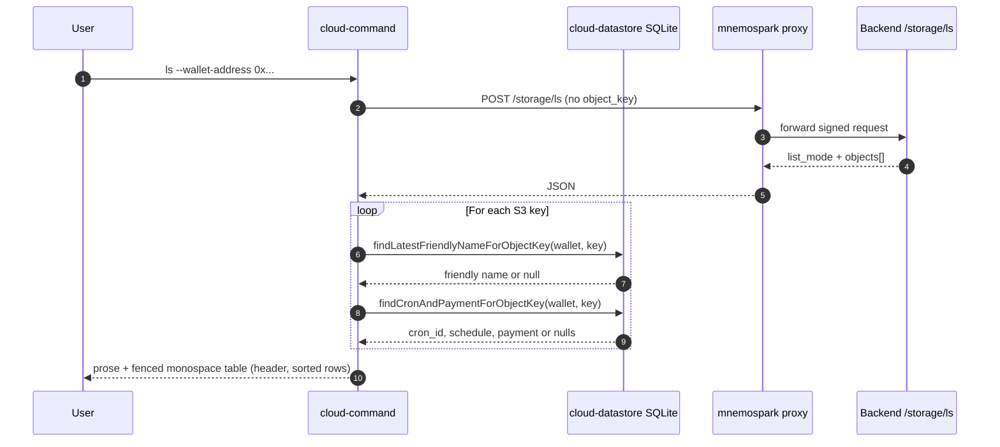

# Cursor Dev: Client — Wallet-only `ls`, S3 list, SQLite names + cron + payment columns, `ls -l`-style listing, human-readable sizes, copy-friendly presentation

**ID:** cursor-dev-49  
**Repo:** mnemospark  
**Date:** 2026-03-21  
**Revision:** rev 5  
**Last commit in repo (when authored):** `2c1d804` — chore: sync release-please manifest to 0.2.2 (#55)  

**Depends on:** **cursor-dev-48** (mnemospark-backend: `/storage/ls` list mode **deployed** or available in the target environment). Do not merge client-only changes that **require** list mode until the backend supports it; alternatively implement **backward-compatible** parsing (handle both single-object and list responses) and gate wallet-only `ls` on detecting list support (not preferred—deploy backend first).

**Workspace for Agent:** Work only in **mnemospark**. Do **not** edit mnemospark-backend in this run; consume the API contract from cursor-dev-48 / backend OpenAPI. Primary spec: this file (raw: `https://raw.githubusercontent.com/pawlsclick/mnemospark-docs/refs/heads/main/dev_docs/features_cursor_dev/cursor-dev-49-mnemospark-client-storage-ls-list-friendly-names.md`).

**AWS:** Client does not call AWS APIs directly for this feature; storage calls go through the **proxy → backend**. Use **AWS MCP** only if you need to confirm S3 or IAM semantics for documentation strings or troubleshooting (optional).

---

## Order of operations (all repos)

1. **cursor-dev-48 (mnemospark-backend)** — merged, stack **deployed** with list mode on `/storage/ls`.
2. **This task (cursor-dev-49, mnemospark)** — parser, `cloud-storage.ts`, `proxy.ts` if needed, `cloud-command.ts` user messages, `cloud-datastore.ts` lookup helpers (friendly name, **cron + payment** per object key), `ls` column layout, **markdown code-block presentation** (§5c), tests.
3. **mnemospark-docs (optional)** — update [mnemospark_full_workflow.md](../product_docs/mnemospark_full_workflow.md) or slash-command help if `ls` examples still say `--object-key` is mandatory.

---

## Scope

### 1. Command-line / parser (`src/cloud-command.ts`)

- For subcommand **`ls` only**, allow **`--wallet-address`** without **`--object-key`** and without **`--name`** (today `parseObjectSelector` returns `null` if both are missing — change this **only for `ls`**).
- **`download`** and **`delete`** must **continue to require** an object selector (`--object-key` or `--name` + selectors) — do not widen accidentally.
- When in **list mode**, build a storage request payload that **omits** `object_key` (or sends explicit null only if backend accepts it; prefer omission to match GET query behavior).
- Update in-app / slash help strings that currently imply `--object-key` or `--name` is always required for `ls`.

### 2. HTTP client and types (`src/cloud-storage.ts`)

- Extend **`StorageLsResponse`** (or introduce a discriminated union) to represent:
  - **Stat:** existing single-object shape.
  - **List:** `list_mode: true`, `objects: Array<{ key: string; size_bytes: number; last_modified?: string }>`, plus pagination fields mirroring backend (`is_truncated`, `next_continuation_token`).
- Harden **`parseLsResponse`** (or equivalent) to validate both shapes; throw clear errors on malformed payloads.
- **`requestStorageLs`** (or the function that POSTs to `/storage/ls`) must forward optional pagination parameters when exposing advanced usage (MVP: single page; optional CLI flags `--max-keys` / `--continuation-token` can be a follow-up).

### 3. Proxy (`src/proxy.ts`)

- Ensure the proxy forwards **POST** bodies / **GET** queries **without** `object_key` when in list mode (no middleware that strips empty fields incorrectly).

### 4. SQLite — best-effort friendly names, cron job, payment (`src/cloud-datastore.ts`)

**4a. Friendly name**

Add a helper, e.g. **`findLatestFriendlyNameForObjectKey(walletAddress: string, objectKey: string): Promise<string | null>`**, with this **resolution order**:

1. **`friendly_names`**: `wallet_address` match, `object_key = ?`, `is_active = 1`, order by **`created_at` DESC**, limit **1**.
2. Else **`objects`** by `object_key` → `object_id`, then **`friendly_names`** by `object_id` + wallet + `is_active = 1`, latest `created_at`.

If no row: return **`null`** (UI shows key only or “unnamed”).

**4b. Cron job + payment (per `object_key`)**

Schema reference (mnemospark `src/cloud-datastore.ts`): **`cron_jobs`** has `cron_id`, `object_key`, `quote_id`, `schedule` (cron expression string), `status`, …; **`payments`** has `quote_id` (PK), `wallet_address`, `amount` (`REAL`), `network`, `status`, …

Add a helper, e.g. **`findCronAndPaymentForObjectKey(walletAddress: string, objectKey: string): Promise<{ cronId: string; schedule: string; quoteId: string; amount: number | null; network: string | null; paymentStatus: string | null } | null>`** (shape may vary; **null** if no cron row).

- **Cron row:** same selection rule as existing **`findCronByObjectKey`**: **`cron_jobs`** where **`object_key = ?`**, order by **`updated_at` DESC**, limit **1** (if multiple exist, latest wins).
- **Payment row:** if cron row has **`quote_id`**, load **`payments`** where **`quote_id = ?`** **and** **`wallet_address`** matches the **`ls`** wallet (normalized the same way as elsewhere). If missing, expose **`amount: null`** (UI shows **`-`** in payment column).

**Note:** S3 is authoritative for **which keys exist**; SQLite supplies **friendly names**, **cron**, and **payment** only when the **local** catalog has rows (objects uploaded / tracked through this client).

### 5. User-facing output (`cloud-command.ts` or small formatter)

- Build the final user-visible string per **§5c** (copy-friendly): **prose outside** the fence, **table inside** one **fenced code block**.
- Render **`ls` data rows** in a GNU **`ls -l`-style column layout** — **one line per object**, stable left-to-right columns, **space-padded** (compute column widths from the **full result set** after **sorting** per §5c).

### 5a. `ls -l`-style columns (stat and list `ls`)

Match the **visual habit** of **`ls -l`** for the leading columns, then append **mnemospark-specific** columns for **cron** and **payment** before the final **name** (see [GNU `ls` long format](https://www.gnu.org/software/coreutils/manual/html_node/ls-invocation.html) for the leftmost fields).

**Column order (left → right)**

1. **Mode / type (10 chars):** literal **`----------`** (placeholder only; **no** Unix permission semantics for S3 objects).
2. **Link count:** literal **`1`** (fixed width **2**, right-aligned: ` 1`).
3. **Owner:** literal **`-`** (fixed width **8**, left-aligned padded).
4. **Group:** literal **`-`** (fixed width **8**, left-aligned padded).
5. **Size:** human-readable size from **§5b** (below), **right-aligned** in a column whose width = **max rendered width** across all rows in this response; **one space** before the next column (same role as `ls -l` size field).
6. **S3 mtime:** derived from S3 `last_modified` when present. Use the same **shape** as `ls -l`: **`MMM DD HH:MM`** for “recent” objects and **`MMM DD  YYYY`** (or equivalent fixed width) for older years — pick one rule and document it in code (e.g. same calendar year as “now” → time; else year). Use **UTC** or **local** time but **state which** in a one-line comment. If `last_modified` is missing, use a **fixed-width** placeholder **`         -`** (12 chars) so columns stay aligned.
7. **Cron id:** `cron_jobs.cron_id` from **§4b**, or a fixed-width **`         -`** (truncate long ids with **`…`** if needed; column width = max width across rows, like other padded fields).
8. **Next run:** **next fire time** after “now” computed from **`cron_jobs.schedule`** (the stored cron expression). Use a **small, maintained** cron parser dependency **or** an existing project utility if one already exists; document **timezone** (recommend **UTC** for consistency with S3 timestamps). Format as **`MMM DD HH:MM`** (same width rule as §5a.6) or compact **ISO** in a **fixed-width** column. If there is **no** cron row, schedule is **unparseable**, or status is inactive in a way the code treats as “no upcoming run”, show a **fixed-width** **`         -`**. Do **not** show only the raw cron string here — users asked for a **run date**; if next-run computation is impossible for a given expression, show **`?`** in a fixed-width field and log or document the limitation.
9. **Payment:** from **§4b** `payments.amount` when present: format for readability (e.g. up to **6** decimal places for token amounts, trim trailing zeros; avoid scientific notation). Append **`network`** in parentheses when non-empty, e.g. **`0.5 (base)`**. If no payment row, show **`         -`** (fixed width aligned with column max). Optionally include **`payments.status`** as a short suffix (e.g. **`0.5 (base) settled`**) if it fits column width rules — if too noisy, **amount + network only**. Apply **§5c** max width to the **rendered payment cell** (truncate end with **`…`**, keep column width aligned).
10. **Name:** last column. If a friendly name exists: **`Friendly name (object_key)`**; else **`object_key`**. Do **not** right-pad the name column; apply **§5c** **max width** with **middle ellipsis** (`start … end`) so a single long key does not break copy-paste layouts.

**Single-object (stat) `ls`**

- Emit **one** line in the **same** column layout (synthetic single-row table) so stat and list look consistent.

**Tests**

- Golden-string or structural tests: **multiple objects** share the **same** width for the **size**, **S3 mtime**, **cron id**, **next run**, and **payment** columns; each line contains the **10-char** mode placeholder and **object key** text.

### 5b. Human-readable file sizes (stat and list `ls`)

Today `ls` surfaces **`size_bytes`** in a way that is hard to scan. **Change user-visible output** to show an **easy-to-read size** with **KB / MB / GB** (and **B** for small files, **TB** if needed). The resulting strings populate the **size column** in **§5a**.

**Requirements**

- Apply to **both** modes: existing **single-object** `ls` (stat) and new **list** `ls`.
- Implement a **single shared helper**, e.g. `formatBytesForDisplay(bytes: number): string` (name to match repo conventions), colocated with existing storage message formatters or in `cloud-utils.ts` if that is the right shared home. **Reuse** if an equivalent already exists.
- **Input:** non-negative integer (floor or reject non-integers / NaN per existing error style). **`0`** must display as **`0 B`**.
- **Scale:** use **decimal** prefixes (1 KB = **1_000** B, 1 MB = **1_000_000** B, etc.) and labels **`B`**, **`KB`**, **`MB`**, **`GB`**, **`TB`**. This matches common “SI” storage labeling users expect when they say “MB/GB.”
- **Precision:** use **at most one decimal place** for KB+ when the fractional part matters; prefer **whole numbers** when the value is within **1%** of the next unit boundary (avoid `1023.9 KB` when `1.0 MB` is clearer). Trim trailing **`.0`**. Document the rounding rule in a one-line comment next to the helper.
- **API contract:** backend continues to return **`size_bytes` only** (see cursor-dev-48); do not rely on formatted strings from the server.

**Tests**

- Unit tests for the formatter: `0`, values just below/above 1_000 and 1_000_000, large objects, and typical list rows.

### 5c. Presentation: monospace block, headers, sort, width caps, empty state, copy-friendly layout

**Copy-friendly structure (required)**

- Assemble the returned message so users can **copy the table in one gesture**:
  - **Outside** the fenced block (plain prose / markdown paragraphs): **disclaimer** (local SQLite for names, cron, payment; **`-`** = unknown locally), **legend** (one short line mapping abbreviations to meanings, e.g. that **`NEXT`** is next cron fire in UTC), **`bucket:`** line with bucket name from the API when available, **`sorted by:`** line stating the rule from below, optional **`total <N>`** for this page, and if the backend reports **truncation**, a line such as **`List truncated; more objects in bucket.`** (and future continuation-token hint if implemented). **Do not** put these lines inside the code fence.
  - **Inside a single fenced code block:** **header row** (see below) then **data rows** only — no disclaimer, no bucket line. Use a **single** opening/closing triple-backtick pair for the whole table; use plain **` ``` `** (no language tag) or **` ```text `** so hosts render **monospace** and preserve spaces.

**Header row (inside code block, first line)**

- One line of **abbreviated column labels** aligned to the **same column boundaries** as data (pad with spaces). Example tokens (adjust to match §5a): **`PERM`**, **`LN`**, **`USER`**, **`GRP`**, **`SIZE`**, **`S3_TIME`**, **`CRON`**, **`NEXT`**, **`PAY`**, **`NAME`** (or shorter if width-constrained). Document chosen abbreviations in the **legend** outside the block.

**Sort order (before computing column widths)**

- **Default:** sort rows by S3 **`last_modified` descending** (newest first); objects **missing** `last_modified` sort **after** all dated rows, ordered by **`key` ascending**. **Tie-break** by **`key` ascending**. Document in a one-line code comment.

**Width caps (constants, tune in one place)**

- **Name** column displayed text: max **72** characters; if longer, replace the middle with **` … `** while keeping recognizable **prefix and suffix** (ensure `object_key` tail remains visible enough to disambiguate, e.g. at least **8** chars of suffix unless key is shorter).
- **Payment** column displayed text: max **28** characters; truncate end with **`…`** if needed while keeping the **numeric amount** visible when possible.

**Empty list**

- When **zero** objects: **no** fenced code block. Prose only: clear sentence e.g. **`No objects in this bucket.`** plus **`bucket:`** if known. Still include **disclaimer** if other `ls` modes use it, or a one-line note that the bucket is empty.

**Stat mode (single object)**

- Use the **same** pattern: prose outside (minimal), then **one** code block with **header + one data row** so copy-paste behavior matches list mode.

### 6. Operations / telemetry

- Prefer **one** `operations` row per `ls` list invocation (`type: "ls"`, metadata or error_message field noting `list_mode: true`) rather than one row per S3 key (avoid SQLite spam).

### 7. Tests

- Update tests that expect **`ls` + wallet only** to be invalid (`src/cloud-command.test.ts` in the mnemospark repo currently asserts invalid args).
- Add unit tests for **parse** (list mode), **response parsing**, and **friendly name resolution** (datastore).
- **`cloud-storage.test.ts`**: fixture for list response.
- **User message / integration-style tests:** assert `ls` output contains **formatted sizes** (not only raw `size_bytes` integers) for stat and list flows where applicable.
- Assert **`ls -l`-style layout**: multiple objects produce **aligned** columns; lines include the **10-char** placeholder mode field and **consistent** widths for **size**, **S3 mtime**, **cron**, **next run**, and **payment** columns.
- **Datastore tests** for **§4b** join (cron + payment by `object_key` / `quote_id` / wallet).
- **Presentation (§5c):** output contains **one** fenced block wrapping header + rows; **prose** (disclaimer, legend, bucket, sort) appears **outside** the fence; **empty list** has **no** fence; **sort order** verified with fixtures (newest mtime first).

---

## Overview

End users run `/mnemospark_cloud ls --wallet-address <addr>` and see **every object key** in their bucket (from S3 via the backend), with **friendly names**, **cron job id**, **next scheduled run** (from the stored cron expression), and **payment amount** (from the linked quote) filled in **best effort** from local SQLite. **All `ls` output** (single-object and list) uses a **GNU `ls -l`-like column layout** (placeholder mode, size, S3 mtime, cron, next run, payment, name) with **human-readable sizes** (B, KB, MB, GB, …), **sorted for scanability**, **width-capped** long fields, a **header row**, and a **single monospace markdown code block** for the table so the listing is **easy to copy**; **prose** (disclaimer, legend, bucket, sort rule) stays **outside** that block.

---

## Context

- SQLite schema: `friendly_names`, **`cron_jobs`** (`cron_id`, `object_key`, `quote_id`, `schedule`, …), **`payments`** (`quote_id`, `wallet_address`, `amount`, `network`, `status`, …), `objects` (see mnemospark `src/cloud-datastore.ts`).
- Backend contract: **cursor-dev-48**.

---

## Diagrams



---

## References

- This spec: [cursor-dev-49-mnemospark-client-storage-ls-list-friendly-names.md](cursor-dev-49-mnemospark-client-storage-ls-list-friendly-names.md) — raw: `https://raw.githubusercontent.com/pawlsclick/mnemospark-docs/refs/heads/main/dev_docs/features_cursor_dev/cursor-dev-49-mnemospark-client-storage-ls-list-friendly-names.md`
- Backend dependency: [cursor-dev-48-backend-storage-ls-s3-list-mode.md](cursor-dev-48-backend-storage-ls-s3-list-mode.md)
- Prior client ls: [cursor-dev-14-client-ls-download-delete.md](cursor-dev-14-client-ls-download-delete.md)
- Backend OpenAPI (contract): `https://raw.githubusercontent.com/pawlsclick/mnemospark-backend/refs/heads/main/docs/openapi.yaml`
- GNU coreutils `ls` long listing (reference for column order): [ls invocation](https://www.gnu.org/software/coreutils/manual/html_node/ls-invocation.html)

---

## Agent

- **Install (idempotent):** `npm ci` or `npm install` per project.
- **Start (if needed):** None; mock `fetch` in tests.
- **Secrets:** None for unit tests.
- **Acceptance criteria (checkboxes):**
  - [ ] `/mnemospark_cloud ls --wallet-address <addr>` **without** `--object-key` or `--name` is **valid** and triggers **list mode**.
  - [ ] **download** / **delete** still **require** object selector.
  - [ ] **Proxy** forwards list requests without forcing `object_key`.
  - [ ] **Response parsing** supports **both** stat and list JSON shapes from backend.
  - [ ] **SQLite helper** resolves friendly name with the **two-step** rule (`object_key` row first, then `object_id`).
  - [ ] **SQLite helper** resolves **cron + payment** per **§4b** (latest `cron_jobs` row by `object_key`, then `payments` by `quote_id` + wallet).
  - [ ] **User-visible output** shows S3 keys with **best-effort** names, **cron id**, **next run** (from schedule), **payment** column, and a **short disclaimer** about the local catalog.
  - [ ] **`ls` shows human-readable sizes** (B, KB, MB, GB, TB as needed) for **both** stat and list modes via a **shared** `formatBytesForDisplay` (or equivalent), using **decimal** KB/MB/GB; **unit tests** cover edge cases.
  - [ ] **List (and stat) `ls` output matches `ls -l`-style columns** per **§5a** (placeholder mode, links, owner, group, right-aligned size, fixed-width **S3 mtime**, **cron id**, **next run**, **payment**, **name** last).
  - [ ] **§5c presentation:** **one** markdown **fenced code block** contains **aligned header row + data rows only**; **disclaimer, legend, bucket, sorted-by, total/truncation** lines are **outside** the fence (copy-friendly).
  - [ ] **Sort** per §5c (**S3 mtime desc**, missing mtime last, tie-break **key asc**).
  - [ ] **Width caps** for **name** (middle ellipsis) and **payment** (end ellipsis) per §5c.
  - [ ] **Empty bucket:** prose-only message, **no** empty code fence.
  - [ ] **Tests** updated/added; CI green.
  - [ ] Branch + PR from default branch (follow mnemospark repo policy if documented).

---

## Task string (optional)

Work only in **mnemospark**. Read `cursor-dev-49-mnemospark-client-storage-ls-list-friendly-names.md` in mnemospark-docs (raw GitHub URL if needed). **Depends on deployed cursor-dev-48.** Implement wallet-only `ls`: relax `parseObjectSelector` for `ls` only; extend `cloud-storage` types and parsers for list responses; add **`findLatestFriendlyNameForObjectKey`** and **`findCronAndPaymentForObjectKey`** (§4) in `cloud-datastore.ts`; format output as **GNU `ls -l`-style column rows** (§5a) including **cron id**, **next run** from schedule, and **payment amount**; **shared human-readable byte formatting** (§5b); **§5c** — sort rows, width caps, **header line inside** a **single triple-backtick code block**, **prose** (disclaimer, legend, bucket, sorted-by, total/truncation) **outside** the block; empty list = prose only. Update proxy if needed; fix tests. Do not change download/delete selector requirements. Acceptance: spec checkboxes.
