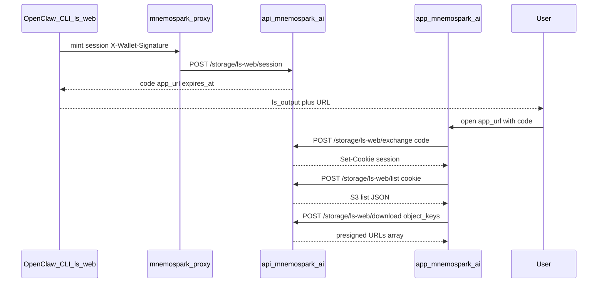

# Cursor Dev: Backend — `ls-web` session mint, exchange, list, multi-download (no web delete)

**ID:** cursor-dev-50  
**Repo:** mnemospark-backend  
**Date:** 2026-04-15  
**Revision:** rev 1  
**Last commit in repo (when authored):** `69fb13b` — fix(iam): use inline policies for DynamoDB CMK KMS (no managed policy)

**Related cursor-dev IDs:** Builds on wallet auth ([auth-01](cursor-dev-auth-01-lambda-authorizer.md)–[auth-04](cursor-dev-auth-04-lambdas-authorizer-context.md)), storage [cursor-dev-05](cursor-dev-05-lambda-storage-ls.md), [cursor-dev-06](cursor-dev-06-lambda-storage-download.md), [cursor-dev-48](cursor-dev-48-backend-storage-ls-s3-list-mode.md). Website: **cursor-dev-51** (parallel). Client: **cursor-dev-52** (after API + app URL stable).

**Workspace for Agent:** Work only in **mnemospark-backend**. Do **not** require the mnemospark or mnemospark-website repos for implementation; align with **cursor-dev-51** on CORS origin, cookie name, and path names via OpenAPI and this spec. The primary spec for this work is this file (raw: `https://raw.githubusercontent.com/pawlsclick/mnemospark-docs/refs/heads/main/dev_docs/features_cursor_dev/cursor-dev-50-backend-cloud-ls-web-session-and-bff.md`).

**AWS:** Use the **AWS MCP Server** when available. Follow [AWS Best Practices](https://docs.aws.amazon.com/).

---

## Scope

Implement **browser-oriented BFF routes** for the **`ls-web`** product: **CLI-minted** short-lived access to **`https://app.mnemospark.ai`**, backed by **new Lambdas** (or one Lambda with route dispatch) and **API Gateway** wiring. **No delete** from the web surface: **do not** expose `DELETE` / `POST` delete semantics for `ls-web` session callers.

### Session model

- **TTL:** **6 hours** (21600 seconds) from successful **session mint**. Enforce on every **exchange**, **list**, and **download** call.
- **Mint:** Authenticated with existing **`X-Wallet-Signature`** (same as other storage routes). Returns a **single-use** or short-lived **exchange code** (high-entropy, opaque) plus **`https://app.mnemospark.ai`** entry URL (with `code` query param or path segment—align with cursor-dev-51) and **`expires_at`** (ISO 8601).
- **Storage:** Persist session server-side (**DynamoDB** recommended: PK `session_id` or hashed token, attributes `wallet_address`, `expires_at` epoch, optional `exchange_code_hash` consumed flag, TTL attribute for DynamoDB TTL). Single-use exchange code after cookie issuance.
- **Exchange:** Browser **`POST`** with JSON body `{ "code": "<otp>" }` (exact shape in OpenAPI). Response sets **`Set-Cookie`**: **`HttpOnly`**, **`Secure`**, **`Domain=.mnemospark.ai`**, **`SameSite=Lax`**, **`Path=/`**, reasonable cookie name (e.g. `mnemospark_ls_web`—document). Cookie value = opaque session id matching DynamoDB row. **Do not** put wallet secrets in cookie.
- **List:** **`GET` or `POST`** under `/storage/ls-web/...` **list** (name TBD) validates session cookie (or header fallback if you must support non-cookie clients—v1 is cookie-first), resolves **authorized wallet** from session, returns **same S3 list semantics** as **`/storage/ls`** list mode (reuse internal helpers / S3 `list_objects_v2` with pagination). Response shape should match or **subset** existing list JSON so the web app can render **key**, **size_bytes**, **last_modified** (and pagination fields).
- **Multi-download:** **`POST`** with JSON body **`{ "object_keys": ["...", "..."] }`** (cap **e.g. 25** keys per request—document and enforce). For each key: **authorize** key belongs to wallet bucket (prefix/object rules consistent with existing storage Lambdas), then produce **presigned GET** (or equivalent) using **same policy duration** semantics as existing **`/storage/download`**. Return JSON array of `{ "object_key", "url", "expires_at" }` (or errors per key). **No** zip bundling required for v1 unless trivial.

### API Gateway / SAM

- Add routes under a stable prefix, e.g. **`/storage/ls-web/session`** (POST, **wallet authorizer ON**), **`/storage/ls-web/exchange`** (POST, **no** wallet authorizer—validate code; **OPTIONS** for CORS), **`/storage/ls-web/list`**, **`/storage/ls-web/download`** (session validation in Lambda; CORS + OPTIONS).
- **CORS:** `Access-Control-Allow-Origin: https://app.mnemospark.ai` (exact), `Access-Control-Allow-Credentials: true`, allow **methods** and **headers** needed for `POST` + `Cookie`. Echo CORS from existing env **`MNEMOSPARK_CORS_ALLOW_ORIGIN`** pattern only if extended to include app origin; prefer **explicit** app origin for these routes.
- **Authorizer:** **Mint** uses existing Lambda authorizer. **Exchange / list / download** must **not** rely on `X-Wallet-Signature` from the browser; they use **session** only.

### Security / abuse

- Rate-limit **exchange** and **download** (WAF or in-Lambda throttling—document).
- **CSRF:** Same-site cookie + **POST** for exchange and download; document that **GET** list should be read-only or use **POST** for list if you prefer uniform CSRF posture.

### Docs

- Update **`docs/openapi.yaml`** with all new paths, schemas, and error codes.
- Add **`docs/storage-ls-web.md`** (or equivalent) with examples: mint from CLI proxy, exchange from browser, list, batch download.

### Tests

- Unit tests: session TTL edge, code replay rejection, download cap, invalid keys.
- Integration tests where patterns already exist for storage.

---

## Diagrams

---

## References

- [`meta_docs/wallet-proof.md`](../../meta_docs/wallet-proof.md) — raw: `https://raw.githubusercontent.com/pawlsclick/mnemospark-docs/refs/heads/main/meta_docs/wallet-proof.md`
- [auth_no_api_key_wallet_proof_spec.md](../product_docs/auth_no_api_key_wallet_proof_spec.md)
- [cursor-dev-06-lambda-storage-download.md](cursor-dev-06-lambda-storage-download.md)
- [cursor-dev-48-backend-storage-ls-s3-list-mode.md](cursor-dev-48-backend-storage-ls-s3-list-mode.md)
- [mnemospark_backend_api_spec.md](../product_docs/mnemospark_backend_api_spec.md)

---

## Agent

- **Install (idempotent):** `python -m venv .venv && source .venv/bin/activate && pip install -r requirements.txt` (or project-standard venv path per `AGENTS.md`).
- **Start (if needed):** None.
- **Secrets:** AWS credentials for deploy; no new long-lived secrets required for session v1 beyond existing stack params.
- **Acceptance criteria (checkboxes):**
  - [ ] `POST /storage/ls-web/session` requires valid `X-Wallet-Signature`; returns one-time `code`, `app` URL fragment, and `expires_at`; TTL **6h**.
  - [ ] `POST /storage/ls-web/exchange` accepts `code`, sets **`HttpOnly`** session cookie **`Domain=.mnemospark.ai`**, invalidates single-use code.
  - [ ] List endpoint returns wallet-scoped S3 list consistent with **`/storage/ls`** list mode; respects session expiry.
  - [ ] Download endpoint accepts **`object_keys`** array (capped); returns presigned URLs aligned with **`/storage/download`** semantics; rejects keys outside wallet bucket.
  - [ ] **No** `ls-web` delete route exposed to browsers.
  - [ ] **CORS** allows **`https://app.mnemospark.ai`** with **credentials** on exchange, list, download (and OPTIONS).
  - [ ] OpenAPI + SAM updated; unit/integration tests added or extended.

---

## Task string (optional)

Work only in **mnemospark-backend**. Implement `ls-web` BFF: POST session (wallet proof), POST exchange (OTP to HttpOnly cookie Domain=.mnemospark.ai), list and batch presigned download (cap keys), TTL 6h, DynamoDB session store, CORS for https://app.mnemospark.ai, no web delete. Update OpenAPI/SAM/tests. GitOps: branch from main, conventional commits, tests green, PR. Acceptance: checkboxes in cursor-dev-50.
