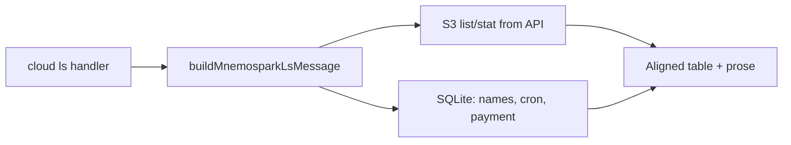

# Cursor Dev: Client — `ls` table columns and header prose refresh

**ID:** cursor-dev-50  
**Repo:** mnemospark  
**Date:** 2026-03-22  
**Revision:** rev 1  
**Last commit in repo (when authored):** `dcaa8b4` — chore(main): release 0.5.0 (#68)

**Depends on:** **cursor-dev-49** (wallet-only `ls`, list mode, formatter in `src/cloud-ls-format.ts`).

**Workspace for Agent:** Work only in **mnemospark**. Primary spec: this file (raw: `https://raw.githubusercontent.com/pawlsclick/mnemospark-docs/refs/heads/main/dev_docs/features_cursor_dev/cursor-dev-50-mnemospark-ls-table-columns-and-prose.md`).

**AWS:** None for this change; output formatting only.

---

## Diagrams

---

## Scope

Update **`src/cloud-ls-format.ts`** (and tests that assert on `ls` output):

1. **Remove columns** from the fenced table: **PERM**, **LN**, **USER**, **GRP** (no `ls -l`-style leading fields).
2. **Rename headers:** **CRON** → `CRON JOB`, **NEXT** → `NEXT PAYMENT DATE`, **PAY** → `AMOUNT DUE`, **NAME** → `FILE NAME OR OBJECT-KEY`. Keep **SIZE** and **S3_TIME** as today unless product asks otherwise.
3. **Replace prose** (outside the code fence) with exactly this intent:
   - Title line: `☁️ mnemospark cloud files`
   - `S3 bucket: <bucket>`
   - `The columns: CRON JOB, NEXT PAYMENT DATE, AMOUNT DUE, FILE NAME are from this host's mnemospark SQLite catalog`
   - `mnemospark cloud only stores the OBJECT-KEY for privacy`
4. **Drop** the previous disclaimer/legend, **`sorted by:`** line, and **`total N`** line from default output. **Keep** the truncation line when `is_truncated` is true: `List truncated; more objects in bucket.` (append after the privacy line, still outside the fence).
5. **Empty bucket:** same new intro lines, then blank line, then `No objects in this bucket.` (no fence).

Adjust column width logic so **NEXT PAYMENT DATE** and time cells align (widen the next-run column as needed).

---

## References

- Prior behavior and data sources: [cursor-dev-49-mnemospark-client-storage-ls-list-friendly-names.md](./cursor-dev-49-mnemospark-client-storage-ls-list-friendly-names.md) (raw: `https://raw.githubusercontent.com/pawlsclick/mnemospark-docs/refs/heads/main/dev_docs/features_cursor_dev/cursor-dev-49-mnemospark-client-storage-ls-list-friendly-names.md`)
- Formatter implementation: `mnemospark` repo `src/cloud-ls-format.ts`

---

## Agent

- **Install (idempotent):** `npm ci`
- **Start (if needed):** None.
- **Secrets:** None.
- **Acceptance criteria (checkboxes):**
  - [ ] Stat and list `ls` omit PERM, LN, USER, GRP.
  - [ ] Headers match the rename list; SIZE and S3_TIME unchanged.
  - [ ] Prose matches the four lines above (grammar: host’s); truncation line preserved when truncated.
  - [ ] Empty bucket uses intro + “No objects…” without a fence.
  - [ ] `npm test`, `npm run lint`, `npm run typecheck`, and `npm run build` pass.
  - [ ] Branch + PR from `main`; do not commit to `main`.

## Task string (optional)

Work only in **mnemospark**. Implement cursor-dev-50: simplify `ls` table columns, rename headers, replace outside-the-fence prose per `dev_docs/features_cursor_dev/cursor-dev-50-mnemospark-ls-table-columns-and-prose.md`, update tests, open a PR.
