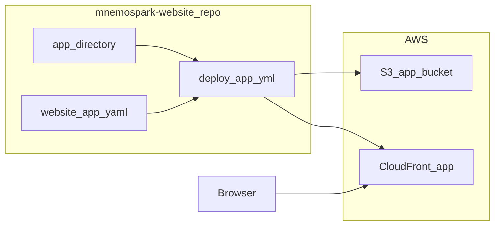

# Cursor Dev: Website — `app.mnemospark.ai` static shell, `website-app.yaml`, multi-download UI

**ID:** cursor-dev-51  
**Repo:** mnemospark-website  
**Date:** 2026-04-15  
**Revision:** rev 1  
**Last commit in repo (when authored):** `88b2f1f` — feat(staging): add Paragraph blog links, FAQ, and FAQPage JSON-LD

**Related cursor-dev IDs:** **cursor-dev-50** (backend API/CORS/cookie contract—sync before ship). **cursor-dev-52** (client prints app URL—depends on stable app hostname).

**Workspace for Agent:** Work only in **mnemospark-website**. Do **not** modify [`infra/cloudformation/website-prod.yaml`](https://github.com/pawlsclick/mnemospark-website/blob/main/infra/cloudformation/website-prod.yaml), [`.github/workflows/deploy-prod.yml`](https://github.com/pawlsclick/mnemospark-website/blob/main/.github/workflows/deploy-prod.yml), or [`.github/workflows/promote-staging-to-prod.yml`](https://github.com/pawlsclick/mnemospark-website/blob/main/.github/workflows/promote-staging-to-prod.yml) for this feature. The primary spec for this work is this file (raw: `https://raw.githubusercontent.com/pawlsclick/mnemospark-docs/refs/heads/main/dev_docs/features_cursor_dev/cursor-dev-51-website-cloud-ls-web-shell-and-assets.md`).

**AWS:** Use **AWS MCP** when available. Follow [AWS Best Practices](https://docs.aws.amazon.com/).

---

## Scope

Deliver a **standalone** static site for **`https://app.mnemospark.ai`** that does **not** share the marketing S3 bucket or CloudFront distribution.

### Repository layout

- Add top-level **`app/`** directory containing **`index.html`** and static assets (JS/CSS; hashed filenames optional). **Marketing** content stays under **`prod/`** and **`staging/`** only.
- **`app/`** implements:
  - **Nav + footer** visual continuity with [`staging/index.html`](https://github.com/pawlsclick/mnemospark-website/blob/main/staging/index.html) (typography, dark theme, `--chain-accent`, logo strip—copy patterns, not runtime coupling).
  - **Main:** tabular **file list** from **`POST`** (or `GET` per backend) **`/storage/ls-web/list`** on **`https://api.mnemospark.ai`** with **`credentials: 'include'`**.
  - **Checkbox per row** + primary action **“Download selected”** (and optional **Select all / clear**). On submit: call **`POST /storage/ls-web/download`** with **`{ "object_keys": [...] }`**; open or chain **presigned URLs** (new tabs or sequential downloads—document UX and browser limits). Respect backend **max keys** cap; surface validation errors.
  - **Bootstrap flow:** On load with **`?code=`** (or agreed path), call **`POST /storage/ls-web/exchange`**, then strip or replace history so code is not bookmarked; then load list.
  - **Copy block:** Short note that **friendly names / billing** from chat **`ls`** align by **object-key**; **delete** only via **`/mnemospark cloud delete`** in OpenClaw.
- **No WalletConnect**; **no delete** UI.

### Infrastructure — new stack only

- Add **[`infra/cloudformation/website-app.yaml`](https://github.com/pawlsclick/mnemospark-website/blob/main/infra/cloudformation/website-app.yaml)** defining:
  - **New** private **S3 bucket** for app static assets (name pattern e.g. `mnemospark-website-app-<AccountId>-<region>`).
  - **CloudFront OAC** + **distribution** with alias **`app.mnemospark.ai`** only.
  - **ACM viewer cert (us-east-1):** `arn:aws:acm:us-east-1:929837999468:certificate/098cc9c8-b9b8-4179-99b4-288b97690e6c` (`*.mnemospark.ai`).
  - **Security headers** response policy (mirror [`website-prod.yaml`](https://github.com/pawlsclick/mnemospark-website/blob/main/infra/cloudformation/website-prod.yaml) style: HSTS, frame deny, etc.).
  - **Bucket policy** allowing **only** this distribution’s **`AWS:SourceArn`**.
  - **GitHub OIDC deploy role** for app (separate role name from marketing deploy role), with **`s3:PutObject`** / sync and **`cloudfront:CreateInvalidation`** on **app** distribution only—mirror **marketing** OIDC conditions (org/repo/branch/environment) but scoped to **`deploy-app`** workflow.
- **Outputs:** `BucketName`, `DistributionId`, `DistributionDomainName`, `GitHubDeployRoleArn` (if role created), **`AppDnsTarget`** for Porkbun.

### Deploy workflow

- Add **`.github/workflows/deploy-app.yml`** (name exact flexible):
  - Triggers: `push` to `main` affecting **`app/**`**, **`infra/cloudformation/website-app.yaml`**, or the workflow file; **`workflow_dispatch`** optional.
  - Steps: OIDC → **`cloudformation deploy`** `website-app` stack → **`aws s3 sync ./app`** to app bucket (HTML **no-cache**, other assets cache headers per marketing pattern) → **`create-invalidation`** **`/*`** on **app** distribution only.
  - **Do not** trigger on `prod/**` alone.

### DNS (manual / Porkbun)

- Document: create **`app`** **CNAME** (or ALIAS) to **`AppDnsTarget`** output (CloudFront domain).

---

## Diagrams

---

## References

- [`staging/index.html`](https://github.com/pawlsclick/mnemospark-website/blob/main/staging/index.html) (visual reference)
- [`infra/cloudformation/website-prod.yaml`](https://github.com/pawlsclick/mnemospark-website/blob/main/infra/cloudformation/website-prod.yaml) (patterns to copy—not edit)
- [cursor-dev-50-backend-cloud-ls-web-session-and-bff.md](cursor-dev-50-backend-cloud-ls-web-session-and-bff.md) — raw: `https://raw.githubusercontent.com/pawlsclick/mnemospark-docs/refs/heads/main/dev_docs/features_cursor_dev/cursor-dev-50-backend-cloud-ls-web-session-and-bff.md`

---

## Agent

- **Install (idempotent):** None beyond AWS CLI / SAM if used locally; CI uses OIDC.
- **Start (if needed):** None.
- **Secrets:** GitHub environment **`app`** or repo secrets for **`AWS_ROLE_ARN_APP`** (pattern after **`AWS_ROLE_ARN_PROD`**).
- **Acceptance criteria (checkboxes):**
  - [ ] **`app/`** contains production-ready shell: nav, table + **checkboxes**, **multi-file download** action, footer, exchange-on-load, list fetch with credentials.
  - [ ] **`website-app.yaml`** creates **dedicated** S3 + CloudFront + OAC; **alias** `app.mnemospark.ai`; **ACM ARN** as specified; **no** edits to **`website-prod.yaml`**.
  - [ ] **`deploy-app.yml`** deploys app stack + sync + invalidation; **does not** alter marketing **`deploy-prod.yml`** / promote workflow.
  - [ ] README section documents **`app`** DNS step (Porkbun) and first-time stack deploy parameters (OIDC provider ARN, etc.).
  - [ ] **No** WalletConnect; **no** delete control in UI.

---

## Task string (optional)

Work only in **mnemospark-website**. Add **`app/`** ls-web UI (checkboxes + multi-download), **`infra/cloudformation/website-app.yaml`** standalone bucket+CloudFront+ACM wildcard, **`deploy-app.yml`**, do **not** change marketing prod stack or workflows. README: Porkbun `app` DNS. GitOps: branch from main, conventional commits, PR. Acceptance: cursor-dev-51 checkboxes.
