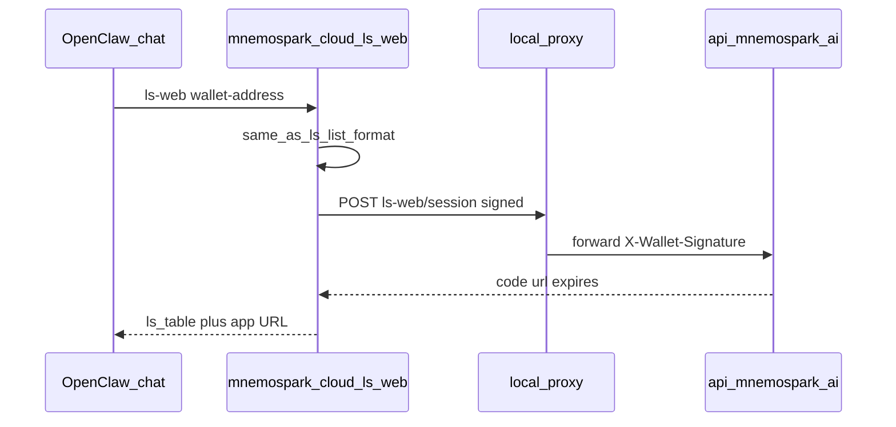

# Cursor Dev: Client — `/mnemospark cloud ls-web` (ls output + app URL + expiry)

**ID:** cursor-dev-52  
**Repo:** mnemospark  
**Date:** 2026-04-15  
**Revision:** rev 1  
**Last commit in repo (when authored):** `339d210` — docs(readme): launch link, install copy, and quick start trim (#127)

**Related cursor-dev IDs:** Depends on **cursor-dev-50** (session mint API deployed or available in target env) and **cursor-dev-51** (stable **`https://app.mnemospark.ai`** hostname and exchange path). Builds on **cursor-dev-49** (wallet-only `ls` list + `buildMnemosparkLsMessage`).

**Workspace for Agent:** Work only in **mnemospark**. Do **not** require mnemospark-backend or mnemospark-website trees. The primary spec for this work is this file (raw: `https://raw.githubusercontent.com/pawlsclick/mnemospark-docs/refs/heads/main/dev_docs/features_cursor_dev/cursor-dev-52-client-cloud-ls-web-command.md`).

---

## Scope

Add **`ls-web`** as a **`cloud`** subcommand (slash command: **`/mnemospark cloud ls-web wallet-address:…`**).

### Behavior

1. **Run the same code path as `ls`** for the given **`wallet-address:`** (list mode: no `object-key` / `name` required for full bucket listing). Reuse **`buildMnemosparkLsMessage`** (or equivalent) so chat output matches **`ls`** exactly, including SQLite-enriched columns when present.
2. **Then** call the proxy → backend **`POST /storage/ls-web/session`** (or documented path) with **`X-Wallet-Signature`** to obtain **`code`**, **`app_url`** (or compose **`https://app.mnemospark.ai/...?code=`** from contract), and **`expires_at`**.
3. **Print** the listing first, then a clear block with **browse URL** and **human-readable expiry** (6h from mint, aligned with server clock skew note if any).
4. **Errors:** surface 401/403/5xx from mint like other cloud commands.

### Parser / schema

- Add **`ls-web`** to cloud arg parsing alongside **`ls`**; required **`wallet-address:`** (or **`wallet:`** alias). Reuse or mirror **`lsSchema`** where possible.
- **Unit tests** in [`src/args/parser.test.ts`](https://github.com/pawlsclick/mnemospark/blob/main/src/args/parser.test.ts) (or project convention) for typical chat lines.

### Help

- Extend **`CLOUD_HELP_TEXT`** in [`src/cloud-command.ts`](https://github.com/pawlsclick/mnemospark/blob/main/src/cloud-command.ts) with **`ls-web`** bullet: purpose, required args, output expectation (full `ls` + URL + expiry).

### Proxy / HTTP

- Add proxy forwarder for session mint if not already generic; follow existing **`requestStorageLsViaProxy`** patterns in [`src/cloud-storage.ts`](https://github.com/pawlsclick/mnemospark/blob/main/src/cloud-storage.ts) (or appropriate module).

---

## Diagrams

---

## References

- [cursor-dev-50-backend-cloud-ls-web-session-and-bff.md](cursor-dev-50-backend-cloud-ls-web-session-and-bff.md)
- [cursor-dev-49-mnemospark-client-storage-ls-list-friendly-names.md](cursor-dev-49-mnemospark-client-storage-ls-list-friendly-names.md)
- [`cloud-ls-format.ts`](https://github.com/pawlsclick/mnemospark/blob/main/src/cloud-ls-format.ts) — `buildMnemosparkLsMessage`
- [mnemospark_full_workflow.md](../product_docs/mnemospark_full_workflow.md)

---

## Agent

- **Install (idempotent):** `npm ci`
- **Start (if needed):** None.
- **Secrets:** None beyond local wallet key for signing (existing).
- **Acceptance criteria (checkboxes):**
  - [ ] **`/mnemospark cloud ls-web wallet-address:<addr>`** prints **identical** listing block to **`ls`** for same wallet, then **URL + expiry**.
  - [ ] Session mint uses **wallet proof** via proxy; failures are user-readable.
  - [ ] **`cloud help`** documents **`ls-web`**.
  - [ ] Parser tests cover **`ls-web`** argv shapes.
  - [ ] **GitOps (code repo):** branch from **`main`**, conventional commits, **`npm test`** (or project test script) green, PR.

---

## Task string (optional)

Work only in **mnemospark**. Implement **`cloud ls-web`**: reuse **`ls`** list + `buildMnemosparkLsMessage`, then signed **`POST /storage/ls-web/session`**, print `https://app.mnemospark.ai` URL with code and expiry. Help text, arg schema, tests. Branch from main, conventional commits, tests, PR. Acceptance: cursor-dev-52 checkboxes.
