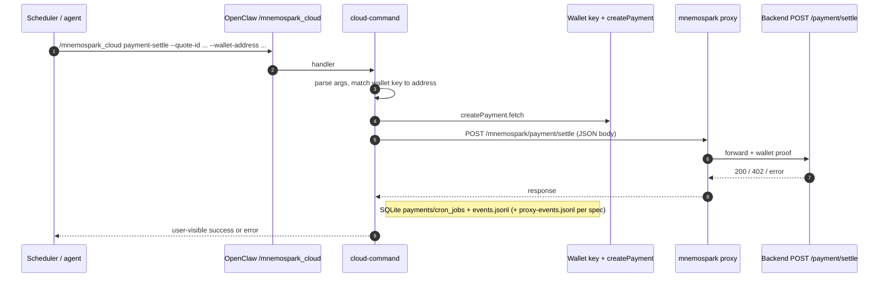
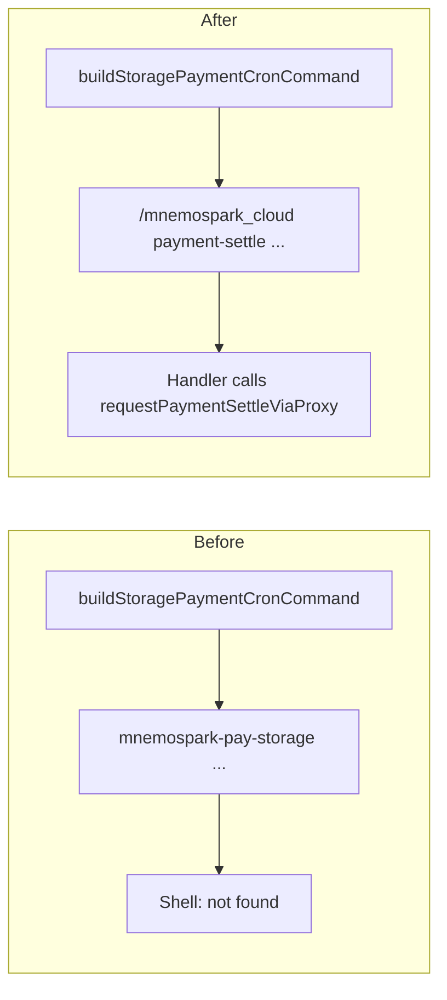

# Fix: `/mnemospark_cloud payment-settle` and cron command string

**ID:** fix-10  
**Repo:** mnemospark  
**Date:** 2026-03-22  
**Revision:** rev 2  
**Last commit in repo (when authored):** `2c1d804` — chore: sync release-please manifest to 0.2.2 (#55) *(rev 2: observability requirements only in this doc)*  

**Related:** Supersedes the non-existent **`mnemospark-pay-storage`** shell pseudo-command stored in `crontab.txt` / cron job JSON. See discussion: cron agents fail because **`mnemospark-pay-storage` is not on `PATH`**.

**Workspace for Agent:** Work only in **mnemospark** (OpenClaw plugin: `src/cloud-command.ts`, `src/cloud-price-storage.ts`, `src/cloud-datastore.ts`, `src/proxy.ts`, tests, skills). Do **not** change **mnemospark-backend** in this run unless you discover a contract bug (unlikely). The primary spec for this work is this file (raw: `https://raw.githubusercontent.com/pawlsclick/mnemospark-docs/refs/heads/main/dev_docs/fix/fix-10-mnemospark-cloud-payment-settle-and-cron-command.md`).

**AWS:** No SAM/Lambda changes in this fix. Optional: use the **AWS MCP** server only if you need to verify **POST /payment/settle** behavior against live docs; the client already forwards via the local proxy.

---

## Scope

### Problem

1. **`buildStoragePaymentCronCommand`** (`src/cloud-command.ts`) emits a string starting with **`mnemospark-pay-storage`**, which is **not** a real executable or npm binary. Schedulers/agents that run the cron `command` in a shell fail (e.g. `command not found`).
2. **Payment settlement** is already implemented for the **upload** path via **`requestPaymentSettleViaProxy`** (`src/cloud-price-storage.ts`) with **`createPayment(walletKey).fetch`** for **402 / x402** retry behavior. There is **no** user-facing **`/mnemospark_cloud`** subcommand to trigger the same flow on a schedule.

### Solution

1. **Add** a real **`/mnemospark_cloud payment-settle`** subcommand that:
   - Parses **`--quote-id`** and **`--wallet-address`** (both **required**).
   - Resolves the wallet private key (**same rules as upload**: `MNEMOSPARK_WALLET_KEY` / `~/.openclaw/mnemospark/wallet.key` / legacy path per existing `resolveWalletPrivateKey` / handler options).
   - Verifies **`privateKeyToAccount(key).address`** matches **`--wallet-address`** (case-insensitive), same pattern as **upload**.
   - Calls **`requestPaymentSettleViaProxy(quoteId, walletAddress, { fetchImpl: createPayment(walletKey).fetch, correlation?, proxyBaseUrl? })`** — **reuse the same `createPayment` + proxy path as upload’s settle-before-upload** so **402** handling stays identical.
   - Returns clear **success** or **error** user text (include trimmed backend/proxy body on failure when safe).
   - **Persistence and audit (each run, including when invoked on the storage-payment schedule):**
     - **`state.db`** (`~/.openclaw/mnemospark/state.db`, see `src/cloud-datastore.ts`): record the outcome so SQLite stays the **source of truth** alongside legacy logs. At minimum:
       - **`payments`**: **`upsertPayment`** reflecting settle success or failure (mirror the **`upload`** path’s post-settle pattern: e.g. `status` / `settled_at` / `trans_id` when the backend response provides them; on failure, persist a non-terminal or failed status consistent with existing conventions—do not leave the row silently stale).
       - **`cron_jobs`**: when the job can be correlated (e.g. match **`quote_id`** and **`object_key`** from optional flags or from `cron_jobs` / `findQuoteById`), **refresh** the row (e.g. re-**`upsertCronJob`** so **`updated_at`** reflects the last attempted run; adjust **`status`** if the product defines states beyond `active`). If correlation is impossible, still record **`payments`** + JSONL below.
     - **JSONL event streams** (same directory as `state.db`, via **`appendJsonlEvent`** / **`emitCloudEventBestEffort`** in `src/cloud-command.ts`):
       - **`events.jsonl`**: append at least one structured line per settle attempt with **`event_type`**, **`ts`**, **`quote_id`**, **`wallet_address`**, success/failure **`status`**, and correlation ids (**`operation_id`** / **`trace_id`**) when using **`buildRequestCorrelation`**—same shape family as **`price-storage.completed`** / **`upload.completed`**.
       - **`proxy-events.jsonl`**: when settlement goes through the **local mnemospark proxy**, the proxy already appends **`payment.settle`** **`start`** / **`result`** lines (`src/proxy.ts`, **`emitProxyEvent`**). For **client-side** parity with **`emitOperationEvent`** (dual-write to both JSONL files), either mirror the same settle lifecycle into **`proxy-events.jsonl`** from the command handler **or** document that operators rely on proxy lines when the proxy is in path; prefer **dual-write from the handler** when the plugin calls the backend without the proxy so **`proxy-events.jsonl`** stays useful for grep-based workflows.
     - Do **not** log secrets (wallet private key, raw payment payloads).

2. **Change** **`buildStoragePaymentCronCommand`** to emit an instruction that OpenClaw / agents can run as the **slash command**, not a shell binary, for example:

   ```text
   /mnemospark_cloud payment-settle --quote-id "<uuid>" --wallet-address "<0x…>"
   ```

   Use the existing **`quoteCronArgument`** helper (or equivalent safe quoting) so embedded quotes in UUID/address do not break parsing.

3. Include **informational** flags in the emitted string for **operator context** (must match what the parser accepts):
   - **`--object-id`**, **`--object-key`**, **`--storage-price`** — same values as today’s cron job record.  
   - If present, the **handler** may **ignore** them for the API call (backend **`POST /payment/settle`** only needs **`quote_id`** + **`wallet_address`** per `PaymentSettleRequest` in `src/cloud-price-storage.ts`), but they help humans/agents correlate rows in **`object.log`** / SQLite.  
   - **Alternatively:** emit **only** `--quote-id` and `--wallet-address` if you want the shortest cron line; then document that object metadata lives in `crontab.txt` JSON.

4. **Update** **`CLOUD_HELP_TEXT`** in `cloud-command.ts` with a bullet for **`payment-settle`** (purpose, required flags).

5. **Update** **`ParsedCloudArgs`** / **`parseCloudArgs`** (or equivalent) to include **`payment-settle`** branches and validation modes (`payment-settle-invalid`).

6. **Tests:** `cloud-command.test.ts` — assertions that referenced **`mnemospark-pay-storage`** (e.g. upload/cron expectations) must expect the **new** string prefix **`/mnemospark_cloud payment-settle`** (or the exact format you implement). Add tests for successful parse, missing args, wallet mismatch, and mocked settle failure/success. Where practical, assert **`events.jsonl`** (and **`proxy-events.jsonl`** if the handler dual-writes) receives the new settle event type, and that **`payments`** / **`cron_jobs`** rows in SQLite reflect the run (reuse patterns from existing JSONL + datastore tests).

7. **Skills / docs in mnemospark repo:** `skills/mnemospark/` — add **`payment-settle`** to command lists where **price-storage** / **upload** are documented so agents discover the real flow.

8. **Do not** add a real **`mnemospark-pay-storage`** binary unless explicitly requested later; the fix is **slash-command-first**.

---

## Overview

Cron jobs created after **upload** store a `command` string that was meant to instruct an agent to pay for storage monthly. That string used a **fake** CLI name. This fix makes the stored instruction a **real** **`/mnemospark_cloud`** subcommand and implements that subcommand using the **same** proxy + x402 path as **upload** settlement.

---

## Context

- **`PaymentSettleRequest`** (`src/cloud-price-storage.ts`): `quote_id`, `wallet_address`; optional `payment` / `payment_authorization` for 402 retries (handled via **`createPayment` fetch**).
- **Proxy:** `POST` **`/mnemospark/payment/settle`** (see `src/proxy.ts`).
- **Existing settle call site:** `src/cloud-command.ts` upload handler (`requestPaymentSettleViaProxy`).

---

## Diagrams





---

## Details

### Parsing conventions

- **Subcommand name:** `payment-settle` (kebab-case, consistent with **`price-storage`**, **`op-status`**).
- **Flags:** Use **`parseNamedFlags`** / same patterns as **`upload`** (`--quote-id`, `--wallet-address`). Reject unknown flags or document them if you add optional informational flags.
- **Async:** **`payment-settle`** does **not** require **`--async`** for MVP unless product asks; default is **inline** synchronous settle.

### Cron string format

- Must be a **single line** (or documented multi-line if your cron runner supports it — default **one line**).
- Prefer **stable quoting**: the current **`quoteCronArgument`** uses **`JSON.stringify`** for argument tokens; ensure the **slash command** parser accepts the resulting strings when the agent pastes them into OpenClaw.

### Backward compatibility

- **Existing** `crontab.txt` lines already containing **`mnemospark-pay-storage`** are **not** auto-migrated by this fix (optional follow-up: one-time migration script). Document that operators may **replace** old commands manually or re-upload once.
- **New** uploads create cron rows with the **new** command string.

### Security notes

- **`--wallet-address`** must match the configured private key; do not settle for a different wallet.
- Do **not** log the full private key; follow existing upload logging discipline.

### Observability (SQLite + JSONL)

- **Paths:** `~/.openclaw/mnemospark/state.db`, `events.jsonl`, `proxy-events.jsonl` (also **`manifest.jsonl`** for friendly names only—not required for payment-settle). Reference: `skills/mnemospark/references/state-and-logs.md`.
- **Implementation anchors in mnemospark:** `createCloudDatastore` / **`upsertPayment`** / **`upsertCronJob`** (`src/cloud-datastore.ts`); **`emitCloudEventBestEffort`** → **`events.jsonl`** (`src/cloud-command.ts`); **`emitOperationEvent`** pattern for dual JSONL; proxy **`payment.settle`** → **`proxy-events.jsonl`** (`src/proxy.ts`).

---

## Spec instructions

- This file is the **authoritative** fix spec for the mnemospark repo.
- If you update **product** workflow docs in **mnemospark-docs**, add a short cross-link in a follow-up PR (optional).

---

## References

- This spec: [fix-10-mnemospark-cloud-payment-settle-and-cron-command.md](fix-10-mnemospark-cloud-payment-settle-and-cron-command.md) — raw: `https://raw.githubusercontent.com/pawlsclick/mnemospark-docs/refs/heads/main/dev_docs/fix/fix-10-mnemospark-cloud-payment-settle-and-cron-command.md`
- `mnemospark` — `src/cloud-command.ts` (`buildStoragePaymentCronCommand`, upload settle block) — raw: `https://raw.githubusercontent.com/pawlsclick/mnemospark/refs/heads/main/src/cloud-command.ts`
- `mnemospark` — `src/cloud-price-storage.ts` (`PaymentSettleRequest`, `requestPaymentSettleViaProxy`) — raw: `https://raw.githubusercontent.com/pawlsclick/mnemospark/refs/heads/main/src/cloud-price-storage.ts`
- `mnemospark` — `src/proxy.ts` (`/mnemospark/payment/settle`, **`emitProxyEvent`** / **`proxy-events.jsonl`**) — raw: `https://raw.githubusercontent.com/pawlsclick/mnemospark/refs/heads/main/src/proxy.ts`
- `mnemospark` — `src/cloud-datastore.ts` (`state.db`, **`payments`**, **`cron_jobs`**) — raw: `https://raw.githubusercontent.com/pawlsclick/mnemospark/refs/heads/main/src/cloud-datastore.ts`
- `mnemospark` — `skills/mnemospark/references/state-and-logs.md` — raw: `https://raw.githubusercontent.com/pawlsclick/mnemospark/refs/heads/main/skills/mnemospark/references/state-and-logs.md`
- Backend OpenAPI (contract reference): `https://raw.githubusercontent.com/pawlsclick/mnemospark-backend/refs/heads/main/docs/openapi.yaml` (paths `/payment/settle`)

---

## Agent

- **Install (idempotent):** `npm ci` or `npm install` in **mnemospark**; run existing test script (`npm test` or project equivalent).
- **Start (if needed):** None for unit tests. Integration may require local proxy + backend (optional).
- **Secrets:** None for unit tests. Real settle needs wallet key + funded test wallet + backend (developer environment).
- **Acceptance criteria (checkboxes):**
  - [ ] **`/mnemospark_cloud payment-settle --quote-id <id> --wallet-address <addr>`** is parsed and handled by **`cloud-command`**.
  - [ ] Handler calls **`requestPaymentSettleViaProxy`** with **`createPayment(walletKey).fetch`** (same pattern as upload settle).
  - [ ] **Wallet address** must match derived address from private key; otherwise clear **error** message.
  - [ ] **`buildStoragePaymentCronCommand`** emits **`/mnemospark_cloud payment-settle ...`** (not **`mnemospark-pay-storage`**).
  - [ ] **`CLOUD_HELP_TEXT`** documents **`payment-settle`**.
  - [ ] **Unit tests** updated/added; **cron command expectation** strings updated.
  - [ ] **`skills/mnemospark/`** references updated where commands are listed.
  - [ ] Each **`payment-settle`** run updates **`state.db`** (**`payments`**, and **`cron_jobs`** when the job can be correlated) per the persistence rules above.
  - [ ] Each run appends to **`events.jsonl`** with a clear **`event_type`** and correlation fields; **`proxy-events.jsonl`** coverage matches the chosen approach (handler dual-write and/or documented reliance on proxy **`payment.settle`** lines).
  - [ ] Branch + PR from default branch (follow mnemospark repo policy).

---

## Task string (optional)

Work only in **mnemospark**. Read `dev_docs/fix/fix-10-mnemospark-cloud-payment-settle-and-cron-command.md` in **mnemospark-docs** (raw GitHub URL if needed). Implement **`/mnemospark_cloud payment-settle`** with required **`--quote-id`** and **`--wallet-address`**, using **`requestPaymentSettleViaProxy`** and **`createPayment(walletKey).fetch`** like the upload flow. Replace **`buildStoragePaymentCronCommand`** output to emit the slash command (not **`mnemospark-pay-storage`**). On every run (including cron-driven), persist to **`state.db`** (**`payments`**, **`cron_jobs`** when correlated) and append **`events.jsonl`** (and **`proxy-events.jsonl`** per spec). Update help text, tests, and **skills**. Acceptance: checkboxes in the fix spec.
