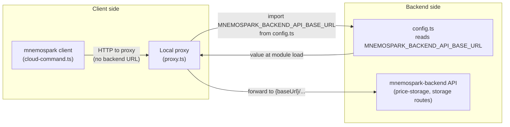

# How mnemospark client and proxy use MNEMOSPARK_BACKEND_API_BASE_URL

**Date:** 2026-03-16  
**Revision:** rev 1  
**Milestone:** e2e-staging-2026-03-16 (mnemospark & mnemospark-backend)  
**Repos / components:** mnemospark (client, proxy)

## 1. Single source: `config.ts`

The value is read **once at module load** in `src/config.ts`:

```ts
export const MNEMOSPARK_BACKEND_API_BASE_URL = (
  process.env.MNEMOSPARK_BACKEND_API_BASE_URL ?? ""
).trim();
```

So any process that loads this module (Node’s `process.env`) sees the same value for the rest of that process’s lifetime.

## 2. Proxy (the part that “knows” the backend URL)

The **proxy** is what actually talks to the backend. It imports that config and passes it into the “forward to backend” helpers:

- `src/proxy.ts` imports `MNEMOSPARK_BACKEND_API_BASE_URL` from `./config.js` and, in its route handlers, passes it as `backendBaseUrl` into:
  - `forwardPriceStorageToBackend`
  - `forwardStorageUploadToBackend`
  - and the storage forward functions in `cloud-storage.ts`

So the **proxy is aware** of `MNEMOSPARK_BACKEND_API_BASE_URL` only through this config import; it does not read `process.env` itself.

## 3. Client (slash commands / cloud flow)

The **client** (OpenClaw plugin and `/mnemospark_cloud` handlers) does **not** use the backend URL. It only calls the **local proxy**:

- `cloud-command.ts` uses `requestPriceStorageViaProxy`, `requestStorageLsViaProxy`, etc.
- Those “ViaProxy” helpers (in `cloud-price-storage.ts` and `cloud-storage.ts`) call:
  - `proxyBaseUrl` = `http://127.0.0.1:${PROXY_PORT}` (and `PROXY_PORT` comes from `config.js`).

So the client is only aware of:

- **PROXY_PORT** (and thus the local proxy URL) via `config.js`.
- It is **not** aware of `MNEMOSPARK_BACKEND_API_BASE_URL`; it never receives or uses that value.

## 4. Flow summary

| Component              | Reads env? | How it gets the backend URL                    |
|------------------------|-----------|-------------------------------------------------|
| **config.ts**          | Yes       | `process.env.MNEMOSPARK_BACKEND_API_BASE_URL`  |
| **Proxy**              | No        | Imports `MNEMOSPARK_BACKEND_API_BASE_URL` from config and passes it as `backendBaseUrl` to the forward functions |
| **Client (slash cmd)** | No        | Only talks to the proxy; never uses backend URL |

**Bottom line:** The **client** is not aware of `MNEMOSPARK_BACKEND_API_BASE_URL`. Only the **config** module reads it, and the **proxy** uses it when forwarding to the backend. Setting the env var in the environment where the OpenClaw gateway (and thus the proxy) runs is enough for the proxy to see it when `config.js` is first loaded.

### Diagram



## How to set it so it’s read at module load

The value is read once when `config.js` is first imported. It must be in the **process environment before** any code that loads the plugin (or CLI) runs.

- **Same shell (recommended):**  
  `export MNEMOSPARK_BACKEND_API_BASE_URL="https://your-api-id.execute-api.region.amazonaws.com/stage"`  
  then start the process in that shell (e.g. `openclaw start` or `mnemospark gateway start`).

- **Inline when starting:**  
  `MNEMOSPARK_BACKEND_API_BASE_URL="https://..." openclaw start`

- **From a file (no .env support in mnemospark itself):**  
  If you keep the URL in a file (e.g. `~/.mnemospark/env`), inject it into the environment when starting, e.g.:  
  `export $(grep -v '^#' ~/.mnemospark/env | xargs)` then start the process, or  
  `env $(grep -v '^#' .env | xargs) openclaw start`  
  (Never commit that file or put it under version control.)

- **Systemd / launchd:**  
  Use `Environment=MNEMOSPARK_BACKEND_API_BASE_URL=https://...` or `EnvironmentFile=/path/to/file` so the variable is set when the service process starts.

If you set the variable **after** the Node process has already loaded the mnemospark plugin, it’s too late: `config.js` has already run and cached the (then-empty) value. Restart the process after setting the env var.

### When the gateway runs under systemd

If you run `openclaw gateway start` and see “Restarted systemd service: openclaw-gateway.service”, the gateway process is **started by systemd**, not by your shell. Anything you `export` in that shell is never seen by the gateway. Use one of these so the variable is available when the service starts:

- **Option A — OpenClaw global `.env` (simplest)**  
  Create or edit `~/.openclaw/.env` and add a line:
  ```bash
  MNEMOSPARK_BACKEND_API_BASE_URL=https://wrlx6tq7vh.execute-api.us-east-1.amazonaws.com/staging
  ```
  OpenClaw loads this file when the gateway starts (it does not override already-set vars). Then restart the gateway:
  ```bash
  openclaw gateway start
  ```

- **Option B — OpenClaw config `env` block**  
  In `~/.openclaw/openclaw.json`, add (or merge into) an `env` block:
  ```json
  "env": {
    "MNEMOSPARK_BACKEND_API_BASE_URL": "https://wrlx6tq7vh.execute-api.us-east-1.amazonaws.com/staging"
  }
  ```
  Then restart: `openclaw gateway start`.

- **Option C — Systemd drop-in override**  
  So the service itself gets the var from systemd:
  ```bash
  sudo mkdir -p /etc/systemd/system/openclaw-gateway.service.d
  echo '[Service]
  Environment="MNEMOSPARK_BACKEND_API_BASE_URL=https://wrlx6tq7vh.execute-api.us-east-1.amazonaws.com/staging"' | sudo tee /etc/systemd/system/openclaw-gateway.service.d/mnemospark-backend.conf
  sudo systemctl daemon-reload
  openclaw gateway start
  ```

## Proxy Health check  
Run:
```
curl -s http://127.0.0.1:7120/health | jq .
```
When the backend URL is set you should see `backendConfigured: true`:
```
{
  "status": "ok",
  "wallet": "0xB261Ea2c20e11576C13D45D5Da431d2Ae0471C7e",
  "backendConfigured": true
}
```
If you see `backendConfigured: false`, the gateway process did not have `MNEMOSPARK_BACKEND_API_BASE_URL` in its environment at startup (e.g. you started via systemd but only set the var in your shell).

---

## Spec references

- This doc: `meta_docs/backend-api-base-url.md`  
  Raw URL: `https://raw.githubusercontent.com/pawlsclick/mnemospark-docs/refs/heads/main/meta_docs/backend-api-base-url.md`
- Troubleshooting price-storage: `meta_docs/troubleshoot-price-storage-flow.md`  
  Raw URL: `https://raw.githubusercontent.com/pawlsclick/mnemospark-docs/refs/heads/main/meta_docs/troubleshoot-price-storage-flow.md`
- Milestone overview: `meta_docs/e2e-staging-milestone-2026-03-16.md`  
  Raw URL: `https://raw.githubusercontent.com/pawlsclick/mnemospark-docs/refs/heads/main/meta_docs/e2e-staging-milestone-2026-03-16.md`
