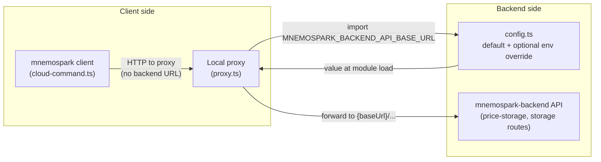

# How mnemospark client and proxy resolve the backend API base URL

**Date:** 2026-04-05  
**Revision:** rev 2  
**Milestone:** e2e-staging-2026-03-16 (mnemospark & mnemospark-backend); default production API from 2026.4.5  
**Repos / components:** mnemospark (client, proxy)

## Overview

The mnemospark **proxy** forwards storage and pricing calls to the mnemospark **backend**. The backend base URL comes from `src/config.ts`: it defaults to **`https://api.mnemospark.ai`**. Set environment variable **`MNEMOSPARK_BACKEND_API_BASE_URL`** only when you need to **override** that default (for example staging, a private API Gateway URL, or local testing).

## 1. Single source: `config.ts`

The value is read **once at module load** in `src/config.ts`:

```ts
const DEFAULT_BACKEND_API_BASE_URL = "https://api.mnemospark.ai";

export const MNEMOSPARK_BACKEND_API_BASE_URL = (
  process.env.MNEMOSPARK_BACKEND_API_BASE_URL ?? DEFAULT_BACKEND_API_BASE_URL
).trim();
```

Any process that loads this module sees the same URL for the rest of that process’s lifetime.

## 2. Proxy (the part that talks to the backend)

The **proxy** imports that config and passes it into the “forward to backend” helpers:

- `src/proxy.ts` imports `MNEMOSPARK_BACKEND_API_BASE_URL` from `./config.js` and passes it as `backendBaseUrl` into the forward functions for price-storage, upload, payment settlement, etc.

The proxy does not read `process.env` for this value itself; it only uses the exported constant.

## 3. Client (slash commands / cloud flow)

The **client** (OpenClaw plugin and `/mnemospark` handlers) does **not** use the backend URL directly. It calls the **local proxy** at `http://127.0.0.1:${PROXY_PORT}` (default port `7120` from config).

## 4. Flow summary

| Component              | Reads env? | How it gets the backend URL                                      |
| ---------------------- | ---------- | ------------------------------------------------------------------ |
| **config.ts**          | Yes        | `MNEMOSPARK_BACKEND_API_BASE_URL` **or** built-in production URL |
| **Proxy**              | No         | Imports `MNEMOSPARK_BACKEND_API_BASE_URL` from config              |
| **Client (slash cmd)** | No         | HTTP to local proxy only                                           |

**Bottom line:** Production installs normally need **no** env var. Set `MNEMOSPARK_BACKEND_API_BASE_URL` in the **gateway process environment** when you must override. The value is fixed at first import; restart the gateway after changing it.

### Diagram



## When to set `MNEMOSPARK_BACKEND_API_BASE_URL`

- **Production (default):** omit the variable; the plugin uses `https://api.mnemospark.ai`.
- **Override:** set the variable **before** any code loads mnemospark (same rules as before: process env at startup).

Examples (override only):

```bash
export MNEMOSPARK_BACKEND_API_BASE_URL="https://your-api-id.execute-api.region.amazonaws.com/stage"
# then start the gateway / CLI in that shell
```

**Systemd / launchd:** use `Environment=` or `EnvironmentFile=` so the override is present when the service starts.

### When the gateway runs under systemd

If the gateway is started by **systemd**, shell `export` is not visible to that process. For an **override**, use one of:

- **`~/.openclaw/.env`** (OpenClaw loads it for the gateway).
- **`openclaw.json` `env` block** with `MNEMOSPARK_BACKEND_API_BASE_URL`.
- **Systemd drop-in** `Environment=...`.

You do **not** need these for production unless you are **not** using the default `https://api.mnemospark.ai`.

## Proxy health check

```bash
curl -s http://127.0.0.1:7120/health | jq .
```

With the built-in default (or a non-empty override), expect **`backendConfigured: true`**.

If you see **`backendConfigured: false`**, the loaded config resolved to an **empty** string (for example `MNEMOSPARK_BACKEND_API_BASE_URL=` explicitly cleared). That is unusual with current defaults; restart with a valid override or unset the variable to use production.

---

## Spec references

- This doc: `meta_docs/backend-api-base-url.md`  
  Raw URL: `https://raw.githubusercontent.com/pawlsclick/mnemospark-docs/refs/heads/main/meta_docs/backend-api-base-url.md`
- Troubleshooting price-storage: `meta_docs/troubleshoot-price-storage-flow.md`  
  Raw URL: `https://raw.githubusercontent.com/pawlsclick/mnemospark-docs/refs/heads/main/meta_docs/troubleshoot-price-storage-flow.md`
- Milestone overview: `meta_docs/e2e-staging-milestone-2026-03-16.md`  
  Raw URL: `https://raw.githubusercontent.com/pawlsclick/mnemospark-docs/refs/heads/main/meta_docs/e2e-staging-milestone-2026-03-16.md`
- Release ops: `ops/release-planning-and-ops.md`  
  Raw URL: `https://raw.githubusercontent.com/pawlsclick/mnemospark-docs/refs/heads/main/ops/release-planning-and-ops.md`
