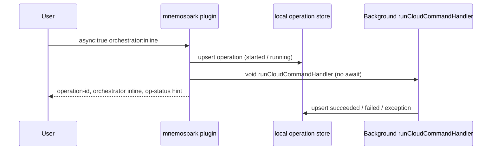
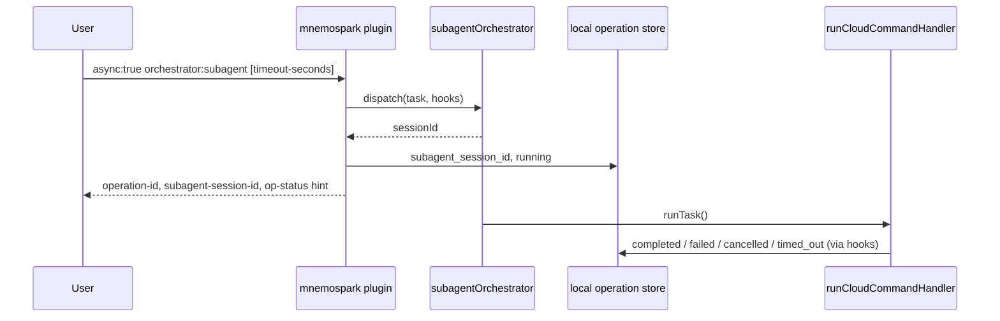

# Cloud async orchestrator modes (`inline` vs `subagent`)

**Date:** 2026-04-03  
**Revision:** rev 1  
**Milestone:** cross-cutting (mnemospark cloud async)  
**Repos / components:** mnemospark (`src/cloud-command.ts` — `createCloudCommand`, async paths for `backup`, `upload`, `download`)

This document explains how **`orchestrator:inline`** and **`orchestrator:subagent`** differ when you run **`async:true`** on supported cloud subcommands. Both modes run the real work in the background and record an **operation-id** for `/mnemospark cloud op-status`; they are not about upload payload “inline” vs presigned (that is a separate `inline` / `presigned` upload encoding in the same file).

---

## Overview

| | `orchestrator:inline` (default) | `orchestrator:subagent` |
|---|---|---|
| **When to use** | Default async: fire-and-forget run with operation tracking | Session-style async: progress hooks, optional timeout, cancellable via `op-status` |
| **`timeout-seconds:`** | Not supported | Supported (`async:true` + `orchestrator:subagent`) |
| **`op-status` cancel** | Not supported | Supported (uses `subagent-session-id`) |
| **Immediate reply** | `orchestrator: inline` + `operation-id` | `orchestrator: subagent` + `operation-id` + `subagent-session-id` |
| **Datastore** | `orchestrator` = `inline`, no `subagent_session_id` | `orchestrator` = `subagent`, `subagent_session_id` set |

Both require **`async:true`**. The **`orchestrator:`** and **`timeout-seconds:`** flags are rejected unless async is enabled.

---

## Command overview

Chat-style flags (slash command):

- `async:true`
- `orchestrator:inline` or `orchestrator:subagent` (default if omitted: **`inline`**)
- `timeout-seconds:<n>` — only with **`async:true`** and **`orchestrator:subagent`**

Applies to async **`backup`**, **`upload`**, and **`download`** (see built-in help strings in `cloud-command.ts`).

---

## `orchestrator:inline`

- After validation, the handler records the operation and immediately returns a short message that includes **`operation-id`** and **`orchestrator: inline`**.
- The actual command body runs in the background via **`void runCloudCommandHandler(...)`** (promise chain: success updates operation to `succeeded` / `failed`, catch → `ASYNC_EXCEPTION`).
- There is **no** subagent session identifier, **no** per-operation timeout in the orchestrator layer, and **`/mnemospark cloud op-status ... cancel:true`** cannot cancel an inline run (cancellation is only implemented for subagent-orchestrated operations).

---

## `orchestrator:subagent`

- The plugin uses **`subagentOrchestrator.dispatch(...)`** (default: in-process implementation from **`createInProcessSubagentOrchestrator()`** unless tests or callers inject another implementation).
- Dispatch creates a **`subagent-session-id`** (form `agent:mnemospark:subagent:<uuid>`), optionally arms a **timeout** when `timeout-seconds` is set, and runs the same logical work by calling **`runCloudCommandHandler`** with forced operation/trace correlation inside the subagent task path.
- Lifecycle hooks update the local operation store and emit **`operation.progress`**, **`operation.completed`**, **`operation.cancelled`**, **`operation.timed_out`** as appropriate.
- The immediate reply includes **`subagent-session-id`** and points you at **`op-status`** for monitoring; **`op-status`** with **cancel** targets this session.

Subagent payload shape uses schema **`mnemospark.subagent-task.v1`** (operation id, trace id, command, stripped args, timeout, `requestedBy` with plugin command / chat / sender).

---

## Step-by-step (conceptual)

### Client (mnemospark)

1. Parse flags; require **`async:true`** if **`orchestrator:`** or **`timeout-seconds:`** present; **`timeout-seconds`** only valid with **`orchestrator:subagent`**.
2. Create **operation-id** / **trace-id**, **`operation.dispatched`** event, initial operation row (`status: started`).
3. **If `subagent`:** build **`MnemosparkSubagentTaskV1`**, call **`dispatch`**, persist **`subagent_session_id`**, return background message with session id and optional timeout line.  
   **If `inline`:** set **`running`**, **`void`** the handler, return background message without session id.

### Proxy / backend

- Unchanged by orchestrator mode: async only affects **how the client schedules** the same backup/upload/download logic; HTTP calls to the proxy and backend are the same once **`runCloudCommandHandler`** executes.

---

## Sequence diagrams

### Inline async

### Subagent async

---

## Files used across the path

| Area | Location |
|---|---|
| Flag parsing / defaults | `mnemospark/src/cloud-command.ts` — `parseAsyncControlFlags`, `ORCHESTRATOR_MODES` |
| Async branch | Same file — `runCloudCommandHandler`, block starting when `parsed.async` for `backup` / `upload` / `download` |
| In-process subagent | `createInProcessSubagentOrchestrator()` in `cloud-command.ts` |
| Cancel path | `op-status` + `cancel` when `orchestrator === "subagent"` and `subagent_session_id` present |

---

## Logging

- Operation lifecycle events are appended best-effort to **`events.jsonl`** under the mnemospark home directory (see `emitOperationEventBestEffort` / `operation.*` event types).
- Subagent runs additionally emit progress lines with **`subagent-session-id`** and optional timeout metadata.

---

## Success

- **Inline:** user gets an **operation-id** immediately; completion is reflected when **`op-status`** shows terminal status (or via events).
- **Subagent:** same, plus **subagent-session-id** for cancellation and timeout handling; **`timeout-seconds`** caps wait in the orchestrator layer.

---

## Failure scenarios

- Invalid flag combinations → immediate error (e.g. **`timeout-seconds`** without **`subagent`**).
- **Subagent dispatch** failure → operation marked **`ASYNC_DISPATCH_FAILED`**.
- **Cancel** requested for non-subagent operation → error: cancellation only for subagent-orchestrated operations.

---

## Spec references

- This doc: `meta_docs/cloud-async-orchestrator-modes.md`  
  Raw URL: `https://raw.githubusercontent.com/pawlsclick/mnemospark-docs/refs/heads/main/meta_docs/cloud-async-orchestrator-modes.md`
- Related process specs (same async commands, different focus): `cloud-upload-process-flow.md`, `cloud-download-process-flow.md`, `cloud-backup-process-flow.md` (if present).
- Milestone overview when validating full paths: `e2e-staging-milestone-2026-03-16.md`
