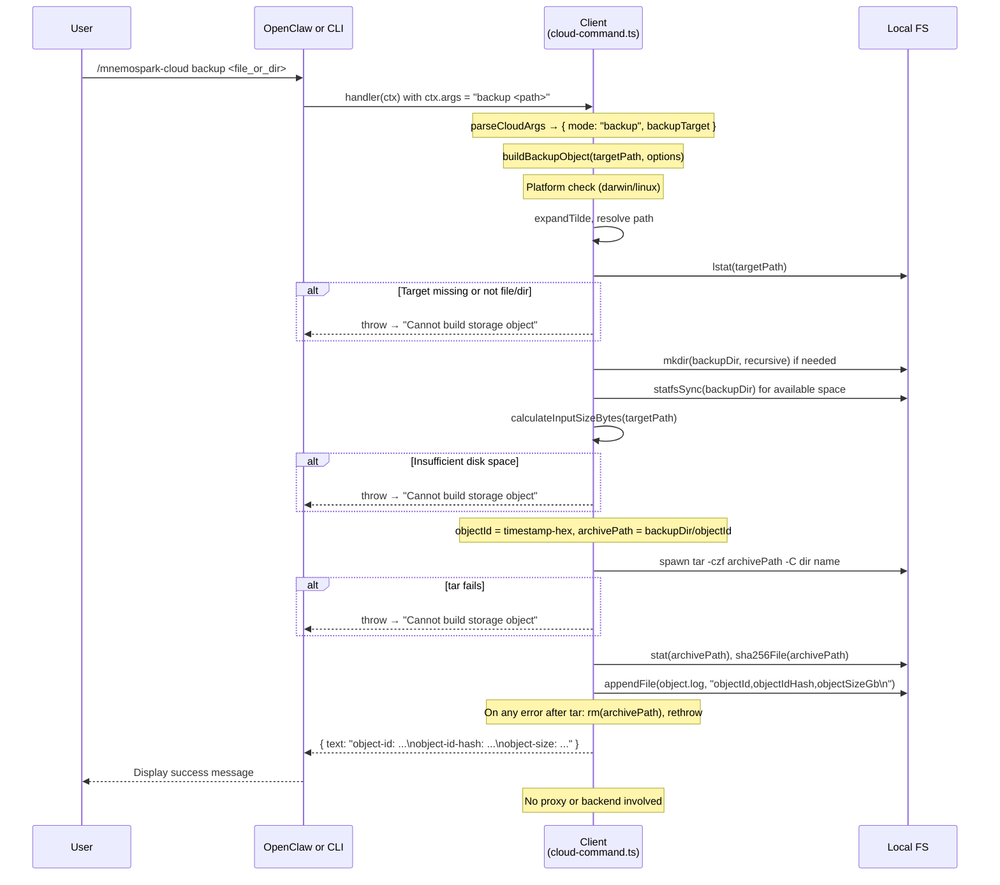

# Cloud Backup Process Flow

End-to-end documentation of the `/mnemospark-cloud backup` command, covering the client (OpenClaw plugin and CLI). **The proxy and backend are not involved** — backup is performed entirely on the client machine (local tar+gzip and filesystem writes).

**Goal**: Create a compressed archive of a file or directory, store it under `~/.openclaw/mnemospark/backup`, and append object metadata to `object.log` for use by later `/mnemospark-cloud price-storage` and `/mnemospark-cloud upload` steps.

---

## 1. Command Overview

```
/mnemospark-cloud backup <file>
/mnemospark-cloud backup <directory>
```

The argument may be a path to a **file** or **directory** on the local filesystem. Paths with spaces may be quoted (e.g. `backup "/path/with spaces"`). A leading `~` is expanded to the user's home directory.

### Required Parameters

| Argument | Description |
|----------|-------------|
| `<file>` or `<directory>` | Path to the file or directory to back up. Required; if missing (e.g. user runs `/mnemospark-cloud backup` with nothing after), the client treats it as an unknown subcommand and shows help with `isError: true`. |

No `--wallet-address` or other flags are required for backup.

### Prerequisites

- **Platform**: Backup is supported only on **macOS** (`darwin`) and **Linux**. On Windows, the handler throws `UnsupportedBackupPlatformError` and the user sees "Cloud backup is only supported on macOS and Linux."
- **Target path**: The path must exist and resolve to a file or directory (after `~` expansion). The code uses `lstat()`; the target must be a regular file or directory.
- **Disk space**: The backup directory (default `~/.openclaw/mnemospark/backup`) must have at least **input size + 10 MiB** (`TAR_OVERHEAD_BYTES`) free. If not, the client throws "Insufficient disk space for backup object."
- No wallet, proxy, or backend is required.

---

## 2. Step-by-Step Flow

### 2.1 Client (mnemospark)

**Entry point**: The cloud command handler in `createCloudCommand()` in `src/cloud-command.ts` (line 1176). For backup, the handler calls `backupBuilder(parsed.backupTarget, options.backupOptions)`, which defaults to `buildBackupObject()` (line 442).

#### Step 1 — Argument Parsing

`parseCloudArgs(ctx.args)` (line 241):

- Expects the first token to be `backup` and the rest to be the target path (after stripping surrounding quotes).
- If `subcommand === "backup"` and `rest` (after `stripWrappingQuotes`) is non-empty → returns `{ mode: "backup", backupTarget: string }`.
- If `backup` is followed by nothing or only whitespace → `backupTarget` is empty and the parser returns `{ mode: "unknown" }` (user then sees help with `isError: true`).

#### Step 2 — Platform Check

`buildBackupObject(targetPathArg, options)` (line 442):

- Reads `platform` from `options.platform ?? process.platform`.
- If platform is not `darwin` or `linux` (see `SUPPORTED_BACKUP_PLATFORMS`), throws `UnsupportedBackupPlatformError(platform)`.
- Handler maps this to: `{ text: "Cloud backup is only supported on macOS and Linux.", isError: true }`.

#### Step 3 — Resolve and Validate Target Path

- **Expand and resolve**: `targetPath = resolve(expandTilde(targetPathArg))`. `expandTilde()` expands a leading `~` to `homedir()`.
- **Stat target**: `lstat(targetPath)`. If the target is neither a file nor a directory (e.g. missing, symlink, or block device), throws `Error("Backup target must be a file or directory")`. Directory recursion uses `readdir` and `lstat` on entries.

#### Step 4 — Backup Directory

- **Path**: `tmpDir = options.tmpDir ?? DEFAULT_BACKUP_DIR` → default `~/.openclaw/mnemospark/backup`.
- **Create if missing**: `mkdir(tmpDir, { recursive: true })` if the directory does not exist.
- **Validate**: `stat(tmpDir)` must show a directory; otherwise throws `Error("Backup path is not a directory")`.

#### Step 5 — Disk Space Check

- **Input size**: `calculateInputSizeBytes(targetPath)` — for a file (or symlink to file), returns file size; for a directory, recursively sums sizes of all files (symlinks to files count as their target size).
- **Available space**: `getAvailableDiskBytes(tmpDir, options)` — uses `statfsSync(tmpDir)` (or `options.availableDiskBytes` if provided for tests).
- **Required**: `requiredDiskBytes = inputSizeBytes + TAR_OVERHEAD_BYTES` (10 MiB).
- If `availableDiskBytes < requiredDiskBytes`, throws `Error("Insufficient disk space for backup object")`.

#### Step 6 — Object ID and Archive Path

- **Object ID**: `createObjectId(options)` produces `${Date.now()}-${randomBytes(8).toString('hex')}` (e.g. `1739123456789-a1b2c3d4e5f60708`).
- **Archive path**: `archivePath = join(tmpDir, objectId)`. The archive file is named by the object ID (no `.tar.gz` suffix in the path; the content is gzip-compressed tar).

#### Step 7 — Create Archive (tar + gzip)

- **Command**: `runTarGzip(archivePath, targetPath)` spawns: `tar -czf <archivePath> -C <sourceDir> <sourceName>`.
  - `sourceDir` = `dirname(targetPath)`, `sourceName` = `basename(targetPath)` so that the archive contains a single top-level entry (file or directory).
- **Errors**: If `tar` exits non-zero, the promise rejects with the stderr string or a generic message. The handler does not interpret tar errors specially; any throw from `buildBackupObject` is mapped to `{ text: "Cannot build storage object", isError: true }` (except `UnsupportedBackupPlatformError`).

#### Step 8 — Hash and Size

- **Archive stat**: `stat(archivePath)` to get compressed size.
- **SHA-256**: `sha256File(archivePath)` streams the file and returns the hex digest (`objectIdHash`).
- **Size in GB**: `objectSizeGb = toGbString(archiveStats.size)` — size in bytes converted to a decimal string in GB (e.g. `"0.000403116"`).

#### Step 9 — Append to object.log

- **Line**: A single CSV line: `objectId,objectIdHash,objectSizeGb` (no timestamp; backup rows have this three-column format).
- **Write**: `appendObjectLogLine(line, options.homeDir)` (line 488):
  - Resolves path: `join(homeDir ?? homedir(), OBJECT_LOG_SUBPATH)` → `~/.openclaw/mnemospark/object.log`.
  - Ensures parent directory exists with `mkdir(dirname(objectLogPath), { recursive: true })`.
  - Appends `${line}\n` in UTF-8.

#### Step 10 — Cleanup on Error

- If any step after creating the archive file fails (e.g. hashing, appending to object.log), `buildBackupObject` runs `rm(archivePath, { force: true })` (ignoring errors) and rethrows. So the user never gets a half-written log line without a corresponding archive, or vice versa.

#### Step 11 — Return to User

- **Success**: Handler returns:
  - `text`: Three lines: `object-id: <objectId>`, `object-id-hash: <objectIdHash>`, `object-size: <objectSizeGb>`.
  - No `isError` (falsy).
- **Failure**: As above — platform → "Cloud backup is only supported on macOS and Linux."; any other throw → "Cannot build storage object"; both with `isError: true`.

---

### 2.2 Local Proxy (mnemospark)

**Not used.** Backup does not send any request to the proxy. The proxy has no `/mnemospark/backup` route.

---

### 2.3 Backend (mnemospark-backend)

**Not used.** No Lambda, API Gateway, or DynamoDB is involved. Backup is entirely local.

---

## 3. Files Used Across the Path

### Client only (mnemospark repo)

| File | Role |
|------|------|
| `src/index.ts` | Plugin entrypoint; registers the `/mnemospark-cloud` command (which includes the backup subcommand). |
| `src/cloud-command.ts` | `parseCloudArgs()` parses `backup <target>`; `buildBackupObject()` implements platform check, path resolution, disk check, `tar -czf`, SHA-256, and `appendObjectLogLine()`. Defines `BACKUP_DIR_SUBPATH`, `DEFAULT_BACKUP_DIR`, `OBJECT_LOG_SUBPATH`, `TAR_OVERHEAD_BYTES`, `SUPPORTED_BACKUP_PLATFORMS`, `expandTilde`, `calculateInputSizeBytes`, `getAvailableDiskBytes`, `runTarGzip`, `sha256File`, `createObjectId`, `toGbString`, `appendObjectLogLine`, `UnsupportedBackupPlatformError`. |
| `src/types.ts` | OpenClaw plugin types. |
| `src/cli.ts` | CLI: for `mnemospark cloud backup <path>`, passes `cloudArgs` into the same `createCloudCommand().handler(ctx)`. |

### Local Proxy (mnemospark repo)

Not used for backup.

### Backend (mnemospark-backend repo)

Not used for backup.

### Local filesystem (user machine)

| Path | Role |
|------|------|
| `<targetPath>` | User-supplied file or directory to back up (read-only). |
| `~/.openclaw/mnemospark/backup/` | Default backup directory; created if missing. Archive is written as `~/.openclaw/mnemospark/backup/<objectId>`. |
| `~/.openclaw/mnemospark/object.log` | Append-only log; one new line per backup: `objectId,objectIdHash,objectSizeGb`. |

---

## 4. Logging

### Client plugin

- The backup handler in `src/cloud-command.ts` does **not** call `api.logger` or any other logger. Success and failure are communicated only via the return value `{ text, isError }`.
- If the plugin failed to register the `/mnemospark-cloud` command at load time, `api.logger.warn` would have been called once in `src/index.ts`; that is unrelated to a single backup run.

### Local proxy

Not involved.

### Backend

Not involved.

---

## 5. Success

### What the user sees

Three lines of text:

```
object-id: <objectId>
object-id-hash: <objectIdHash>
object-size: <objectSizeGb>
```

Example: `object-id: 1739123456789-a1b2c3d4e5f60708`, `object-id-hash: f2ccd28f...`, `object-size: 0.000403116`.

### What gets written

1. **Archive file**: `~/.openclaw/mnemospark/backup/<objectId>` — gzip-compressed tar of the target file or directory. The filename has no extension; content is tar+gzip.
2. **object.log**: One new line appended: `objectId,objectIdHash,objectSizeGb`. Other row types in the same file (price-storage, upload, cron) use different CSV formats; backup rows are identified by having exactly three columns and no timestamp in the first field (numeric-style objectId).

### Backend side effects

None. Backup does not call the backend.

---

## 6. Failure Scenarios

### Client-side only

| Condition | Result | `isError` |
|-----------|--------|-----------|
| Platform is not `darwin` or `linux` | `"Cloud backup is only supported on macOS and Linux."` | true |
| Missing backup target (e.g. `/mnemospark-cloud backup` with nothing after) | Treated as unknown subcommand; help text is shown | true |
| Target path does not exist or is not file/directory | `buildBackupObject` throws; handler returns `"Cannot build storage object"` | true |
| Backup directory not a directory (e.g. file in the way) | Throw → `"Cannot build storage object"` | true |
| Insufficient disk space in backup dir | Throw `"Insufficient disk space for backup object"` → handler returns `"Cannot build storage object"` | true |
| `tar` fails (e.g. permission, I/O) | Throw from `runTarGzip` → `"Cannot build storage object"` | true |
| Any other error in `buildBackupObject` (e.g. hashing, writing object.log) | Partial archive is removed; handler returns `"Cannot build storage object"` | true |

There are no proxy or backend failure modes for backup.

---

## 7. What the Command Returns

- **Return type**: The handler returns an object `{ text: string; isError?: boolean }`.

- **Success**:
  - `text`: Three lines: `object-id: <objectId>`, `object-id-hash: <objectIdHash>`, `object-size: <objectSizeGb>`.
  - `isError`: not set or false.

- **Failure**:
  - Platform: `text: "Cloud backup is only supported on macOS and Linux."`, `isError: true`.
  - Any other error: `text: "Cannot build storage object"`, `isError: true`.

- **Parameters**: One required argument — the backup target `<file>` or `<directory>`. No flags. The target may be quoted if it contains spaces; a leading `~` is expanded.

---

## 8. Sequence Diagram



---

## 9. Recommended Code Changes

Discrepancies or improvements identified while documenting the backup flow:

| # | Change | Repo | Severity | Description |
|---|--------|------|----------|-------------|
| 9.1 | Use canonical command name in upload error messages | **mnemospark** | Low | ✅ Implemented. `src/cloud-command.ts` now uses canonical slash-command names in those upload guidance strings (e.g. "Run /mnemospark-cloud backup first."). |
| 9.2 | Optional: Log backup success/failure | **mnemospark** | Low | The backup handler does not log. Adding an optional debug or info log when a backup succeeds (objectId, path) or fails (reason) would align with other flows and help support. Not required for correctness. |
| 9.3 | Backup object.log row format and parsing | **mnemospark** | Low | Backup appends a three-column row `objectId,objectIdHash,objectSizeGb` with no timestamp. Downstream parsers (e.g. for price-storage or upload) that read object.log must be able to distinguish backup rows from price-storage and upload rows (which use different column layouts). If the format is ever extended (e.g. add a type prefix or timestamp), ensure all readers are updated. No change required if the current contract is intentional and stable. |

No changes are recommended for **mnemospark-backend** for the backup flow; the backend is not involved.
