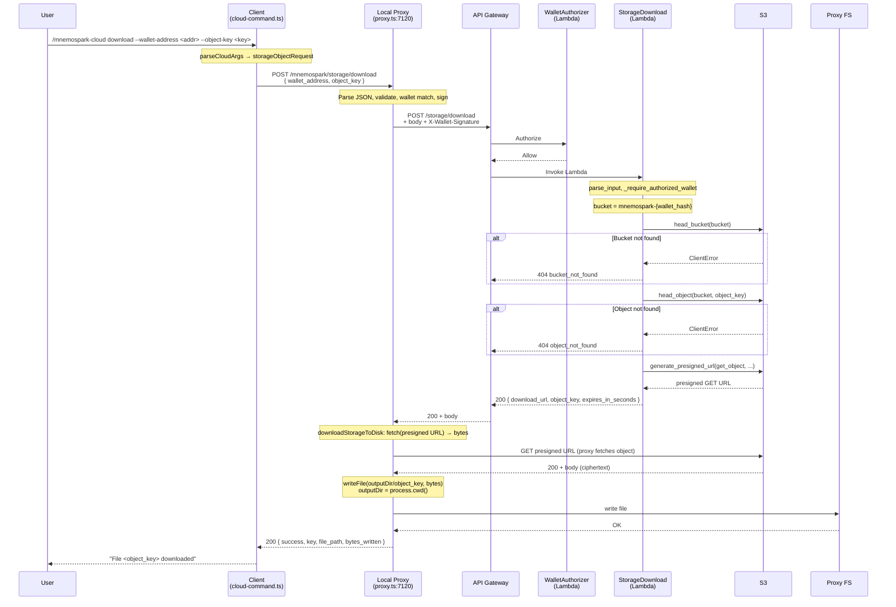

# Cloud Download Process Flow

End-to-end documentation of the `/mnemospark-cloud download` command, covering the client, local proxy, and AWS backend.

**Goal**: Download the object from S3 storage to the local host so that the file can be used. The backend returns a short-lived presigned S3 GET URL; the **proxy** fetches the object from that URL and writes it to disk, then returns the file path and metadata to the client. The client displays success but does not receive or show the file path in the current implementation.

---

## 1. Command Overview

```
/mnemospark-cloud download --wallet-address <addr> --object-key <object-key>
```

### Required Parameters

| Flag | Description |
|------|-------------|
| `--wallet-address` | EVM wallet address (0x-prefixed). Must match the proxy's wallet; the backend generates a presigned URL for that wallet's S3 bucket. |
| `--object-key` | The S3 object key (returned from upload or from object.log). Must be a **single path segment** (no `/` or `\`) per backend validation. |

Optional: `--location` or `--region` (AWS region for the S3 bucket).

### Prerequisites

1. The object must already exist in the wallet's S3 bucket (from a prior upload).
2. Local proxy running on `127.0.0.1:7120` with a wallet key (proxy signs the request and writes the file to disk).
3. `MNEMOSPARK_BACKEND_API_BASE_URL` set so the proxy can forward to the backend.

---

## 2. Step-by-Step Flow

### 2.1 Client (mnemospark)

**Entry point**: Cloud command handler in `createCloudCommand()` in `src/cloud-command.ts`. For `download`, the handler calls `requestStorageDownload(parsed.storageObjectRequest, options.proxyStorageOptions)` and then formats the result.

#### Step 1 — Argument Parsing

`parseCloudArgs(ctx.args)` (line 241):

- Expects the first token to be `download` and the rest to be `--key value` pairs.
- `parseStorageObjectRequest()` validates: `wallet_address` and `object_key` required; optional `location` / `region`.
- If valid → `{ mode: "download", storageObjectRequest }`. If invalid → `{ mode: "download-invalid" }`; handler returns `"Cannot download file: required arguments are --wallet-address, --object-key."` with `isError: true`.

#### Step 2 — Request to Proxy

`requestStorageDownloadViaProxy(request, options)` in `src/cloud-storage.ts` (line 315):

- Uses `requestJsonViaProxy(STORAGE_DOWNLOAD_PROXY_PATH, request, parseStorageDownloadProxyResponse, options)`.
- **URL**: `POST {proxyBaseUrl}/mnemospark/storage/download` (default `http://127.0.0.1:7120/mnemospark/storage/download`).
- **Headers**: `Content-Type: application/json`.
- **Body**: JSON `{ wallet_address, object_key, location? }`.

#### Step 3 — Response Handling

- The proxy performs the backend call and **writes the file to disk** on the proxy host. It then returns **200** with JSON: `{ success: true, key, file_path, bytes_written }`.
- If the proxy returns non-OK (e.g. 400, 403, 404, 502), the client throws; the handler catches and returns `{ text: "Cannot download file", isError: true }` (no backend or proxy detail in the message).
- `parseStorageDownloadProxyResponse` expects `key`, `file_path`, and treats `success` as optional (defaults true). If `downloadResult.success === false`, the handler throws and returns "Cannot download file".

#### Step 4 — Success Message

- Handler returns `{ text: "File <object_key> downloaded" }`. The **file path** returned by the proxy is **not** included in this message, so the user does not see where the file was saved.

---

### 2.2 Local Proxy (mnemospark)

**Entry point**: `src/proxy.ts`, route for `POST` and path matching `STORAGE_DOWNLOAD_PROXY_PATH` (`/mnemospark/storage/download`) at line 527.

#### Step 1 — Read and Parse Body

- `readProxyJsonBody(req)` parses JSON. On failure, proxy responds **400** with `"Invalid JSON body for /mnemospark cloud download"`.
- `parseStorageObjectRequest(payload)` validates `wallet_address` and `object_key`. If `null`, proxy responds **400** with `"Missing required fields: wallet_address, object_key"`.

#### Step 2 — Wallet Match and Signature

- Same as ls: compare request `wallet_address` to proxy wallet (403 if mismatch); create `X-Wallet-Signature` for the backend (400 if no wallet key).

#### Step 3 — Forward to Backend

- `forwardStorageDownloadToBackend(requestPayload, { backendBaseUrl, walletSignature })`:
  - **URL**: `POST {MNEMOSPARK_BACKEND_API_BASE_URL}/storage/download`.
  - **Headers**: `Content-Type: application/json`, `X-Wallet-Signature`.
  - **Body**: Same JSON (`wallet_address`, `object_key`, `location`).
- Backend returns **200** with JSON `{ download_url, object_key, expires_in_seconds }` (presigned S3 GET URL). On non-2xx, proxy forwards that status and body to the client and does **not** write a file.

#### Step 4 — Write File to Disk (on 2xx)

- If `backendResponse.status` is 2xx, the proxy calls `downloadStorageToDisk(requestPayload, backendResponse)` (no `outputDir` is passed).
- **downloadStorageToDisk** (in `src/cloud-storage.ts`):
  - **outputDir**: `options.outputDir ?? process.cwd()` → so the file is written to the **proxy process’s current working directory** (e.g. the gateway’s cwd when it was started).
  - Backend body is JSON with `download_url`. The function parses it, then **fetches** the presigned URL with `fetch(downloadUrl)` to get the raw bytes (the S3 object content).
  - Writes the bytes to `resolveDownloadPath(outputDir, objectKey)` (object key is sanitized to a relative path; path traversal is blocked). Creates parent directories with `mkdir(..., { recursive: true })`.
- So the **proxy** downloads the object from S3 via the presigned URL and writes it to a path under `process.cwd()`. The object stored in S3 is the **encrypted** payload from upload (client-side AES-256-GCM); the proxy does **not** decrypt, so the file on disk is the same ciphertext.

#### Step 5 — Respond to Client

- Proxy responds **200** with `{ success: true, key: downloadResult.key, file_path: downloadResult.filePath, bytes_written: downloadResult.bytesWritten }`. The client parses this but does not show `file_path` to the user.

---

### 2.3 Backend (mnemospark-backend)

**Entry point**: Storage download Lambda, handler in `services/storage-download/app.py`. **Route**: `GET` or `POST` `/storage/download`. The client path uses POST with a JSON body.

#### Step 1 — Input Parsing

`parse_input(event)` (line 204):

- Collects params from query and/or body. Requires: `wallet_address` (0x, 20-byte hex), `object_key` (single path segment). Optional: `location`/`region` (default `AWS_REGION` or `us-east-1`), `expires_in_seconds` (default 300, max 3600).
- `_validate_object_key(object_key)` enforces a single segment. On failure, **400**.

#### Step 2 — Authorizer

- `_require_authorized_wallet(event, request.wallet_address)`: wallet required; if missing or not matching, **403 forbidden**.

#### Step 3 — Bucket and Object Existence

- **Bucket**: `_bucket_name(wallet_address)` → `mnemospark-{wallet_hash}`.
- **head_bucket**: If bucket does not exist or access denied, **404** `bucket_not_found`.
- **head_object**: If object does not exist or access denied, **404** `object_not_found`.

#### Step 4 — Presigned URL

- `s3_client.generate_presigned_url("get_object", Params={"Bucket": bucket_name, "Key": request.object_key}, ExpiresIn=request.expires_in_seconds, HttpMethod="GET")`.
- Returns **200** with JSON: `{ "download_url": "<presigned-url>", "object_key": "<key>", "expires_in_seconds": <ttl> }`. The backend does **not** stream or decrypt the object; the presigned URL points at the raw S3 object (which is the encrypted blob stored at upload).

---

## 3. Files Used Across the Path

### Client and Proxy (mnemospark repo)

| File | Role |
|------|------|
| `src/index.ts` | Registers the `/mnemospark-cloud` command. |
| `src/cloud-command.ts` | Parses `download` args; calls `requestStorageDownload`; handles success / failure; success message "File <object_key> downloaded" (no file path). |
| `src/cloud-storage.ts` | `StorageObjectRequest`, `StorageDownloadProxyResponse`; `parseStorageObjectRequest`, `parseStorageDownloadProxyResponse`; `requestStorageDownloadViaProxy`; `forwardStorageDownloadToBackend`; `downloadStorageToDisk` (presigned fetch + write to `outputDir`/object key path); `resolveDownloadPath`, `sanitizeObjectKeyToRelativePath`; `STORAGE_DOWNLOAD_PROXY_PATH`. |
| `src/proxy.ts` | POST `/mnemospark/storage/download`: read body, parse, wallet match, signature, forward to backend; on 2xx, `downloadStorageToDisk(..., backendResponse)` then 200 with `success`, `key`, `file_path`, `bytes_written`. |
| `src/config.ts` | `PROXY_PORT`. |
| `src/mnemospark-request-sign.ts` | Proxy creates `X-Wallet-Signature` for backend. |
| `src/cloud-utils.ts` | `normalizeBaseUrl`, `asRecord`, etc. |

### Backend (mnemospark-backend repo)

| File | Role |
|------|------|
| `services/storage-download/app.py` | Lambda: `parse_input`, `_require_authorized_wallet`, `head_bucket`, `head_object`, `generate_presigned_url("get_object", ...)`; returns 200 with `download_url`, `object_key`, `expires_in_seconds`. |
| `template.yaml` | Storage download function, GET/POST `/storage/download`, Auth. |
| `services/wallet-authorizer/app.py` | Authorizer for `/storage/download` (wallet required). |

### Local Filesystem

- **Proxy host**: The file is written under `process.cwd()` (proxy’s current working directory) at a path derived from `object_key`. No `outputDir` is passed from the proxy, so the location is not configurable in the current flow.

---

## 4. Logging

### Client (mnemospark)

- The download handler does not call `api.logger`. On failure it returns "Cannot download file" with no proxy/backend detail.

### Proxy (mnemospark)

- No dedicated log for download success or failure. Generic stream error logging only.

### Backend (mnemospark-backend)

- `services/storage-download/app.py` has no structured logging. Exceptions become 4xx/5xx responses; Lambda stdout goes to CloudWatch.

---

## 5. Success

### What the user sees

- One line: **"File &lt;object_key&gt; downloaded"**. The **path** where the file was saved is **not** shown.

### What gets written

- **Proxy host**: One file written by the proxy under `process.cwd()` at a path derived from the object key (e.g. `<cwd>/<object_key>`). The content is the **S3 object as stored** (the encrypted payload from upload; no decryption is performed).

### Backend side effects

- None. The Lambda only reads (head_bucket, head_object) and returns a presigned URL; no DynamoDB or S3 writes.

---

## 6. Failure Scenarios

### Client-side

| Condition | Result | `isError` |
|-----------|--------|-----------|
| Missing/invalid args | "Cannot download file: required arguments are ..." | true |
| Proxy non-OK or parse error | "Cannot download file" (no detail) | true |
| Response has `success === false` | "Cannot download file" | true |

### Proxy-side

| Status | Condition |
|--------|-----------|
| 400 | Invalid JSON; missing fields; or wallet signature could not be created. |
| 403 | Request wallet does not match proxy wallet. |
| 502 | Backend URL not set, no wallet key, or error during forward or during `downloadStorageToDisk` (e.g. presigned fetch failed, write failed). |
| 4xx/5xx from backend | Proxy forwards the same status and body to the client (no file written). |

### Backend-side

| Status | Condition |
|--------|-----------|
| 400 | Bad request (e.g. invalid wallet_address or object_key). |
| 403 | Forbidden (authorizer wallet missing or mismatch). |
| 404 | Bucket or object not found. |
| 500 | Unhandled exception. |

---

## 7. What the Command Returns

- **Success**: `{ text: "File <object_key> downloaded" }`. The proxy also returns `file_path` and `bytes_written` in the JSON response, but the client does not surface them to the user.
- **Failure**: `{ text: "Cannot download file", isError: true }`. No proxy or backend detail in the message.
- **Parameters**: Required `--wallet-address` and `--object-key`. Optional `--location`/`--region`. Used to resolve the wallet bucket and the S3 key for the presigned URL.

---

## 8. Sequence Diagram



---

## 9. Recommended Code Changes

Discrepancies or improvements relative to the **goal** (download the object from S3 to the local host so the file can be used) and general quality:

| # | Change | Repo | Severity | Description |
|---|--------|------|----------|-------------|
| 9.1 | Use canonical command name in proxy messages | **mnemospark** | Low | Proxy error strings say "Invalid JSON body for /mnemospark cloud download" and "Failed to forward /mnemospark cloud download". Use `/mnemospark-cloud download` for consistency. |
| 9.2 | Configurable download output directory | **mnemospark** | Medium | The proxy calls `downloadStorageToDisk(requestPayload, backendResponse)` with no third argument, so `outputDir` is `process.cwd()` (gateway’s cwd). The file may end up in an unexpected or non-user-visible directory. Recommend: support a configurable download directory (e.g. `MNEMOSPARK_DOWNLOAD_DIR` or `~/.openclaw/mnemospark/downloads`) and pass it as `outputDir` so the user can find the file. |
| 9.3 | Show file path in success message | **mnemospark** | Medium | The proxy returns `file_path` in the JSON; the client does not include it in the success message. For "so that the file can be used", the user needs to know where the file is. Recommend: include the returned `file_path` in the client success message (e.g. "File &lt;object_key&gt; downloaded to &lt;file_path&gt;"). |
| 9.4 | Decryption for "file can be used" | **mnemospark / mnemospark-backend** | High | Upload stores **encrypted** content in S3 (client-side AES-256-GCM). The download backend returns a presigned URL to that **ciphertext**; the proxy writes it to disk as-is. So the downloaded file is **encrypted** and not directly usable without decryption. To align with "so that the file can be used" (plain file), either: (a) document that the current flow returns the encrypted object and that decryption is out of scope or the user’s responsibility, or (b) implement decryption (e.g. backend decrypts with KEK and streams plaintext, or client decrypts after download using the same KEK resolution as upload). |
| 9.5 | Surface backend/proxy error detail on failure | **mnemospark** | Low | On download failure, the handler returns only "Cannot download file". Including the proxy response body or a short error message would help users distinguish 404 (object not found) from 403/502. |
| 9.6 | Goal alignment summary | — | Verified | The flow **does** download the object from S3 to the local host (proxy fetches via presigned URL and writes to disk). Gaps for "file can be used" are: (1) user is not told the file path (9.3), (2) output directory is not configurable (9.2), (3) file is encrypted (9.4). |
