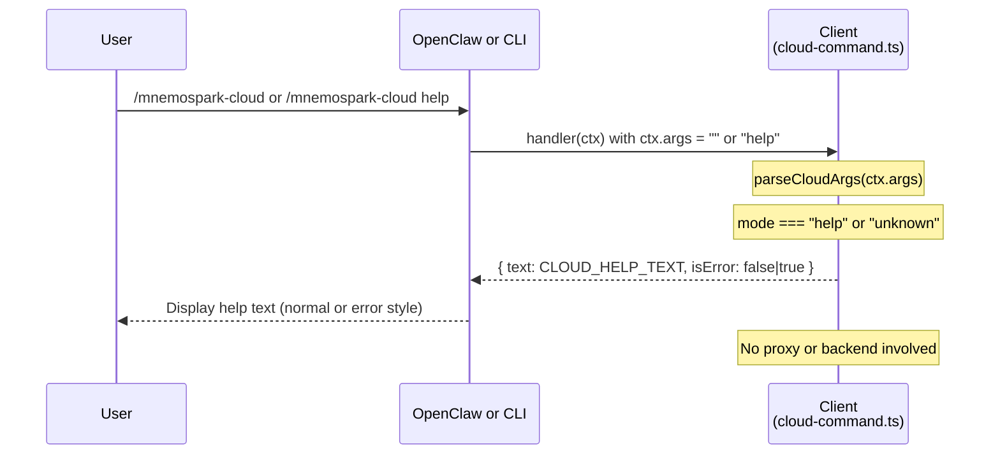

# Cloud Help Process Flow

End-to-end documentation of the `/mnemospark-cloud` and `/mnemospark-cloud help` commands, covering the client (OpenClaw plugin and CLI). **The proxy and backend are not involved** — help is resolved entirely in the client.

**Goal**: Display the mnemospark cloud command usage (list of commands and required arguments) to the user.

---

## 1. Command Overview

```
/mnemospark-cloud
/mnemospark-cloud help
```

Equivalent invocations:

- **OpenClaw (gateway)**: User types `/mnemospark-cloud` or `/mnemospark-cloud help` in the chat. The plugin command handler receives the args and returns the help text.
- **CLI**: User runs `npx mnemospark cloud` or `npx mnemospark cloud help`. The CLI builds a `PluginCommandContext` with `args` set to the substring after `cloud` and invokes the same `createCloudCommand()` handler.

### Required Parameters

**None.** The help command does not take any required or optional flags. Empty args or the single token `help` (or any unknown subcommand) triggers the help response.

### Prerequisites

- The mnemospark plugin must be loaded and the `/mnemospark-cloud` command must be registered (see **2.1**). No wallet, proxy, or backend is required.

---

## 2. Step-by-Step Flow

### 2.1 Client (mnemospark) — Command Registration

**Entry point (registration)**: `src/index.ts`. When the OpenClaw plugin loads, `register()` is called. It registers the cloud command with:

```ts
api.registerCommand(createCloudCommand());
```

The command is defined in `createCloudCommand()` in `src/cloud-command.ts` (line 1155) with:

- **name**: `"mnemospark-cloud"`
- **description**: `"Manage mnemospark cloud storage workflow commands"`
- **acceptsArgs**: `true`
- **requireAuth**: `true`
- **handler**: async function that calls `parseCloudArgs(ctx.args)` and, for help or unknown mode, returns the help text.

If registration throws, `api.logger.warn` is called with a message like `Failed to register /mnemospark-cloud command: <error>`. The user then does not see the command in the slash-command list.

---

### 2.2 Client (mnemospark) — Invocation and Argument Parsing

When the user runs `/mnemospark-cloud` or `/mnemospark-cloud help` (or `/mnemospark-cloud <unknown>`):

1. **Handler entry**  
   The handler in `createCloudCommand()` (line 1176) runs with `ctx.args` set by the host:
   - **OpenClaw**: `ctx.args` is the remainder of the slash command after the command name (e.g. `""` for `/mnemospark-cloud`, `"help"` for `/mnemospark-cloud help`).
   - **CLI**: `ctx.args` is `cloudArgs` passed to `runCloud(cloudArgs)` in `src/cli.ts` (e.g. `""` or `"help"`).

2. **Parse args**  
   `parseCloudArgs(ctx.args)` in `src/cloud-command.ts` (line 241):
   - **Empty or whitespace**: `trimmed` is `""` → returns `{ mode: "help" }`.
   - **First token `help`**: subcommand is `"help"` → returns `{ mode: "help" }`.
   - **First token unknown** (e.g. `foo`, `backup` without a path): returns `{ mode: "unknown" }` when the token is not a recognized subcommand, or another mode (e.g. `backup`, `price-storage`) when it is recognized with valid or invalid args.

   For the **help** path, only `{ mode: "help" }` and `{ mode: "unknown" }` are relevant: both cause the handler to return the same help text (see step 3).

3. **Return help text**  
   At line 1180:
   - If `parsed.mode === "help"` or `parsed.mode === "unknown"`, the handler returns:
     - `{ text: CLOUD_HELP_TEXT, isError: parsed.mode === "unknown" }`.
   - So:
     - **Success (help requested explicitly)**: `{ text: CLOUD_HELP_TEXT, isError: false }`.
     - **Unknown subcommand**: `{ text: CLOUD_HELP_TEXT, isError: true }` — same text, but the host may display it as an error (e.g. red or error state).

**No network calls, no proxy, no backend.** The flow is:

```
User → OpenClaw/CLI → createCloudCommand().handler(ctx)
  → parseCloudArgs(ctx.args) → { mode: "help" } or { mode: "unknown" }
  → return { text: CLOUD_HELP_TEXT, isError: false|true }
  → User sees help in chat or stdout
```

---

### 2.3 Local Proxy (mnemospark)

**Not used.** The proxy listens on `127.0.0.1:7120` and serves only:

- `GET /health`
- `POST /mnemospark/price-storage`
- `POST /mnemospark/upload`
- `POST /mnemospark/upload/confirm`
- `POST /mnemospark/ls`
- `POST /mnemospark/download`
- `POST /mnemospark/delete`

There is no `/mnemospark/help` or similar route. The help command never contacts the proxy.

---

### 2.4 Backend (mnemospark-backend)

**Not used.** No Lambda, API Gateway, or DynamoDB is involved. Help is entirely client-side.

---

## 3. Files Used Across the Path

### Client only (mnemospark repo)

| File | Role |
|------|------|
| `src/index.ts` | Plugin entrypoint; registers the `/mnemospark-cloud` command via `createCloudCommand()`. On registration failure, logs a warning. |
| `src/cloud-command.ts` | Defines `parseCloudArgs()`, `CLOUD_HELP_TEXT`, and the command handler. For empty args or subcommand `help`, returns `{ mode: "help" }`. For unknown subcommand, returns `{ mode: "unknown" }`. Handler returns `{ text: CLOUD_HELP_TEXT, isError }` for help/unknown. |
| `src/types.ts` | OpenClaw plugin type definitions (`OpenClawPluginCommandDefinition`, `PluginCommandContext`). |
| `src/cli.ts` | CLI entry; for `mnemospark cloud [args]`, builds `PluginCommandContext` with `args: cloudArgs` and invokes `createCloudCommand().handler(ctx)`. Help is shown when `cloudArgs` is empty or `"help"`. |

### Local Proxy (mnemospark repo)

Not used for help.

### Backend (mnemospark-backend repo)

Not used for help.

### Local filesystem

None. The help command does not read or write any files (no `object.log`, no wallet, no backup dir).

---

## 4. Logging

### Client plugin (`src/index.ts`)

- **Command registration**: If `api.registerCommand(createCloudCommand())` throws, `api.logger.warn` is called with the error message. No other logging is performed for the help command itself.
- The help handler in `src/cloud-command.ts` does **not** call `api.logger` or any other logger when returning help. So a successful `/mnemospark-cloud` or `/mnemospark-cloud help` produces no log lines from the handler.

### Local proxy

Not involved.

### Backend

Not involved.

---

## 5. Success

### What the user sees

The user sees the contents of `CLOUD_HELP_TEXT` (defined in `src/cloud-command.ts` lines 79–103), which includes:

- A short header: **mnemospark Cloud Commands**
- Lines for:
  - `/mnemospark-cloud` or `/mnemospark-cloud help` — show this message
  - `/mnemospark-cloud backup <file>` or `<directory>` and required args
  - `/mnemospark-cloud price-storage` and required flags
  - `/mnemospark-cloud upload` and required flags
  - `/mnemospark-cloud ls`, `download`, `delete` and required flags
- A note that backup writes to `~/.openclaw/mnemospark/backup` and `object.log`, and that storage commands require `--wallet-address`.

The host (OpenClaw or CLI) displays this as normal output when `isError` is `false` (i.e. when the user ran `/mnemospark-cloud` or `/mnemospark-cloud help`).

### What gets written

Nothing. No files, no network, no side effects.

---

## 6. Failure Scenarios

### Client-side only

| Condition | Result | `isError` |
|-----------|--------|-----------|
| User runs `/mnemospark-cloud` or `/mnemospark-cloud help` | Handler returns `CLOUD_HELP_TEXT` | `false` |
| User runs `/mnemospark-cloud <unknown>` (e.g. `/mnemospark-cloud foo`) | Handler returns same `CLOUD_HELP_TEXT` | `true` |
| Plugin failed to register the command at load time | User does not see `/mnemospark-cloud` in the command list; `api.logger.warn` was called once at registration | N/A |

There are no proxy or backend failure modes for the help command because the proxy and backend are not called.

---

## 7. What the Command Returns

- **Return type**: The handler returns an object `{ text: string; isError?: boolean }` (per OpenClaw plugin contract).
- **Success** (`/mnemospark-cloud` or `/mnemospark-cloud help`):
  - `text`: Full `CLOUD_HELP_TEXT` (multi-line string).
  - `isError`: `false`.
- **Unknown subcommand** (e.g. `/mnemospark-cloud foo`):
  - `text`: Same `CLOUD_HELP_TEXT`.
  - `isError`: `true` (host may render as error).
- **Parameters**: No parameters are required or consumed for the help path. The only input is `ctx.args` (string), which may be empty, `"help"`, or any other string; empty or `"help"` yields `mode: "help"`, anything else that does not match a known subcommand yields `mode: "unknown"`.

---

## 8. Sequence Diagram



---

## 9. Recommended Code Changes

Discrepancies or improvements identified while documenting the help flow:

| # | Change | Repo | Severity | Description |
|---|--------|------|----------|-------------|
| 9.1 | Unify slash-command string in proxy error messages | **mnemospark** | Low | ✅ Implemented. Proxy messages now consistently use the canonical slash-command form (`/mnemospark-cloud ...`). |
| 9.2 | Optional: Log help/unknown at debug level | **mnemospark** | Low | The help handler does not log when help or unknown is requested. If the plugin API exposes a logger in the command context, adding a single debug log (e.g. "mnemospark-cloud help requested" / "unknown subcommand") would align with other commands that log and aid support. Optional; not required for correctness. |
| 9.3 | Optional: UX for unknown subcommand | **mnemospark** | Low | When `parsed.mode === "unknown"`, the handler returns the full help text with `isError: true`. Some UIs may show the whole block in red. Alternatives: (a) return a short error line plus the same help text with `isError: false` for the help part, or (b) keep current behavior and document that unknown subcommand shows help in error style. No change required for backend; client-only UX choice. |

No changes are recommended for **mnemospark-backend** for the help flow; the backend is not involved.
