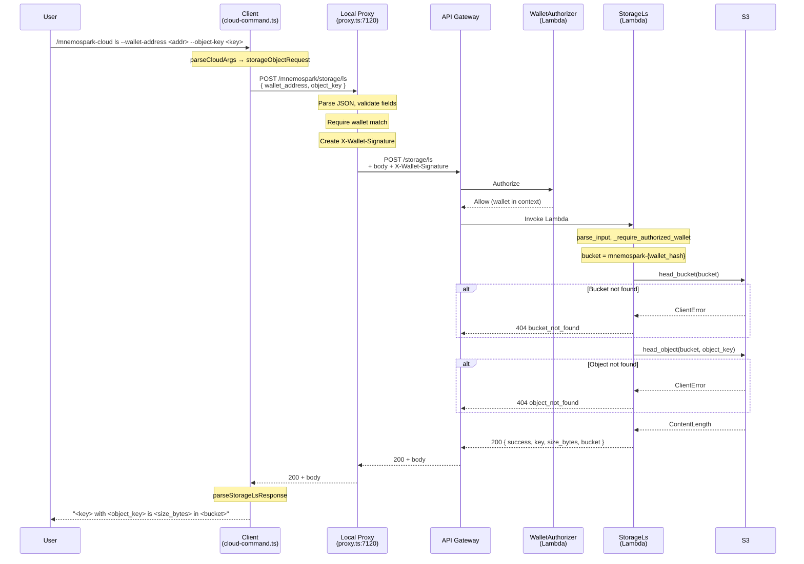

# Cloud LS Process Flow

**Date:** 2026-03-16  
**Revision:** rev 1  
**Milestone:** e2e-staging-2026-03-16 (mnemospark & mnemospark-backend)  
**Repos / components:** mnemospark (client, proxy), mnemospark-backend (storage-ls, wallet-authorizer)

End-to-end documentation of the `/mnemospark-cloud ls` command, covering the client, local proxy, and AWS backend.

**Goal**: Obtain a successful **listing** (metadata) of **one object** stored in S3 for the user's wallet: object key, size in bytes, and bucket name. This is single-object metadata lookup, not a full bucket listing.

---

## 1. Command Overview

```
/mnemospark-cloud ls --wallet-address <addr> --object-key <object-key>
```

### Required Parameters

| Flag | Description |
|------|-------------|
| `--wallet-address` | EVM wallet address (0x-prefixed). Must match the proxy's wallet; the backend returns metadata for objects in that wallet's S3 bucket. |
| `--object-key` | The object key (S3 key) returned from a prior upload (e.g. the `object_key` in the upload success message or in object.log). Must be a **single path segment** (no `/` or `\`). |

Optional: `--location` or `--region` (AWS region for the S3 bucket; defaults on backend if omitted).

### Prerequisites

1. User has at least one object uploaded to mnemospark storage for this wallet (otherwise the backend returns 404 "Bucket not found" or "Object not found").
2. Local proxy is running on `127.0.0.1:7120` with a wallet key configured (proxy signs the request and enforces wallet match).
3. `MNEMOSPARK_BACKEND_API_BASE_URL` is set so the proxy can forward to the backend.

---

## 2. Step-by-Step Flow

### 2.1 Client (mnemospark)

**Entry point**: Cloud command handler in `createCloudCommand()` in `src/cloud-command.ts`. For `ls`, the handler calls `requestStorageLs(parsed.storageObjectRequest, options.proxyStorageOptions)` then formats the result.

#### Step 1 — Argument Parsing

`parseCloudArgs(ctx.args)` (line 241):

- Expects the first token to be `ls` and the rest to be `--key value` pairs.
- `parseNamedFlags(rest)` and `parseStorageObjectRequest()` (in `src/cloud-storage.ts`) validate: `wallet_address` and `object_key` required; optional `location` / `region`.
- If valid → `{ mode: "ls", storageObjectRequest: StorageObjectRequest }`. If invalid → `{ mode: "ls-invalid" }`; handler returns `"Cannot list storage object: required arguments are --wallet-address, --object-key."` with `isError: true`.

#### Step 2 — Request to Proxy

`requestStorageLsViaProxy(request, options)` in `src/cloud-storage.ts` (line 315):

- Uses `requestJsonViaProxy(STORAGE_LS_PROXY_PATH, request, parseStorageLsResponse, options)`.
- **URL**: `POST {proxyBaseUrl}/mnemospark/storage/ls` (default `http://127.0.0.1:7120/mnemospark/storage/ls`).
- **Headers**: `Content-Type: application/json`.
- **Body**: JSON `{ wallet_address, object_key, location? }`.

#### Step 3 — Response Handling

- If `!response.ok`, throws with the response body or status. The handler catches and returns `{ text: "Cannot list storage object", isError: true }` (no backend error detail is surfaced to the user).
- If OK, parses JSON with `parseStorageLsResponse(payload)`. Required fields: `key` (or `object_key`), `size_bytes`, `bucket`; optional `success`, `object_id`. Missing required fields throw; handler surfaces as "Cannot list storage object".
- If `lsResult.success === false`, the handler throws `"ls failed"` and returns "Cannot list storage object".

#### Step 4 — Format and Return Success

`formatStorageLsUserMessage(lsResult, requestedObjectKey)` (line 1150):

- Returns one line: `<object_id or key> with <object_key> is <size_bytes> in <bucket>` (e.g. `myfile.tar.gz with myfile.tar.gz is 1024 in mnemospark-a1b2c3d4e5f60708`).
- Handler returns `{ text: formatStorageLsUserMessage(...) }` (no `isError`).

---

### 2.2 Local Proxy (mnemospark)

**Entry point**: `src/proxy.ts`, route for `POST` and path matching `STORAGE_LS_PROXY_PATH` (`/mnemospark/storage/ls`) at line 453.

#### Step 1 — Read and Parse Body

- `readProxyJsonBody(req)` parses JSON. On failure, proxy responds **400** with `"Invalid JSON body for /mnemospark cloud ls"`.
- `parseStorageObjectRequest(payload)` validates `wallet_address` and `object_key`. If `null`, proxy responds **400** with `"Missing required fields: wallet_address, object_key"`.

#### Step 2 — Wallet Match

- Compares `requestPayload.wallet_address` (lowercased) to the proxy's configured wallet address. If they differ, responds **403** with `{ error: "wallet_proof_invalid", message: "wallet proof invalid" }`.

#### Step 3 — Wallet Signature

- `createBackendWalletSignature("POST", "/storage/ls", requestPayload.wallet_address)` builds the EIP-712 signature for the backend. If the proxy has no wallet key, it responds **400** with the body from `createWalletRequiredBody()` (wallet required for storage endpoints).

#### Step 4 — Forward to Backend

- `forwardStorageLsToBackend(requestPayload, { backendBaseUrl, walletSignature })` in `src/cloud-storage.ts`:
  - **URL**: `POST {MNEMOSPARK_BACKEND_API_BASE_URL}/storage/ls`.
  - **Headers**: `Content-Type: application/json`, `X-Wallet-Signature`.
  - **Body**: Same JSON (`wallet_address`, `object_key`, `location` if present).
- If `backendBaseUrl` or `walletSignature` is missing, `forwardStorageToBackend` throws; proxy catches and responds **502** with `proxy_error` and message including "Failed to forward /mnemospark cloud ls: ...".

#### Step 5 — Relay Response

- Forwards the backend's status code and body (and auth/payment headers if any). On proxy exception, **502** with "Failed to forward /mnemospark cloud ls: ...".

---

### 2.3 Backend (mnemospark-backend)

**Entry point**: `StorageLsFunction` Lambda, handler in `services/storage-ls/app.py`. **Route**: `GET` or `POST` `/storage/ls` (API Gateway). The client path uses POST with a JSON body.

#### Step 1 — Input Parsing

`parse_input(event)` (line 216):

- Collects params from query string and/or JSON body. Requires: `wallet_address` (0x-prefixed 20-byte hex), `object_key` (non-empty, single path segment: no `/` or `\`, not `.` or `..`). Optional `location` or `region` (defaults to `AWS_REGION` or `us-east-1`).
- `_validate_object_key(object_key)` enforces a single segment. On validation failure, raises `BadRequestError`; handler returns **400**.

#### Step 2 — Authorizer

- `_require_authorized_wallet(event, request.wallet_address)`: extracts wallet from API Gateway authorizer context. For `/storage/ls`, wallet is **required**; if missing or not matching request `wallet_address`, raises `ForbiddenError`; handler returns **403 forbidden**.

#### Step 3 — Bucket and Object Lookup

- **Bucket name**: `_bucket_name(wallet_address)` → `mnemospark-{sha256(wallet_address)[:16]}`.
- **Bucket access**: `_assert_bucket_access(s3_client, bucket_name)` calls `head_bucket`. If the bucket does not exist (or access denied), raises `NotFoundError("bucket_not_found", "Bucket not found for this wallet")`; handler returns **404** with that body. Per backend behavior, wallets that have never uploaded get "Bucket not found".
- **Object size**: `_get_object_size(s3_client, bucket_name, object_key)` calls S3 `head_object`. If the object does not exist (or access denied), raises `NotFoundError("object_not_found", "Object not found: <key>")`; handler returns **404**.

#### Step 4 — Response

- Returns **200** with JSON: `{ "success": true, "key": "<object_key>", "size_bytes": <size>, "bucket": "<bucket_name>" }`. The backend does **not** return `object_id`; the client uses `result.object_id ?? result.key` when formatting the message, so the user sees the key as the identifier.

---

## 3. Files Used Across the Path

### Client and Proxy (mnemospark repo)

| File | Role |
|------|------|
| `src/index.ts` | Registers the `/mnemospark-cloud` command. |
| `src/cloud-command.ts` | Parses `ls` args; calls `requestStorageLs`; handles success / `!success` / throw; `formatStorageLsUserMessage`. |
| `src/cloud-storage.ts` | `StorageObjectRequest`, `StorageLsResponse`; `parseStorageObjectRequest`, `parseStorageLsResponse`; `requestStorageLsViaProxy` (client → proxy); `forwardStorageLsToBackend` (proxy → backend); `STORAGE_LS_PROXY_PATH`; `requestJsonViaProxy`, `forwardStorageToBackend`. |
| `src/proxy.ts` | POST `/mnemospark/storage/ls` handler: read body, parse, wallet match, wallet signature, `forwardStorageLsToBackend`, relay response or 502. |
| `src/config.ts` | `PROXY_PORT`. |
| `src/mnemospark-request-sign.ts` | Proxy uses this to create `X-Wallet-Signature` for the backend. |
| `src/cloud-utils.ts` | `normalizeBaseUrl`, `asRecord`, etc. |
| `src/types.ts` | Plugin types. |

### Backend (mnemospark-backend repo)

| File | Role |
|------|------|
| `services/storage-ls/app.py` | Lambda handler: `parse_input`, `_require_authorized_wallet`, bucket name from wallet hash, `head_bucket`, `head_object` for size, response `success`, `key`, `size_bytes`, `bucket`. |
| `template.yaml` | `StorageLsFunction`, GET/POST `/storage/ls`, Auth, `StorageLsFunctionLogGroup`. |
| `services/wallet-authorizer/app.py` | Authorizer for `/storage/ls` (wallet required). |

### Local Filesystem

- No files written or read by the ls command on the client (no object.log update for ls).

---

## 4. Logging

### Client (mnemospark)

- The ls handler does not call `api.logger`. On failure it returns "Cannot list storage object" with no backend detail.

### Proxy (mnemospark)

- Generic stream error logging only. No dedicated log line for ls success or failure.

### Backend (mnemospark-backend)

- `services/storage-ls/app.py` has no structured logging (no `logging.getLogger` or event keys). Exceptions are turned into 4xx/5xx responses; Lambda stdout/stderr go to CloudWatch (`StorageLsFunctionLogGroup`).

---

## 5. Success

### What the user sees

One line of text:

- `<object_id or key> with <object_key> is <size_bytes> in <bucket>`

Example: `myfile.tar.gz with myfile.tar.gz is 2048 in mnemospark-a1b2c3d4e5f60708`. (Backend does not return `object_id`, so the client uses the key.)

### What gets written

- Nothing. No object.log or other file changes for ls.

### Backend side effects

- None. The Lambda only reads from S3 (`head_bucket`, `head_object`); no DynamoDB or S3 writes.

---

## 6. Failure Scenarios

### Client-side

| Condition | Result | `isError` |
|-----------|--------|-----------|
| Missing/invalid args | "Cannot list storage object: required arguments are ..." | true |
| Proxy non-OK (400, 403, 404, 502) or parse error | "Cannot list storage object" (no backend message in current implementation) | true |
| Response OK but `success === false` | "Cannot list storage object" | true |

### Proxy-side

| Status | Condition |
|--------|-----------|
| 400 | Invalid JSON or missing `wallet_address`/`object_key`; or wallet signature could not be created (wallet required). |
| 403 | Request `wallet_address` does not match proxy wallet. |
| 502 | Backend URL not set, no wallet key, or forwarding error; message in body. |

### Backend-side

| Status | Condition |
|--------|-----------|
| 400 | Bad request: e.g. invalid `wallet_address`, `object_key` with `/` or empty. |
| 403 | Forbidden: missing or mismatched authorizer wallet. |
| 404 | Bucket not found for this wallet, or object not found for the given key. |
| 500 | Unhandled exception (e.g. S3 error). |

---

## 7. What the Command Returns

- **Success**: `{ text: string }` with one line: `<id/key> with <object_key> is <size_bytes> in <bucket>`.
- **Failure**: `{ text: "Cannot list storage object", isError: true }`. Optional detail only when args are invalid ("required arguments are ..."); proxy/backend errors are not currently included in the user-facing message.
- **Parameters**: Required `--wallet-address` and `--object-key`. Optional `--location`/`--region`. The backend uses them to resolve the wallet-scoped bucket and the object key in S3.

---

## 8. Sequence Diagram



---

## 9. Recommended Code Changes

Discrepancies or improvements relative to the **goal** (successful listing of the object stored in S3) and general quality:

| # | Change | Repo | Severity | Description |
|---|--------|------|----------|-------------|
| 9.1 | Use canonical command name in proxy messages | **mnemospark** | Low | ✅ Implemented. Proxy error strings now use `/mnemospark-cloud ls`. |
| 9.2 | Surface backend error detail on ls failure | **mnemospark** | Medium | On proxy/backend failure, the handler catches and returns only "Cannot list storage object" with no backend message. Including the response body (or a short error message) when non-OK would help users distinguish 404 (bucket/object not found) from 403/502. |
| 9.3 | Structured logging in storage-ls Lambda | **mnemospark-backend** | Low | ✅ Implemented. `services/storage-ls/app.py` now emits structured logs for request parsing, auth confirmation, success, and 4xx/5xx error paths. |
| 9.4 | Goal alignment | **mnemospark / mnemospark-backend** | Verified | The flow **does** align with the goal: the user supplies `--wallet-address` and `--object-key`, and the backend returns metadata (key, size_bytes, bucket) for that **one** object in the wallet's S3 bucket via `head_object`. This is a single-object listing, not a full bucket list; no change required for that contract. |

---

## Spec references

- This doc: `meta_docs/cloud-ls-process-flow.md`  
  Raw URL: `https://raw.githubusercontent.com/pawlsclick/mnemospark-docs/refs/heads/main/meta_docs/cloud-ls-process-flow.md`
- Wallet proof spec: `meta_docs/wallet-proof.md`  
  Raw URL: `https://raw.githubusercontent.com/pawlsclick/mnemospark-docs/refs/heads/main/meta_docs/wallet-proof.md`
- Milestone overview: `meta_docs/e2e-staging-milestone-2026-03-16.md`  
  Raw URL: `https://raw.githubusercontent.com/pawlsclick/mnemospark-docs/refs/heads/main/meta_docs/e2e-staging-milestone-2026-03-16.md`
