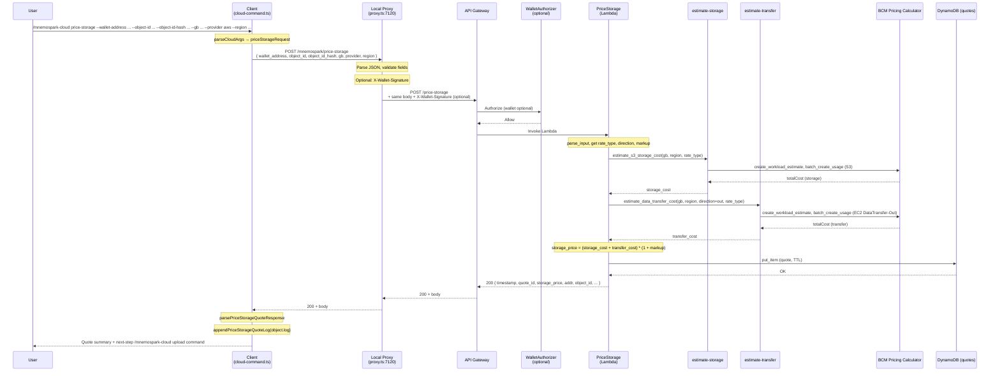

# Cloud Price-Storage Process Flow

End-to-end documentation of the `/mnemospark-cloud price-storage` command, covering the client, local proxy, and AWS backend.

**Goal**: Obtain a successful quote for **S3 storage costs** and **outbound data transfer costs** based on the file size (`--gb`) requested. The quote is stored in DynamoDB (with TTL) and returned to the user so they can proceed to `/mnemospark-cloud upload` with a valid `quote-id`.

---

## 1. Command Overview

```
/mnemospark-cloud price-storage --wallet-address <addr> --object-id <id> --object-id-hash <hash> --gb <gb> --provider <provider> --region <region>
```

### Required Parameters

| Flag | Description |
|------|-------------|
| `--wallet-address` | EVM wallet address (0x-prefixed). Required for all storage commands; used to associate the quote with the wallet for upload. |
| `--object-id` | Object identifier from a prior `/mnemospark-cloud backup` step. |
| `--object-id-hash` | SHA-256 hash of the backup archive (from backup output). |
| `--gb` | File size in GB (decimal, e.g. `0.000403116`). Used by the backend to compute S3 storage and outbound data transfer costs. |
| `--provider` | Storage provider. Only `aws` is supported for MVP. |
| `--region` | AWS region (e.g. `us-east-1`). Used for storage and transfer pricing. |

All six are mandatory. Missing or invalid args cause a client-side error before any network call.

### Prerequisites

1. User has run `/mnemospark-cloud backup` and has `object-id`, `object-id-hash`, and size in GB (e.g. from backup output or object.log).
2. Local proxy must be running on `127.0.0.1:7120` (or `MNEMOSPARK_PROXY_PORT`).
3. Proxy must have `MNEMOSPARK_BACKEND_API_BASE_URL` set so it can forward to the backend. No wallet key is required on the client for price-storage (backend treats wallet proof as optional for this route).

---

## 2. Step-by-Step Flow

### 2.1 Client (mnemospark)

**Entry point**: Cloud command handler in `createCloudCommand()` in `src/cloud-command.ts` (line 1176). For price-storage, the handler calls `requestPriceStorageQuote(parsed.priceStorageRequest, options.proxyQuoteOptions)` then `appendPriceStorageQuoteLog(quote, objectLogHomeDir)`.

#### Step 1 — Argument Parsing

`parseCloudArgs(ctx.args)` (line 241):

- Expects the first token to be `price-storage` and the rest to be `--key value` pairs.
- `parseNamedFlags(rest)` extracts: `wallet-address`, `object-id`, `object-id-hash`, `gb`, `provider`, `region`.
- `parsePriceStorageQuoteRequest()` (in `src/cloud-price-storage.ts`) validates: all six fields present, `gb` parseable as a number. Returns `null` if any missing or invalid.
- If valid → `{ mode: "price-storage", priceStorageRequest: PriceStorageQuoteRequest }`. If invalid → `{ mode: "price-storage-invalid" }`; handler then returns `"Cannot price storage: required arguments are --wallet-address, --object-id, --object-id-hash, --gb, --provider, --region."` with `isError: true`.

#### Step 2 — Request to Proxy

`requestPriceStorageViaProxy(request, options)` in `src/cloud-price-storage.ts` (line 316):

- **URL**: `POST {proxyBaseUrl}/mnemospark/price-storage` (default `http://127.0.0.1:7120/mnemospark/price-storage`).
- **Headers**: `Content-Type: application/json`.
- **Body**: JSON `PriceStorageQuoteRequest`: `{ wallet_address, object_id, object_id_hash, gb, provider, region }`.
- Uses `fetch` (or `options.fetchImpl`). No wallet signature is sent from the client; the proxy adds `X-Wallet-Signature` when forwarding to the backend.

#### Step 3 — Response Handling

- If `!response.ok`, throws with `responseBody` or a generic status message. The handler catches and returns `"Cannot price storage: <message>"` with `isError: true`.
- If OK, parses JSON and calls `parsePriceStorageQuoteResponse(payload)`. Required fields: `timestamp`, `quote_id`, `storage_price`, `addr`, `object_id`, `object_id_hash`, `object_size_gb`, `provider`, `location`. Missing fields throw; handler surfaces as "Cannot price storage".

#### Step 4 — Append to object.log

`appendPriceStorageQuoteLog(quote, objectLogHomeDir)` (line 507):

- Builds a CSV line: `timestamp,quote_id,storage_price,addr,object_id,object_id_hash,object_size_gb,provider,location`.
- Appends to `~/.openclaw/mnemospark/object.log` (parent dir created if needed). This allows the upload command to look up the quote by `quote_id` and validate wallet/object.

#### Step 5 — Return Success Message

`formatPriceStorageUserMessage(quote)` (line 1143) returns two lines:

- Quote valid for 1 hour, storage price, object_id, file size, provider, location.
- Next step: run `/mnemospark-cloud upload --quote-id <id> --wallet-address <addr> --object-id <id> --object-id-hash <hash>`.

Handler returns `{ text: formatPriceStorageUserMessage(quote) }` (no `isError`).

---

### 2.2 Local Proxy (mnemospark)

**Entry point**: `src/proxy.ts`, route for `POST` and path matching `PRICE_STORAGE_PROXY_PATH` (`/mnemospark/price-storage`) at line 282.

#### Step 1 — Read and Parse Body

- `readProxyJsonBody(req)` reads the request body and parses JSON. On failure, proxy responds **400** with `"Invalid JSON body for /mnemospark cloud price-storage"` (message uses space form; see Recommended Code Changes).
- `parsePriceStorageQuoteRequest(payload)` validates required fields. If `null`, proxy responds **400** with `"Missing required fields: wallet_address, object_id, object_id_hash, gb, provider, region"`.

#### Step 2 — Wallet Signature (Optional)

- `createBackendWalletSignature("POST", "/price-storage", requestPayload.wallet_address)` builds an EIP-712 signature for the backend. The backend authorizer treats `/price-storage` as **wallet optional**; if the proxy cannot create a signature (e.g. no wallet key), it still forwards the request without `X-Wallet-Signature`.

#### Step 3 — Forward to Backend

- `forwardPriceStorageToBackend(requestPayload, { backendBaseUrl: MNEMOSPARK_BACKEND_API_BASE_URL, walletSignature })` in `src/cloud-price-storage.ts` (line 449):
  - **URL**: `POST {MNEMOSPARK_BACKEND_API_BASE_URL}/price-storage`.
  - **Headers**: `Content-Type: application/json`, and `X-Wallet-Signature` if present.
  - **Body**: Same JSON as received from the client.
- If `backendBaseUrl` is not set, `forwardPriceStorageToBackend` throws; proxy catches and responds **502** with `proxy_error` and message including "MNEMOSPARK_BACKEND_API_BASE_URL is not configured" or "Failed to forward /mnemospark cloud price-storage: ...".

#### Step 4 — Relay Response

- Proxy forwards the backend's status code, body, and payment-related headers (e.g. `PAYMENT-REQUIRED`, `x-payment-required`) to the client. No body transformation.
- If `normalizeBackendAuthFailure()` detects an auth failure (401/403), proxy sends that status and body. For price-storage, wallet is optional so auth failure is less common.
- On any other exception (e.g. network error), proxy responds **502** with `"Failed to forward /mnemospark cloud price-storage: <error>"`.

---

### 2.3 Backend (mnemospark-backend)

**Entry point**: `PriceStorageFunction` Lambda, handler loaded via `services/price_storage_entry.py` from `services/price-storage/app.py`. **Route**: `POST /price-storage` (API Gateway, `template.yaml` line 556). Request body validated against `PriceStorageRequest` model (required: `wallet_address`, `object_id`, `object_id_hash`, `gb`, `provider`, `region`).

#### Step 1 — Input Parsing

`parse_input(event)` (line 90):

- Decodes JSON body (base64 if `isBase64Encoded`). Validates: `wallet_address`, `object_id`, `object_id_hash`, `provider`, `region` non-empty strings; `provider` must be `aws`; `gb` required, numeric, and > 0.
- On validation failure, raises `BadRequestError`; handler returns **400** `{"error": "Bad request", "message": "<detail>"}`.

#### Step 2 — Authorizer Context (Optional)

- `_extract_authorizer_wallet(event)` reads wallet from API Gateway authorizer context. For `/price-storage`, the wallet authorizer is configured as **optional**; if present, the handler logs it (see Logging). No enforcement that request `wallet_address` matches authorizer wallet for this route.

#### Step 3 — S3 Storage Cost

- `estimate_storage_cost(gb=request["gb"], region=request["region"], rate_type=rate_type)` (line 201):
  - Loads the **estimate-storage** service module (`services/estimate-storage/app.py`) and calls `estimate_s3_storage_cost(storage_gb_month=gb, region=region, rate_type=rate_type)`.
  - That function uses **AWS BCM Pricing Calculator** (`bcm-pricing-calculator`): creates a workload estimate, adds S3 usage (e.g. `TimedStorage-ByteHrs`, key `s3stor01`), polls until status `VALID`, returns `totalCost`.
- Returns a float (storage cost in the BCM currency, typically USD).

#### Step 4 — Data Transfer Cost (Outbound)

- `estimate_transfer_cost(gb=request["gb"], region=request["region"], direction=direction, rate_type=rate_type)` (line 209):
  - Loads the **estimate-transfer** service module (`services/estimate-transfer/app.py`) and calls `estimate_data_transfer_cost(data_gb=gb, direction=direction, region=region, rate_type=rate_type)`.
  - **Direction** is from env `PRICE_STORAGE_TRANSFER_DIRECTION` (default **`out`** in `template.yaml`), so the quote includes **outbound** data transfer cost.
  - Transfer module uses BCM Pricing Calculator with EC2 data transfer usage type (e.g. `DataTransfer-Out-Bytes` for outbound).
- Returns a float (transfer cost).

#### Step 5 — Combined Price and Markup

- `storage_price = round((storage_cost + transfer_cost) * (1 + markup_multiplier), 2)` (line 313).
- `markup_multiplier` from env `PRICE_STORAGE_MARKUP_PERCENT` (or `PRICE_MARKUP_PERCENT`), default `0`. So the quote is **S3 storage + outbound transfer**, optionally marked up.

#### Step 6 — Persist Quote and Respond

- `_build_quote_response(request, storage_price)` builds the response object: `timestamp`, `quote_id` (UUID), `storage_price`, `addr`, `object_id`, `object_id_hash`, `object_size_gb`, `provider`, `location`.
- `write_quote(...)` writes the quote to the **DynamoDB quotes table** (`QUOTES_TABLE_NAME`), with TTL from `QUOTE_TTL_SECONDS` (default 3600). Item includes `storage_cost`, `transfer_cost`, `markup_multiplier` for auditing.
- Returns **200** with the quote JSON. On DynamoDB or BCM errors, handler returns **500** with an error body.

---

## 3. Files Used Across the Path

### Client and Proxy (mnemospark repo)

| File | Role |
|------|------|
| `src/index.ts` | Registers the `/mnemospark-cloud` command. |
| `src/cloud-command.ts` | Parses `price-storage` args; calls `requestPriceStorageViaProxy`; `appendPriceStorageQuoteLog`; `formatPriceStorageUserMessage`; handles success/error and upload next-step message. |
| `src/cloud-price-storage.ts` | `PriceStorageQuoteRequest` / `PriceStorageQuoteResponse` types; `parsePriceStorageQuoteRequest` / `parsePriceStorageQuoteResponse`; `requestPriceStorageViaProxy` (client → proxy); `forwardPriceStorageToBackend` (proxy → backend); `PRICE_STORAGE_PROXY_PATH`. |
| `src/proxy.ts` | POST `/mnemospark/price-storage` handler: read body, parse, optional wallet signature, `forwardPriceStorageToBackend`, relay response or 502. |
| `src/config.ts` | `PROXY_PORT` (default 7120). |
| `src/mnemospark-request-sign.ts` | Used by proxy to create `X-Wallet-Signature` when forwarding. |
| `src/cloud-utils.ts` | `normalizeBaseUrl`, `asRecord`, etc. |
| `src/types.ts` | Plugin types. |

### Backend (mnemospark-backend repo)

| File | Role |
|------|------|
| `services/price_storage_entry.py` | Lambda entry; loads `price-storage/app.py`. |
| `services/price-storage/app.py` | Main handler: `parse_input`, `estimate_storage_cost`, `estimate_transfer_cost`, `storage_price = (storage_cost + transfer_cost) * (1 + markup)`, `write_quote`, response. |
| `services/estimate-storage/app.py` | `estimate_s3_storage_cost()`: BCM Pricing Calculator, S3 storage (e.g. `TimedStorage-ByteHrs`, key `s3stor01`). |
| `services/estimate-transfer/app.py` | `estimate_data_transfer_cost()`: BCM Pricing Calculator, data transfer (direction in/out; price-storage uses **out**). |
| `template.yaml` | `PriceStorageFunction`, `POST /price-storage`, `PriceStorageRequest` model, env: `QUOTES_TABLE_NAME`, `QUOTE_TTL_SECONDS`, `PRICE_STORAGE_MARKUP_PERCENT`, `PRICE_STORAGE_TRANSFER_DIRECTION: out`, `PRICE_STORAGE_RATE_TYPE`. |
| `services/wallet-authorizer/app.py` | Authorizer; `/price-storage` is **wallet optional**. |

### Local Filesystem (user machine)

| Path | Role |
|------|------|
| `~/.openclaw/mnemospark/object.log` | Client appends one CSV line per successful quote: `timestamp,quote_id,storage_price,addr,object_id,object_id_hash,object_size_gb,provider,location`. |

---

## 4. Logging

### Client (mnemospark)

- The price-storage handler does **not** call `api.logger` when sending the request or on success/failure. Errors are returned to the user as `"Cannot price storage: <message>"`.

### Proxy (mnemospark)

- `console.error` / `console.warn` for request/response stream errors (generic for all routes). No specific log line for price-storage success. On 502, the error message is sent in the response body; the proxy does not log it to a file.

### Backend (mnemospark-backend)

- **price-storage Lambda**: If authorizer context is present, `print(json.dumps({...}))` with wallet info (line 289). No structured logging (e.g. no `logging.getLogger`) for request parsed, storage_cost, transfer_cost, or quote_id. Failures return 400/500 body but are not necessarily logged with a standard event shape.
- **estimate-storage / estimate-transfer**: Used as libraries by price-storage; their Lambda handlers are not invoked for price-storage. BCM calls and errors surface as exceptions and result in 500 from price-storage.
- **CloudWatch**: Lambda logs (stdout/print) go to the function’s log group (`PriceStorageFunctionLogGroup` in template).

---

## 5. Success

### What the user sees

Two lines:

- Your storage quote `<quote_id>` is valid for 1 hour, the storage price is `<storage_price>` for `<object_id>` with file size of `<object_size_gb>` in `<provider>` `<location>`.
- If you accept this quote run the command `/mnemospark-cloud upload --quote-id <quote_id> --wallet-address <addr> --object-id <object_id> --object-id-hash <object_id_hash>`.

### What gets written

- **Client**: One CSV line appended to `~/.openclaw/mnemospark/object.log` (quote row).
- **Backend**: One item in the DynamoDB quotes table with `quote_id`, TTL, `storage_price`, `storage_cost`, `transfer_cost`, `markup_multiplier`, and request fields. Quote expires after `QUOTE_TTL_SECONDS` (default 1 hour).

### Backend side effects

- Quote stored in DynamoDB. No S3 or payment is performed; that happens in upload.

---

## 6. Failure Scenarios

### Client-side

| Condition | Result | `isError` |
|-----------|--------|-----------|
| Missing/invalid args | "Cannot price storage: required arguments are ..." | true |
| Proxy returns non-OK | "Cannot price storage: <response body or status>" | true |
| Proxy returns 200 but invalid JSON or missing fields | "Cannot price storage" (parse error) | true |

### Proxy-side

| Status | Condition |
|--------|-----------|
| 400 | Invalid JSON body or missing required fields. |
| 502 | Backend URL not set, network error, or backend error; message in body. |

### Backend-side

| Status | Condition |
|--------|-----------|
| 400 | Bad request: e.g. `gb` missing or ≤ 0, `provider` not `aws`, invalid body. |
| 500 | DynamoDB error, BCM Pricing Calculator error (e.g. estimate invalid or timeout), or unhandled exception. |

---

## 7. What the Command Returns

- **Success**: `{ text: string }` with the two-line message above (quote summary + next-step upload command). No `isError`.
- **Failure**: `{ text: "Cannot price storage: <detail>", isError: true }`. Detail can be the proxy response body, a parse error, or a network/backend message.
- **Parameters**: All six flags are required: `--wallet-address`, `--object-id`, `--object-id-hash`, `--gb`, `--provider`, `--region`. The backend uses `gb`, `provider`, and `region` to compute S3 storage and outbound data transfer costs; the rest are echoed and stored for upload.

---

## 8. Sequence Diagram



---

## 9. Recommended Code Changes

Discrepancies or improvements relative to the **goal** (successful quote for S3 storage + outbound data transfer based on `--gb`) and general quality:

| # | Change | Repo | Severity | Description |
|---|--------|------|----------|-------------|
| 9.1 | Use canonical command name in proxy/client messages | **mnemospark** | Low | Proxy error strings say "Invalid JSON body for /mnemospark cloud price-storage" and "Failed to forward /mnemospark cloud price-storage". For consistency with docs and slash-command format, use `/mnemospark-cloud price-storage`. Same for other commands in proxy and for upload error messages in cloud-command.ts that reference "Run /mnemospark cloud price-storage first." |
| 9.2 | Structured logging in price-storage Lambda | **mnemospark-backend** | Medium | `services/price-storage/app.py` has no structured logging (only a `print` when authorizer wallet is present). Adding a logger and log events for request parsed, storage_cost, transfer_cost, quote_id, and errors would align with storage-upload and improve diagnostics. |
| 9.3 | BCM integration test / key validation | **mnemospark-backend** | Medium | Per mnemospark-backend AGENTS.md, the integration test `test_real_bcm_estimate_or_skip_when_no_credentials` (e.g. in estimate-storage or related tests) can fail with BCM `ValidationException` (e.g. key format `[a-zA-Z0-9]*`). If any BCM usage key (in estimate-storage or estimate-transfer) uses hyphens or other invalid characters, fix the key to satisfy BCM so real deployments and integration tests succeed. Current estimate-storage uses `s3stor01` and estimate-transfer uses `dtxfer01`; if other code paths or tests use different keys, ensure they are valid. |
| 9.4 | Goal alignment | **mnemospark-backend** | Verified | The current flow **does** align with the goal: backend uses `--gb`, `--provider`, and `--region` to compute S3 storage cost (estimate-storage) and outbound data transfer cost (estimate-transfer with `PRICE_STORAGE_TRANSFER_DIRECTION: out`), then applies markup and returns a single `storage_price`. No change required for goal alignment; 9.2 and 9.3 improve robustness and observability. |
