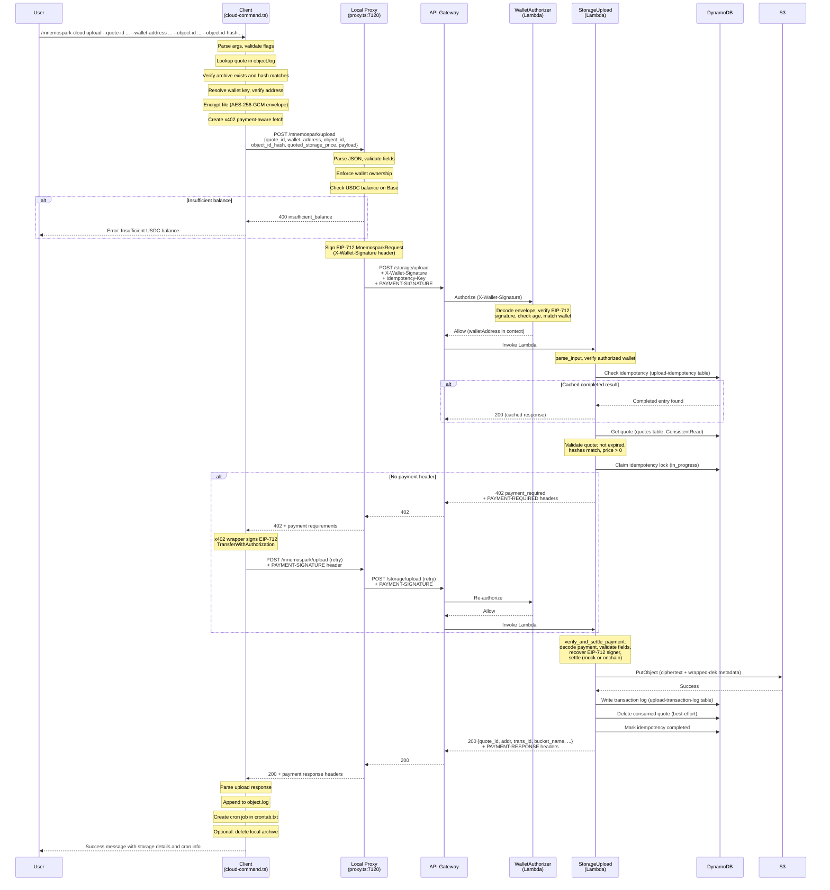

# Cloud Upload Process Flow

End-to-end documentation of the `/mnemospark-cloud upload` command, covering the client, local proxy, and AWS backend.

**Goal**: Successful USDC payment and encrypted file storage in S3.

---

## 1. Command Overview

```
/mnemospark-cloud upload --quote-id <id> --wallet-address <addr> --object-id <id> --object-id-hash <hash>
```

### Required Parameters

| Flag | Description |
|---|---|
| `--quote-id` | ID from a prior `/mnemospark-cloud price-storage` quote |
| `--wallet-address` | EVM wallet address (0x-prefixed, 20-byte hex) |
| `--object-id` | Object identifier from a prior `/mnemospark-cloud backup` step |
| `--object-id-hash` | SHA-256 hash of the local backup archive |

All four flags are mandatory. Missing any causes an immediate client-side error before any network call.

### Prerequisites

1. A local backup archive must exist at `~/.openclaw/mnemospark/backup/<object_id>`.
2. A valid price-storage quote must be logged in `~/.openclaw/mnemospark/object.log`.
3. A wallet private key must be resolvable (env var, or key file on disk).
4. The local proxy must be running on `127.0.0.1:7120`.
5. The wallet must have sufficient USDC balance on Base (chain ID 8453).

---

## 2. Step-by-Step Flow

### 2.1 Client (mnemospark)

**Entry point**: `createCloudCommand()` in `src/cloud-command.ts` (line 1155), registered in `src/index.ts` (line 213).

#### Step 1 -- Argument Parsing

`parseCloudArgs(ctx.args)` extracts the `upload` subcommand and parses the four required `--key value` flags via `parseNamedFlags()`. If any flag is missing, the handler returns `{ text: "Cannot upload storage object: required arguments are ...", isError: true }` immediately.

#### Step 2 -- Quote Lookup from Local Log

`findLoggedPriceStorageQuote(quote_id, homeDir)` reads `~/.openclaw/mnemospark/object.log` to find the price-storage quote matching the given `quote_id`. Validates that the logged quote's `walletAddress`, `objectId`, and `objectIdHash` match the command arguments.

#### Step 3 -- Archive Verification

Checks that the local backup archive exists at `~/.openclaw/mnemospark/backup/<object_id>`, is a file (not a directory), and its SHA-256 hash matches `--object-id-hash`.

#### Step 4 -- Wallet Key Resolution

`resolveWalletPrivateKey(homeDir)` tries, in order:

1. `MNEMOSPARK_WALLET_KEY` environment variable
2. `~/.openclaw/mnemospark/wallet/wallet.key`
3. `~/.openclaw/blockrun/wallet.key`

Derives the address via `privateKeyToAccount(walletKey)` and verifies it matches `--wallet-address`.

#### Step 5 -- Payload Preparation (Client-Side Encryption)

`prepareUploadPayload(archivePath, walletAddress, homeDir)` at line 983:

1. Reads the archive file into memory.
2. Loads (or generates) a 32-byte **KEK** (Key Encryption Key) from `~/.openclaw/mnemospark/keys/<wallet-hash>.key`.
3. Generates a random 32-byte **DEK** (Data Encryption Key).
4. Encrypts file content with **AES-256-GCM** using the DEK.
5. Wraps (encrypts) the DEK with the KEK using AES-256-GCM.
6. Selects upload mode:
   - `"inline"` if encrypted content <= 4,500,000 bytes -- base64-encoded in the JSON body.
   - `"presigned"` if larger -- expects a presigned S3 URL from the backend.
7. Computes SHA-256 of the encrypted content.

Returns an `UploadPayload` object with `mode`, `content_base64` (inline only), `content_sha256`, `content_length_bytes`, `wrapped_dek`, `encryption_algorithm`, `bucket_name_hint`, and `key_store_path_hint`.

#### Step 6 -- Payment Fetch Setup

`createPaymentFetch(walletKey)` (from `src/x402.ts`) creates an x402-aware `fetch` wrapper:

- On the first call, makes the request without payment headers.
- If the response is `402 Payment Required`, extracts payment requirements from `PAYMENT-REQUIRED` / `x-payment-required` headers.
- Signs an EIP-712 `TransferWithAuthorization` message for USDC on Base.
- Retries the request with the signed payment in `PAYMENT-SIGNATURE` / `x-payment` headers.
- Caches payment parameters per endpoint to skip the 402 round trip on subsequent calls.

#### Step 7 -- Upload Request via Proxy

`requestStorageUploadViaProxy()` at `src/cloud-price-storage.ts` line 345:

- **URL**: `POST http://127.0.0.1:7120/mnemospark/upload`
- **Headers**: `Content-Type: application/json`, `Idempotency-Key: <uuid>`, plus x402 payment headers if cached.
- **Body** (JSON):
  ```json
  {
    "quote_id": "...",
    "wallet_address": "...",
    "object_id": "...",
    "object_id_hash": "...",
    "quoted_storage_price": 1.25,
    "payload": {
      "mode": "inline",
      "content_base64": "<base64-encrypted-content>",
      "content_sha256": "...",
      "content_length_bytes": 12345,
      "wrapped_dek": "<base64-wrapped-key>",
      "encryption_algorithm": "AES-256-GCM",
      "bucket_name_hint": "mnemospark-<hash>",
      "key_store_path_hint": "~/.openclaw/mnemospark/keys/<hash>.key"
    }
  }
  ```

#### Step 8 -- Presigned Upload (if applicable)

`uploadPresignedObjectIfNeeded()` at line 1016: if the backend response includes `upload_url`, PUTs the encrypted content directly to S3 via that presigned URL. If `mode == "presigned"` but no `upload_url` is returned, throws an error.

#### Step 9 -- Post-Upload Logging and Cron

1. `appendStorageUploadLog()` writes a CSV line to `~/.openclaw/mnemospark/object.log` with: timestamp, quote_id, addr, addr_hash, trans_id, storage_price, object_id, object_key, provider, bucket_name, location.
2. `createStoragePaymentCronJob()` creates a monthly cron entry in `~/.openclaw/mnemospark/crontab.txt` (runs on the 1st of each month).
3. `maybeCleanupLocalBackupArchive()` deletes the local archive if `MNEMOSPARK_DELETE_BACKUP_AFTER_UPLOAD` is set.

#### Step 10 -- Return Success Message

Returns to the user:

> Your file `<object_id>` with key `<object_key>` has been stored using `<provider>` in `<bucket_name>` `<location>`
> A cron job `<cronId>` has been configured to send payment monthly (on the 1st) for storage services. If payment is not sent, your `<object_id>` will be deleted after the **32-day deadline** (30-day billing interval + 2-day grace period).
> Thank you for using mnemospark!

---

### 2.2 Local Proxy (mnemospark)

**Entry point**: `src/proxy.ts`, upload route handler at line 342.

The proxy runs on `127.0.0.1:7120` (configurable via `MNEMOSPARK_PROXY_PORT`). It starts automatically when the OpenClaw gateway launches and is registered as an OpenClaw service with `start`/`stop` lifecycle for graceful shutdown.

#### Step 1 -- Parse and Validate Request Body

`readProxyJsonBody(req)` reads the incoming JSON. `parseStorageUploadRequest(payload)` validates the required fields: `quote_id`, `wallet_address`, `object_id`, `object_id_hash`, `quoted_storage_price`, `payload`. Returns 400 if parsing fails.

#### Step 2 -- Wallet Ownership Enforcement

Compares `requestPayload.wallet_address` against the proxy's configured wallet address. If they don't match, returns `403 wallet_proof_invalid`. This ensures only the local wallet owner can initiate uploads.

#### Step 3 -- Wallet Signature Creation

`createBackendWalletSignature("POST", "/storage/upload", walletAddress)` signs an EIP-712 `MnemosparkRequest` typed data message containing the HTTP method, path, wallet address, nonce, and timestamp. The result is base64-encoded and set as the `X-Wallet-Signature` header for the backend.

#### Step 4 -- USDC Balance Check

Calculates `requiredMicros` from `quoted_storage_price * 1,000,000`. Queries the wallet's USDC balance on Base via `BalanceMonitor.checkSufficient(requiredMicros)`. If insufficient, returns:

```json
{
  "error": "insufficient_balance",
  "message": "Insufficient USDC balance. Current: $X.XX, Required: $Y.YY",
  "wallet": "0x...",
  "help": "Fund wallet 0x... on Base before running /mnemospark cloud upload"
}
```

If balance is low but sufficient, triggers an `onLowBalance` callback (logged as a warning).

#### Step 5 -- Forward to Backend

`forwardStorageUploadToBackend(requestPayload, options)` at `src/cloud-price-storage.ts` line 416:

- **URL**: `POST ${MNEMOSPARK_BACKEND_API_BASE_URL}/storage/upload`
- **Headers**: `Content-Type: application/json`, `X-Wallet-Signature`, `Idempotency-Key`, `PAYMENT-SIGNATURE` / `x-payment` (forwarded from client)
- **Body**: The `StorageUploadRequest` JSON, forwarded unchanged.

#### Step 6 -- Response Relay

Forwards the backend's status code, body, and payment-related headers (`PAYMENT-REQUIRED`, `PAYMENT-RESPONSE`, `x-payment-required`, `x-payment-response`) back to the client. Normalizes 401/403 auth failures into consistent JSON error bodies. On proxy-level exceptions, returns `502 proxy_error`.

---

### 2.3 Backend (mnemospark-backend)

**Entry point**: `StorageUploadFunction` Lambda, handler at `services/storage-upload/app.py` line 1086.

**Route**: `POST /storage/upload` (defined in `template.yaml` line 563).

#### Step 1 -- API Gateway Request Validation

API Gateway validates the request body against the `StorageUploadRequest` JSON Schema model (`template.yaml` lines 374-401) with `ValidateBody: true`. Required top-level fields: `quote_id`, `wallet_address`, `object_id`, `object_id_hash`, `ciphertext`, `wrapped_dek`.

#### Step 2 -- Lambda Authorizer (Wallet Signature Verification)

`WalletRequestAuthorizer` Lambda at `services/wallet-authorizer/app.py` runs before the upload handler:

1. Extracts `X-Wallet-Signature` header (base64-encoded JSON envelope).
2. Decodes the envelope: `payloadB64`, `signature`, `address`.
3. Inner payload: `method`, `path`, `walletAddress`, `nonce`, `timestamp`.
4. Verifies the EIP-712 signature using `eth_account` against the `MnemosparkRequest` typed data schema.
5. Checks signature age (max 300 seconds) and future skew (max 60 seconds).
6. For `/storage/upload`: requires the body's `wallet_address` matches the recovered signer.
7. Returns IAM Allow/Deny policy; on Allow, passes `walletAddress` in authorizer context.

#### Step 3 -- Input Parsing

`parse_input(event)` at line 399:

- Decodes the JSON body via `_collect_request_params`.
- Extracts and validates: `quote_id`, `wallet_address` (normalized to lowercase), `object_id`, `object_id_hash`, `object_key` (defaults to `object_id`), `provider` (defaults to `"aws"`), `location` (defaults to `AWS_REGION`).
- Base64-decodes `ciphertext` (or `content` as fallback).
- Validates `wrapped_dek` as base64.
- Extracts `Idempotency-Key` and payment headers.

#### Step 4 -- Authorized Wallet Double-Check

`_require_authorized_wallet(event, request.wallet_address)` at line 1096 extracts `walletAddress` from `event.requestContext.authorizer` and compares it to the request body's `wallet_address`. Mismatch returns 403.

#### Step 5 -- Idempotency Check (First Pass)

If `Idempotency-Key` header is present, checks the `upload-idempotency` DynamoDB table:

- If a `completed` entry exists with matching `request_hash`, returns the cached 200 response immediately (short-circuit).
- If `in_progress` or hash mismatch, returns `409 conflict`.

#### Step 6 -- Quote Lookup and Validation

`_build_quote_context` at line 494 fetches the quote from the `quotes` DynamoDB table with consistent read and validates:

- Quote exists and has not expired (`expires_at > now`).
- `object_id_hash` matches the quote's stored hash.
- `object_id` matches (if stored on quote).
- `wallet_address` matches (if stored on quote).
- `storage_price > 0`.

Converts `storage_price` to USDC microdollars (`storage_price * 1,000,000`).

#### Step 7 -- Idempotency Lock (Second Pass)

If `Idempotency-Key` is present, `_claim_idempotency_lock` atomically writes an `in_progress` record with `attribute_not_exists` condition to prevent double-execution.

#### Step 8 -- Payment Verification and Settlement

`verify_and_settle_payment()` at line 791:

1. If no payment header is present, raises `PaymentRequiredError` (402) with payment requirements in `PAYMENT-REQUIRED` / `x-payment-required` headers containing: `scheme`, `network` (eip155:8453), `asset` (USDC address), `payTo` (recipient wallet), `amount` (in microdollars).
2. Decodes the base64-encoded JSON payment payload.
3. Extracts a `TransferAuthorization` (EIP-3009 `transferWithAuthorization` for USDC).
4. Validates: `from` matches wallet, `to` matches configured recipient, asset matches, network matches, amount >= quote amount, `validAfter <= now < validBefore`.
5. Recovers the EIP-712 signer via `eth_account` and verifies it matches `wallet_address`.
6. Settles payment based on `MNEMOSPARK_PAYMENT_SETTLEMENT_MODE`:
   - **mock** (default): generates a deterministic pseudo-tx-id via SHA-256 of `quote_id:signature:nonce:value`. No on-chain transaction.
   - **onchain**: retrieves relayer private key from AWS Secrets Manager, builds and submits a `transferWithAuthorization` transaction to Base mainnet via `web3.py`, waits for receipt (180s timeout), verifies `receipt.status == 1`, returns actual tx hash.

#### Step 9 -- S3 Upload

`_upload_ciphertext_to_s3()` at line 1025:

1. Computes bucket name: `mnemospark-{sha256(wallet_address)[:16]}`.
2. Validates bucket name against S3 naming rules.
3. Creates the bucket if it does not exist (`head_bucket` + `create_bucket`).
4. `s3:PutObject` with ciphertext as `Body` and `wrapped-dek` in object `Metadata`.

#### Step 10 -- Transaction Log

`_write_transaction_log()` at line 1045 writes to the `upload-transaction-log` DynamoDB table with: `quote_id`, `trans_id`, timestamp, payment details (network, asset, amount, status=confirmed, recipient), wallet info, object metadata, provider, bucket, location.

#### Step 11 -- Quote Deletion

Best-effort `delete_item` on the quotes table for the consumed `quote_id` (line 1166). Failures are silently caught.

#### Step 12 -- Idempotency Completion and Response

If an idempotency lock was acquired, marks it `completed` with the response body and payment response header cached.

Returns 200 with:

```json
{
  "quote_id": "...",
  "addr": "0x...",
  "addr_hash": "a3f1b2c4d5e6f7a8",
  "trans_id": "0xabc123...",
  "storage_price": 1.25,
  "object_id": "backup.tar.gz",
  "object_key": "backup.tar.gz",
  "provider": "aws",
  "bucket_name": "mnemospark-a3f1b2c4d5e6f7a8",
  "location": "us-east-1"
}
```

Response headers include `PAYMENT-RESPONSE` and `x-payment-response` (base64 JSON with `trans_id`, `network`, `asset`, `amount`).

---

### 2.4 Return Path Summary

```
Backend 200 + payment-response headers
  -> Proxy relays status, body, and payment headers to client
    -> Client x402 wrapper resolves the final response
      -> requestStorageUploadViaProxy parses the JSON response
        -> uploadPresignedObjectIfNeeded (PUT to S3 if presigned URL returned)
          -> appendStorageUploadLog (write to object.log)
            -> createStoragePaymentCronJob (write to crontab.txt)
              -> maybeCleanupLocalBackupArchive (optional)
                -> Return success message to user
```

---

## 3. Files Used Across the Path

### Client and Proxy (mnemospark repo)

| File | Role |
|---|---|
| `src/index.ts` | Plugin entrypoint; registers the `/mnemospark-cloud` command and starts the proxy |
| `src/cloud-command.ts` | Command definition, argument parsing, upload orchestration, AES-256-GCM encryption, presigned upload, post-upload logging/cron |
| `src/cloud-price-storage.ts` | `StorageUploadRequest`/`UploadPayload` types, `requestStorageUploadViaProxy()`, `forwardStorageUploadToBackend()`, request/response parsing |
| `src/proxy.ts` | Local HTTP proxy server; routes `/mnemospark/upload` to backend, adds wallet signatures, checks USDC balance |
| `src/x402.ts` | x402 payment fetch wrapper; handles 402 responses with EIP-712 signed USDC `TransferWithAuthorization` |
| `src/mnemospark-request-sign.ts` | Creates `X-Wallet-Signature` EIP-712 header for backend authentication |
| `src/config.ts` | `PROXY_PORT` (default 7120) and `MNEMOSPARK_BACKEND_API_BASE_URL` |
| `src/balance.ts` | `BalanceMonitor` -- USDC balance checking on Base chain |
| `src/payment-cache.ts` | Caches x402 payment parameters to skip 402 round trips |
| `src/nonce.ts` | Generates cryptographic nonces |
| `src/wallet-key.ts` | Wallet private key validation |
| `src/wallet-signature.ts` | Wallet signature normalization |
| `src/auth.ts` | Wallet key resolution for proxy startup |
| `src/cloud-utils.ts` | Shared utilities (`normalizeBaseUrl`, `asRecord`, etc.) |
| `src/types.ts` | OpenClaw plugin type definitions (`OpenClawPluginCommandDefinition`) |

### Backend (mnemospark-backend repo)

| File | Role |
|---|---|
| `services/storage-upload/app.py` | Main upload Lambda handler (1231 lines): input parsing, wallet authorization, idempotency, quote validation, payment verification/settlement, S3 upload, transaction log |
| `services/storage-upload/requirements.txt` | Dependencies: `boto3`, `eth-account`, `web3` |
| `services/wallet-authorizer/app.py` | Lambda authorizer: EIP-712 wallet proof verification, signature age checking |
| `template.yaml` | SAM template: route definitions, IAM roles, DynamoDB tables (`QuotesTable`, `UploadTransactionLogTable`, `UploadIdempotencyTable`), environment variables, API Gateway models, CloudWatch alarms |

### Local Filesystem (user machine)

| Path | Role |
|---|---|
| `~/.openclaw/mnemospark/object.log` | Persistent log of quotes, uploads, and cron entries (CSV format) |
| `~/.openclaw/mnemospark/crontab.txt` | Monthly payment cron job entries |
| `~/.openclaw/mnemospark/backup/<object_id>` | Local backup archive (input to upload) |
| `~/.openclaw/mnemospark/wallet/wallet.key` | Wallet private key file |
| `~/.openclaw/mnemospark/keys/<wallet-hash>.key` | AES-256 KEK for envelope encryption |

---

## 4. Logging

### Client Plugin (`src/index.ts`)

- `api.logger.info(...)` -- proxy startup, wallet info, balance checks.
- `api.logger.error(...)` -- proxy errors.
- `api.logger.warn(...)` -- low balance warnings.

### Local Proxy (`src/proxy.ts`)

- `console.error("[mnemospark] Request stream error: ...")` -- stream read failures.
- `console.warn("[mnemospark] Failed to create wallet proof...")` -- signature creation failures.
- `console.log("[mnemospark] Existing proxy detected...")` -- proxy reuse detection.

### Persistent File Logging (Client)

- `~/.openclaw/mnemospark/object.log` -- append-only CSV with backup, quote, and upload records.
- `~/.openclaw/mnemospark/crontab.txt` -- cron job entries for monthly payments.

### Backend (AWS)

- **Lambda Log Groups**: `StorageUploadFunctionLogGroup` with configurable retention (`ObservabilityLogRetentionDays`, default 30 days). Note: the handler has no explicit `print()` or `logging` calls -- all observability comes from Lambda runtime auto-logging.
- **API Gateway Access Logs**: `ApiGatewayAccessLogsLogGroup` capturing request metadata (requestId, IP, method, path, status, latency).
- **CloudTrail**: `MnemosparkCloudTrail` for management event auditing.
- **CloudWatch Alarms**: 4XX errors, 5XX errors, throttling, and latency alarms.

---

## 5. Success

### What the User Sees

```
Your file `backup.tar.gz` with key `backup.tar.gz` has been stored using `aws`
in `mnemospark-a3f1b2c4` `us-east-1`
A cron job `cron-abc123` has been configured to send payment monthly (on the 1st)
for storage services. If payment is not sent, your `backup.tar.gz` will be deleted
after the **32-day deadline** (30-day billing interval + 2-day grace period).
Thank you for using mnemospark!
```

### What Gets Written

**object.log** -- new CSV line:

```
2026-03-09 12:00:00,quote-123,0x1111...1111,a3f1b2c4,0xabc123,1.25,backup.tar.gz,backup.tar.gz,aws,mnemospark-a3f1b2c4,us-east-1
```

**crontab.txt** -- new cron entry for monthly payment on the 1st.

### Backend Side Effects

1. Ciphertext stored in S3 bucket `mnemospark-{wallet_hash}` with `wrapped-dek` metadata.
2. Transaction log row written to `upload-transaction-log` DynamoDB table.
3. Consumed quote deleted from `quotes` DynamoDB table (best-effort).
4. Idempotency record marked `completed` in `upload-idempotency` DynamoDB table (if Idempotency-Key was provided).

---

## 6. Failure Scenarios

### Client-Side Failures (before network call)

| Condition | Error Message | `isError` |
|---|---|---|
| Missing required flags | `"Cannot upload storage object: required arguments are --quote-id, --wallet-address, --object-id, --object-id-hash."` | true |
| Quote not found in object.log | `"Cannot upload storage object: quote-id not found in object.log. Run /mnemospark cloud price-storage first."` | true |
| Quote details mismatch | `"Cannot upload storage object: quote details do not match wallet/object arguments."` | true |
| Archive not found locally | `"Cannot upload storage object: local archive not found at <path>. Run /mnemospark cloud backup first."` | true |
| Archive is not a file | `"Cannot upload storage object: local archive path is not a file (<path>)."` | true |
| Archive hash mismatch | `"Cannot upload storage object: object-id-hash does not match local archive."` | true |
| Wallet address mismatch | `"Cannot upload storage object: wallet key address <derived> does not match --wallet-address <given>."` | true |

### Proxy-Side Failures

| Status | Error Key | Condition |
|---|---|---|
| 400 | `Bad request` | Invalid JSON body or missing required fields |
| 400 | `insufficient_balance` | Wallet USDC balance < quoted price |
| 400 | (wallet required) | Failed to create wallet signature |
| 403 | `wallet_proof_invalid` | Request wallet does not match proxy wallet |
| 502 | `proxy_error` | Backend forwarding failure (network error, timeout, etc.) |

### Backend-Side Failures

| Status | Error Key | Condition |
|---|---|---|
| 400 | `Bad request` | Missing/invalid fields, hash mismatch, validation failure |
| 402 | `payment_required` | No payment header, invalid payment, amount too low, expired authorization, signer mismatch |
| 403 | `forbidden` | Missing or mismatched wallet authorizer context |
| 404 | `quote_not_found` | Quote missing or expired |
| 409 | `conflict` | Idempotency-Key reuse with different payload, or upload already in progress |
| 500 | `Internal error` | Unhandled exceptions (S3 failure, DynamoDB failure, relayer error, etc.) |

The 402 response includes `PAYMENT-REQUIRED` and `x-payment-required` headers with base64-encoded payment requirements:

```json
{
  "accepts": [{
    "scheme": "exact",
    "network": "eip155:8453",
    "asset": "0x833589fcd6edb6e08f4c7c32d4f71b54bda02913",
    "payTo": "0x47d241ae97fe37186ac59894290ca1c54c060a6c",
    "amount": "1250000"
  }]
}
```

---

## 7. Sequence Diagram



---

## 8. Recommended Code Changes

### 8.1 CRITICAL: Client-Backend Request Body Schema Mismatch

**Repos**: `mnemospark` and `mnemospark-backend`
**Severity**: Blocker -- uploads cannot succeed with the current schema mismatch.

The client sends a `StorageUploadRequest` with a nested `payload` object:

```json
{
  "quote_id": "...",
  "wallet_address": "...",
  "object_id": "...",
  "object_id_hash": "...",
  "quoted_storage_price": 1.25,
  "payload": {
    "mode": "inline",
    "content_base64": "<base64-ciphertext>",
    "wrapped_dek": "<base64-wrapped-key>",
    "content_sha256": "...",
    "content_length_bytes": 12345,
    "encryption_algorithm": "AES-256-GCM",
    "bucket_name_hint": "...",
    "key_store_path_hint": "..."
  }
}
```

Defined in `src/cloud-price-storage.ts` lines 36-54. The proxy forwards this body unchanged via `JSON.stringify(request)` in `forwardStorageUploadToBackend()` at line 457.

The backend API Gateway model (`template.yaml` lines 374-401) and `parse_input()` in `services/storage-upload/app.py` expect flat top-level fields:

```json
{
  "quote_id": "...",
  "wallet_address": "...",
  "object_id": "...",
  "object_id_hash": "...",
  "ciphertext": "<base64>",
  "wrapped_dek": "<base64>"
}
```

Two failures result:

1. API Gateway rejects the request (`ValidateBody: true`) because required fields `ciphertext` and `wrapped_dek` are missing at the top level.
2. Even without gateway validation, the Lambda's `parse_input` calls `_decode_base64_field(params, "ciphertext")` which raises `BadRequestError("ciphertext is required")` since `ciphertext` is nested inside `payload`.

**Recommended fix (option a)** -- `mnemospark`: Have `forwardStorageUploadToBackend` flatten the `payload` sub-object to top-level fields before forwarding: map `payload.content_base64` to `ciphertext`, promote `payload.wrapped_dek` to the top level, and remove the nested `payload` key. This keeps the backend API contract stable.

**Recommended fix (option b)** -- `mnemospark-backend`: Update `parse_input` to also look inside a `payload` sub-object for `content_base64`/`ciphertext` and `wrapped_dek`, and update the API Gateway model to not require `ciphertext` and `wrapped_dek` at the top level. More complex but more tolerant of different client shapes.

### 8.2 Presigned URL Path Not Implemented on Backend

**Repo**: `mnemospark-backend`
**Severity**: Blocker for files > 4.5 MB (encrypted)

The client switches to `mode: "presigned"` for encrypted content exceeding 4,500,000 bytes (`INLINE_UPLOAD_MAX_BYTES` at `src/cloud-command.ts` line 49). In this mode, `content_base64` is omitted from the payload and the client expects the backend response to include an `upload_url` (S3 presigned PUT URL).

The backend never generates or returns an `upload_url`. It always expects `ciphertext` in the request body and writes directly via `s3:PutObject`. Large-file uploads therefore fail with "Cannot upload storage object: missing presigned upload URL" thrown from `uploadPresignedObjectIfNeeded` at `src/cloud-command.ts` line 1024.

**Recommended fix** (`mnemospark-backend`): Add a presigned-URL code path in `lambda_handler`: when `mode == "presigned"` and no `ciphertext` is present, generate a presigned S3 PUT URL via `s3_client.generate_presigned_url('put_object', ...)`, return it as `upload_url` in the 200 response, and defer writing the transaction log until a separate confirmation step or use S3 event notifications to confirm the upload completed.

### 8.3 No Explicit Logging in Backend Upload Lambda

**Repo**: `mnemospark-backend`
**Severity**: Medium -- does not block uploads but makes debugging very difficult.

`services/storage-upload/app.py` (1231 lines) contains zero `print()`, `logging.info()`, or `logger.xxx()` calls. All observability comes from Lambda runtime auto-logging (only unhandled exceptions and invocation metadata) and API Gateway access logs (request metadata only, no business context).

**Recommended fix** (`mnemospark-backend`): Add structured logging via `logging.getLogger(__name__)` at key decision points:

- Input parsing success (quote_id, wallet_address, object_id).
- Quote lookup result (found/not found/expired).
- Payment verification outcome (valid/invalid, settlement mode, trans_id).
- S3 upload success (bucket, key, size).
- Idempotency events (cache hit, lock acquired, lock released, completed).
- Error conditions with request context for correlation.

### 8.4 Payment Settled Before S3 Upload -- No Rollback on S3 Failure

**Repo**: `mnemospark-backend`
**Severity**: High -- risk of charging the user without storing their file.

In `lambda_handler` (`app.py` lines 1135-1152), payment is settled first (line 1135), then S3 upload happens (line 1146). If S3 upload fails after payment succeeds:

- The generic `except Exception` handler (line 1227) releases the idempotency lock.
- But on-chain payment is already settled -- the `transferWithAuthorization` nonce is consumed on the USDC contract.
- A retry with the same payment signature will fail because the nonce was already used.
- The user has been charged but their file was not stored.

**Recommended fix** (`mnemospark-backend`): Wrap the S3 upload in its own try/except block. On S3 failure after successful payment settlement:

- Return a partial-success response (e.g., status 207) that includes the `trans_id` and payment proof but signals the file was not stored, so the client can retry the S3 upload without re-paying.
- Alternatively, do NOT release the idempotency lock on S3 failure. Keep the lock in `in_progress` state so that a retry with the same idempotency key can re-attempt the S3 upload using the already-settled payment result.

### 8.5 Payment Settlement Mode Defaults to `mock`

**Repo**: `mnemospark-backend`
**Severity**: Medium -- configuration risk for production deployments.

`MNEMOSPARK_PAYMENT_SETTLEMENT_MODE` defaults to `mock` (`app.py` line 870). In mock mode, no actual USDC transfer occurs -- only a deterministic hash is generated as the `trans_id`. If deployed without explicitly setting the parameter to `onchain`, uploads appear to succeed but no payment is collected.

**Recommended fix** (`mnemospark-backend`): Consider one of:

- Fail explicitly when `MNEMOSPARK_PAYMENT_SETTLEMENT_MODE` is not set (remove the `mock` default), so production deployments are forced to configure the mode.
- Add a startup validation in the Lambda (cold start) that logs a warning when running in mock mode.
- Add a `Condition` in `template.yaml` that requires `PaymentSettlementMode` to be explicitly provided for production stages.
