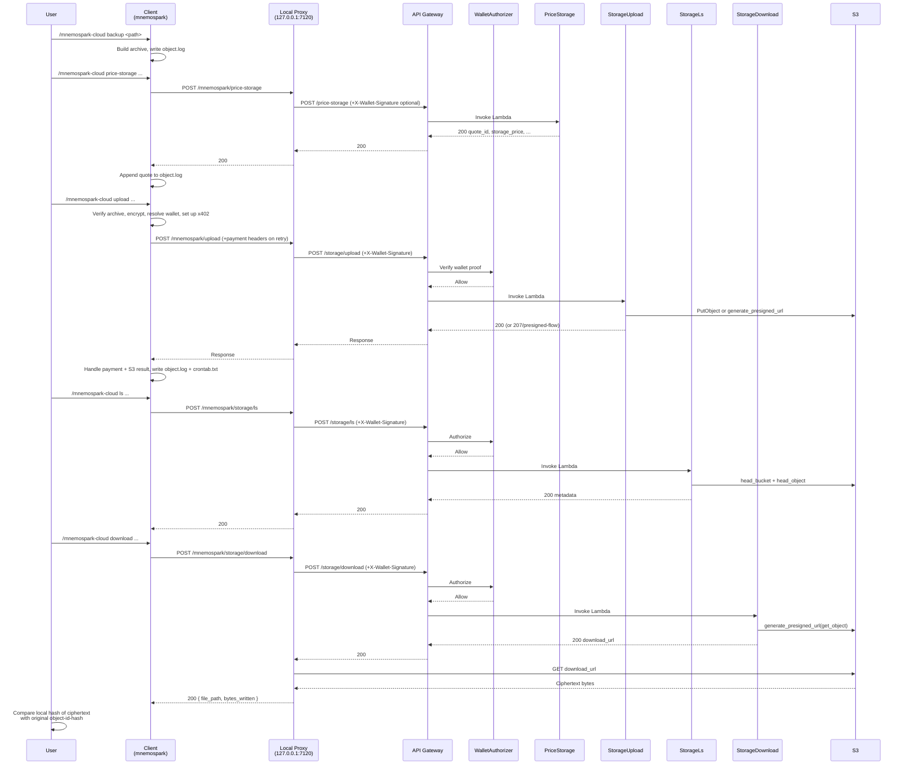

# End-to-end staging milestone: backup → quote → upload → ls → download → hash match

**Date:** 2026-03-16  
**Revision:** rev 1  
**Milestone:** e2e-staging-2026-03-16 (mnemospark & mnemospark-backend)  
**Git tags:**  
- `mnemospark`: `milestone/e2e-staging-2026-03-16`  
- `mnemospark-backend`: `milestone/e2e-staging-2026-03-16`

This spec captures the known-good baseline for the first full staging end-to-end test:

> **backup → price-storage quote → upload (payment) → ls → download → local hash match**

and ties it to the code versions referenced by the tags above.

## Overview

At this milestone, the mnemospark client, proxy, and backend support a complete encrypted cloud storage flow:

1. **Backup**: Local tar+gzip archive built and logged.
2. **Price-storage**: Backend computes a quote for S3 storage + outbound transfer and persists it.
3. **Upload**: Client encrypts the backup, settles payment (USDC on Base, onchain or mock), and stores ciphertext in a wallet-scoped S3 bucket.
4. **Ls**: Backend returns object size and bucket metadata.
5. **Download**: Proxy fetches the encrypted object from S3 via a presigned URL and writes it to local disk.
6. **Hash match**: Local tooling confirms that the downloaded ciphertext matches what was uploaded (integrity).

Each step is documented in more detail in the existing process-flow specs under `meta_docs/`.

## References

- Backup: `meta_docs/cloud-backup-process-flow.md`  
- Quote: `meta_docs/cloud-price-storage-process-flow.md`  
- Upload: `meta_docs/cloud-upload-process-flow.md`  
- List: `meta_docs/cloud-ls-process-flow.md`  
- Download: `meta_docs/cloud-download-process-flow.md`  
- Delete: `meta_docs/cloud-delete-process-flow.md`  
- Wallet proof auth: `meta_docs/wallet-proof.md`  
- Payment auth (x402): `meta_docs/payment-authorization-eip712-trace.md`

Raw GitHub URLs for automated agents:

- Backup: `https://raw.githubusercontent.com/pawlsclick/mnemospark-docs/refs/heads/main/meta_docs/cloud-backup-process-flow.md`
- Price-storage: `https://raw.githubusercontent.com/pawlsclick/mnemospark-docs/refs/heads/main/meta_docs/cloud-price-storage-process-flow.md`
- Upload: `https://raw.githubusercontent.com/pawlsclick/mnemospark-docs/refs/heads/main/meta_docs/cloud-upload-process-flow.md`
- Ls: `https://raw.githubusercontent.com/pawlsclick/mnemospark-docs/refs/heads/main/meta_docs/cloud-ls-process-flow.md`
- Download: `https://raw.githubusercontent.com/pawlsclick/mnemospark-docs/refs/heads/main/meta_docs/cloud-download-process-flow.md`
- Delete: `https://raw.githubusercontent.com/pawlsclick/mnemospark-docs/refs/heads/main/meta_docs/cloud-delete-process-flow.md`
- Wallet proof: `https://raw.githubusercontent.com/pawlsclick/mnemospark-docs/refs/heads/main/meta_docs/wallet-proof.md`
- Payment auth: `https://raw.githubusercontent.com/pawlsclick/mnemospark-docs/refs/heads/main/meta_docs/payment-authorization-eip712-trace.md`

## High-level sequence

This diagram is descriptive of the milestone behavior rather than prescriptive; see the individual flow docs for full parameter and error-handling details.

