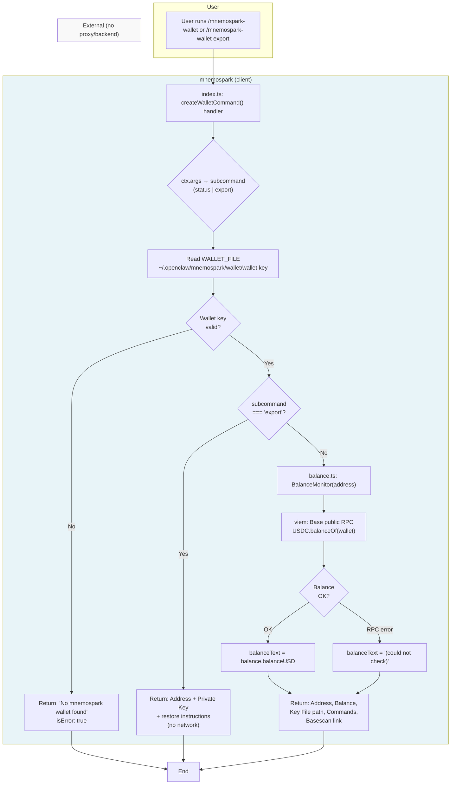

# Wallet and Export Process Flow

**Date:** 2026-03-16  
**Revision:** rev 1  
**Milestone:** e2e-staging-2026-03-16 (mnemospark)  
**Repos / components:** mnemospark (client)

End-to-end documentation of the `/mnemospark-wallet` and `/mnemospark-wallet export` commands.

**Goal**: Show the user their crypto wallet details (address, balance, key file location) and let them store the key safely via export. Private key and wallet data never leave the client; the proxy and mnemospark backend are **not** involved in these commands.

---

## 1. Command Overview

| Command | Purpose |
|--------|---------|
| `/mnemospark-wallet` or `/mnemospark-wallet status` | Show wallet address, USDC balance on Base, and key file path |
| `/mnemospark-wallet export` | Show private key for backup and restore instructions |

### Important: No Proxy or Backend

These commands run **entirely in the client** (mnemospark plugin). They do **not** call the local proxy or the mnemospark AWS backend. The only external call is for **balance**: the client uses the **Base public RPC** (viem) to read USDC balance from the chain. No wallet proof, no storage API, no Lambda.

---

## 2. Required Parameters

| Parameter | Required | Description |
|-----------|----------|-------------|
| **Subcommand** | No (default: `status`) | Optional: `status` (default) or `export`. Parsed from `ctx.args` after trimming and lowercasing. |
| **Auth** | Yes | Command is registered with `requireAuth: true`; OpenClaw must be in an authenticated context. |
| **Wallet key on disk** | Yes (current behavior) | The handler only reads from the file `~/.openclaw/mnemospark/wallet/wallet.key`. If that file is missing or invalid, the command returns an error. It does **not** currently resolve the key from `MNEMOSPARK_WALLET_KEY` or from the legacy path `~/.openclaw/blockrun/wallet.key`. |

So effectively:

- **No CLI flags** are required; the only “parameter” is the optional subcommand (`export` vs default status).
- **Wallet key** must be present in `~/.openclaw/mnemospark/wallet/wallet.key` (0x-prefixed, 66-character hex). If the user relies only on `MNEMOSPARK_WALLET_KEY` or only has a legacy Blockrun wallet file, the command will report “No mnemospark wallet found.”

---

## 3. Files Used Across the Path

### Client (mnemospark)

| File | Role |
|------|------|
| `src/index.ts` | Registers the `/mnemospark-wallet` command and defines the handler (`createWalletCommand()`). Reads `WALLET_FILE`, derives address via viem, branches on `export` vs status, calls `BalanceMonitor` for status. |
| `src/auth.ts` | Exports `WALLET_FILE` and `LEGACY_WALLET_FILE`. Defines `WALLET_DIR` = `~/.openclaw/mnemospark/wallet`, `WALLET_FILE` = `~/.openclaw/mnemospark/wallet/wallet.key`. Not used by the wallet handler for key resolution (handler reads only `WALLET_FILE` directly). |
| `src/balance.ts` | `BalanceMonitor`: reads USDC balance on Base via viem `createPublicClient` + `http()` (public RPC). Used when subcommand is not `export`. |
| `node:fs` | `existsSync`, `readFileSync` in the handler to read the wallet key file. |
| `viem/accounts` | `privateKeyToAccount(walletKey)` to derive address from private key. |

### Proxy and Backend

- **Proxy** (`src/proxy.ts`): Not used for `/mnemospark-wallet` or `/mnemospark-wallet export`.
- **Backend** (mnemospark-backend): Not used for these commands. Wallet-proof and storage APIs are for cloud/upload flows only.

### Disk Paths

| Path | Purpose |
|------|---------|
| `~/.openclaw/mnemospark/wallet/wallet.key` | Only wallet key source currently read by the wallet command handler. Must contain a single line: 0x-prefixed 64-hex private key (66 chars total). |

---

## 4. Step-by-Step Flow

### 4.1 `/mnemospark-wallet` (status) and `/mnemospark-wallet export` — Shared Start

1. **Command registration**  
   - In `register()` in `src/index.ts`, `createWalletCommand()` is awaited and the returned command is passed to `api.registerCommand()`.  
   - If registration fails, `api.logger.warn` is called with the error message; no other logging occurs in the registration path for the wallet command.

2. **Handler invocation**  
   - When the user runs `/mnemospark-wallet` or `/mnemospark-wallet export`, OpenClaw invokes the command handler with a `PluginCommandContext` (including `ctx.args`).

3. **Subcommand parsing**  
   - `subcommand = ctx.args?.trim().toLowerCase() || "status"`  
   - So no args (or empty) → `"status"`; `"export"` → `"export"`; anything else (e.g. `"status"`) is passed through as-is (and for non-export, flow falls through to status).

4. **Read wallet key**  
   - Handler checks `existsSync(WALLET_FILE)`.  
   - If true, reads with `readFileSync(WALLET_FILE, "utf-8").trim()`.  
   - Validates: key must start with `0x` and have length 66.  
   - Derives address: `privateKeyToAccount(walletKey).address.replace(/\s/g, "")`.  
   - Any read/parse error is swallowed; `walletKey` or `address` stays undefined.

5. **No wallet found**  
   - If `!walletKey || !address`, handler returns:
     - `{ text: "No mnemospark wallet found. Run \`openclaw plugins install mnemospark\`.", isError: true }`  
   - No proxy or backend is called; no logging in the handler for this case.

### 4.2 `/mnemospark-wallet export` — Export Path

6. **Export branch**  
   - If `subcommand === "export"`, handler returns immediately with a single `text` block that includes:
     - Title: ☁️ **mnemospark Wallet Export**
     - Security warning (private key controls funds; never share).
     - **Address:** \`{address}\`
     - **Private Key:** \`{walletKey}\`
     - **To restore on a new machine:**  
       - Option 1: `export MNEMOSPARK_WALLET_KEY=...`  
       - Option 2: `mkdir -p ~/.openclaw/mnemospark/wallet && echo "..." > ~/.openclaw/mnemospark/wallet/wallet.key && chmod 600 ...`
   - No network calls, no proxy, no backend. No logging in the handler for export.

### 4.3 `/mnemospark-wallet` (status) — Status Path

6. **Balance check**  
   - Handler creates `new BalanceMonitor(address)`.  
   - Calls `await monitor.checkBalance()`.  
   - `BalanceMonitor` (in `src/balance.ts`):
     - Uses viem `createPublicClient` with `chain: base` and `transport: http(undefined, { timeout: 10_000 })` (public Base RPC).
     - Reads USDC balance via `readContract` on `USDC_BASE` (`0x833589fCD6eDb6E08f4c7C32D4f71b54bdA02913`) with `balanceOf(walletAddress)`.
     - Caches result for 30 seconds (TTL); first call or after TTL hits the RPC.
   - On success: `balanceText = \`Balance: ${balance.balanceUSD}\``.  
   - On failure (e.g. RPC error): `balanceText = "Balance: (could not check)"`; exception is caught and not rethrown; no logging in the handler.

7. **Success response**  
   - Handler returns a single `text` block:
     - ☁️ **mnemospark Wallet**
     - **Address:** \`{address}\`
     - **{balanceText}** (e.g. `Balance: $X.XX` or `Balance: (could not check)`)
     - **Key File:** \`{WALLET_FILE}\` (path to wallet.key)
     - **Commands:** `/mnemospark-wallet`, `/mnemospark-wallet export`
     - **Fund with USDC on Base:** https://basescan.org/address/{address}

---

## 5. Logging

| Location | When | What |
|----------|------|------|
| `src/index.ts` (registration) | If `createWalletCommand()` or `api.registerCommand(walletCommand)` fails | `api.logger.warn` with error message. |
| Wallet command handler | — | **No logging** for success, failure, or export. Balance failures are swallowed and only reflected in the returned text ("could not check"). |
| `src/balance.ts` | — | No application logging; only viem/RPC interaction. |
| Proxy / backend | — | Not in the path for these commands. |

So: logging for the wallet feature is limited to **registration failure**. There is no log when a user runs status or export, and no log when balance check fails.

---

## 6. Success and Failure

### Success

- **Status**  
  - Wallet file exists and is valid, address derived.  
  - Balance is either shown (from Base RPC) or shown as "(could not check)" if RPC fails.  
  - Return: markdown block with address, balance line, key file path, commands, and Basescan link.

- **Export**  
  - Same wallet validation.  
  - Return: markdown block with address, private key, and restore instructions. No network calls.

### Failure

- **No wallet**  
  - File missing or key invalid/not 66-char hex → return `{ text: "No mnemospark wallet found...", isError: true }`.  
  - No proxy or backend; no log in handler.

- **Status: balance check failed**  
  - RPC error (e.g. timeout, network) → handler catches, sets `balanceText = "Balance: (could not check)"`, still returns success with that line. So from the user’s perspective the command “succeeded” but balance is unknown.

- **Export**  
  - No separate failure path beyond “no wallet”; if wallet is found, export always returns the key and instructions.

---

## 7. What the Commands Return

- **Return type**: Plugin command returns an object `{ text: string, isError?: boolean }`.

- **Status**  
  - `text`: Multiline markdown (address, balance, key file, commands, Basescan link).  
  - `isError`: not set (falsy).

- **Export**  
  - `text`: Multiline markdown (title, warning, address, private key, restore steps).  
  - `isError`: not set.

- **No wallet**  
  - `text`: "No mnemospark wallet found. Run \`openclaw plugins install mnemospark\`."  
  - `isError`: true.

---

## 8. Flow Summary (Mermaid)

**Note**: The proxy and mnemospark-backend do not appear in this flow; they are not used for `/mnemospark-wallet` or `/mnemospark-wallet export`.

---

## 9. Recommended Code Changes

These items would align behavior with the goal of “show wallet details and let the user store the key safely,” and with how the rest of the plugin resolves the wallet.

### mnemospark

1. **Wallet resolution in the wallet command**  
   The handler only reads `WALLET_FILE`. Elsewhere (e.g. proxy startup, cloud commands), the wallet is resolved via `resolveOrGenerateWalletKey()` (env → `WALLET_FILE` → `LEGACY_WALLET_FILE`). So if a user has:
   - only `MNEMOSPARK_WALLET_KEY` set, or  
   - only a legacy file at `~/.openclaw/blockrun/wallet.key`,  
   the wallet command returns “No mnemospark wallet found” even though the proxy and cloud commands can use that wallet.  
   **Recommendation**: In the wallet command handler, resolve the wallet the same way (e.g. call a shared resolver that checks env, then `WALLET_FILE`, then `LEGACY_WALLET_FILE`), and use that key/address for both status and export. That way status and export work for env-only and legacy-file users.

2. **Audit logging for export**  
   Export exposes the private key to the user for backup. There is no log that export was run, which can make support or security reviews harder.  
   **Recommendation**: When building the wallet command in `register()`, close over `api` and in the handler’s export branch call `api.logger.info("mnemospark-wallet export requested")` (do not log the key or address). `PluginCommandContext` does not expose a logger, so using the plugin `api` from the closure is the way to add this.

3. **Optional: explicit “status” in help**  
   The UI already says “/mnemospark-wallet - Show this status”. No code change strictly required; the doc and flow above assume “status” is the default when args are empty or equal “status”.

### mnemospark-backend

- No changes recommended for these commands; the backend is not involved in `/mnemospark-wallet` or `/mnemospark-wallet export`.

---

## Spec references

- This doc: `meta_docs/wallet-and-export-process-flow.md`  
  Raw URL: `https://raw.githubusercontent.com/pawlsclick/mnemospark-docs/refs/heads/main/meta_docs/wallet-and-export-process-flow.md`
- Milestone overview: `meta_docs/e2e-staging-milestone-2026-03-16.md`  
  Raw URL: `https://raw.githubusercontent.com/pawlsclick/mnemospark-docs/refs/heads/main/meta_docs/e2e-staging-milestone-2026-03-16.md`
