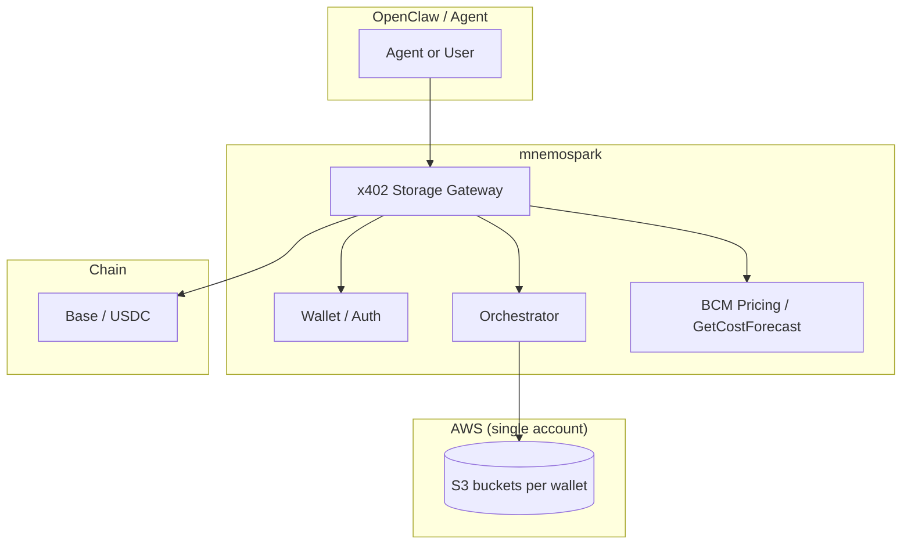

# mnemospark – Product Specification v3

**Document version:** 3.1  
**Last updated:** February 2026  
**Audience:** Product Managers, leadership, feature development

**Changelog (v3.1 – Sr. Engineer feedback from spec_feedback_for_sr_engineer.md):**

- **Encryption:** Remove Phase 1 (SSE-S3/SSE-KMS). **MVP implements Phase 2 only:** client-held envelope encryption (KEK/DEK) from day one; no migration from Phase 1.
- **Activity log:** Resolved — **Option A.** Lightweight JSONL under `~/.openclaw/mnemospark/logs/` for customer requests and debugging (timestamp, request type, wallet, amount, success/failure); rotation/retention TBD (e.g. 90 days).
- **Get storage usage:** Resolved — **free endpoint**; does not incur a fee (no 402). Product: free call to check existing storage use.
- **Idempotency:** Sr. Engineer accepted optional `Idempotency-Key` with TTL (e.g. 24h); duplicate within TTL returns cached success without double charge.
- **Bucket naming:** Convention **`mnemospark-<wallet-id-hash>`** using deterministic hash (e.g. `hashlib.sha256`; short version if needed for S3 length limits). For multi-region, suffix for global uniqueness as needed (see S3 bucket naming rules). Bucket creation: **lazy** — when user accepts price of storage, check for existing S3 bucket for wallet; if yes use it, if not create bucket in the region.
- **Pricing APIs:** S3 storage cost estimate → `examples/s3-cost-estimate-api`; egress data transfer cost → `examples/data-transfer-cost-estimate-api`. GetCostForecast: one monthly fee per wallet; no per-tenant/bucket filter required for MVP.
- **Gateway/orchestrator inputs and errors:** Region (and related inputs) from installed slash commands; error codes and messages — see [mnemospark_full_workflow.md](./mnemospark_full_workflow.md).

**Changelog (v3.0):**

- Replace AWS Organizations + sub-accounts model with **one AWS account, one S3 bucket per wallet**.
- Adopt **AWS S3 + client-held envelope encryption** as the long-term storage model (“their data, their key”).
- **MVP encryption:** Client-held envelope encryption (KEK/DEK, key store in file or 1Password) from day one; mnemospark never stores keys.
- Keep v2 decisions for **x402 flows, pricing via BCM Pricing Calculator + GetCostForecast, S3-only MVP, 2–3 regions**, but simplify infra and identity.

mnemospark remains a **storage orchestration** product for **OpenClaw** and its agents. Agents pay for their own persistence and data sovereignty using **x402 payment-as-authentication**. The product will support **many storage providers and many regions** over time; **MVP** still uses **AWS S3 only** (no Glacier) in **two to three regions** as a proof of concept. Revenue is **metered via x402**: per-request activity fees (quote via AWS BCM Pricing Calculator API + markup) and **one monthly storage fee** per wallet (GetCostForecast + markup). **Get storage usage** is a **free** endpoint (no 402). No region premium in MVP.

---

## 1. Core concept

### 1.1 x402 payment-as-authentication handshake

- x402 is used as **payment-as-authentication**. The handshake: “Pay to prove entitlement to use this storage endpoint.” Payment both **authorizes** the operation and **meters** it. No separate API keys or OAuth for storage access—the micropayment is the credential.
- **Verification:** Verification happens **on-chain** before granting access to cloud account resources and storage. Once payment is verified, S3 operations are performed in mnemospark’s single AWS account (no Organizations, no sub-accounts).
- **Protocol alignment (x402 v2):** Mnemospark aligns with x402 v2 terminology and ecosystem conventions. Preferred header names: **`PAYMENT-REQUIRED`** (server sends payment requirements in 402 response), **`PAYMENT-SIGNATURE`** (client sends signed payment on retry), **`PAYMENT-RESPONSE`** (server sends settlement details in 200 response). Legacy headers (`x-payment-required`, `x-payment`, `x-payment-response`) are accepted for backward compatibility. Networks use **CAIP-2** identifiers (e.g. Base mainnet **`eip155:8453`**, Base Sepolia **`eip155:84532`**).

### 1.2 Storage orchestration (product)

- **Storage orchestration** means the product decides **where** (provider, region) and **how** (storage class, tier) to store agent data and executes the operations after payment.
  - **Provider selection:** Start with AWS S3; later add other providers (e.g. GCS, Azure Blob) and Glacier/archive tiers.
  - **Regional storage (feature):** Choose region(s) for data (sovereignty, latency, compliance). MVP offers two to three regions; product will support multiple providers and many regions over time.
  - **Storage class selection:** Map agent needs to S3 storage classes (e.g. Standard, Standard-IA). Glacier is out of scope for MVP.
  - **Sync semantics:** Upload, download, list—each metered as **activity** (per-request x402).

### 1.3 Goal: Agents pay for their own persistence and sovereignty

- **Persistence:** Agent state, memories, and artifacts are stored in cloud storage; the **agent (or its wallet)** pays for that storage and for each sync.
- **Sovereignty:** Region choice gives control over where data lives. Region premium may be added later; MVP uses cost + markup only.
- **Autonomous:** No human-in-the-loop to top up a provider API key; the agent’s wallet is funded with USDC and pays via x402 per operation.

---

## 2. Revenue model (metered x402 payments)

Unchanged from v2, except that infra is now a single AWS account with buckets per wallet.

All charges are collected via **per-request x402 micropayments** (e.g. USDC on Base). Two fee types:

### 2.1 Activity fee: Pay-per-sync (per-request x402)

- **What counts as “sync”:** Each discrete storage operation that consumes bandwidth or compute.
  - **Upload (PUT):** When the agent requests storage, we know the size of the files. A **quote** is produced using the **AWS BCM Pricing Calculator API** for S3 (service "Amazon Simple Storage Service", attributes: storage class, region, usage quantity, and optional discounts). Generate estimates for storage, requests, and data transfer. Apply a **markup percentage** for using the service. Charge the OpenClaw wallet via x402 before performing the operation.
  - **Download (GET):** **Egress** (data transferred **out** of AWS) is quoted via the BCM Pricing Calculator API, markup applied, and the OpenClaw agent wallet is charged via x402 for the download.
  - **List / enumerate:** Pay per LIST (or per 1000 keys); quote via BCM + markup.
- **No pre-paid balance for MVP:** Every operation is a 402; no off-chain balance ledger.

### 2.2 Storage fee: Monthly (forecast + markup)

- **Source:** Use **AWS Cost Explorer Forecast API** (**GetCostForecast**): retrieves predicted spending over a specified time period (e.g. up to 3 months daily or 18 months monthly) based on historical usage. Specify TimePeriod, Metric (e.g. BLENDED_COST), Granularity (DAILY/MONTHLY), and optional Filter (by service, region, tags, etc.) to get forecasts with confidence intervals.
- **Monthly fee:** The **forecasted amount of usage** for storage is the basis for the **storage fee**. Apply a **markup percentage** for using the service. This is the **monthly fee** charged to the OpenClaw wallet for hosting the storage (one x402 per month per wallet/tenant).
- **MVP:** No region premium; cost + markup only.

### 2.3 Summary table

| Fee type | Metered by / source                 | Example x402 trigger            |
| -------- | ----------------------------------- | ------------------------------- |
| Activity | BCM Pricing Calculator API + markup | 402 before upload/download/list |
| Storage  | GetCostForecast + markup (monthly)  | Monthly 402 for storage hosting |

---

## 3. MVP scope and phases

### 3.1 Why S3 for MVP

- **Mature APIs:** PUT, GET, LIST, multipart upload. Easy to map “sync” to S3 operations.
- **Regions:** MVP supports **two to three regions** as a proof of concept. Use **CloudFormation templates or CDK** to map infrastructure to each region (simple, repeatable) if needed; for v3, a single AWS account is sufficient.
- **Pricing alignment:** BCM Pricing Calculator API supports full S3 cost modeling; GetCostForecast supports monthly storage fee projection.

### 3.2 MVP plan (Phase 2 only — client-held encryption)

MVP implements **client-held envelope encryption** from day one; there is no Phase 1 (SSE-S3/SSE-KMS) or migration from Phase 1.

- **Infra:** One AWS account; **one S3 bucket per wallet** (per region as configured). Bucket naming: **`mnemospark-<wallet-id-hash>`** using a deterministic hash (e.g. `hashlib.sha256`; short version if needed for S3 3–63 character rules). For multi-region, suffix for global uniqueness as needed. **Bucket creation is lazy:** when the user accepts the price of storage, check if an S3 bucket exists for the wallet in the region; if yes use it, if not create it.
- **Encryption:** **Client-held envelope encryption** (KEK/DEK) as specified in [mvp_option_aws_client_encryption.md](./archive/mvp_option_aws_client_encryption.md):
  - Backend generates a **KEK** per wallet **once**, returns it in the API response, and **never persists** it.
  - Client stores KEK in a configurable **key store** (file under `~/.openclaw/mnemospark/keys/` or 1Password via CLI/Connect).
  - For each object, client generates a **DEK**, encrypts payload, wraps DEK with KEK, and sends **ciphertext + wrapped_DEK**; mnemospark stores only ciphertext and wrapped_DEK (body + metadata).
- **Goal:** “Their data, their key” and end-to-end: **pay via x402 → quote via BCM → upload/download/list via S3** in 2–3 regions, with one monthly storage fee via GetCostForecast.
- **Pricing APIs (reference):** S3 storage cost estimate — `examples/s3-cost-estimate-api`; egress data transfer cost — `examples/data-transfer-cost-estimate-api`.

### 3.3 MVP capabilities

1. **Storage backend (S3 only)**
   - Single “storage provider” interface: create bucket (or use existing), PUT, GET, LIST, delete, get metadata. First implementation: **AWS S3**. Use **@aws-sdk/client-s3** (v3). Credentials: **IAM role or user** in the single account. Agent pays mnemospark via x402; mnemospark pays AWS (or passes through cost + markup).
   - **Bucket strategy:** **One bucket per wallet** (per region). Bucket naming: **`mnemospark-<wallet-id-hash>`**; lazy creation on first accepted storage (see Section 3.2). Data keyed within bucket by agent: e.g. `agent=<agent-id>/...`.

2. **x402 gateway for storage**
   - All storage API calls go through an **x402 gateway**. Gateway returns **402** with payment options in the **`PAYMENT-REQUIRED`** header (or legacy `x-payment-required`); amount from BCM quote + markup. Agent (or proxy) signs payment and retries with **`PAYMENT-SIGNATURE`** (or legacy `x-payment`); gateway verifies **on-chain**, then performs the S3 operation. Network is expressed as **CAIP-2** (e.g. `eip155:8453` for Base). **Region** (and related inputs) come from the installed slash commands — see [mnemospark_full_workflow.md](./mnemospark_full_workflow.md).
   - **Payment verification:** On-chain per request. Request types: (1) establish storage and store data, (2) update stored data, (3) monthly service fee for stored data, (4) download stored data.

3. **Orchestration (region + storage class)**
   - **Region selection:** Two to three regions for MVP.
   - **Storage class:** MVP uses S3 Standard (or one other non-Glacier class as needed). No Glacier.
   - **Orchestrator:** Given “sync this blob in region X,” chooses bucket (per wallet) and object key; performs the operation after payment.

4. **Metering and pricing**
   - **Activity:** Quote via **BCM Pricing Calculator API** (see `examples/s3-cost-estimate-api` and `examples/data-transfer-cost-estimate-api`). Apply markup; return in 402 body; after on-chain verification, perform operation. **Storage usage source of truth:** **AWS APIs only** (e.g. S3 API, Cost Explorer); **no internal ledger** for GB stored.
   - **Storage fee:** One **monthly fee** per wallet via **GetCostForecast** + markup; one x402 per month for storage hosting. No per-tenant/bucket filter required for MVP.
   - **Activity log:** Lightweight JSONL under `~/.openclaw/mnemospark/logs/` (timestamp, request type, wallet, amount, success/failure) for customer requests and debugging; rotation/retention TBD (e.g. 90 days).

5. **Agent-facing API**
   - **REST** API: “Upload object,” “Download object,” “List prefix,” “Get storage usage.” Upload, download, and list require per-request x402. **Get storage usage is free** (no 402). Idempotency via optional `Idempotency-Key` header (see Section 10.3). Error codes and messages — see [mnemospark_full_workflow.md](./mnemospark_full_workflow.md).

### 3.4 Out of scope for MVP (later)

- **S3 Glacier** (restore semantics, archive tiers).
- Other storage backends (GCS, Azure Blob, IPFS/Crust).
- Region premium; pre-paid balance; off-chain ledger.
- Full CRR/SRR and Multi-Region Access Points.
- Non-AWS storage encryption models.

---

## 4. OpenClaw product and integration

Same as v2, with storage details updated for buckets-per-wallet and client-held keys in Phase 2.

### 4.1 Product for OpenClaw and its agents

mnemospark is a product **for OpenClaw and its agents**. It should be **easy to install into OpenClaw and use**, in the same way as the prior plugin (ClawRouter): install via OpenClaw’s plugin system, fund a wallet, and use storage from the assistant (commands, tools, or agent-accessible API).

- **OpenClaw** is the personal AI assistant platform (openclaw.ai, GitHub `openclaw/openclaw`). It provides the Gateway (control plane), channels, agents, skills, and tools.
- **Install and use:** Users install mnemospark as an OpenClaw plugin. The plugin registers commands (e.g. `/wallet`, `/storage`) and starts the storage gateway when the OpenClaw gateway runs. **OpenClaw plugin surface** aligns with the OpenClaw plugin API (commands, optional tools, service with `stop()` for gateway shutdown).

### 4.2 OpenClaw directory and file structure (reference)

Unchanged from v2; mnemospark config and wallet/key files live under `~/.openclaw/mnemospark/`.

---

## 5. Architecture at a glance

### 5.1 Tenant and identity model (simplified)

- **One AWS account** for all customers in MVP.
- **Wallet = storage tenant.** Each OpenClaw wallet corresponds to a logical tenant in mnemospark.
- **S3 buckets:**
  - **One bucket per wallet** (per region as needed), named **`mnemospark-<wallet-id-hash>`** (deterministic hash, e.g. `hashlib.sha256`; short version if needed for S3 3–63 char rules; for multi-region, suffix for global uniqueness as needed). **Lazy creation:** when user accepts price of storage, check for existing bucket for wallet in region; if not present, create it.
  - Within that bucket, objects are keyed by agent and path: `agent=<agent-id>/...`.
- **Identity to AWS:** mnemospark uses IAM credentials (role/user) in the single account to operate on S3, enforcing per-wallet isolation via bucket-per-wallet naming and access policy.

### 5.2 Backend API architecture (path-based routing)

**mnemospark-backend** exposes **one internet-facing REST API** (API Gateway). The proxy/client call a single API base URL; **API Gateway routes each request by path** to a **specific Lambda function**. Each Lambda has a single responsibility and a least-privilege IAM role (e.g. cost Lambdas need only BCM; storage Lambda needs S3 and Secrets Manager; quote/payment Lambda needs DynamoDB and chain access).

| Client command / use | Method and path                                     | Lambda responsibility                                                                                              |
| -------------------- | --------------------------------------------------- | ------------------------------------------------------------------------------------------------------------------ |
| price-storage        | `POST /price-storage`                               | Price-storage Lambda: calls storage cost + transfer cost, adds markup, creates quote, writes to DynamoDB (1h TTL). |
| (building block)     | `POST /estimate/storage`                            | S3 storage cost Lambda: BCM Pricing Calculator only.                                                               |
| (building block)     | `POST /estimate/transfer`                           | Data transfer cost Lambda: BCM Pricing Calculator only.                                                            |
| upload               | `POST /storage/upload`                              | Upload Lambda: quote lookup (DynamoDB), payment verification (EIP-712/USDC), S3 upload, DynamoDB transaction log.  |
| ls                   | `GET /storage/ls` or `POST /storage/ls`             | Object storage Lambda: list object metadata (name + size).                                                         |
| download             | `GET /storage/download` or `POST /storage/download` | Object storage Lambda: get object, decrypt, stream or return.                                                      |
| delete               | `POST /storage/delete` or `DELETE /storage/delete`  | Object storage Lambda: delete object (and bucket if empty).                                                        |

Reference: [mnemospark_full_workflow.md](./mnemospark_full_workflow.md) § mnemospark-backend API architecture.

### 5.3 Core components

- **Storage gateway + orchestrator.** Gateway receives storage requests, returns 402 with price (BCM quote + markup), accepts payment, verifies on-chain, then calls **orchestrator**. Orchestrator selects region and bucket (per wallet) and invokes **S3**.
- **Deployment:** OpenClaw plugin + local gateway. When the OpenClaw gateway runs, the plugin starts the storage gateway (e.g. HTTP REST on localhost). **mnemospark proxy listens on port 7120** (does not conflict with BlockRun proxy on 8402).
- **Payment layer:** Wallet, x402 signing, on-chain verification, 402 retry flow (reused from existing codebase).
- **Encryption layer:** Client-held envelope encryption (KEK/DEK) and key store (file or 1Password) in the OpenClaw plugin.

---

## 6. How data flows

### 6.1 Sync (upload) – client-held envelope encryption

1. Client loads **KEK** from key store (file or 1Password).
2. Client generates **DEK**, encrypts payload → ciphertext, wraps DEK with KEK → wrapped_DEK.
3. Agent sends “upload object” to **x402 Storage Gateway** (e.g. `PUT /v1/store/...` with **ciphertext + wrapped_DEK**).
4. Gateway calls **BCM Pricing Calculator API** (see `examples/s3-cost-estimate-api`) to get quote for initial sync and storage (service, region, usage). Applies **markup**.
5. Gateway responds **402** with payment options (amount, payTo, asset, network).
6. Agent (or proxy) signs payment with wallet; retries request with payment header.
7. Gateway verifies payment **on-chain**.
8. Orchestrator checks for **bucket** for wallet in region (lazy create if missing); selects object key; calls **S3 PutObject** with ciphertext and wrapped_DEK (metadata or body prefix per [mvp_option_aws_client_encryption.md](./archive/mvp_option_aws_client_encryption.md)). Gateway never sees KEK or plaintext.
9. Gateway returns 200 + metadata. **Storage usage** is derived from **AWS APIs** (no internal ledger). Append one line to activity log (JSONL under `~/.openclaw/mnemospark/logs/`).

### 6.2 Download (egress)

- Agent requests download. Gateway quotes **egress** (data transfer out) via **BCM Pricing Calculator API** (see `examples/data-transfer-cost-estimate-api`), applies markup, returns 402. Agent pays; gateway verifies on-chain and performs GET; charges wallet.
- Gateway returns **ciphertext + wrapped_DEK**; client decrypts using KEK and DEK.

### 6.3 Get storage usage

- **Free endpoint** (no 402). Client can call to check existing storage use; no fee.

### 6.4 Monthly storage fee

- Use **GetCostForecast** for forecasted storage cost; apply **markup**. Charge OpenClaw wallet via **one x402 per month** for storage hosting (one monthly fee per wallet).

---

## 7. Technologies

| Layer            | Technology                                                    | Note                                                                                                                                                                        |
| ---------------- | ------------------------------------------------------------- | --------------------------------------------------------------------------------------------------------------------------------------------------------------------------- |
| Payment          | x402 (EIP-712 USDC on Base)                                   | Payment-as-auth; on-chain verification per request. x402 v2 headers (`PAYMENT-REQUIRED`, `PAYMENT-SIGNATURE`, `PAYMENT-RESPONSE`); CAIP-2 network IDs (e.g. `eip155:8453`). |
| Wallet           | viem, existing auth module                                    | Wallet pays for storage operations.                                                                                                                                         |
| Storage (MVP)    | AWS S3 only                                                   | **@aws-sdk/client-s3** (v3). IAM in single account. No Glacier in MVP.                                                                                                      |
| Encryption (MVP) | Client-held envelope encryption (KEK/DEK)                     | As in [mvp_option_aws_client_encryption.md](./archive/mvp_option_aws_client_encryption.md); KEK in OpenClaw file/1Password; no Phase 1 (SSE-S3/SSE-KMS).                    |
| Pricing          | BCM Pricing Calculator API, Cost Explorer GetCostForecast API | S3 cost: `examples/s3-cost-estimate-api`; egress: `examples/data-transfer-cost-estimate-api`; GetCostForecast for monthly storage; apply markup.                            |
| Orchestration    | New module                                                    | Region + bucket (one per wallet); calls S3 API.                                                                                                                             |
| Gateway          | HTTP REST server (existing proxy pattern)                     | 402 + BCM quote + orchestrator + S3.                                                                                                                                        |
| Host             | OpenClaw                                                      | Plugin aligns with OpenClaw plugin API.                                                                                                                                     |
| Testing          | Vitest                                                        | Integration tests against **real S3**.                                                                                                                                      |

---

## 8. Design and structure (code / feature areas)

Largely unchanged from v2, with updates to bucket strategy and encryption.

- **Keep:** `x402`, `auth`, `balance`, `payment-cache`, `config`, `logger`; proxy-style HTTP server and 402 retry flow.
- **Remove or replace:** LLM router, model list, BlockRun provider, LLM proxy target (see v2 Section 12).
- **Add / update:**
  - **Storage gateway:** REST API for store/get/list; 402 before each operation; BCM quote + markup; on-chain verification; call orchestrator after payment.
  - **Orchestrator:** Inputs: region, key, body. Output: S3 PutObject/GetObject/ListObjects with chosen bucket (per wallet).
  - **Storage backend (S3):** Wrapper around **@aws-sdk/client-s3** (v3); one bucket per wallet; IAM in single account.
  - **Pricing module:** BCM Pricing Calculator API (activity, egress); GetCostForecast (monthly storage); markup config.
  - **Encryption module:** Key provisioning endpoint (generate KEK once per wallet), client-side library for KEK/DEK handling, key-store abstraction (file + 1Password).
- **Config:** Region list (2–3 for MVP), storage-class mapping (S3 Standard), markup percentage. Region and related inputs from slash commands ([mnemospark_full_workflow.md](./mnemospark_full_workflow.md)).

---

## 9. Trade-offs and implications

- **Simplified AWS model:** One account + buckets-per-wallet is operationally simpler than AWS Organizations + sub-accounts, but centralizes blast radius; mitigation via IAM and bucket policies.
- **Client-held envelope encryption (MVP):** Strong “their data, their key” guarantee; more client complexity (key backup, loss implications) but no keys on mnemospark side.
- **One bucket per wallet:** Clear tenant isolation and naming; more buckets to manage; easy mapping from wallet to S3 bucket.
- **No internal ledger:** Reliance on AWS APIs (S3, Cost Explorer) for usage and billing. **Activity log:** JSONL under `~/.openclaw/mnemospark/logs/` for audit and debugging (resolved).

---

## 10. Resolved decisions (v3) and remaining open questions

### 10.1 Resolved (v3)

- **Tenant / identity model:** **No AWS Organizations.** Single AWS account. **Wallet = tenant.** One S3 bucket per wallet (per region as configured).
- **Payment verification and settlement:** Verification is **on-chain** before granting access to storage. Once payment is verified, gateway performs S3 operations in the single account.
- **Pre-paid balance vs per-request 402:** **Per-request x402 only.** Quote produced with **BCM Pricing Calculator API** for S3 (service, attributes, usage, discounts). Apply markup; charge OpenClaw wallet per operation. No pre-paid balance for MVP.
- **Storage usage source of truth:** **No internal ledger.** Use **AWS APIs only** (e.g. S3 API, Cost Explorer / GetCostForecast for forecasted usage).
- **Region premium values:** **MVP:** Two or three regions as proof of concept. **No region premium.** Determine cost and apply a **markup percentage** for using the service.
- **Activity fee pricing:** **BCM Pricing Calculator API** for initial sync and storage quote + **markup**. **Egress:** Quote data transfer out via BCM, markup, charge OpenClaw wallet on download. **Storage fee:** **GetCostForecast API** for forecasted usage; storage fee = forecast + markup; monthly x402 to OpenClaw wallet for hosting.
- **Glacier restore semantics:** **No Glacier for MVP.** Deferred.
- **Multi-region MVP:** At least **two to three regions**; simple with buckets per wallet mapped per region.
- **Encryption:** **MVP implements client-held envelope encryption only** (KEK/DEK per [mvp_option_aws_client_encryption.md](./archive/mvp_option_aws_client_encryption.md)). No Phase 1 (SSE-S3/SSE-KMS); no migration.
- **Get storage usage:** **Free endpoint**; no 402; free call to check existing storage use.
- **Activity log:** **Option A.** Lightweight JSONL under `~/.openclaw/mnemospark/logs/` (timestamp, request type, wallet, amount, success/failure) for customer requests and debugging; rotation/retention TBD (e.g. 90 days).
- **Idempotency:** Optional `Idempotency-Key` header; TTL (e.g. 24h); duplicates within TTL return cached success without double-charging (Sr. Engineer accepted).

### 10.2 Technical decisions (from Sr. Engineer feedback)

- **Bucket naming:** `mnemospark-<wallet-id-hash>` using deterministic hash (e.g. `hashlib.sha256`; short version if needed for S3 3–63 char rules). For multi-region, suffix for global uniqueness as needed.
- **Bucket creation:** Lazy — when user accepts price of storage, check for S3 bucket for wallet in region; if yes use it, if not create it.
- **Pricing APIs:** S3 storage cost estimate → `examples/s3-cost-estimate-api`; egress data transfer cost → `examples/data-transfer-cost-estimate-api`.
- **GetCostForecast:** One monthly fee per wallet; no per-tenant/bucket filter required for MVP.
- **Gateway/orchestrator:** Region and related inputs from installed slash commands; error codes and messages — see [mnemospark_full_workflow.md](./mnemospark_full_workflow.md).

### 10.3 Idempotency (recommendation)

Optional `Idempotency-Key` header; duplicates within TTL return cached success without double-charging. TTL default 24h; scope and “same key, different body” behavior per feature 06.

---

## 11. Technology choices (decisions in v3)

| Area                        | Options                                               | Decision (v3)                                                                                                                     |
| --------------------------- | ----------------------------------------------------- | --------------------------------------------------------------------------------------------------------------------------------- |
| **AWS SDK**                 | `@aws-sdk/client-s3` (v3) vs `aws-sdk` (v2)           | **@aws-sdk/client-s3** (v3).                                                                                                      |
| **Server-side AWS auth**    | IAM role vs long-lived access keys in env             | **IAM role/user** in a single account.                                                                                            |
| **Bucket strategy**         | One per wallet / shared / prefix                      | **One bucket per wallet.** Agents keyed within bucket by prefix.                                                                  |
| **Gateway transport**       | HTTP REST vs gRPC vs both                             | **REST.**                                                                                                                         |
| **Metering storage**        | Same process (SQLite/JSONL) vs separate DB vs S3-only | Usage _source of truth_ is AWS APIs only; **JSONL activity log** under `~/.openclaw/mnemospark/logs/` for audit/debug (resolved). |
| **Payment verification**    | On-chain per request vs off-chain batch               | **On-chain per request.**                                                                                                         |
| **Encryption (MVP)**        | Client-held KEK/DEK only (no Phase 1)                 | **Client-held KEK/DEK** per [mvp_option_aws_client_encryption.md](./archive/mvp_option_aws_client_encryption.md).                 |
| **OpenClaw plugin surface** | Commands, tools, service stop                         | Aligns with OpenClaw plugin API.                                                                                                  |
| **Testing**                 | Vitest; localstack vs real S3                         | **Test with real S3 integration.**                                                                                                |

---

## 12. Parts of the existing codebase to prune (later)

Same as v2; see v2 Section 12 for detailed list. Net effect: remove LLM router and related modules; keep x402/payment/auth/config/logging; replace proxy with storage gateway.

---

## 13. Feature development checklist (for PM)

- [ ] **x402 payment-as-auth:** Document handshake (402 → sign → on-chain verify → access); ensure gateway never performs storage without verified payment.
- [ ] **Storage gateway API:** Define REST for upload, download, list, get storage usage (free, no 402); idempotency (`Idempotency-Key`); 402 response shape and payment header.
- [ ] **Activity fee:** Integrate BCM Pricing Calculator API for quote (initial sync, storage, egress); apply markup; expose in 402 body; verify on-chain then perform operation.
- [ ] **Orchestrator:** Region + bucket (one per wallet); integration with S3 backend.
- [ ] **S3 backend:** @aws-sdk/client-s3 (v3); IAM in single account; one bucket per wallet (`mnemospark-<wallet-id-hash>`); lazy bucket creation; no Glacier.
- [ ] **Storage fee:** GetCostForecast for forecasted usage; apply markup; one monthly x402 per wallet.
- [ ] **Encryption (client-held):** Implement KEK provisioning, DEK per object, wrapped_DEK layout (metadata/body), and key-store abstraction (file + 1Password).
- [ ] **OpenClaw integration:** Plugin install, config paths, wallet path, commands (`/wallet`, `/storage`), gateway start/stop; region and inputs from slash commands ([mnemospark_full_workflow.md](./mnemospark_full_workflow.md)); align with OpenClaw plugin API.
- [ ] **Agent-facing docs:** How to fund wallet, call storage API, interpret 402, understand activity vs storage fees, get storage usage (free), and manage keys.
- [ ] **Activity log:** JSONL under `~/.openclaw/mnemospark/logs/`; rotation/retention (e.g. 90 days).

---

## 14. Terminology

Same as v2 with added encryption terms:

- **KEK (Key Encryption Key):** Long-lived key per wallet; generated once by backend, returned to client, never stored by mnemospark; used to wrap DEKs.
- **DEK (Data Encryption Key):** Per-object key used to encrypt payload; wrapped by KEK and stored alongside ciphertext.

The rest of the terminology (x402, storage orchestration, activity fee, storage fee, etc.) remains as defined in v2.
