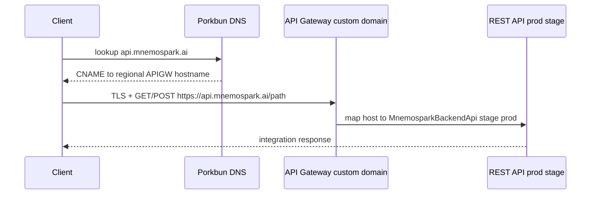
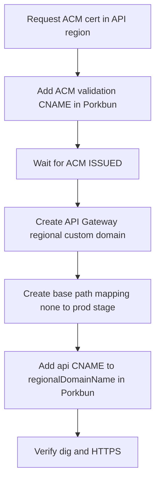

# mnemospark-backend — API Gateway custom domain and Porkbun DNS (`api.mnemospark.ai`)

Date: 2026-04-05  
Revision: rev 1  
Milestone: prod REST API custom domain (regional, no CloudFront)  
Repos / components: **mnemospark-backend** (`MnemosparkBackendApi`, SAM stack **`mnemospark-prod`**), **AWS** (API Gateway, ACM), **Porkbun** (DNS), region **us-east-1** (or the region where the prod REST API lives).

## Overview

Production clients should call the wallet REST API at a **stable hostname**—**`https://api.mnemospark.ai`**—instead of the default **`https://{rest-api-id}.execute-api.{region}.amazonaws.com/prod`** URL. That default URL is correct but **opaque**; if the API were ever recreated, the id could change and break configured clients.

This runbook describes the setup we use: **ACM TLS** in the API’s region, an **API Gateway regional custom domain name**, a **base path mapping** with **`(none)`** so paths match **`docs/openapi.yaml`** without a `/prod` prefix in the URL, and a **Porkbun CNAME** to the **regional domain name** API Gateway assigns to the custom domain (not a raw CNAME to `{rest-api-id}.execute-api…` for TLS on the custom host).

**Not in scope here:** CloudFront in front of the API, staging DNS (staging continues to use the AWS-generated invoke URL unless you add a separate policy), or changing **`mnemospark-backend`** SAM templates to own the domain (see **IaC and stack impact**).

## Prerequisites

- Prod stack deployed (**`mnemospark-prod`**) with regional REST API **`MnemosparkBackendApi`** and stage name **`prod`** (see **`samconfig.prod.toml`**).
- **Porkbun** DNS control for **`mnemospark.ai`**.
- **IAM** permission to create **ACM** certificates and **API Gateway** domain names and base path mappings in the target account and region.
- **Certificate coverage:** The hostname **`api.mnemospark.ai`** must appear on the ACM certificate you attach (as an explicit name or via a **wildcard** `*.mnemospark.ai`). A certificate that only lists the apex and **`www`** does **not** cover **`api`**.

## Architecture (traffic path)

After setup, HTTPS requests use **SNI** with your certificate on API Gateway’s regional custom-domain endpoint. API Gateway maps the hostname to the **`prod`** stage; **regional WAF** on that REST stage (from the SAM template) still applies, because traffic is still the same API stage.

## Diagrams

### Sequence (runtime)



### Flowchart (setup order)



## Step-by-step setup

### 1. Request an ACM certificate (same region as the API)

1. Open **AWS Certificate Manager** in **`us-east-1`** (must match the **regional** REST API and regional custom domain).
2. **Request** a public certificate. Recommended SAN set for this project:
   - **`*.mnemospark.ai`** (covers **`api`**, **`docs`**, **`www`**, and other single-label subdomains)
   - **`mnemospark.ai`** (apex—wildcard does **not** cover the naked domain)
3. Choose **DNS validation**.
4. In **Porkbun**, create the **exact** CNAME record(s) ACM shows (name and value). Wildcard and apex may share one validation record; follow the console.
5. Wait until the certificate status is **Issued**.

**CLI (optional):** `aws acm request-certificate` with `--validation-method DNS`, then `aws acm describe-certificate` to read **`ResourceRecord`** values for Porkbun.

Do **not** paste issued certificate ARNs into tickets or public docs; treat them like any other resource identifier.

### 2. Create the API Gateway regional custom domain

**Console:** API Gateway → **Custom domain names** → **Create** → Regional endpoint → choose the **Issued** ACM certificate in **`us-east-1`** → domain **`api.mnemospark.ai`**. Use **minimum TLS** appropriate for your policy (e.g. TLS 1.2). For **routing mode**, choose **base path mapping only** (so mappings attach the API without routing-rule-only configuration).

**CLI example** (replace the certificate parameter with your **us-east-1** ACM certificate reference from the console or a safe internal runbook):

```bash
aws apigateway create-domain-name \
  --region us-east-1 \
  --domain-name api.mnemospark.ai \
  --regional-certificate-arn "<Certificate ARN from ACM console for this region>" \
  --endpoint-configuration types=REGIONAL,ipAddressType=ipv4 \
  --security-policy TLS_1_2 \
  --routing-mode BASE_PATH_MAPPING_ONLY
```

**Capture from output (for DNS):** **`regionalDomainName`** — a hostname of the form **`d-{opaque}.execute-api.us-east-1.amazonaws.com`**. The **`regionalHostedZoneId`** is for **Route 53 alias** records only; **Porkbun** uses a **CNAME** to **`regionalDomainName`**, not an alias to the zone id.

### 3. Base path mapping: `(none)` → `prod`

**Goal:** **`https://api.mnemospark.ai/price-storage`** matches the same resource as **`https://{rest-api-id}.execute-api.us-east-1.amazonaws.com/prod/price-storage`** (stage **`prod`** is selected by the mapping, **not** repeated in the URL).

**CLI:**

```bash
aws apigateway create-base-path-mapping \
  --region us-east-1 \
  --domain-name api.mnemospark.ai \
  --rest-api-id "<prod RestApiId from console or describe-stack>" \
  --stage prod \
  --base-path '(none)'
```

**Console:** Custom domain → **API mappings** → add mapping → base path **(none)** → API **mnemospark-backend-api** (or your prod REST API) → stage **`prod`**.

### 4. Porkbun: production `api` hostname

Create a **CNAME**:

| Field | Value |
|--------|--------|
| **Host** | **`api`** (i.e. **`api.mnemospark.ai`**) |
| **Target** | **`regionalDomainName`** from step 2 (the **`d-…execute-api…`** hostname) |

**Do not** point **`api.mnemospark.ai`** directly at **`{rest-api-id}.execute-api…`** if you are using a **custom domain** for TLS on **`api`**. The custom domain provisions the **`d-…`** target; clients must use the CNAME that API Gateway returns for the custom domain.

**Staging:** Keep using the **AWS-generated** staging invoke URL unless you document a separate hostname policy.

### 5. Verification

**DNS (bypass stale local cache by querying a public resolver):**

```bash
dig api.mnemospark.ai @1.1.1.1 +noall +answer
```

Expect **`api.mnemospark.ai`** → **CNAME** → your **`d-…execute-api.us-east-1.amazonaws.com`**, then **A** records on that target.

**HTTPS:**

```bash
curl -sS -o /dev/null -w "%{http_code}\n" "https://api.mnemospark.ai/"
```

**403** on **`/`** is common when there is no public **GET /** on the API. Exercise a real **`paths`** entry from **`docs/openapi.yaml`** (with expected auth), e.g. **`/price-storage`** with **POST** and correct headers.

**Read-back:**

```bash
aws apigateway get-domain-name --region us-east-1 --domain-name api.mnemospark.ai
aws apigateway get-base-path-mappings --region us-east-1 --domain-name api.mnemospark.ai
```

## OpenAPI and URL shape

In **`mnemospark-backend/docs/openapi.yaml`**, **`servers`** uses **`…amazonaws.com/{stage}`** for the default URL; **`paths`** are rooted at **`/`** (e.g. **`/price-storage`**). With **`(none)`** mapping, **`https://api.mnemospark.ai`** is the effective origin for those paths: no **`/prod`** segment in the public URL.

## CORS

Prod stack parameters **`RestApiCorsAllowOrigin`** / **`DashboardGraphqlCorsAllowOrigin`** may still be **`*`**. **`Access-Control-Allow-Origin`** reflects the **browser page’s origin**, not the API hostname; you do not add **`https://api.mnemospark.ai`** to CORS **only** because you added a custom domain. Tighten CORS to explicit HTTPS origins in a **separate** hardening change if required.

## IaC and stack impact

Resources created **only** in the API Gateway / ACM consoles or via one-off CLI are **not** managed by **`mnemospark-prod`**. **`sam deploy`** does **not** remove them unless you later add matching **`AWS::ApiGateway::DomainName`** and **`AWS::ApiGateway::BasePathMapping`** resources and reconcile imports.

**Safe pattern:** Prove the setup manually (this doc), then add CloudFormation resources in **mnemospark-backend** in a follow-up PR, using parameters for **domain name** and **certificate** reference—avoid duplicating an existing domain name without an **import** or teardown plan.

## Failure scenarios

| Symptom | Likely cause |
|---------|----------------|
| Browser TLS error “certificate invalid” | Hostname not on the ACM cert, or wrong cert attached to the custom domain |
| **`Could not resolve host`** | Porkbun CNAME missing or not propagated |
| **403** on paths that work on **`execute-api`** URL | Wrong **RestApiId** or **stage** in mapping; or **WAF** / authorizer difference (compare headers and method) |
| **404** / wrong resource | Base path not **`(none)`** when you expect OpenAPI paths at the root |

## Spec references

- This doc: `mnemospark-docs/ops/api-custom-domain-dns.md` — [raw GitHub URL](https://raw.githubusercontent.com/pawlsclick/mnemospark-docs/refs/heads/main/ops/api-custom-domain-dns.md)
- Prod bootstrap runbook (order of operations, Porkbun summary): `mnemospark-docs/ops/deploy-backend-prod.md` — [raw URL](https://raw.githubusercontent.com/pawlsclick/mnemospark-docs/refs/heads/main/ops/deploy-backend-prod.md)
- Meta-doc conventions: `mnemospark-docs/meta_docs/README.md` — [raw URL](https://raw.githubusercontent.com/pawlsclick/mnemospark-docs/refs/heads/main/meta_docs/README.md)
- Backend API contract: `mnemospark-backend/docs/openapi.yaml` (paths and default **servers** placeholder)
- AWS (external): [Set up a Regional custom domain name in API Gateway](https://docs.aws.amazon.com/apigateway/latest/developerguide/apigateway-regional-api-custom-domain-create.html)
