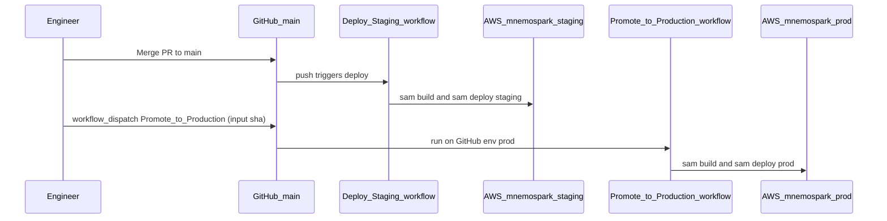
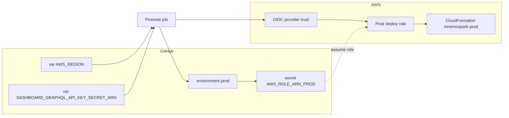

# mnemospark-backend — prod stack bootstrap

Date: 2026-04-04  
Revision: rev 7  
Milestone: prod-bootstrap (pre-`mnemospark-prod` stack)  
Repos / components: **mnemospark-backend** (SAM / CloudFormation, GitHub Actions), AWS (your account), **us-east-1** (or the region you use); DNS (Porkbun).

## Overview

Staging is typically deployed as CloudFormation stack **`mnemospark-staging`** (see **`samconfig.staging.toml`** in **mnemospark-backend**). That stack includes **regional AWS WAFv2** on the public **REST** API stage (`MnemosparkBackendApi`) when the root SAM template defines it—see **AWS WAF (regional, REST API)**. Prod will get the **same template resources** under **`mnemospark-prod`** when you promote (separate Web ACL and association, not shared with staging).

This guide is the **ordered runbook** to stand up **`mnemospark-prod`**, wire the GitHub **`prod`** environment (the exact environment name used in `promote-prod.yml`), and use **Promote to Production** to update prod **only when you choose**.

Reference stack config in the backend repo: `samconfig.prod.toml` (`stack_name = "mnemospark-prod"`).

## Prerequisite: parameterize staging (do this before prod cutover)

**Goal:** Remove **environment-specific hardcoding** from the SAM template and deploy workflows so **staging** and **prod** both receive addresses, RPC URLs, settlement mode, and **secret identifiers** through **CloudFormation parameters** (sourced from GitHub **Variables** / `sam deploy --parameter-overrides`, never committed private keys).

**Why before prod:** Today `template.yaml` still carries **default** addresses (e.g. `MnemosparkRecipientWallet`, `RelayerWalletAddress`, `PaymentAssetAddress`) and a **literal** relayer secret name plus a **fixed IAM** Secrets Manager resource path (`mnemospark/relayer-private-key*`). **Deploy Staging** also **hardcodes** `BaseRpcUrl` and literals inside `parameter-overrides`. That makes clean **per-environment** values (especially **separate prod relayer secrets**) awkward. Refactoring **staging first** proves the parameter surface in a live stack, then **Promote to Production** can pass the **same parameter names** with **prod** GitHub vars.

**After this refactor, update:** the **Workflows**, **Parameter parity**, **Wallet / relayer**, and **GitHub `prod` variables** subsections of this doc (and `deploy-backend.md`) to match the final parameter names your PR introduces.

## Deploy control model

- **Staging** updates from **Deploy Staging**: push to `main` (or manual `workflow_dispatch` of that workflow) builds and deploys **`mnemospark-staging`**. **Security Post Deploy** may run after a successful staging deploy; it does **not** touch the prod stack.
- **Prod** updates **only** from **Promote to Production**: a **manual** `workflow_dispatch` where you supply the **commit SHA** to deploy. Nothing in the repo automatically deploys or updates **`mnemospark-prod`** when staging changes.
- **Your workflow:** merge and ship to staging, **test and validate there**, then run **Promote to Production** with the SHA you trust—prod stays on the previous revision until you promote.

Promote does **not** “sync the running staging stack”; it checks out **git** at the given SHA and runs `sam deploy` for prod. Choose a SHA that staging has already exercised (typically the `main` commit after **Deploy Staging** succeeded).

## Order of operations

Follow this order so credentials, secrets, and GitHub configuration exist before the first prod deploy breaks halfway.

| Step | What | Why order matters |
|------|------|-------------------|
| 0 | **Parameterize template + staging workflow** | See **Instructions: staging template and workflow refactor** and the **Agent prompt (implement parameterization)**. Land and validate on **`mnemospark-staging`** before relying on prod-specific parameters. |
| 1 | **IAM: GitHub OIDC → prod deploy role** | Prod workflow needs `secrets.AWS_ROLE_ARN_PROD` before `sam deploy` can run. |
| 2 | **GitHub: `prod` environment** | Workflow job targets `environment: prod`; use protection rules (required reviewers) for a human gate before prod deploy. |
| 3 | **AWS Secrets Manager (prod-specific)** | Create prod secrets (dashboard GraphQL key, relayer private key) and use **distinct** secret names/ARNs via the **new** template parameters—no sharing unless intentional. |
| 4 | **GitHub `prod` secrets and variables** | Mirror the **same variable keys** as staging for each new parameter (different values for prod). Ensure `DASHBOARD_GRAPHQL_API_KEY_SECRET_ARN` and any relayer-secret parameter inputs are set. |
| 5 | **Keep deploy paths aligned** | **`PaymentSettlementMode`** and **`BaseRpcUrl`** are set **explicitly** in both **`deploy-staging.yml`** and **`promote-prod.yml`** (same values: `onchain`, `https://mainnet.base.org`). After the prerequisite refactor, move those literals to GitHub **Variables** in **both** workflows together so keys still match. |
| 6 | **First `mnemospark-prod` deploy** | Via **Promote to Production** (recommended) or one-time `sam deploy --config-file samconfig.prod.toml` with correct `--parameter-overrides`. The same template creates **`MnemosparkBackendApiWebAcl`** + **`MnemosparkBackendApiWebAclAssociation`** for prod (new ACL, not the staging one). |
| 7 | **Verify prod WAF** | In **CloudFormation** → **`mnemospark-prod`** → outputs: **`MnemosparkBackendApiWebAclArn`**. In **WAF** → Web ACLs (Regional), confirm association to the **prod** REST API stage. See **AWS WAF (regional, REST API)**. |
| 8 | **Obtain prod REST API invoke URL** | From **API Gateway** (`MnemosparkBackendApi` / `AWS::ApiGateway::RestApi`): `https://{rest-api-id}.execute-api.{region}.amazonaws.com/prod`. Needed for **`PROD_BASE_URL`** (smoke tests) and as the **target** for Porkbun until a custom domain fronts the API. |
| 9 | **Porkbun: `api.mnemospark.ai` → prod** | Point the hostname at prod so **mnemospark clients use the stable DNS name**, not the raw `execute-api` URL—see **Porkbun DNS**. Traffic still hits the **same REST stage** protected by **regional WAF** when the domain maps to that API. |
| 10 | **Fund prod relayer wallet (Base)** | On-chain settlement needs gas on the address the stack uses for monitoring and (via secret) signing. |
| 11 | **Ongoing: merge → validate staging → promote when ready** | Push to `main` deploys **staging only**. After you are satisfied with staging, manually run **Promote to Production** with that commit’s SHA; **prod does not auto-update** with staging. |

## Instructions: staging template and workflow refactor

Complete these in **mnemospark-backend** (PR → merge → confirm **Deploy Staging** succeeds) **before** treating prod bootstrap as done.

1. **Inventory hardcoded environment surface**  
   In `template.yaml`, locate **parameter defaults** that embed real addresses (`MnemosparkRecipientWallet`, `RelayerWalletAddress`, `PaymentAssetAddress`, etc.), any **literal** `MNEMOSPARK_RELAYER_SECRET_ID` (or equivalent) on Lambdas, and **IAM** `secretsmanager` resources that assume a **fixed** secret name prefix. In `.github/workflows/deploy-staging.yml`, locate **hardcoded** `parameter-overrides` strings (e.g. `BaseRpcUrl=…`, `PaymentSettlementMode=…`).

2. **Add or tighten CloudFormation parameters**  
   - Introduce parameters for every value that should differ by environment (minimum: **relayer secret id** or ARN-shaped id, **relayer wallet address**, **recipient wallet**, **Base RPC URL**, **payment settlement mode**; add **payment network / USDC contract** if they should not use template defaults).  
   - Prefer **no sensitive defaults**: use empty string defaults plus `AllowedPattern` / deployment-time validation where appropriate, or document required overrides in `samconfig.*.toml` comments.  
   - Wire **Lambda environment variables** and **IAM policies** with `!Ref` / `!Sub` from those parameters (IAM secret ARN patterns must follow the **actual** secret naming convention you choose, e.g. suffix per environment).

3. **Keep secrets out of git**  
   Private keys belong in **Secrets Manager** (or SSM); CloudFormation should receive **secret id / ARN parameters** only. Do not add keys to GitHub vars.

4. **Update Deploy Staging**  
   Replace inline literals in `sam deploy --parameter-overrides` with **`vars.*`** (and `secrets.*` only if you intentionally use GitHub Secrets for non-AWS tokens—prefer AWS for app secrets). Add each new name to **`staging`** environment variables in GitHub and document them in `docs/deploy-staging.md`.

5. **Update local SAM configs**  
   Set placeholders in `samconfig.staging.toml` / `samconfig.prod.toml` for any parameters you expect to pass from the CLI for emergency deploys.

6. **Deploy and verify staging**  
   Merge to `main`, let **Deploy Staging** run, then smoke-test and check CloudWatch / on-chain behavior. If the template includes **WAF**, confirm stack output **`MnemosparkBackendApiWebAclArn`** and regional association to the **staging** REST stage. If CloudFormation **replacement** is required for a resource, treat it as a planned change (review change set).

7. **Update Promote to Production**  
   Keep **`promote-prod.yml`** `--parameter-overrides` **keys** in lockstep with **Deploy Staging**. Today both already include **`PaymentSettlementMode`** and **`BaseRpcUrl`**; when you parameterize, add the same new keys here and read values from the **`prod`** GitHub environment variables.

8. **Refresh ops docs**  
   Bump **Revision** in this file; list the **canonical GitHub variable names** and any new AWS prerequisites once the PR is merged.

## Agent prompt (implement parameterization)

Copy everything inside the fence into a new agent task (mnemospark-backend repo; follow branch policy).

```text
You are implementing an infrastructure refactor in the mnemospark-backend repository.

Goal
- Remove hardcoded environment-specific addresses and secret identifiers from the SAM template and from GitHub Actions deploy commands, so staging and future prod stacks are driven by CloudFormation parameters supplied per environment (GitHub Environment variables + sam deploy --parameter-overrides).
- Do this for STAGING first: merge, run Deploy Staging, confirm mnemospark-staging still works.

Scope (minimum)
1) template.yaml
   - Identify Parameters whose Default values embed real addresses (e.g. MnemosparkRecipientWallet, RelayerWalletAddress, PaymentAssetAddress) and decide which must become required overrides per environment (empty or clearly non-production defaults).
   - Replace literal MNEMOSPARK_RELAYER_SECRET_ID (and any similar) with a Parameter (e.g. RelayerPrivateKeySecretId or name that matches semantics) passed into Lambda environment.
   - Update IAM statements that reference secretsmanager:mnemospark/relayer-private-key* to use !Sub/!Ref so the allowed secret ARN pattern matches the parameterized secret id/name (support distinct staging vs prod secrets in the same AWS account).
   - Ensure PaymentSettlementMode and BaseRpcUrl are always set explicitly from parameters for onchain staging (no accidental empty BaseRpcUrl on deploy).

2) .github/workflows/deploy-staging.yml
   - Remove hardcoded BaseRpcUrl and PaymentSettlementMode strings from parameter-overrides; read from vars (e.g. BASE_RPC_URL, PAYMENT_SETTLEMENT_MODE) or a single structured convention you document.
   - Pass every new template parameter needed for staging (RelayerWalletAddress, MnemosparkRecipientWallet, RelayerPrivateKeySecretId, etc.) via vars; fail the job with a clear error if a required var is missing.

3) .github/workflows/promote-prod.yml
   - Baseline today: promote-prod.yml already passes PaymentSettlementMode=onchain and BaseRpcUrl=https://mainnet.base.org matching deploy-staging.yml.
   - When parameterizing: mirror the same parameter-overrides KEYS as deploy-staging.yml, sourcing values from prod GitHub environment vars (use different values than staging where appropriate, e.g. dedicated prod RPC if you add one).

4) Documentation
   - Update docs/deploy-staging.md and docs/deploy.md with the list of required GitHub Variables for staging and prod.
   - Do not commit secrets; document that relayer private key material is created in AWS Secrets Manager by operators.

Constraints
- Match existing naming and YAML style; minimal unrelated refactors.
- Run unit tests (pytest) if you touch Python; sam validate if you change template.yaml.
- Output: PR description summarizing new parameters, new GitHub vars operators must set, and any stack-update cautions (replacements).

Reference ops context: mnemospark-docs/ops/deploy-backend-prod.md (prerequisite section and order of operations).
```

## Diagrams

### Routine promote path (on demand from staging)



### GitHub ↔ AWS (prod job)



After the prerequisite refactor, add nodes (or treat `VarDash` as representative) for every SAM parameter sourced from GitHub Variables (`BASE_RPC_URL`, relayer secret id, wallet addresses, etc.).

## Workflows (source of truth)

| Workflow | File | Trigger | AWS role secret | Notes |
|----------|------|---------|-----------------|-------|
| Deploy Staging | `.github/workflows/deploy-staging.yml` | Push to `main`, or `workflow_dispatch` | `AWS_ROLE_ARN_STAGING` | Updates **staging only** (stack e.g. **`mnemospark-staging`**). Template can include **regional WAFv2** on **`MnemosparkBackendApi`**; deploy role needs **WAFv2** IAM. **Target:** env-specific SAM parameters from GitHub **`staging`** variables. **Never** deploys prod. |
| Promote to Production | `.github/workflows/promote-prod.yml` | **`workflow_dispatch`** only; **required input: `sha`** | `AWS_ROLE_ARN_PROD` | GitHub environment **`prod`**. Same template as staging → creates **prod** **WAF** + association; **prod** deploy role must allow **WAFv2** like staging. Passes **`PaymentSettlementMode`**, **`BaseRpcUrl`**, dashboard secret ARN, price vars. **After refactor:** same keys, values from **`prod`** vars. |
| Security Post Deploy | `.github/workflows/security-post-deploy.yml` | After staging deploy, schedule, or manual | _(none — repo scan + optional ZAP)_ | ZAP uses **`ZAP_TARGET_URL_STAGING`** only today. |

**On-demand prod updates:** In GitHub → **Actions** → **Promote to Production** → **Run workflow**. Enter the **full commit SHA** you validated in staging—typically the `main` commit after **Deploy Staging** succeeded. Approve the **`prod`** environment if configured with required reviewers. Prod **does not** deploy when staging deploys; only this manual workflow updates **`mnemospark-prod`**.

## GitHub `prod` environment configuration

The workflow sets `environment: prod`. In **Settings → Environments**, the environment name must be exactly **`prod`** (GitHub does not rename environments in place—if you used **`production`** before, create **`prod`** and copy secrets/variables, or adjust the workflow to match your chosen name).

### Secrets

| Name | Used by | Notes |
|------|---------|-------|
| `AWS_ROLE_ARN_PROD` | `promote-prod.yml` | IAM role ARN trusted for `repo:ORG/mnemospark-backend:ref:refs/heads/*` (or your narrowed trust). Same OIDC pattern as staging, **prod-specific** role and permissions. |

### Variables

| Name | Used by | Notes |
|------|---------|-------|
| `AWS_REGION` | Prod deploy | e.g. `us-east-1` |
| `DASHBOARD_GRAPHQL_API_KEY_SECRET_ARN` | `promote-prod.yml` | **Must be a variable** (`vars.…`), not only a secret—the workflow reads `${{ vars.DASHBOARD_GRAPHQL_API_KEY_SECRET_ARN }}`. Value: Secrets Manager ARN for the **prod** dashboard GraphQL `x-api-key`. |
| `PRICE_STORAGE_FLOOR` | Optional | Passed to SAM; defaults to `0` if unset in workflow expression. |
| `PRICE_STORAGE_MARKUP` | Optional | Same as above. |
| `PROD_BASE_URL` | Smoke tests | REST API base URL (no trailing slash per `scripts/smoke.sh`). Prefer **`https://api.mnemospark.ai`** once DNS is live so smoke tests match **prod client** config; until then use the **`execute-api`** URL. If unset or placeholder, smoke tests are skipped. |
| _(additional vars)_ | After prerequisite PR | Add one GitHub variable per new CloudFormation parameter (e.g. `BASE_RPC_URL`, `PAYMENT_SETTLEMENT_MODE`, `RELAYER_WALLET_ADDRESS`, `MNEMOSPARK_RECIPIENT_WALLET`, relayer secret id parameter)—**exact names** must match what the workflows pass. **Mirror the same keys** from **`staging`** into **`prod`** with prod values. |

**Correction vs duplicate checklist items:** `DASHBOARD_GRAPHQL_API_KEY_SECRET_ARN` should **not** be duplicated under **Secrets** for the current workflows—it is read from **Variables**. Storing the same ARN as a secret is optional and unused unless you change the workflow.

### `ZAP_TARGET_URL_PROD`

The **Security Post Deploy** workflow only references **`ZAP_TARGET_URL_STAGING`**. Setting `ZAP_TARGET_URL_PROD` in GitHub does **nothing** until `.github/workflows/security-post-deploy.yml` (or a sibling job) is extended to run ZAP against prod. Treat **prod ZAP** as a follow-up automation task if you want parity with staging.

## AWS: prod stack and URLs

- **Stack name:** `mnemospark-prod` (`samconfig.prod.toml`).
- **Staging reference:** `mnemospark-staging` (already in the same account/region per your ARN).

### Client-facing URLs: staging vs prod

| Environment | What mnemospark clients should use | Notes |
|-------------|-----------------------------------|--------|
| **Staging** (`mnemospark-staging`) | The **AWS-generated** invoke URL for **`MnemosparkBackendApi`** (`AWS::ApiGateway::RestApi`), e.g. `https://{rest-api-id}.execute-api.{region}.amazonaws.com/staging` | No stable branded hostname; **`STAGING_BASE_URL`** and client config point at this URL. |
| **Prod** (`mnemospark-prod`) | **`https://api.mnemospark.ai`** (after Porkbun + any API Gateway custom domain / TLS wiring you use) | Clients are configured with this **DNS name** so they do **not** depend on the opaque **`execute-api`** hostname, which would change if the API were recreated. |

### Finding the prod invoke URL (for smoke tests and DNS targets)

The SAM template exposes **`DashboardGraphQLHttpApiUrl`** as a stack output, but the **wallet REST API** (`AWS::Serverless::Api` **MnemosparkBackendApi**) does **not** currently emit a dedicated output in `template.yaml`. After deploy, obtain the REST invoke URL from:

- **Console:** API Gateway → APIs → **`mnemospark-backend-api`** (prod stage) → copy invoke URL, **or**
- **CLI:** resolve `RestApiId` from the stack or API name, then  
  `https://{rest-api-id}.execute-api.us-east-1.amazonaws.com/prod`  
  (stage name matches **`StageName=prod`**).

Use that invoke URL for **`PROD_BASE_URL`** in GitHub **until** `https://api.mnemospark.ai` resolves and reaches the same API; then set **`PROD_BASE_URL`** to the **custom URL** so **`scripts/smoke.sh`** matches what clients use. **`MNEMOSPARK_BACKEND_API_BASE_URL`** (and similar client config) for **prod** should be the **Porkbun hostname**, not the raw API Gateway URL.

## AWS WAF (regional, REST API)

**Source of truth in repo:** Root **`template.yaml`** in **mnemospark-backend** (not the optional nested stack under `infrastructure/waf/` unless you deliberately use that alternate layout). The SAM stack that backs **`mnemospark-staging`** and future **`mnemospark-prod`** includes:

| Resource | Purpose |
|----------|---------|
| **`MnemosparkBackendApiWebAcl`** | **REGIONAL** WAFv2 web ACL, name pattern `${StackName}-rest-api-waf`. **Default action:** allow. **Managed rule groups:** `AWSManagedRulesCommonRuleSet`, `AWSManagedRulesKnownBadInputsRuleSet` (both with override “none”—rules apply as AWS defines). **CloudWatch metrics / sampled requests** enabled per rule. |
| **`MnemosparkBackendApiWebAclAssociation`** | Associates the ACL with the **API Gateway REST API stage** for **`MnemosparkBackendApi`** (`ResourceArn` … `/restapis/{RestApiId}/stages/{StageName}`). Depends on **`MnemosparkBackendApiStage`**. |

**Stack output:** **`MnemosparkBackendApiWebAclArn`** — use it for audits, support tickets, or attaching additional tooling.

**Staging vs prod:** Each stack gets its **own** Web ACL and association. **Do not** point prod DNS or clients at staging’s API if you expect prod isolation; WAF configuration is **per stack** but **same rule shape** as long as both deploy from the same template revision.

**Dashboard GraphQL HTTP API:** The association above targets the **REST** API (`MnemosparkBackendApi`). The internal **HTTP API** used for dashboard GraphQL is **not** covered by this association unless you add a separate WAF resource and association in the template.

**Deploy IAM:** The prod (and staging) **OIDC deploy role** must allow **WAFv2** create/associate/update and **API Gateway** WebACL wiring where required. See **`docs/iam-mnemospark-deploy-policy.json`** in **mnemospark-backend** (`Sid`: **`WAFv2`** and related API Gateway actions). If promote fails on WAF, extend the prod deploy policy to match that file, then retry.

**Operations:** After rule updates or false positives, use **WAF** console (sampled requests, metrics), **CloudWatch**, and managed-rule **tuning** (e.g. scope-down statements) in the template or console—then redeploy or change the Web ACL as your process allows.

## Wallet / relayer operations (prod)

### Target (after **Prerequisite: parameterize staging**)

| Checklist item | Detail |
|----------------|--------|
| Add prod relayer secret to AWS | Create a **prod-only** Secrets Manager secret; pass its **name or ARN** into the stack via the **parameter** wired to `MNEMOSPARK_RELAYER_SECRET_ID` (exact parameter name from the refactor PR). IAM must allow that secret’s ARN pattern for the payment-settle (and related) roles. |
| Switch to prod relayer address | Set **`RelayerWalletAddress`** via GitHub **`prod`** variables (and the same parameter in **`promote-prod.yml`** as staging uses). |
| Fund prod relayer wallet for gas | **Manual:** send Base ETH to the prod relayer address after the stack reflects that address. |

Also configure **SNS email** for relayer alerts if you use the monitoring path (`docs/base-relayer-monitoring.md` in the backend repo).

### Interim (if prod is deployed before the refactor merges)

The template may still use a **literal** relayer secret id and **fixed** IAM path (`mnemospark/relayer-private-key*`), and template **defaults** may still embed addresses. Prefer **completing the prerequisite PR** before relying on **distinct** staging vs prod relayer secrets in one account.

## Parameter parity (staging vs prod)

**Onchain / RPC (done):** Both **`deploy-staging.yml`** and **`promote-prod.yml`** pass **`PaymentSettlementMode=onchain`** and **`BaseRpcUrl=https://mainnet.base.org`** in `--parameter-overrides`, so prod deploys do not rely on template defaults for an empty **`BaseRpcUrl`**. **`samconfig.prod.toml`** includes the same pair for emergency **`sam deploy --config-file samconfig.prod.toml`**.

**Also passed in both workflows:** **`StageName`** (staging vs prod), **`DashboardGraphqlApiKeySecretArn`** (from env var), **`PriceStorageFloor`**, **`PriceStorageMarkup`**.

**Prerequisite refactor (remaining):** Move **wallet addresses**, **relayer secret id**, and (optionally) **RPC URL / settlement mode** from template defaults and YAML literals into **GitHub Variables** for **`staging`** and **`prod`**, keeping **identical override keys** in both workflows. After that PR, update this subsection with the canonical variable names (or point to **`docs/deploy-staging.md`**).

## Porkbun DNS (`api.mnemospark.ai`)

**Purpose:** Give **production** mnemospark clients a **stable, configurable base URL** (`https://api.mnemospark.ai`) instead of the **AWS-managed** **`MnemosparkBackendApi`** invoke URL (`*.execute-api.*.amazonaws.com`). That hostname is what you put in client settings and docs for prod.

**Staging:** Clients talking to **`mnemospark-staging`** continue to use the **API Gateway–generated URL** for that stack. There is **no** parallel Porkbun record described here for staging; do not point `api.mnemospark.ai` at staging unless you intentionally change that policy.

**Record (prod):** `api.mnemospark.ai` → target the **prod** API endpoint (CNAME/ALIAS to the **execute-api** hostname, or to **CloudFront** / another front if you terminate TLS or route there).

**Order:** Create or update after the **first prod deploy** when you know the invoke URL or custom-domain target.

API Gateway **custom domain** (API Gateway-owned cert, base path mapping) vs **CNAME to execute-api** vs **CloudFront in front** is an architecture choice; this doc only requires that **prod clients** end up on **`https://api.mnemospark.ai`**, not on the raw RestApi URL. If the custom domain maps to the **same** `MnemosparkBackendApi` stage, **regional WAF** still applies to that traffic.

## IAM and deploy policy

Apply the same **deploy policy** pattern as staging (see backend **`docs/iam-mnemospark-deploy-policy.json`** and **`docs/base-relayer-monitoring.md`** for SNS and other statements) to the **prod** role. Prod and staging roles are typically **two roles** with the same JSON policy shape, different ARNs. Ensure the policy includes **WAFv2** (and API Gateway Web ACL) statements so **`MnemosparkBackendApiWebAcl`** and **`MnemosparkBackendApiWebAclAssociation`** can be created and updated on promote—see **AWS WAF (regional, REST API)**.

## What an agent can do automatically vs what you must do manually

### Automatically (agent with repo + AWS CLI read access + docs)

Typical agent-safe tasks:

- Read and summarize **`promote-prod.yml`**, **`deploy-staging.yml`**, **`samconfig.prod.toml`**, **`template.yaml`** parameters/outputs.
- Compare staging vs prod **parameter-overrides** and flag any **remaining** gaps after chain parity (e.g. relayer / wallet parameters once you parameterize the template).
- Implement or review the **prerequisite parameterization** PR (`template.yaml`, staging workflow, then **`promote-prod.yml`** parity).
- Run **read-only** AWS CLI checks after credentials are available: `aws cloudformation describe-stacks --stack-name mnemospark-prod`, list outputs (including **`MnemosparkBackendApiWebAclArn`**), API Gateway IDs, and **`aws wafv2 list-web-acls --scope REGIONAL`** as needed.
- Propose exact **GitHub variable** values (non-secret) once URLs are known.

Agents should **not** create or paste **private keys** into tickets or CI; relayer key material belongs in **Secrets Manager** via your own secure process.

### Manual (you)

- Create/configure **IAM OIDC trust** and **prod deploy role** in AWS.
- Create **GitHub `prod` environment**, **required reviewers**, **secrets/variables** UI.
- Create **Secrets Manager** secrets (dashboard GraphQL key; relayer key). After the prerequisite refactor, use **separate** secret names for staging vs prod as allowed by the parameterized IAM pattern.
- **Fund** the prod relayer wallet on Base.
- **Porkbun:** point **`api.mnemospark.ai`** at prod so clients use that hostname; staging stays on the **AWS-generated** API URL.
- **Approve** the GitHub **`prod`** environment deployment when promoting.
- **Run workflow_dispatch** for **Promote to Production** with the correct **SHA**.
- After first prod deploy: confirm **regional WAF** is associated to the **prod** REST stage (output **`MnemosparkBackendApiWebAclArn`**); tune rules if legitimate clients are blocked.

## Prompt to give an agent to produce an execution plan

Use this when you want a planning pass (checklist, diffs, and ordered tasks) without assuming the agent has admin access to GitHub or AWS write permissions:

```text
You are working across repos mnemospark-backend and mnemospark-docs.

Goal: Produce a step-by-step execution plan to bootstrap the mnemospark-prod CloudFormation stack in your AWS account and region (e.g. us-east-1), mirroring mnemospark-staging, with GitHub Environment named "prod" (not "production") and manual on-demand promotes via .github/workflows/promote-prod.yml. Prod must never auto-deploy when staging updates.

Constraints and inputs:
- Staging stack name: mnemospark-staging (per samconfig.staging.toml); use your account and region when running AWS CLI or console steps.
- Read mnemospark-docs/ops/deploy-backend-prod.md and treat it as the ordered runbook. Assume **Step 0** is either complete or explicitly in scope: template + workflows parameterized so addresses, RPC URL, settlement mode, and relayer **secret id** are CloudFormation parameters fed from GitHub Environment variables.
- In mnemospark-backend, compare deploy-staging.yml vs promote-prod.yml: **PaymentSettlementMode** and **BaseRpcUrl** are already aligned; list any **remaining** key mismatches (wallet / relayer params) after the parameterization refactor.
- If the refactor is not merged yet, call out remaining hardcoding (template defaults, literal MNEMOSPARK_RELAYER_SECRET_ID, workflow literals for RPC/mode once moved to vars) and prioritize the prerequisite PR for full per-env control.
- Separate the plan into: (A) Prerequisite / parameterization status, (B) AWS IAM/OIDC + roles (include **WAFv2** + API Gateway Web ACL per `docs/iam-mnemospark-deploy-policy.json`), (C) Secrets Manager, (D) GitHub prod env secrets/vars (mirroring staging var keys), (E) first deploy and verification (stack output **`MnemosparkBackendApiWebAclArn`**, WAF association on prod REST stage), (F) Porkbun `api.mnemospark.ai` for **prod** client URLs (staging clients use **execute-api** URL only; WAF still applies to REST stage), (G) ongoing manual promote process with SHA discipline (staging auto, prod manual only).
- For each step, label it Manual vs Agent-assistable (read-only CLI / PR draft).

Output: numbered order of operations, then a PR-style checklist for GitHub and AWS consoles, then optional patch proposals for workflow parity.
```

## Spec references

- This doc: `mnemospark-docs/ops/deploy-backend-prod.md` — [raw GitHub URL](https://raw.githubusercontent.com/pawlsclick/mnemospark-docs/refs/heads/main/ops/deploy-backend-prod.md)
- Related ops runbook: `mnemospark-docs/ops/deploy-backend.md` — [raw URL](https://raw.githubusercontent.com/pawlsclick/mnemospark-docs/refs/heads/main/ops/deploy-backend.md)
- Meta-doc conventions: `mnemospark-docs/meta_docs/README.md` — [raw URL](https://raw.githubusercontent.com/pawlsclick/mnemospark-docs/refs/heads/main/meta_docs/README.md)
- Backend (in mnemospark-backend repo): `template.yaml` ( **`MnemosparkBackendApiWebAcl`**, **`MnemosparkBackendApiWebAclAssociation`**, output **`MnemosparkBackendApiWebAclArn`** ), `docs/deploy-staging.md`, `docs/deploy.md`, `docs/iam-mnemospark-deploy-policy.json` (WAFv2), `docs/base-relayer-monitoring.md`, `docs/price-storage.md`; optional reference `infrastructure/waf/README.md` for a standalone-WAF pattern (root template embeds WAF for the main stack).
- Wallet generation reference (client-side): `mnemospark-docs/meta_docs/ethereum-wallet-generation.md` — [raw URL](https://raw.githubusercontent.com/pawlsclick/mnemospark-docs/refs/heads/main/meta_docs/ethereum-wallet-generation.md)
