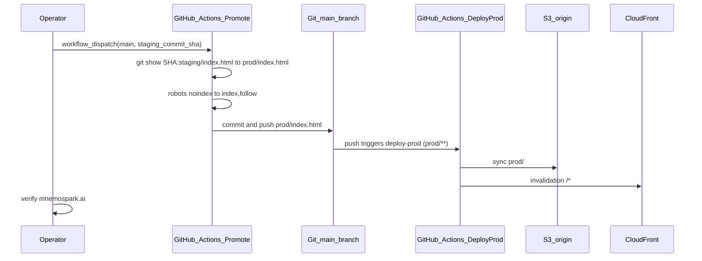

# Promote mnemospark website (staging → prod)

- **Date:** 2026-04-05
- **Revision:** rev 1
- **Milestone:** website-promote-workflow-2026-04-05
- **Repos / components:** [mnemospark-website](https://github.com/pawlsclick/mnemospark-website) (`staging/index.html`, `prod/index.html`, GitHub Actions: `promote-staging-to-prod`, `deploy-prod`)

## Overview

Production HTML for **mnemospark.ai** lives under **`prod/`** in **mnemospark-website**. Staging drafts live under **`staging/`** (typically **`staging/index.html`**, with **`noindex`** robots for test hosts).

This runbook describes the **manual promote**: pick a **full Git commit SHA** whose tree contains the **`staging/index.html`** snapshot you want, run the **Promote staging index to prod** workflow on **`main`**, and let **Deploy website to production** push **`prod/`** to S3 and invalidate CloudFront.

## Prerequisites

- The workflow **Promote staging index to prod** is merged on **`main`** (see `.github/workflows/promote-staging-to-prod.yml` in **mnemospark-website**).
- You have a **40-character** commit hash (lowercase or uppercase) that exists on **`main`** (or in the repo history reachable from the checkout—any commit the clone can `git show <sha>:staging/index.html`).
- **GitHub Actions** is allowed to **push to `main`** if branch protection is enabled (otherwise the promote job fails at `git push`).
- **AWS OIDC** and secrets for **Deploy website to production** are already configured (unchanged from the standard prod deploy).

## Step-by-step flow

### Operator (you)

1. Confirm the **staging** HTML you want is on **`main`** (or note the exact commit SHA that contains it—often the merge commit of your PR).
2. Copy the **full** SHA (40 hex chars), e.g. from the commit page or `git rev-parse HEAD` on that commit.
3. In GitHub: **Actions** → **Promote staging index to prod** → **Run workflow**.
4. Under **Use workflow from**, select branch **`main`** (required—the job exits otherwise).
5. Paste **`staging_commit_sha`** → **Run workflow**.
6. Wait for the promote run to finish, then confirm **Deploy website to production** ran on the subsequent push to **`main`** (path **`prod/**`**).
7. Spot-check **https://mnemospark.ai/** and view source: **`meta robots`** should be **`index, follow`**.

### Promote workflow (GitHub Actions)

1. **Checkout** the repo with **full history** (`fetch-depth: 0`).
2. **Validate** the SHA (40 hex chars) and that **`git show <sha>:staging/index.html`** succeeds.
3. **Write** that blob to **`prod/index.html`** (overwrites the current prod homepage).
4. **Transform for prod:** replace  
   `<meta name="robots" content="noindex, nofollow">`  
   with  
   `<meta name="robots" content="index, follow">`.  
   If a different **`noindex`** robots tag appears, the job **fails** (intentional guard).
5. **Commit** `chore(prod): promote staging/index.html from <full_sha>` and **push to `main`** (no commit if there is nothing to change).

### Deploy workflow (GitHub Actions)

On **push to `main`** affecting **`prod/**`**, **Deploy website to production** (`deploy-prod.yml`):

1. Assumes the prod deploy role (OIDC).
2. Syncs **`prod/`** to the private S3 origin (HTML with no-cache; other assets with day cache).
3. Creates a CloudFront invalidation for **`/*`**.

## Files touched

| Path | Role |
|------|------|
| `staging/index.html` | Source snapshot (read at the given SHA only; not modified by promote). |
| `prod/index.html` | Target file written + committed on **`main`**. |
| `.github/workflows/promote-staging-to-prod.yml` | Manual promote automation. |
| `.github/workflows/deploy-prod.yml` | Automatic deploy after **`prod/**`** changes. |

## Success

- Promote workflow is **green** and **`main`** has a new commit updating **`prod/index.html`** (unless content was already identical).
- Deploy workflow is **green**; S3 sync and CloudFront invalidation succeed.
- Live site shows the expected content and **`robots`** allows indexing.

## Failure scenarios

| Symptom | Likely cause | What to do |
|--------|----------------|------------|
| “Run this workflow from the main branch only” | Workflow started from a non-**`main`** ref. | Re-run with **Use workflow from** = **`main`**. |
| SHA validation error | Not 40 hex chars or typo. | Copy full SHA from GitHub commit page or `git rev-parse`. |
| `staging/index.html` missing at SHA | Commit predates file move or wrong repo. | Pick a commit that contains **`staging/index.html`**. |
| Robots meta error | Staging uses a new robots line the script does not replace. | Update **`.github/workflows/promote-staging-to-prod.yml`** Python step to match the new tag, or restore the expected literal in staging. |
| Push to **`main`** denied | Branch protection blocks **`GITHUB_TOKEN`**. | Allow GitHub Actions to push to **`main`**, or adjust protection / use a documented PAT pattern. |
| Deploy fails after promote | AWS / OIDC / stack. | Use existing website infra runbooks; promote already landed the git commit. |

## Sequence diagram

## Spec references

- This doc: `ops/promote-website-prod.md`  
  - Raw: `https://raw.githubusercontent.com/pawlsclick/mnemospark-docs/refs/heads/main/ops/promote-website-prod.md`
- Website repo layout and day-to-day deploy notes: **mnemospark-website** `README.md`  
  - Raw: `https://raw.githubusercontent.com/pawlsclick/mnemospark-website/refs/heads/main/README.md`
- Promote workflow source: **mnemospark-website** `.github/workflows/promote-staging-to-prod.yml`  
  - Raw: `https://raw.githubusercontent.com/pawlsclick/mnemospark-website/refs/heads/main/.github/workflows/promote-staging-to-prod.yml`
- Prod deploy workflow: **mnemospark-website** `.github/workflows/deploy-prod.yml`  
  - Raw: `https://raw.githubusercontent.com/pawlsclick/mnemospark-website/refs/heads/main/.github/workflows/deploy-prod.yml`
- **meta_docs** conventions (metadata, structure, diagrams, spec references): `meta_docs/README.md`  
  - Raw: `https://raw.githubusercontent.com/pawlsclick/mnemospark-docs/refs/heads/main/meta_docs/README.md`
